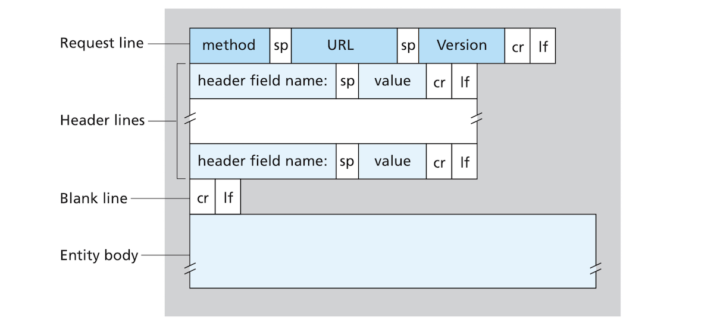
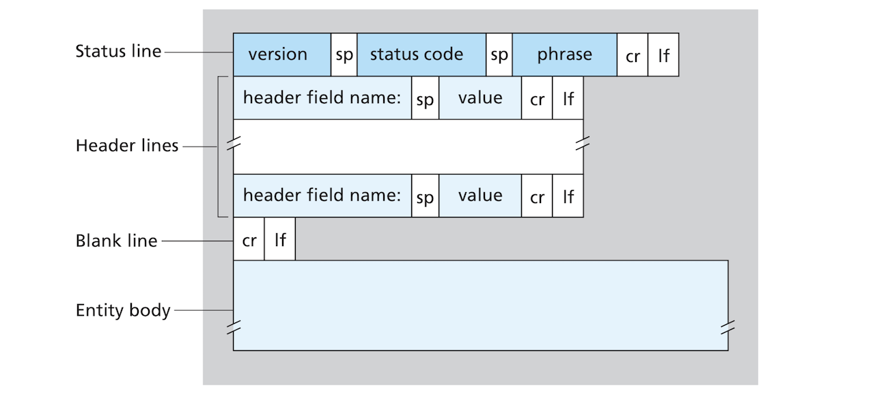
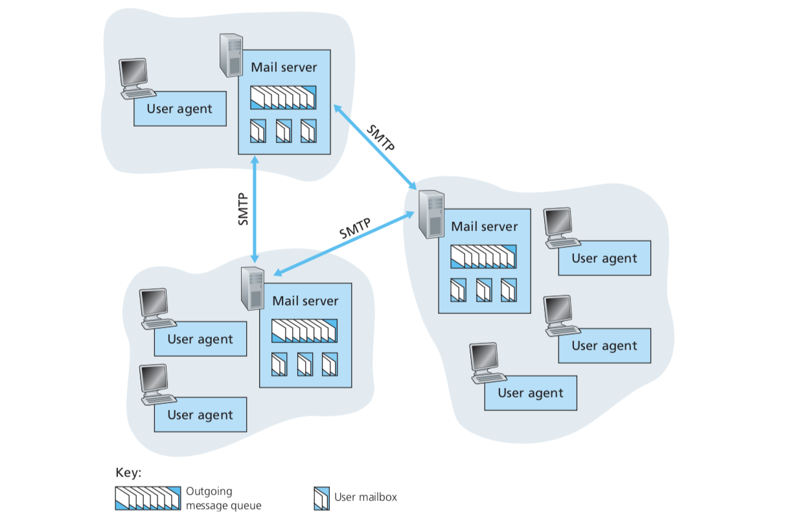
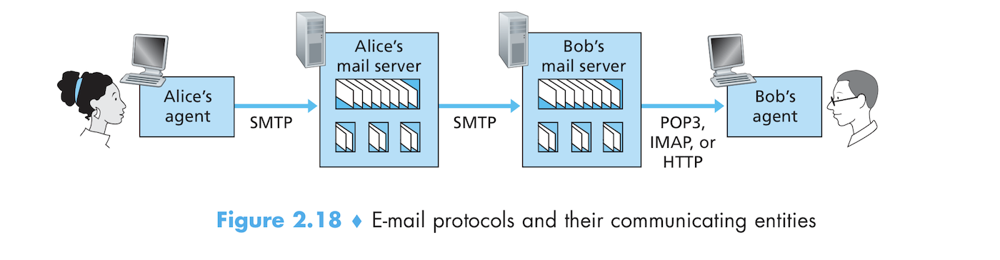
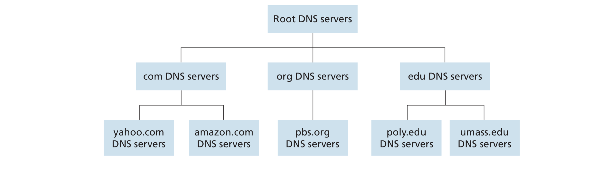
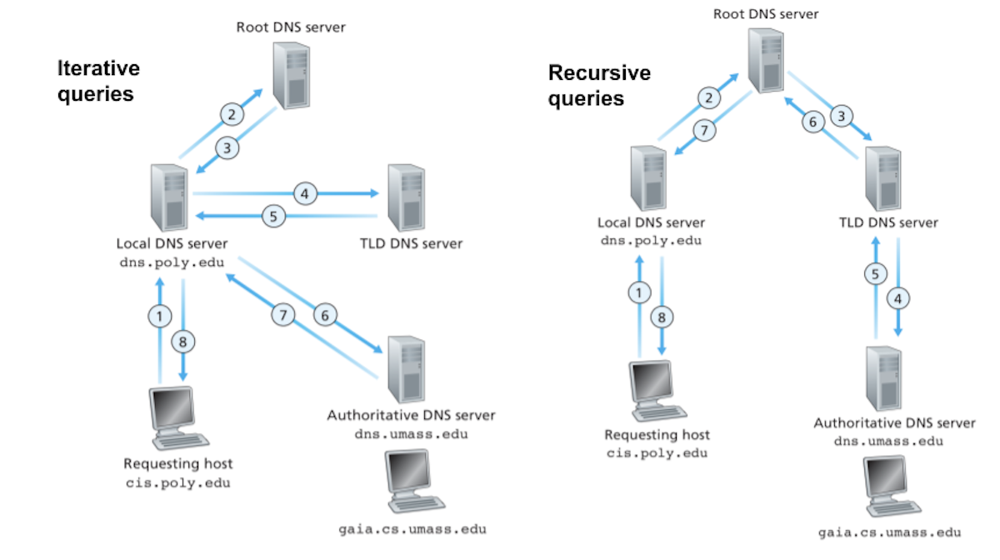
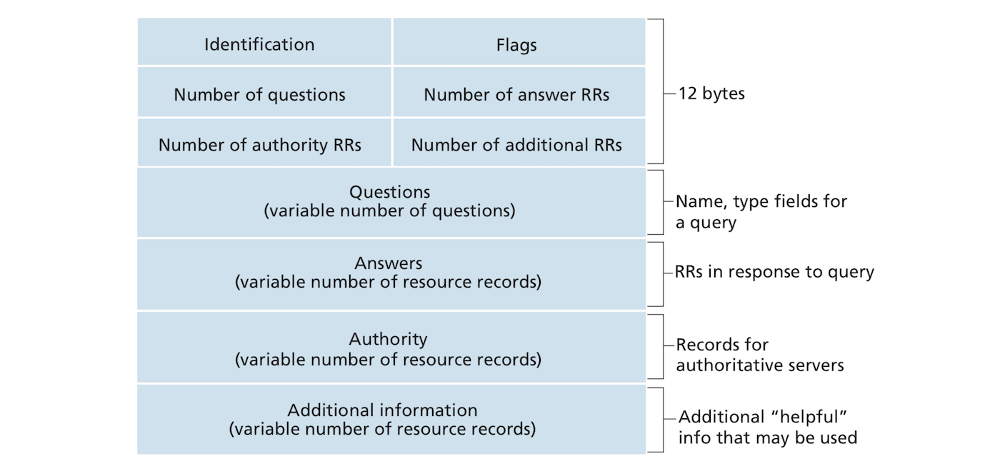

# The Application Layer:
- The application layer is where it's all at. One thing to keep in mind is that the application layer is confined to end systems. Core devices such as switches and routers don't understand anything about application and are confined to the 3 bottom layers of our 5-layer Internet stack!

## Principles of Network Applications:
### Network Application Architecture:
- There are very common application architectures:
1. **Client-Server Architecture**: It consists of two types of host. A ***server***, which is an *always-on* host with a fixed IP address. This fixed big machine is connected to a bunch of ***clients*** (*client* is the other type of host in this architecture). The server is a central dependable machine that receives ***requests*** for data or objects from the client a serves back a ***response*** with the requested data/object. A single server might not be able to server a very large amount of requests, that's why multiple servers can be clustered together into a **data center** to create a powerful virtual server. Protocols that use this architecture includes: HTTP, FTM, SMTP... etc.
2. **P2P (Peer-to-Peer) Architecture**: In P2P, hosts (called **peers** here) share data directly without having to pass by a server. Sample applications include file sharing through with BitTorrent, peer-assisted download accelerators like Xunlei, Internet telephony like Skype. Hybrid architectures combining P2P with Client-Server architectures are also in common use. The advantages of P2P are immense as it is **self-scalable** architecture since peers distribute files to other peers reducing the workload of the network. It is also cost-effective as no dedicated servers are required. P2P suffers from security problems, lack of economic incentives to Silicon valley mafias and asymmetric way ISPs treat download vs. upload traffic.

### Inter-Process Communication:
- In the application layer, the protocols allow applications or more precisely **processes** to communicate with each other. A process in OS lingo is a program running in a host. When communication is done between processes in the same host, this communication is governed by the operating system. When processes reside in different hosts, the communication is governed by application layer protocols.
- Process exchange **messages**. The sending process creates and sends a message and the receiving host receives the message and possibly responds to it with a message of its own.

#### Client and Server Processes:
- A better definition of a network application is that it "consists of pairs of processes that send messages to each other over a network."
- Like hosts, processes can also be labeled as a **client** and a **server**. To be more precise, in a *communication session*, the process that initiates the communication is the client and the process that wait to be contacted for that session is the server. This is the same in both P2P and client-server architectures. While in client-server architectures, the client process usually resides in a client host such as a web browser and the server process (web app) resides in a server host, in P2P this role gets reversed based on which process initiates the communication session. 

#### The Interface between the Process and Computer Network:
- Processes send and receive messages from the network using an Interface called a **socket**. If a process were a house, a socket would be its door.
- A socket is the interface between the application layer and the transport layer. The developer has full control on the application side of the socket while the transport layer is controlled by the operating system. The developer can only choose the protocol to be used on the transport layer (TCP or UDP) and tweak a few parameters such as the maximum buffer size and maximum segment size. 

### Addressing Processes:
- When a process is ready to send a message to another process residing in another host, it needs to identify where that process is. This is done with two pieces of information, the IP address of the receiving host and the socket (or process)'s port number. 

### Transport Services available to Applications:
- Picking a a certain transport layer service to use for transporting our application message depends on the following four dimensions:
	1. **Data Transfer Reliability**: packets can get lost due to it being corrupted in transit or an overflowing router... etc. In an application like email where the data must be transferred reliably, you use a **reliable data transfer** protocol like TCP. Some applications can be **loss-tolerant** such as video/voice chatting. These can use data transfer transport with less reliability like UDP. Lost data results in glitches but the overall messages get through. 
	2. **Throughput**: Throughput almost always suffers from pressure. **bandwidth-sensitive applications** need to have their throughput at a minimum rate (bits per second) to be usable. The transport provides a service that can guarantees the delivery of the specified throughput. If it can't guarantee that throughput, it gives up and the application can't work until that throughput is available again. **Elastic applications** on the other hand can work with as little or as much throughput. This include web and email.
	3. **Timing**: The transport layer can also guarantees that data be received no less than a specified time (say a 100 msec). This is especially important in real time applications like telephone or live games.
	4. **Security**: Security is another great service offered by the transport layer. Things like encryption, end-to-end authentication, data integrity... etc. 

#### TCP vs UDP:
- **TCP** and **UDP** are the chief transport protocols on top of which network applications are built. Choosing one over the other depends on a several criteria. 
- TCP is connection-oriented and is all about reliable data transfer. It also adds a congestion control mechanism. These features add overhead which makes TCP no ideal for real time applications that are sensitive about throughput and time. It's great for elastic applications such as email and web.
- TCP also comes coupled with **SSL/TLS** for security purposes. SSL is an enhancement of TCP that is implemented on the application layer. The client and server must implement SSL to use it. SSL has its own socket. The process passes cleartext data to the SSL socket and SSL encrypts the data and passes the encrypted output to the TCP socket. On the other host, the TCP socket receives the encrypted data, passes it to SSL which decrypts it and then passes it to the process.
- UDP on the other hand is connectionless, and doesn't offer transfer reliability or congestion control, thus making it a lightweight protocol great for real-time applications, even if a packet is lost here or there or if some packets arrived out of order.
- While the transport layer can offer security and reliability with the TCP transport and its SSL enhancement, it can't offer any guarantees concerning timing and throughput. There are programming tricks the programmer can add to her application, but these have their limitations.

### Application Layer Protocols:
- An application layer protocol defines how messages between different processes in different host machines are exchanged. An application-layer	protocol should define the following:
	- The type of messages exchanged (request and response messages).
	- The syntax of message types such as fields and how they are delineated.
	- The semantics (meanings) of fields.
	- Rules for how and when processes send or respond to messages.
- Some protocols are in the public domain and specified in RFCs such as HTTP and FTP. If you implement the protocol correctly, you can create an application that can download web pages or files. Other protocols are proprietary like those used by Skype.
- Protocols are only one part of the applications that are based on them. HTTP is only one part of the Web. The Web has many other components such as servers, the HTML language... etc. 

## HTTP:
### HTTP Overview:
- **HTTP (typer-text transfer protocol)** is the de facto protocol of the **web** or the **world wide web**. The web itself is an application, the most popular and successful application that runs on the Internet. 
- Let's start with some basic but crucial terminology:
	+ A **web page** (also a **document**) consists of one or more objects. Objects can be images, video clips, HTML files... etc. 
	+ A web page consists of a **base HTML file** and probably sever referenced objects.
	+ The objects are referenced in the base HTML file with **URLs**. A URL consists of two parts: the **hostname** of the server that houses the object, the object's **path name**. 
	+ The clients in the web are usually the web browsers and **web servers** such as Apache are the servers.
- The HTTP protocol defines how a client requests a web page from a server and how the server sends back the requested document.
- HTTP uses the TCP transport protocol. The client initiates a connection with the server. Once the connection is established, the client and server processes can exchange messages through their sockets. Both processes send HTTP messages into their socket interfaces and receive messages from those same sockets. 
- HTTP is also traditionally a **stateless protocol**, meaning that the server doesn't keep track of the client between any two requests. The server doesn't know if two requests comes from two different clients or the same client.

### Persistent vs Non-Persistent Connections:
- Should each request/response pair have its own TCP connection (i.e. use **persistent connections**), or should all request/response pairs be sent over the same TCP connection (i.e. use **non-persistent connections**)? This is a very important design decision and can have ramifications on your application. 
- HTTP uses persistent connections by default, but you can configure the clients and server to use non-persistent connections.

#### HTTP with Non-Persistent Connections:
- Let's say we have a web page consisting of a base HMTL file and 20 JPEG images. When using non-persistent connections, the client initiates a connection, then the server open the connection, then client sends a request to get the base HTML, then the server receives the request, retrieves the file and sends it back, the server tells the client to close the connection, the client ensures that the file has been received completely intact, the client then closes the connection. This whole process then is repeated for each of the 20 other documents.
- In non-persistent TCP connections, only one request and only one response can be transported. In our example above 21 connections are opened to serve our web page.
- The connections can be opened in parallel (simultaneously) or serially (one connection at a time). Modern browsers allow for certain amount of parallel connections, but users can configure their browsers to change this number or specify an upper limit to the number parallel connections. 
- **Round-trip time (RTT)** is the time it takes for a small packet to travel from client to server and then back to the server. RTT includes all kinds of delay (transmission, propagation, queuing, processing delays... etc.).
- RTT can be used as a measure of how much time it would take to retrieve a file/object. Requesting a file takes two RTTs plus the time necessary to transfer the file as files usually take several packets. This can be done as follows:
	1. **First RTT**: 
		- The client sends a small TCP segment to the server asking for a connection to be opened.
		- The server responds with a small acknowledgment segment.
	2. **Second RTT**:
		- The client sends an acknowledgment that it has been acknowledged by the server. Combined with the acknowledgment is a message requesting the HTML file.
		- The server sends the file to the client after receiving the acknowledgment and request message.

- The first RTT and the first trip of the second RTT are called a **TCP 3-way handshake**. We will cover it later.

#### HTTP with Persistent Connections:
- Non-Persistent connections suffer from several disadvantages:
	- A new connection with all its overhead such as a TCP buffer and a TCP variable. These are costly on resources and a server handling thousands of requests can easily get overwhelmed by these.
	- Each object will suffer a delay of 2 RTTs.
- In a persistent connection, the server leaves the TCP connection open after sending a response. The following requests and responses will be sent over the same connection. Our entire page and its 20 images get sent over the same connection. Even multiple web pages from the same server can be served over the same persistent connection. Other objects can be sent over the same connection even if there are pending requests that haven't be served yet. 
- HTTP servers close connections when they are used for a certain time (timeout).

### HTTP Message Format:
- HTTP defines two types of messages: **request messages** and **response messages**.

#### HTTP Request Messages:
- The following is a simple HTTP request message:

```
GET /cs-topics/networking.html HTTP/1.1
Host: www.ahmaazouzi.io
Connection: close
User-agent: Mozilla/6.0
Accept-language: ar

```
- HTTP messages are written in plain ASCII text.
- The request message in our example has 5 lines but it can have many more and it can also have few as one!
- A Typical request consists of:
	- The first line of the request is called a **request line**. The request line itself consists of:
		+ The request method, such as GET, POST ..etc. A request method dictates how the client communicates with the server. With GET, for example, a client usually fetches data or documents. A google search, for example, asks for search results. 
		+ The **path** which points to the requested resource.
		+ The HTTP **version**. The most common version is http 1.1.
	- **Request headers** are key value pairs. They include the host, user agent..etc. There can be a lot of headers.
	- A request might also have a **body** that contains parameters added to the request. A POST method has a body while GET doesn't. query parameters in a POST method are added to the request's body and are not appended to the URL as in a GET request.
- `POST` and `GET` are the most commonly used HTTP request methods. The following tables shows some of the fundamental differences between the two:

| **`GET`** | **`POST`**
| --- | --- |
| Parameters are placed in URL | Parameters in body
| Used for fetching documents | Updates data in server
| Has a maximum URL length | No max length
| Cachable | Non-cachable
| Not for changing server | supposed to change server

- These fundamental differences between `POST` and `GET` dictate the fact that `GET` is mostly used to retrieve documents (or data) from the server, while `POST` is used to send data to the server and actuate changes
- The following figure shows the general format of an HTTP request:


#### HTTP Response Messages:
- A typical HTTP response looks as follow:
```
HTTP/1.1 200 OK 
Connection: close
Date: Mon, 10 Apr 2020 00:00:00 GMT
Server: Apache
Content-Length: 6821
Content-Type: text/html

<h1>Hello, World!</h1>
```
- It has headers and a body just like a request, but it differs from a request in that it has a **status line** instead of a request line. A status line consists of 3 parts:
	+ The HTTP version.
	+ A **status code** which is a number indicating if the request was successful. Codes include 202 for a successful request, 404 for a not found page, 500 for a server error.. etc. 
	+ "A **status message**, a non-authoritative short description of the status code."
- One important header line in the example request is the **connection** line which controls the connection's persistence. This particular request wants the server to close connection after the requested object is received.
- The following figure shows the general format of an HTTP response:


### User-Server Interaction: Cookies:
- HTTP is stateless. This simple designed has allowed for the creation of highly performant web servers since these don't have to worry too much about remembering clients. Servers can still remember clients with the infamous **cookies**.
- A cookie consists of 4 parts:
	1. A cookie header on the request message.
	2. A cookie header on the response message.
	3. A cookie file in the client host that is managed by the browser.
	4. A backend database at the server.
- Cookies work as follows:
	+ When a user visits a website for the first time, the server creates a unique identification number and a unique entry in its database. The database entry is indexed by the unique identification number.
	+ The server responds to the user's request by adding the `Set-cookie` header line to the response, for example `Set-cookie: 222222`.
	+ When the browser receives the response it sees the `Set-cookie` header and appends a line to it's cookie file. This line has the hostname of the server and the identification number in the `Set-cookie` header.
	+ In every subsequent request from the user to the server, the browser will consult its cookie file, extracts the identification number from the cookie file and attaches it to the request before sending it to the server. This is achieved with the `Cookie` header. (e.g. `Cookie: 222222`)
- Cookies permit the server to identify the host between different request. Cookies are very useful in that they keep track of logged in user, for example, allow the user to set personal preferences. They are used for recommendations and have many great application.
- Some corporations, however, use cookies in extremely nefarious ways. Cookies are a privacy nightmare!!

### Web Caching:
- "A **web cache**-Also called a **proxy server**- is a network entity that satisfies HTTP requests on behalf of of an origin of a web server." Wow, so academic! The web cache server has its own storage. Browsers can be configured to direct their requests to the web cache first. Basically, the cache stands as a mediator between the client and the actual server. When the client requests an object, the request goes to the proxy server which checks if it has a copy of the object. If it has a copy, it sends it to the client. If it doesn't have a copy, it sends an HTTP request to the reasl server, stores a copy of the object and serves the client's request. 
- Web cache is installed by ISPs and your cache might go through several caches corresponding to different levels of ISPs.
- Using cache servers achieves two goals: increasing the speed of responses and page retrieval on the one hand (in the worse case it would eliminate a lot of propagation delay), and on the other hand caching offloads much of traffic strain on an ISP's access link reducing costs and and frustration. 
- **Content delivery networks (CDN)** are geographically distributed cache servers that play an important role in today's Internet.

### The Conditional `GET`:
- Caching is good and all, but you don't want stale objects from the cache in the ever more dynamic web of today. The **conditional GET** allows the cache server to verify that an object is up to date. A conditional GET is a regular GET request with a **`If-Modified-Since:`** header.
- When the client requests something, the cache server sends a conditional GET request to the actual server. If the requested object hasn't been modified, the server returns a response with an empty body and the status code **`304`** and the status message **`Not Modified`**. An empty body means a very fast transmission.

## FTP:
- **FTP (file transfer protocol)** allows you to transfer files between the local host and remote host. A typical FTP session goes as follows:
	1. The user provides an FTP client with an FTP hostname.
	2. The client opens a TCP connection with the FTP server process.
	3. The user is asked to provide a username and a password.
	4. The user is authorized to use the server.
	5. The user copies files from/to the local host or remote host.
- FTP seems similar to HTTP. They are both used to transfer files. However they are differences between the two. One big difference is that FTP establishes two connections between the local and remote host:
	1. A **control connection** for sending control information to the server such as user identification, password and commands to change the directory and put and get files
	2. A **data connection** that's used exclusively for exchanging data, that is files, between the two hosts.
- *Nerd extra*: protocols which send both data and control information over the same connection are called **in-band** such as HTTP and SMTP. FTP is said to be **out-of-band**.
- The anatomy of an FTP session: The client initiates a control connection with the FTP server on port 21. The client sends the FTP server the username and password over this control connection. The user can send command to change the directory in the remote host over this same control connection. When the server receives a command to transfer a file, it opens a data connection and then a single file is transfered. The connection is closed immediately after one and only one filed has been transferred. If the user wants to transfer another file during the same session, a new data connections is opened for that.
- The control connection is persistent throughout an FTP session while the data connection is non-persistent.
- Unlike HTTP, FTP is **stateful**. It needs to keep track of the user and associate her with an id and a password and keep track of where she is in the directory tree!! This taxing on the FTP server making less capable of having many simultaneous sessions. It's not as amazingly performant as HTTP.

#### FTP Commands and Replies:
- FTP commands are sent in 7-bit ASCII format over the control connection. Each command is made of 4 ASCII characters. Some commands have optional arguments.To delineate successful commands, separate them by a new line. 
- Here are some common FTP commands (thee are many more):

| Command Syntax | Role |
| --- | --- |
| `USER <username>` | send user id to the server |
| `PASS <password>` | send user password to the server |
| `LIST` | asks the server to send a list of files in the current directory in the remote host. The list is sent back to the client over a new data non-persistent data connection |
| `RETR <filename>` | gets a file from the server in the current directory. It opens a data connection over which the file is sent. |
| `STOR <filename>` | puts a file in the remote host in the current directory in the remote host. |

- Each command is responded to by the server with a **reply** which is a 3 digit code followed by an optional message. replies are similar to HTTP response status codes. The following table lists some of the more common replies:

| Reply | Message |
| --- | --- |
| `331` | `Username OK, password required` |
| `125` | `Data connection already open; transfer starting` |
| `425` | `Can't open data connection` |
| `452` | `Error writing file` |

## SMTP and Email:
- Email is asynchronous! When you send an email to somebody, they can read it any time they want! They don't have to be there at moment you send the email. 
- The following figures shows how Email is structured in general:



- E-mail generally consists of these three main components:
	+ **User agents** which are pieces of software the user utilizes to read, forward, save, compose and send emails.
	+ **Mail servers** which are the core of email. They contain **mailboxes** that are assigned to users. These mailboxes contain emails sent to the corresponding users. When a user sends an email to another user, the email goes to sender's mail server. The sender's mail server sends the email to the recipient's mail server which places the email in the recipient's mailbox. If for any reason the sender's server fails to send the email, it puts the email in it's **outgoing message queue** which will try and retry  to send the email to the recipient (typically every half hour for several days) until it successfully sends it. If it fails to send it, the message is discarded and sender is notified with an email.
	+ **Simple mail transfer protocol (SMTP)** which is the main protocol used in exchanging email between the sender's mail server and the recipient's server. It runs on top of TCP. A mail server can be either an SMTP client or an SMTP server, depending on which is sending the email (or more accurately which one initiates a TCP connection).

### SMTP:
- SMTP is an amazing and very old technology that dates back to the 70s or even 60s. While it works mostly fine, it has one big flaw. It encodes the headers and body of a message in 7-bit ASCII. Emails, including their binary multimedia content, have to be encoded to 7-bit ASCII before being sent and then decoded back when received.
- The client mail server starts transferring an email by first establishing a TCP connection at port 25 of the server SMTP. If the connection fails, a reattempt is done later. Once the connection is established, the client and server do some application-level handshaking "to introduce themselves". The client indicates the sender and recipient emails as  After the handshake, the client sends the message's data over the TCP connection. If there are other emails, they are sent one after the other. When there are no more emails to be sent the client closes the TCP connection. 
- The SMTP TCP connection is persistent. Multiple mail messages can be sent over a single TCP connection. 
- The messages exchanged between the two SMTP servers involve some voodoo and messages and handshaking which not very necessary to copy here.

### SMTP vs HTTP:
- SMTP is similar to HTTP in that both run on TCP; they are used to transfer files; SMTP operates over a persistent connection, while HTTP is mostly persistent connection-wise. However there some fundamental differences between the two:
	+ HTTP is **pull protocol** meaning that the client pulls and gets data from the server. TCP is initiated by the machine that want to receive files. SMTP is a **push protocol**, meaning that the client sends data to the server. The client is the one who wants to send data.
	+ SMTP requires that the messages be encoded in 7-bit ASCII while HTTP does not.
	+ While HTTP puts each object (such as image, video) in its own HTTP message, SMTP puts all objects in one message.

### Mail Access Protocols:
- Until the early 1990s, users used to log into the server host to access their mail boxes and run a reader that goes over their mail. Today, mail access is done with a client-server architecture, where the user uses a **mail client** running on her end system. Mail clients allow for cool things like the ability to view multimedia and attachments. 
- A user agent can't directly communicate with the mail server it wants to send a message to. instead, it uses SMTP to send an email to to its mail server. The mail server then sends the message to the recipient's mail server. Why this two way scheme? The mail client alone doesn't have a way to handle situations where the recipient's mail server is down. The always on mail server receives mail any time and makes reattempts to send emails when the recipient's mail server is unresponsive.
- The following figure shows the journey of an email from the time it's sent by the sender until it's accessed by the recipient:

- SMTP is a push protocol. It is used to push the email from the user agent to the mail server and the then from the sender's mail server to the recipient's server. Accessing the email by the recipient's is a pull operation; it requires a pull operation. There are several protocols used to pull emails from the recipient's mail server including: **post office protocol--Version 3 (POP3)**, **Internet mail access protocol (IMAP)** and **HTTP**.

#### POP3:
- POP3 is simple but has limited capabilities. A POP3 session starts when the user agents opens a TCP connection at port 110. When the connection is established, the POP3 session goes through 3 phases:
	1. *Authorization*: the user agent sends a user and password (in the clear) to authenticate the user.
	2. *Transaction*: If the authorization is successful, the agent can retrieve mail, mark it for deletion, remove deletion marks ..etc.
	3. *Update*: takes place after the user uses `quit` command which ends the session. At this stage, mail marked for deletion is deleted.
- Generally speaking, POP3 commands are responded to with two possible replies: **`+OK`** with some data if the command was executed successfully, and **`+ERR`** if something went wrong.
- POP3 has several commands that can be used during the transaction phase such as `list` for listing messages, `retr` for retrieving messages and `dele` for deleting messages. 
- With POP3 you can use a *download and delete* mode where you delete messages from the server after downloading them, or you can use the *download and keep* mode where the messages are kept after the download for later access on other machines.
- POP3 keeps some state during a session to identify messages marked for deletion, but doesn't keep state between different session. This limited guarding of state keeps POP3 simple.

#### IMAP:
- POP3 presents you with a list of emails that you can download locally and organize into folders and do all kinds of data management with them, but you can't create folders in the server itself or organize your mail in it so that you have a unified mail hierarchy that you can access from any computer. The much more complex IMAP protocol solves this problem. IMAP allows you to create folders and move messages between folders. When a new message arrives, it's placed in the INBOX folder, but you can moved to any folder. IMAP also has commands to search messages in remote folders. It also allows you to just retrieve parts of messages like their headers to jut have peeps at messages and only read emergent ones during situations of low bandwidth.
- IMAP holds state across sessions such as state about what folders contain what messages.

#### Web-Based E-Mail:
- Since the creation of HOTMAIL in the mid 1990s, email has been largely accessed in the web through HTTP and web browsers. Email is retrieved through HTTP rather than POP3 or IMAP. Sending email from the user agent to the mail server is also done with HTTP instead of SMTP. Mail servers, however, still use SMTP to communicate with each other.

## DNS:
- **Hostnames** such as `www.github.com` are easy to remember for humans but might be difficult for routers because they are alphanumeric strings of various lengths. IP addresses, on the other hand, are hard to remember for humans but an easy cake for routers.
- An IP address such as `127.0.0.10`consists of 4 bytes and has a rigid hierarchical structure. The four bytes are represented as decimal numbers separated by periods. Each byte can have a value between 0 and 255. It's hierarchical because it's scanned from left to right to get more specific information about where a website is located. It's like starting with a country, then a state, then a county, then a village, then a street ...etc. until you pinpoint a house or an apartment. 

### DANS Services:
- **Domain Name System (DNS)** is a directory service that translate hostnames to IP addresses, thus allowing both humans and machines to easily identify hosts. DNS consists of: 
	1. "A distributed database implemented in a hierarchy of **DNS servers**."
	2. An application-layer protocol that enables hosts to query the distributed database.
- DNS servers are usually UNIX machines running the **Berkley Internet Name Domain** software. The DNS protocol runs over UDP at port 53.
- DNS is heavily relied on by other application layer protocols such as HTTP, FTP, SMTP, etc.
- Using DNS as part of an HTTP request, for example, works as follows:
	+ You enter a URL `www.someHost.com/index.html` in the browser.
	+ The browser extracts the hostname from the URL you entered and passes it into the DNS client.
	+ The DNS client sends a query containing the hostname to the DNS server.
	+ The DNS server processes the query and sends back an IP address associated with the hostname.
	+ When the browser gets a IPD address, it opens a TCP connection with the server process located in the given IP address.
- DNS round trips add delay to whatever application uses it. Sometimes, this delay is substantial. However, IP addresses are cached in nearby DNS servers. Caching helps reduce DNS traffic and delays!
- Other services provided by the DNS include:
	+ **Host aliasing**: You can use a simplified **alias** like `www.doors4.com`to refer to a long convoluted hostname such as as `www.locks.doors.4saddles.com` (the real hostname is called the **canonical hostname**). DNS can be made to return the canonical hostname and the IP address corresponding to the given alias. 
	+ **Mail server aliasing**: This is the same as host aliasing but for mail servers. Give people short easy to remember hostnames if you want them to use your amazing website.
	+ **Load distribution**: DNS also allows for load distribution among replicated systems that sit over different servers with different IP addresses. One hostname can be associated with a range of IP addresses. When the client sends a query, the DNS server replies with the entire set of IP addresses rotated. The HTTP requested will be sent to the first IP address in the set. This helps distribute the workload between different servers making them faster and more responsive.

### Overview of How DNS Works:
- From the perspective of the applications that use DNS, it is a black box. The application passes the DNS client a hostname, and the DNS client does some voodoo that might last anything between milliseconds to seconds until it returns the intended IP address.
- The distributed nature of DNS makes it extremely complex, however, this very distributedness is the reason for the success of DNS and why it still works: it remove the risk of a *single point of failure*, the traffic volume is distributed, the costs of maintaining a distributed database is shared among many entities .. etc. Simply put, DNS is *scalable* because it is distributed. An alternative centralized system would easily fail under too much traffic that keeps growing.

#### A Distributed Hierarchical Database:
- There is a bunch of DNS servers distributed around the globe. No single DNS server have all the mappings, but these are distributed. Generally speaking, there are three classes of DNS servers: **root DNS servers**, **top-level domain (TLD) DNS servers** and **authoritative DNS servers**. organized in the following manner:

- As far as this hierarchy is concerned, When a DNS client wants to get the IP address of `www.amazon.com`, it first contacts some root server which returns IP addresses for TLD servers for the top-level	domain `com`. The client then asks one of these TLD servers which returns the IP address of an authoritative server for `amazon.com`. Then the client contacts that authoritative server which returns the IP for `www.amazon.com`.
- Some more details on the DNS server classes:
	1. **Root DNS servers**: There are 13 root DNS servers (labeled A through M), most of which are located in North America. These servers are not single servers, but each of them is a network of replicated servers. This is intended for security and reliability. There 247 root DNS servers in 2011. 
	2. **Top-level domain (TLD) servers**: These servers maintain the top level domains such as `com`, `org`, `edu`, `info` as well as country top-level domains such `ma`, `us`, `fr`, `ca`, etc.
	3. **Authoritative DNS servers**: Every organization with publicly accessible hostx (web or mail server) must provide DNS records that map those hosts to IP addresses. An organization can implement its own authoritative DNS server, or it can pay to have their authoritative DNS records be stored and maintained by a service provider. Large organizations do this themselves.
- **Local DNS servers** or **default name servers** are not part of the DNS hierarchy, but they are crucial to the DNS architecture. They are part of the ISP. When the host connects to the ISP, the ISP gives it the IP addresses of one or more of its local DNS servers. DNS servers can be either in the LAN or in very few routers away from the host. They act as a proxy between the host and the DNS hierarchy.
- I will repeat how an IP address get mapped by DNS:
	1. The local host sends a query to its local DNS server.
	2. The DNS server sends a query to a root level DNS server.
	3. The root DNS server returns a list of IP addresses for TLD servers to the local DNS server.
	4. The local DNS server sends a query to one of the TLD servers.
	5. The TLD server sends the IP address for the appropriate authoritative server to the local DNS server.
	6. The local server sends a query for the desired domain's IP address.
	7. The authoritative address sends the desired IP address to the local DNS server.
	8. The local DNS server sends the desired IP address to the host.
- In this example, DNS exchanged at least 8 messages to get a single hostname's IP address, 4 queries and 4 replies! There can be more than 8 messages. Consider a case where the TLD DNS servers don't know about the authoritative DNS servers that are closest in hierarchy to the given hostname. They might be authoritative servers nested within larger servers in the hierarchy. This will require more DNS messages as the nesting gets deeper. 
- There are two types of queries: **recursive queries** in which a server asks another server to do queries on its behalf, while **iterative queries** have replies returned to them directly. Both types of queries are possible, but iterative queries are more common.


#### DNS Caching:
- **DNS caching** is an essential piece of the puzzle. It can substantially reduce delay time and the amount of DNSgenic traffic. Local DNS servers are frequently used to cache DNS replies for future reuse. Because hostnames are not really bound to the IP addresses they map too, cached DNS replies are refreshed after a certain period of time (usually every 2 days).

### DNS Records and Messages:
- DNS servers that implement the DNS distributed database store **resource records (RR)**, "including RRs that provide hostname-to-IP address mappings." A DNS reply message contains one or more RRs.
- A resource record is a 4-field tuple that has the following fields: 
	**`(Name, Value, Type, TTL)`**
- **`TTL`** is *the time to live* of the resource record. It specifies when a resource record is to be removed from a DNS cache.
- A resource record's **type** decides what values go into the **name** and **value** fields, as the following table shows:

| Type | Example | Explanation |
| --- | --- | --- |
| **`A`** | **`(kindle.books.amazon.com, 224.0.22.14, A, 22)`** | In this type the name is a host name and the value is an IP address. This is the DNS hostname-to-IP mapping. |
| **`NS`** | **`(foo.com, dns.foo.com, NS, 22)`** | The name is a domain and the value is an authoritative DNS server that knows how to get IPs. This used to dig further down for the hostname-to-IP mapping. |
| **`CNAME`** | **`(foo.com, foo.bar.morefoo.cazyfoo.com, CNAME, 22)`** | The name is an alias and the value is the canonical hostname. This types resolves aliases to hostnames. |
| **`MX`** | **`(bestmail.com, relay1.amazing.new.bestmail.com, MX, 22)`** | Resolves an alias to the canonical name of a mail server. Such alias allows a both a mail server and another server such as a web server to have the same domain name. When querying the mail server DNS uses **`MX`**, but use **`CNAME`** when trying to reach a web server. |

#### DNS Messages:
- The only types of messages in DNS are **queries** and **replies**. They both have the same format. The following figure illustrates the format of a DNS message:

- A DNS message consist of the following sections:
	* The **header section** which is the first 12 bytes of the message. It consists of:
		+ The *identification* field which is a 16-bit number that identifies the query. This number gets copied into the reply messages to query allowing the client to match the reply with the right query.
		+ The *flags* field has several 1-bit flags:
			- A *query/reply* which identifies the message as either a query with 0 or a reply with a 1.
			- An 1-bit *authoritative flag* which is set in a reply message when the DNS server is authoritative for the queried hostname. 
			- A 1-bit *recursion-desired flag* when a client wants the DSN server to perform recursion if the mapping is not available. 
			- A 1-bit *recursion-available* flag is set to one if the DNS server supports.
		+ The next four fields, namely **Number of questions**, **Number of answer RRs**, **number of authority RRs**, **number of additional RRs** refer to the numbers of records in the next 4 sections that follow the header section.
		+ The **question section** has information about the query being made. It contains a *name* field for the name being queried and a *type* field for the type of the query such as `A` for an IP address query or MX for a mail server.
		+ The **answer section** contains the resource records for the queried name. Such an RR was described in detail earlier. A reply can return multiple RRs in the answer because hostnames do often have multiple IP addresses, when servers are replicated for example.
		+ The **authority section** "contains records of other authoritative servers" (*Whatever the fook this means!!!*)
		+ The **additional section** contains extra miscellaneous data, say the IP address of a canonical hostname associated with an alias, maybe ??!!!
- The **nslookup** program allows you to send a DNS query directly to a DNS server and see what's happening. I tried it and didn't see much!!! Maybe *Wireshark* will do the trick.

#### Inserting Records into the DNS Database:
- How do you get a *website?* in the DNS database? You will roughly follow these steps:
	- Come up a with a domain name for your website such as `foobar.com`
	- Register the domain name at a **registrar** which is a company that verifies the uniqueness of your domain name, enters it into the DNS database and charges a fee for these services. Network Solutions used to monopolize domain registration before 1999, but since then the monopoly was broken and there are many registrars nowadays. They get accredited by the Internet Corporation for Assigned Names and Numbers (ICANN).
	- When registering the domain, you give the registrar domain name `foobar.com` and names and IP addresses of your primary and secondary authoritative DNS servers.
	- The registrar enters a type NS and a type A records for each of your authoritative DNS servers into the DLT servers as follows:
		**`foobar.com, <authoritative DNS server>, NS`**
		**`<authoritative DNS server>, <IP address>, A`**
- I am a little dizzy!! Maybe I should reread on DNS somewhere else!

### DNS and Security:
- Root level has been DDoSed in the past but the damage was unfelt because of caching and because of some filtering mechanisms and other security messages that were part of those servers design. TLD could also be attacked but such attacks are generally futile and don't do much damage. 
- A more destructive and more targeted type of attacks has to do with *man-in-the-middle* where a bad actor intercepts queries and returns bogus replies to the client host. **DNS poisoning** also seems to be favored by attackers. The poisons DNS by sending it bogus replies which the server gladly receives and add to its cache. The victim can then be directed to the attacker website, but this is hard to do.
- The DNS infrastructure can be exploited to carry attacks against a specific target. The attacker sends queries to many authoritative DNS servers. These queries have spoofed addresses of the targeted end system. They will all respond to these queries which will overwhelm the target especially if these replies have large sizes. These attacks haven't been that successful, though!

## Peer-to-Peer Applications:
- the client/server architecture relies on an always on server serving intermittently active clients. In peer-to-peer (P2P), the network is truly distributed. Hosts communicate directly with each other and there no need for always on servers. 
- This section will be about P2P file sharing with BitTorrent.

### P2P File Distribution:
- Downloading a large file from a centralized server puts too much strain on a server's bandwidth resulting in delay and partial of total blockage of other services provided by the server. In a P2P architecture, chunks of a file can be downloaded from other peers without putting too much strain on a single node.
- The **distribution time** is the time it would take copy of a file to be to transferred to specified number (N) of files. Let's just say that the distribution time in the client-server architecture grows linearly as the number of clients N grows. On the other hand, in P2P distribution time grows logarithmically as N gets bigger. It might be counterintuitive, but the more hosts want the file the faster its distribution becomes.

#### The BitTorrent Protocol:
- BitTorrent is one of the most successful P2P file sharing protocols. It has the following characteristics:
	* The collection of peers involved in the distribution of a file are called a **torrent**. 
	* Peers in a torrent download equal-sized **chunks** of the file (each chunk if 256KB in size).
	* When a peer first becomes part of a torrent, it has no chunks. It starts accumulating chunks, however, after joining the torrent.
	* As the peer download chunks it also uploads chunks.
	* Once the client downloads the whole file, it has the choice of leaving the torrent or it can also stay in the torrent (uploading the file altruistically).
	* A peer can leave the torrent before having completed downloaded the whole file and rejoin later. 
* How does this beautiful system run under the hood? At a very high level, an important piece of a torrent is the *tracker* which tracks the peers that make part of the torrent. When a peer joins the torrent it registers itself with the tracker and keeps to inform the tracker it's still part of the torrent. A torrent can have up to a thousand or more peers at any given time. When a new peer joins the torrent, the tracker randomly selects a subset of the peers and sends their IP addresses the new peer. Let's called these peers *neighbor peers*. The new peer attempts to open parallel TCP connections with neighbor peers. neighbor peer might change frequently as new peers become neighbor peers and others leave the neighbor. Neighbor peers usually have different subsets of the file's chunks. Periodically our peers will ask its neighbors for the lists of chunks they have and receives a list from each one of its neighbors. The peer examines these chunk lists and issues another request over TCP based on this knowledge to get the chunks it needs. When our peer accumulates some chunks and has knowledge of what chunks other peers have, it has to make two important decisions: what chunks it should request first, and which one of its neighbors it should direct chunks to. As for the chunks to be requested first, it determines the chunks which have the least copies (in a process called **rarest first**). This will equalize the number of copies of each chunk. As for which neighbors it chooses to send chunks it, it calculates the rates at which neighbors are sending data to it and selects the 4 with highest rate (these 4 are considered **unchoked**). This recalculation happens frequently, so the list of 4 can change frequently. This *tit-for-tat* recpiprocity and trading between peers incentivises users to cooperate rather than be idle freeriders and this might be the reason behind the success of BitTorrent.
- P2P streaming applications have been inspired by BitTorrent such as PPLive and ppstream.

## Socket Programming:
- The application protocols we looked at so far are said to be *open protocols* which are the ones described in an RFC such as FTP, HTTP or SMTP. Any developer or team who implements the protocol correctly can create a server or client application that can communicate with other applications that use the same protocol. There is another class of applications where you develop your own protocols and create your own client and server that implement this protocol.
- While the developer is not limited by an existing protocol, since she is creating her own brand new protocol, there are a few things to consider before doing so: specifically, the developer should carefully choose what transport level protocol to use, the connection-oriented reliable TCP or the connectionless UDP that offers no guarantee of reliability. The developer should also not accidentally use a well-known port like port 80 which is normally reserved for HTTP.
- We have seen earlier that *sockets* are the main interface between the application layer and the transport layer. They also act as a door to the application. The developer can control the application side of the socket while the transport side is mostly a black box. 

### Socket Programming with UDP:
- For a UDP packet to be transported over the Internet, the sending process must supply it with a destination address before pushing out of the socket's door. The Internet will take care of routing the packet until it reaches the process indicated in the destination address. The receiving process can do what it wants with the packet.
- The destination address consists of the IP address of the host where the intended process runs and the port number of the process. The IP address is used to find the host while the port address is used to identify the receiving process. The the source address is also added to the packet but this is done automatically by the underlying system and not added by the developer.
- To illustrate how socket programming is done in general, we examine a little program that uses a UDP socket in Python. The program is very simple. The user inputs some text, the client sends that text to the server, the server converts the text it receives to upper case and sends it back to the client.   
- The following snippet shows the client program.
```python
from socket import *

serverName = "127.0.0.1" 
serverPort = 12000
clientSocket = socket(AF_INET, SOCK_DGRAM)
message = raw_input("Write something ...")
clientSocket.sendto(message, (serverName, serverPort))
response = clientSocket.recvfrom(2048)[0]
print(response)
clientSocket.close()
```
- We start by importing the standard library package `socket` which has the utilities that allow us to use sockets. We store the values of the localhost in `serverName` and the server port where the server process will be running `serverPort`. Then we create a socket using the `AF_INET` constant which denotes that we are using IPv4 and `SOCK_DGRAM` for UDP; we then store this socket in the variable `clientSocket`. We take user keyboard input with the `raw_input()` function and store that input in `message`. We then use our socket to send the message to the server specified by the IP address and port we stored earlier. The `sendto()` method is used for sending the message. The message received back from the server is stored in `response` with the use of the socket's `recvfrom` method. `recvfrom` returns a tuple that contains the response and the server's address. We get the response only which is at index 0. We print our response and the close the socket.
- The following snippet shows the server:
```python
from socket import *

serverPort = 12000
serverSocket = socket(AF_INET, SOCK_DGRAM)
serverSocket.bind(("",serverPort))
print "Server is listening at port 12000... "
while 1:
	message, clientAddress = serverSocket.recvfrom(2048)
	modifiedMessage = message.upper()
	serverSocket.sendto(modifiedMessage, clientAddress)
```
- Again, we import our `socket` module, specify a port. This time we specify the port of our server rather than let the system do it for us. In the client's program we chose the destination port but the source port was chosen by the OS. We then create a socket and *bind* the specified port to the created socket. We then start a *forever* loop that will listen and respond to messages sent by clients. For each message received by the socket, we grab the `message` and the `clientAddress`, we then convert the message to upper case and tore it in `modifiedMessage`. Our socket then sends  the modified message back to the client address it just grabbed. 

### Socket Programming with TCP:
- TCP is different from UDP in that it's connection oriented. Before exchanging data, the client and server need to handshake first and establish a connection. Once the connection is established, an application simply drops data into the connection as opposed to attaching destination address to packets as in UDP????!! (*Not sure about this!!*)
- For a connection between the client and the server sockets to be established, the server must already be on and continually on (just like our UDP sever). The client socket initiates a connection using the server's IP address and the server process's port number. The client establishes the connection after a three way handshake with the *welcoming socket* of the server. Once the handshaking is done with the welcoming socket, a new socket is created on the server specifically for this client. This is called a **connection socket**. Unlike the UDP server, the TCP server has two types of sockets: a *welcoming socket* that grants welcomes and acknowledges all clients, and *connection sockets*. There will be a connection socket for every client that has the honor of being granted a connection. Make sure to keep the distinction between these types of sockets in your mind!!
- We can think of the connection between the two sockets as some kind of a pipe. The client or the server can send and receive arbitrary bytes to the socket. TCP takes care of transporting those bytes reliably to the other end of the pipe. 
- We will rewrite the same application from the earlier section using TCP this time instead of UDP.
- The following snippet shows our TCP socket client:
```python
from socket import *

clientSocket = socket(AF_INET, SOCK_STREAM)
clientSocket.connect(('127.0.0.1', 12000))
message = raw_input("Write something ...")
clientSocket.send(message)
print(clientSocket.recv(1024))
clientSocket.close()
```
- This is very similar to our UDP client except for two small details. The second argument for creating the socket is `SOCK_STREAM` which denotes that we are using TCP instead of UDP.
- The second difference is the use of the `connect` method of the created socket. We supply this method with a tuple containing the IP address and port number of the server. A third difference is that when we send bytes to the socket, we don't need to attach the destination address to the data. In this case, the connection has been established the application needs not worry about attaching transport information to packets; well there are no packets here as the application is pushing arbitrary bytes down the socket which takes care of packetization and all that crap.

```python
from socket import *

serverSocket = socket(AF_INET, SOCK_STREAM)
serverSocket.bind(("", 12000))
serverSocket.listen(1)
print("Listening at 12000 ...")

while 1:
	connectionSocket, addr = serverSocket.accept()
	message = connectionSocket.recv(1024)
	connectionSocket.send(message.upper())
	connectionSocket.close()
```
- The server also uses a TCP socket as indicated by `SOCK_STREAM` being the second argument to the `serverSocket` socket. `serverSocket` here is just the welcoming socket that is used to greet clients wanting to connect to our server. With the `listen(1)` method, we make the socket listen to incoming attempts to connect with the server. The 1 argument to `listen()` indicates the number of queuing connections (I think this refers to pending incoming connections). With the `accept()` method the handshaking is completed and a connection socket is created. The connection socket does its job which receiving a message and converting to upper case and sending it back. We close the connection socket after it finishes its job. 
