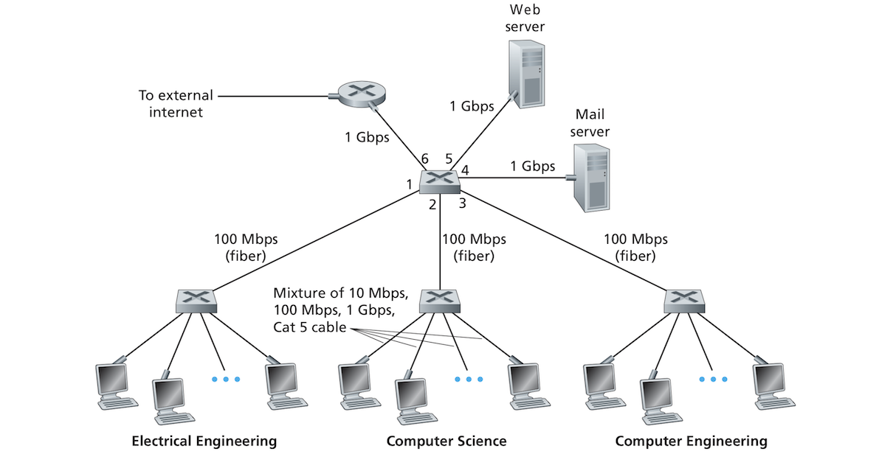
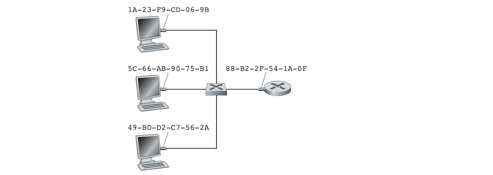
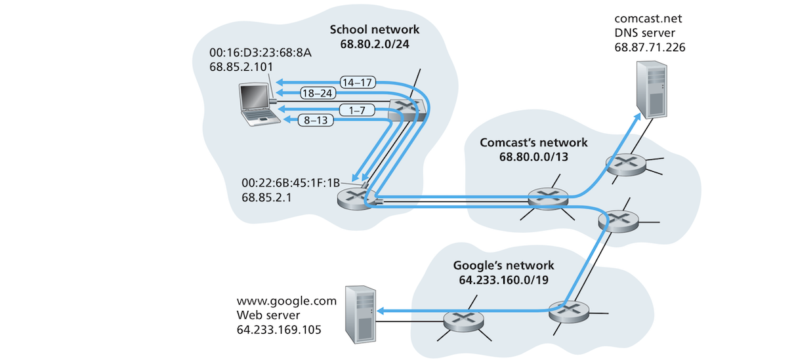

# The Link Layer: Links, Access Networks, and LANs:

## Table of Contents:
* [Introduction](#introduction)
* [Preliminaries](#preliminaries)
	+ [The Services Provided by the Link Layer](#the-services-provided-by-the-link-layer)
	+ [Where Is the Link Layer Implemented?](#where-is-the-link-layer-implemented)
* [Techniques of Error Detection and Correction](#techniques-of-error-detection-and-correction)
	+ [Parity Checks](#parity-checks)
	+ [Checksumming Methods](#checksumming-methods)
	+ [Cyclic Redundancy Check(CRC)](#cyclic-redundancy-check-crc)
* [Multiple Access Links and Protocols](#multiple-access-links-and-protocols)
	+ [Channel Partitioning Protocols](#channel-partitioning-protocols)
	+ [Random Access Protocols](#random-access-protocols)
		+ [Slotted ALOHA](#slotted-aloha)
		+ [Carrier Sense Multiple Access (CSMA)](#carrier-sense-multiple-access-csma)
		+ [Carrier Sense Multiple Access with Collision Detection (CSMA/CD)](#carrier-sense-multiple-access-with-collision-detection-csma-cd)
	+ [Taking-Turns Protocols](#taking-turns-protocols)
* [Switched Local Area Networks](#switched-local-area-networks)
	+ [Link-Layer Addressing and ARP](#link-layer-addressing-and-arp)
		+ [MAC Addresses](#mac-addresses)
		+ [Address Resolution Protocol (ARP)](#address-resolution-protocol-arp)
		+ [Sending a Datagram off the Subnet](#sending-a-datagram-off-the-subnet)
	+ [Ethernet](#ethernet)
		+ [Ethernet Frame Structure](#ethernet-frame-structure)
		+ [Ethernet Technologies](#ethernet-technologies)
	+ [Link-Layer Switches](#link-layer-switches)
		+ [Forwarding and Filtering](#forwarding-and-filtering)
		+ [Self-Learning](#self-learning)
		+ [Properties of Link-Layer Switching](#properties-of-link-layer-switching)
	+ [Virtual Local-Area Networks (VLANs)](#virtual-local-area-networks-vlans)
* [Data Center Networking](#data-center-networking)
	+ [Load Balancing](#load-balancing)
* [Actual Day in the Life of a Web page Request](#actual-day-in-the-life-of-a-web-page-request)

## Introduction:
- In the network layer, we saw how a packet travels from a source host to a destination host traversing a series of links (wired or wireless) and packet switches (routers or and switches).
- When thinking about what goes below the network layer at the *link layer*
	- How does a datagram ravel through each one of the *individual links* that make up its end-to-end path?
	- How are network layer datagrams encapsulated in link layer frames for transmission over a link?
	- Do links in a path use different link-layer protocols?
	- How does a switch differ from a router?
	- Does link layer use addressing and how does this addressing interoperate with the network-layer addressing?
- These questions and others will be answered in this document. While trying to answer these questions we will familiarize ourselves with the two fundamental types of link-layer channels:
	- *Broadcast* channels which connect multiple hosts and are used in wireless LANs, satellite networks and hybrid fiber-coaxial cable (HFC). The fact that multiple hosts are connected to the same broadcast channel requires the use of medium access protocols to coordinate frame transmission. 
	- *Point-to-point* links such as a long-distance link connecting two routers or a host and an Ethernet switch. The point-to-point (PPP) is used to coordinate frame transmission in this kinda link.
- Other topics we will touch upon include:
	- Error detection and correction.
	- Multiple access networks especially the famed Ethernet.
	- Virtual LANS.
	- Data center Networks.
- We will not discuss WiFi but leave it to another day when discussing wireless networking.

## Preliminaries:
- Let's start with a few definitions:
	- A **node** in a link-layer context is any device that runs a link-layer protocols. This includes hosts, switches, and WiFi access points. 
	- **Links** are the communication channels connecting adjacent nodes along a communication path. "In order for a datagram to be transferred from source host to destination host, it must be moved over each of the individual links in the end-to-end path." The following figure shows the path of a datagram from a wireless host and a server. It passes through six links:
		1. A WiFi link between the sending hot and a WiFi access point.
		2. An Ethernet link between the WiFi access point and a link-layer switch. 
		3. A link (probably Ethernet) between the link-layer switch and a router.
		4. A link between the aforementioned router and another router.
		5. An Ethernet layer connecting the previous router to a link-layer switch.
		6. An Ethernet link connecting the switch to the server.

	- A node encapsulates a datagram into a **link-layer frame** and transmits it into the link. 
- The book provides a nice analogy of the relationship between the link layer and network layer, but you know I hate analogies!

### The Services Provided by the Link Layer:
- The basic role of the link layer is moving a datagram from node to an adjacent node over a single communication link, but the details of what services can be offered vary from one protocol to another. Common services offered by link-layer protocols include:
	- **Framing**: Most link-layer protocols encapsulate datagrams in frames. A frame consists of a data field which contains the datagram and a set of header fields. The structure of a frame differs from one link-layer protocol to the next. We will soon see some link layer protocols and their frame structures. 
	- **Link access**: A **medium access control (MAC)** protocols defines the rules by which a frame is is transmitted into the link. For point-to-point links, the MAC is simple or nonexistent since the link has a single receiver at one end and a single destination at the other. The sender can send frames whenever the link is *idle*.
	- **Reliable delivery**: A link-layer protocol guarantees moving a datagram through a link without error! This is similar to what TCP does at the transport layer, but does it only over a single link and not end-to-end because the link layer only operates over a single link between two adjacent nodes. Reliable delivery is also achieved by acknowledgments and retransmissions just like TCP. Reliable delivery is used in links prone to high error rates such as wireless links, but many wired links don't have these errors so protocols used in some wired links don't bother about reliable delivery. 
	- **Error detection and correction**: *This might seem like a subset of reliable delivery!!* Hardware signal noise can cause bit errors in frames. Many link-layer protocols provide mechanisms for detecting and correcting such errors. This is done by appending error-detection bits by the sender in each frame and having the receiver do error checks. Link-layer error detection is more sophisticated than what we saw in TCP and it's done in hardware. The receiver detects when and exactly where an error occurred in a frame and then corrects this error!! *Wow, interesting! Does this mean there is no reason to retransmit the frame?*

### Where Is the Link Layer Implemented?
- Where do hosts implement the link layer? Is it implemented in software or hardware, and how does it interact with the other components of the computer's hardware and software? The link layer is implemented in a hardware piece called the **network adapter** or the **network interface card (NIC)**. At the heart of the NIC is the *link-layer controller* which is a special-purpose chip that implements link-layer services such as framing and error detection. NICs used to be separate components, but are mostly now integrated into the computer's motherboard. 
- On the sending side, the controller encapsulates a datagram into frame, a possibly adds error bits to the frame, and transmits the frame into the link. On the receiving end, the controller receives the frame, possibly performs error checking and then extracts the datagram from the frame.
- For the computer, the NIC and the controller are an IO device. Most of the of link layer functionality is implemented in the NIC hardware, but some is also implemented in software running on the host's CPU. Such functionality includes assembling link-layer addressing :confused:, and activating the controller. On the receiving host, link-layer software in the CPU responds to controller's interrupts,  handles errors and passes the extracted datagram to the network layer. 

## Techniques of Error Detection and Correction:
- **Bit-level error detection and correction** refers to detecting and correcting the corruption of bits in a link-layer frame that has been sent from a node to a physically adjacent node over a link. Both detection and correction are often provided by the link layer but not always. 
- We will only grate the surface of this subject here as there whole books dedicated to it.
- The following figure shows the steps of how link-layer error detection and correction is done:

- As the figure shows, before sending the data D (this also include other frame header fields, etc.), the sending node augments it with error-detection and error-detection bits (EDC).
- The receiving node receives a sequence of bits D' and EDC' which might differ from the original D and EDC due to possible link transit bit corruption. The receiver needs to determine whether D' and EDC' are the same as D and EDC'. The receiver can only determine if an error has been detected which is different from determining if the error has or has not occurred. EDC can only sometimes determine if an error has occurred. It cannot always detect an actual error. There can acktchyually be **undetected bit errors**! Wow! This results in some corrupt datagrams. The goal is to have error-detection and correction schemes that keep the probability of undetected bit errors low, but such schemes can lead to larger overhead. 
- The following subsections will give overview of some common error-detection and correction techniques. 

### Parity Checks: 
- The simplest form of error detection can be done with a single **parity bit**. You can either use an even or odd parity bit. In even parity, we add an extra bit to D such that the total number of bits in EDC whose value is 1 is even. The receiving node counts the number of bits whose value is 1, and if they are odd, the node determines there was an error. At least one bit error has occurred, or more precisely: an odd number of errors has occurred. If an even number of errors has occurred, then the errors go undetected. 
- Experience has shown that, rather than occurring independently of each other, bit errors occur in bursts meaning that single bit parity checks are next to useless. 
- The one-bit parity scheme can be generalized into a *two-dimensional parity* scheme for more robustness. The bits in D can be divided into i columns and j rows and a parity value is calculated for each row and each column as the following figure shows:

- If an error occurs at a given bit, both the row and column where it occurred will be affected. The receiver can detect the error and also locate exactly where it happened and then correct it. 2D-parity matrices can also detect and correct errors in the parity bit themselves although I have no idea how! 
- The ability of the receiver to both detect and correct errors is called **forward error correction (FEC)**. This technique is used in audio storage and playback devices such as CDs. They can be used by themselves or with other techniques such as retransmission in the way we saw with TCP to recover from errors. The good thing about FEC is that it allows for immediate error correction and reduces the number of retransmissions. This is especially useful for real-time applications. 

### Checksumming Methods:
- With checksumming (we've seen it in the transport document), the bits of a packet are treated as a sequence of k-bit integers. These k-bit integers can be added together to produce a sum which is used for error detection. The 1s complement of this sum is sent as a checksum with the data. The receiver takes the 1s complement of the received data (including the checksum). The result should be all 1 bits, but if any of the bits is 0 this means an error has occurred. 
- Checksumming is used in transport layer with TCP, but not in the link layer which uses the more robust cyclic redundancy check (CRC). The latter requires more computations so it is implemented in hardware. 

### Cyclic Redundancy Check(CRC):
- The basic idea of **cyclic redundancy check (CRC)** is follows:
	- The data to be sent can be represented by D. 
	- The sender and receiver agrees on an r + 1 bit pattern called a *generator* which we can represent by G.
	- The sender chooses r bits R and appends them to D such that the resulting d + r bit pattern is exactly divisible by G (The remainder is 0).
	- The receiver divides the received pattern by G. If the result is a nonzero, the receiver detects an error.
- The idea seems fairly basic and clear, but the authors love to waffle on about details.

## Multiple Access Links and Protocols: 
- As we've mentioned earlier, there are two types of links, point-to-point links and broadcast links. Broadcast links (examples include wireless LANs and Ethernet) connect multiple sending and receiving nodes that all share the same broadcast channel. This type of link is considered *broadcast*, because when a node sends a frame each other nodes receives a copy of it.
- This section will try to touch (at a theoretical level e)on the interesting problem facing broadcast links which is the so-called **multiple access problem**: how to coordinate the access of multiple sending and receiving nodes to a shared broadcast channel. 
- Television is one example of broadcasting, but it is a one-way type of broadcasting where television sets only receive signal. A room full of people engaged in a conversation, or conversations. These guys need some kinda protocol to make their conversation possible: not all talking at the same time, listening while another talks, signaling the desire to speak, etc.
- Computer networks also use protocols which allow nodes to coordinate packet transmission into shared broadcast channels. These protocols are called **multiple access protocols**.
- More than one node can transmit frames into the broadcast channel at the same time. The result is that other nodes can receive multiple frames at the same time. Frames in this case are said to **collide** and the receiving nodes cannot make sense of them. Frames that collide lost and the broadcast channel *bandwidth* was wasted during collisions.
- Multiple access protocols' job is to coordinate the transmission of multiple nodes hence reducing collisions and the associated waste of broadcast channels. There are many of these protocols, but they can be broadly classified into 3 categories: **channel partitioning protocols**, **random access protocols**, and **taking turns protocols**.
- If we try to devise our own multiple access protocol, we should ideally make it satisfy the following requirement for a broadcast channel of rate R bits per second:
	- If only one node is sending data, the node has a throughput of R bps.
	- If M nodes have data to send, each node as an average throughput R/M bps.
	- The protocol is decentralized. No master node controls it.
	- The protocol is simple and inexpensive!

### Channel Partitioning Protocols:
- A broadcast channel can be partitioned by nodes using one of the following techniques:
	- **Time division multiplexing (TDM)**: Given a channel with R bps transmission rate that supports N nodes, "time is divided into frames of fixed duration, and each frame is divided into" N "time slots" (these time frames have nothing to do with the link-layer packets called frames). Each time slot is assigned to one of the N nodes. A node must wait for its assigned time slot before it can send a packet. TDM is fair and eliminates collision. Each node gets a dedicated fixed rate of R/N bps. This can be problematic, because a node can only send one packet but it needs to send more and no other node is using the channel at the same time. The node needs to wait for its time to send more data even though the channel sits idle. 
	- **Frequency division multiplexing (FDM)**: An R bps channel supporting N nodes is divided into different Frequencies each with an R/N bandwidth. "FDM thus creates N smaller channels of R/N bps out of the single, larger R bps channel". Like TDM, FDM has the combined advantage of collision avoidance and the fair sharing of bandwidth between the N nodes. It also has the same disadvantage. A node is limited to an R/N bandwidth even if the other nodes are sitting idle!
	- **Code division multiple access (CDMA)** assigns a *code* to each node, just TDM assigns time slots and FDM assigns frequencies. Each node encodes its signal in its assigned code. CDMA allows sending nodes to send signal simultaneously and enables receiving nodes that know the code to receive signal correctly without collision even though signal is entangled. We will see more about CDMA in the mobile chapter. 

### Random Access Protocols:
- Random access protocols allow nodes to send at the full transmission rate of the channel (R bps). When a collision occurs, the sending node retransmits its packet repeatedly until it gets through without a collision. The retransmission doesn't occur immediately after the collision but takes place after a *random delay*. If two nodes have sent colliding frames, each of the two nodes chooses an independently random delay so their frames to be retransmitting would be less likely to collide again. 
- There is a ton of random access protocols. Here we will describe the *ALOHA* and *carrier sense multiple access (CSMA)* protocols.

#### Slotted ALOHA:
- The **slotted ALOHA** protocol is one of the simplest random access protocols. In this scheme, all frames have a fixed size L bits. Time is divided into L/R slots (the time it takes for a frame to be transmitted). Nodes can start transmitting frames at the beginnings of time slots. Nodes in the channel are synchronized so they know when the time slot starts. If two or more frames collide during the current time slot, all the nodes detect the collision before the current slot ends. 
- When a node has a new frame to send, it waits until the beginning of the next time slot and then sends the frame. If there is no collision, the frame is sent successfully and the node can proceed into sending another frame if it has one. If there is a collision, the node retransmits its frame with probability p (between 0 and 1) until that frame is transmitted.
- The probability p is akin to tossing a biased coin (biased towards the retransmission of the frame) so heads (p) would mean retransmit the frame and tails (1 - p) is for waiting until the next time slot to toss the coin again and proceed from there. All nodes involved in the collision toss their coins independently.
- Slotted aloha seems better than channel partitioning protocols like TDM and FDM because it at least allows a node to transmit data at full speed when it is the only active one. It eliminates idle time. It is also decentralized. Each node decides when to retransmit independently of other nodes. 
- When multiple nodes active some problems arise:
	* Slots involved in a collisions are effectively wasted.
	* Other slots will also be wasted/empty because of the probabilistic transmission policy. A retransmitted frame might again collide with a retransmitted or fresh frame, I think!!
- The book went through some mathy voodoo to  conclude that when a large number of nodes are active concurrently, the maximum capacity of a channel using slotted ALOHA is capped 0.37 R bps.
- Slotted ALOHA is itself a modified synchronized of an older unslotted pure *ALOHA* protocol that was unslotted and unsynchronized but there is really no point in discussing it here!

#### Carrier Sense Multiple Access (CSMA):
- In the ALOHA protocols, slotted and otherwise, every node would attempt to transmit packets whenever it has one, independently of one or more of the other nodes are also transmitting their own packets at the same time. ALOHA is akin to a conversation among impolite imbeciles who all talk at the same time. They can be more polite:
	* *Listen before speaking*. This is equivalent to **carrier sensing** in networking lingo. A node listens to the channel. If frames are being sent, the node waits until it detects no transmission is being carried out for a short time and then it starts transmitting its frame. 
	* *If someone else begins talking at the same time, stop talking* or **collision detection**. When a node is transmitting bits, it listen simultaneously to the channel and if it senses that another node is transmitting data it stops a random amount of time before it resumes "the sense-and-transmit-when-idle cycle". 
- These two rules are used in a family of protocols: **carrier sense multiple access (CSMA)** and **carrier sense multiple access with collision detection (CSMA/CD)** protocols. There are different variations of these and here we will focus on their main features.
- One confusing question one might have is "why is there collision in the first place, if nodes do carrier sensing before sending their bits?" The answer is simple: It takes time for bits a node to another to arrive to other nodes. This time is called **channel propagation delay**. Although bits are moving close to light speed or something, they still take time. The larger the channel propagation delay, the less efficient it is and the more and worse collision CSMA/CD suffers from.

#### Carrier Sense Multiple Access with Collision Detection (CSMA/CD): 
- CSMA continues to transmit a frame in its entirety even after a collision is detected which can be wasteful. In CSMA/CD, on the other hand, the nodes involved in a collision cease to transmit bits a short time after detecting a collision. They don't continue to transmit a damaged frame in its entirety. 
- The actions of a node attached to a broadcast channel using CSMA/CD can be summarized as follows:
	1. The node's adapter receives an IP datagram, wraps it in a frame and has it ready for transmission.
	2. The adapter listens on the channel. If the channel is idle (no other node is transmitting data through the channel), the node starts transmitting its frame. If the channel is busy, the node waits until the channel is idle to start transmitting its frame.
	3. While transmitting its frame, the node keeps listening for the presence of signal from other nodes.
	4. If no signal is detected from other nodes, the node continues to transmit its frame until the whole frame is transmitted. If the node detects a collision, it aborts transmission and waits a *random amount of time* before returning to step 2. 
- It is necessary for the wait time after a collision to be random because otherwise the colliding nodes will try to retransmit frames at the same time and re-collide forever! Choosing an interval of time from which to pick a random delay is kinda tricky. If it is small and there are many nodes, the nodes will try to retry to retransmit at near the same time which means they will most likely collide again. If this backoff time is large with a few nodes, the wait before the retransmission will be unnecessarily long. We need a backoff time that is short when there are a few colliding nodes and large when there are many of them. The **binary exponential backoff** is an algorithm that does just this. It is used in Ethernet. When retransmitting a frame that has experienced ***n*** collisions (in the past/number of retransmissions), the node picks a random delay ***K*** from the the interval ***{0, 1, 2, ...., 2n - 1}***. For Ethernet, the actual wait time is ***k · 512 bit times*** (the amount of time needed to send 512 bits through Ethernet). The maximum value of ***n*** is 10.
- The node can still sneak new frames through regardless of whether there are frames waiting to be retransmitted. 

### Taking-Turns Protocols:
- It is ideal if the channel's capacity is equal to R bps when there is only one active node, and R/N bps when there are N active nodes. The **taking-turns** protocols (there are several) try to reach this ideal. 
- One popular taking-turns protocol is the  **polling protocol** which designates a master node which polls the other nodes continuously. The master node sends a message to node 1 telling it it can start transmitting up to a maximum number of frames. When the master node detects lack of signal in the channel it determines that node 1 has stopped sending frames, so it moves on to instruct node 2 to start sending its packets. This continues on forever!
- Advantages of the polling protocol include the elimination of empty slots and collisions. The protocol, however, has its drawbacks which include:
	* Polling delay. If a node is the only active node and after sending its maximum number of frames, the master node takes over and polls all other nodes before returning to the active node and let it resume sending its frames.
	* If the master node fails, the entire channel fails. 
- Bluetooth and 802.15 are examples of polling protocols.
- Another taking-turns protocols is the **token-passing protocol**. In this protocol, there is a small special-purpose frame called a **token** which is exchanged among nodes in a fixed manner. Node 1 sends the token to node 2, node 2 to node 3, etc. and node N back to node 1. If a node has no frames to transmit, it immediately forwards the token to the next node. If the node has frames, it transmits up to a maximum number of frames and then it releases the token for the next node. This scheme is decentralized and very efficient, but suffers for a problem similar to the polling delay problem. If a node fails, the whole channel may fail. If a node fails to release the token, then something need to be done to recover the token.

## Switched Local Area Networks:
- The following diagram shows a *switched local network* which connects 3 departments, 2 servers, and a router, using 4 switches. Switches operate at the link layer, so they switch link-layer frames rather than network-layer datagrams. They also don't understand IP addresses, but use link-layer addresses instead for forwarding link-layer frames:

- In this section, we will study link-layer addressing and how it relates to network-layer addressing, then study Ethernet and how link-layer switches work and finish the section with how switches are used to build large LANs. 

### Link-Layer Addressing and ARP:
#### MAC Addresses:
- Link-layer addresses are not part of routers or hosts. They are part of the network adapters/interfaces of these computers, so a router with multiple interfaces has multiple link-layer addresses in the same way that it has multiple IP addresses.
- Link-layer switches themselves don't have link-layer addresses associated with their interfaces?! :confused:!!
- A link-layer address is known by several names including **LAN address**, **physical address**, and **MAC address** with the latter being the most common name. For most LANs (including Ethernet and 802.11 LANs), a MAC address is 6 bytes long which allows for 248 possible addresses. As the following diagram shows how MAC addresses are expressed: in hexadecimal notation with each byte expressed with 2 hexadecimal numbers. MAC addresses were designed originally to be permanent but it is possible now to change a MAC address with software!! Wow:

- Although network adapters are manufactured by different companies across different countries, they MAC addresses are unique and no two adapters have the same address! This is possible thanks to the IEEE which manages the allocation of MAC addresses. Companies wishing to manufacture adapters buy a chunk of 224 addresses from the IEEE. The IEEE fixes the first 224 for the company and allowing it to create combinations of the last 224 bits of the MAC address.
- A MAC address is flat and not hierarchical like an IP address where the different portions of the IP address might point to networks and subnets within subnets while other portions point to hosts, etc. MAC addresses also don't change if the host or device is moved. A MAC address is a non-changing identifier of a device across networks as opposed to the IP address of a host which changes when the computer is moved from one network to another. If the computer were a person, it's MAC address would be its social security number while it's IP would be its address.
- When a node wants to send a frame to a given destination, it places the MAC address of the destination in the frame and transmits it. An adapter receives this frame and checks its destination MAC address. If the destination address matches the adapter's addresses it unpacks the datagram within it and passes it up to the network layer, and otherwise it discards it. It often happens that an adapter receives frames not addressed to it, as is the general case with broadcast frames, that's why it checks the destination MAC address of the frame.
- When a sending adapter wants all other adapters on the LAN to receive the and process the frame, it uses a special MAC **broadcast address**. In Ethernet and 802.11, this special broadcast address is 48 consecutive 1s: ***FF:FF:FF:FF:FF:FF***.

#### Address Resolution Protocol (ARP):
- We need a way to translate between MAC addresses and IP addresses because they are both used to exchange data. This is done with the **address translation protocol (ARP)**. 
- Imagine a source host with given IP address wants to send a datagram to a destination host within the same subnet that contains other hosts, switches, etc. The source host needs to give its adapter the MAC address as well as the IP address of the destination to be able to send data to it. The sending adapter can use this MAC address to create a frame it then sends to the destination.
- To determine the MAC address corresponding to the given destination IP address, the sending host uses its *ARP module*. The ARP module in the host takes the IP address as an input returns the corresponding MAC address.
- ARP basically resolves IP addresses to MAC addresses in the same way that DNS resolves hostnames to IP addresses, but while DNS resolves hostnames across the Internet, ARP functions only within the same subnet and not outside it.
- How does ARP do it? Each router and host has an **ARP table** which contains mapping between IP addresses and MAC addresses. The following is an example of an ARP table:

| IP address | MAC address | TTL |
| --- | --- | --- |
| 212.212.200.123 | AB:33:13:54:0F:0A | 12:00:29 |
| 212.212.200.213 | 1B:3B:13:54:0F:7A | 00:00:53 |

- The third column of the table contains the time-to-live (TTL) values of mappings after which the mappings are dropped from the table. A given ARP table doesn't have an entry for every host and router in the subnet. Some of these hosts/routers might never make it to the ARP table. Others might have expired. The typical time-to-live of an entry is about 20 minutes. 
- If a host wants to send a datagram to another host or router in the same subnet whose IP address it knows, it must also get its MAC address before it can send that datagram. It checks its ARP table and just grab the MAC address if it is in the table. If the table doesn't have that entry, the host uses the ARP protocol to resolve this address. It constructs a special packet called the **ARP packet**. The ARP packet has multiple fields including the IP and MAC addresses of the sending and receiving nodes. In fact, there are two of these packets which have the same format. The **ARP query packet** is used to query all other hosts/routers in the subnet to find the MAC address corresponding to the IP address being resolved. The sending host passes the ARP query packet to the adapter and instructs it to send it to the MAC broadcast address ***FF:FF:FF:FF:FF:FF***. The ARP query packet is packed into a frame, the broadcast address is placed into its destination field and the frame is transmitted into the subnet. This frame is received by all other hosts/routers in the subnet. Each one of these guys checks passes the query packet up to its ARP module which checks if its IP address matches the IP address in the ARP query packet, and if it is so, this machine sends back to the querying host/router an **ARP response packet** containing the desired MAC-IP mapping. The querying host then updates its ARP table. It is now also capable of sending its datagram to the destination given by the IP address. 
- The query packet is sent in a broadcast frame but the response is sent in a regular frame, because they query is searching for something it doesn't know! Any other router/host could have the MAC address being searched!! Maybe, this is getting a little trippy!
- ARP is also a plug-and-play protocol. There is no need for manual configuration. The ARP tables get updated with entries added and deleted automatically and continuously. 
- ARP is one of those protocols that don't strictly belong to just one layer but is part of both the network and link layers. Some protocols involve the interplay of different elements from different layers. 

#### Sending a Datagram off the Subnet:
- How does a datagram go from a host in the current subnet to another host in a different subnet? Let's say we have two subnets 1 and 2 connected by a router and we want to send a datagram from a host in subnet 1 to a host in subnet 2. The sending host first finds the MAC address of the interface of the first-hop router in the path to the destination using ARP. It uses this MAC address to create a frame that it sends to that router's interface. The router's interface receives the frame which it passes up to the network's layer. The router's forwarding table is checked for which other router's interface the datagram needs to be forwarded to. Once this IP address of this interface is decided, the router uses ARP to get this interface's MAC address. A frame is created and transmitted to this outgoing router's interface. The outgoing interface receives the frame and the datagram is extracted and passed up to the network layer. This one checks its forwarding table and determines the IP address of the destination host. It then uses its ARP module to find the MAC address associated with the destination's IP address. It packs the datagram in a frame and sends it to the destination. The destination accepts the frame and unpacks the datagram. Wow, what an arduous trip!!!
- Let's just note that a router with multiple interfaces does actually have multiple IP addresses, MAC addresses, and ARP modules for each of these interfaces. 

### Ethernet:
- Ethernet has dominated wired LANs for a long time and might continue to do so for a long time. It might not be irresponsible to claimed that Ethernet has been "to local area networking what the Internet has been to global networking."
- It has witnessed a lot of evolution since its inception sometime during the 1970s. 

#### Ethernet Frame Structure:

- An Ethernet frame consists of the following 6 fields:
	* **Data** *field (46 to 1,500 bytes)*: This field capped at 1500 bytes and it carries the network-layer packet (e.g. an IP datagram). The minimum size of this field is 64 bytes so if the datagram is smaller than 64 bytes, the data field is stuffed/padded. When a frame is received, the datagram it contains has both the datagram and stuffing. The network layer uses the length field in the datagram header to remove the stuffing.
	* **Destination address** *(6 bytes)*: It contains the MAC address of the destination adapter. If this MAC address is the same as the adapter's MAC address or is a broadcast address, it unpacks the frame's data field and passes it up to the network layer. Otherwise, it discards the frame. 
	* **Source address** *(6 bytes)*: contains the sending adapter's MAC address. 
	* **Type** *field (2 bytes)*: Allows Ethernet to multiplex network-layer protocols. IP is not the only network layer protocols. The same host might support multiple network-layer protocols and this type field allows Ethernet to pass the contents of the frame's data field to the appropriate network-layer protocol. For example, the type for a frame containing an ARP packet is different from the one in a frame containing an IP datagram. 
	* **Cyclic redundancy check (CRC)** *(4 bytes)*: As we've seen earlier, CRC is used to detect bit errors.
	* **Preamble** *(8 bytes)*: The Ethernet frame starts with an 8-byte preamble. Each of the first 7 bytes consists of the pattern ***10101010***, while the last byte in the preamble is ***10101011***. The book says, the preamble "wakes up" the the receiving adapter (whatever that means!! :confused:), and to synchronize the two adapters clocks!!! The last two bits of the 8th byte of the preamble signals to the receiver that the content of the frame is about to start. 
- Ethernet is connectionless, meaning it provides an unreliable service to the network-layer protocols that involves no handshaking! The adapter receiving a frame performs a CRC check for errors but doesn't sends back an acknowledgment or negative acknowledgment back to the sending adapter. The receiving adapter might drop a frame or receive a bad frame without the sending adapter knowing anything about such a event. Datagrams might be lost because of issues at the link layer. Neither the link layer nor the network layer will try to restore such missing datagrams, In most systems, this is done at the transport layer with TCP.

#### Ethernet Technologies:
- In practice, Ethernet is not a single uniform protocol but comes in different varieties with weird names such as 10BASE-T or 1000BASE-LX. These and others have been standardized by the so-called IEEE 802.3 CSMA/CD working group. The different parts of these cryptic acronyms list the features of each of the technologies they name. For example in 10BASE-T, 10 means its transmission rate is 10 Mbps, BASE means it's "baseband Ethernet"; it only carries Ethernet traffic. T means the physical medium it uses is twisted-pair copper wire. By the way, actual commercial Ethernet is also a physical-layer specification not just a link-layer protocol. 
- Different Ethernets might use different physical media and specifications and transfer data at different rates (10 Mbps, 100 Mbps and 1000 Mbps). They are compatible with each other, though, and have the same frame structure. 

### Link-Layer Switches:
- I still have no idea what a **switch** is and what it does exactly! It says that the role of a switch is to receive a incoming link-layer frames and forward them unto outgoing links. Switches are also **transparent** to the hosts and routers in a subnet, meaning that hosts/routers address their frames to other hosts/routers rather than to switches separating senders from receivers. If a group of routers forward datagrams from a source host to a destination host, then a switch can forward frames in the same subnet from a sending host/router to a receiving host/routers. Another vital function switches can play within a subnet is the ability to buffer frames to lessen jamming if their outgoing links have a capacity lower than the incoming frames. 
 
#### Forwarding and Filtering:
- **Filtering** refers to the action of the switch determining whether a frame should be forwarded to some interface or just  dropped.
- **Forwarding** refers to the switch's function of determining to which interface a frame is to be directed and the moving of the frame to such interface.
- The switch performs filtering and forwarding using its **switch table** which contains entries for some but not necessarily all hosts/routers in the LAN. As the following table shows, each entry contains: a MAC address, the interface leading to that MAC address, and the time when the entry was placed in the table:

| MAC address | Interface | Time |
| --- | --- | --- |
| A2:BB:C7:E1:22:3F | 1 | 5:23 |
| A2:BB:C7:E1:22:11 | 3 | 2:43 |
| .... | .... | .... |

- Frame forwarding might seem similar to datagram forwarding, but the similarity is only skin deep. Differences include the fact that switch forwarding uses MAC addresses rather than IP addresses and switch tables are constructed in a manner different from that of router forwarding tables.
- When a switch receives a frame at an interface x, the switch indexes its table with the MAC address of that frame and one of 3 things could happen:
	1. The given MAC address is not in the table, at which point copies of the frame are broadcast to each of the buffers of other interfaces except for interface x.
	2. The given MAC address is in the table, but the interface associated with it is x. In this case, the frame is dropped. Why forward a frame to yourself? :confused:
	3. The given MAC address is in the table, and the interface associated with is not x. The switch simply forwards the frame to that interface so it would be transmitted through the link attached to it.

#### Self-Learning:
- How does a switch table get configured/constructed? This is done  with no manual intervention or the use of a configuration protocol. Switches do this automatically through **self-learning** which is accomplished as follows:
	1. The switch table is initially empty.
	2. For each frame coming through an interface, the switch stores in its switch table the source MAC address of the frame, the interface where the frame was received and the current time.  
	3. The switch deletes an address from the table if no frame has been received after a certain period of time (the so-called **aging time**). This means when a host is replaced by another, the old MAC address for the old host is dropped. 
- Switches are another **plug-and-play** technology that require no manual intervention by an administrator. Installing a switch or a changing or removing a host doesn't require any kind of configuration.All you need to do is to plug LAN segments in appropriate interfaces. Switches are also full-duplex meaning they can send and receive frames at the same time.  

#### Properties of Link-Layer Switching:
- This subsection lists advantages LANs using switches over LANs based on buses star topologies (*W haven't studied these to make the comparison!!!*).
- Anyways, switches have the ability to:
	- *Eliminate collisions* precisely because switches buffer frames at interfaces and never transmit more than one frame at a time. 
	- Allow for *heterogeneous links*. Since link segments are isolated by switches, different links with different speeds and different media can be part of the same LAN. 
	- Switches can help with *network management* by disconnecting rogue and malfunctioning adapters, etc. 

### Virtual Local-Area Networks (VLANs):
- As the following figure (which we've seen earlier) shows, networks can be configured into hierarchical switched LANs interconnected with a switch hierarchy:

- The hierarchical configuration shown in the image suffers from several drawbacks:
	- **Lack of traffic isolation**: intergroup traffic behind a switch is local to the area behind that switch, but broadcast traffic such as ARP and DHCP packets whose destinations haven't been learnt by by self-learning switches must still traverse the whole network. This broadcast traffic adversely affects the performance of the network as a whole and does also lead heavy security/privacy issues because these broadcast ARP, etc. packets can reveal dangerous information to other departments.
	- **Inefficient use of switches**: Can you isolate traffic with one switch that have many ports? What if you have 3 switches with many ports, but also need to create 10 isolated LANs? Can you do this with the few switches you have?
	- **Limited user management**: Can a host stay connected to its intended LAN even if it's physically moved to a different location?
- These problems are addressed with **virtual local area networks (VLANs)**. A VLAN allows you define multiple *virtual* LANs over single physical LAN infrastructure. Hosts in a VLAN communicate with each other as if they were the only ones connected to that switch so they can't see traffic of hosts in other VLANs in the same LAN nor can other VLAN hosts see their traffic.
- Switch management software is used to configure VLANs. Hosts are added or removed from VLANs using this switch management software. 
- The switch contains a table for maintaining port-to-VLAN mappings. Traffic is isolated based on these mappings.
- There are other details about VLANs that have to do with interconnecting different VLANs, etc. This was a very brief intro to just get an idea. 

## Data Center Networking:
- Large companies like googal maintain unbelievably large data centers containing many many thousands of hosts. These data centers are at the heart of the so-called cloud application. A data center has a **data center network** which interconnects its hosts and connects the data center itself to the Internet.
- Enormous amounts of money can go into running and maintaining a data centers which are used for hosts, networking equipment such as routers, switches, power supply, etc. Networking is an important part of a data center and making good networking decisions can reduce the costs of a data center drastically.
- Data centers store and serve a lot of content and do a lot of distributed computation. This work is done by hosts which come in the form of **blades** that look like pizza boxes. Blades are regular computers with CPUs, memories and disk storage and are stacked in **racks**. A typical rack contains 20 to 40 blades. At the top of a rack is a so-called **top-of-the-rack (TOR)** switch which interconnects the blades in the rack and other switches in the data center. Each blade has its own network interface card which allows it to be connected to its TOR switch. Each TOR has ports that ports that connect to the rack's blades and others that can be connected to other switches. These connections run over 1 Gbps Ethernet and more!
- Data centers handle two types of traffic: internal traffic between hosts in the data center and external traffic between the data center hosts and the Internet. One or more **border routers** connect the data center to the rest of the world. The job of the data center network then is connecting the racks to each other and connecting the racks to the border routers. There is a whole *science* called **data center network design** dedicated to protocols, techniques, etc. of connecting racks to other racks and to the border routers. 

### Load Balancing:
- External clients connect to an application running in a cloud data center (there are usually several of these application running in each of these data centers) through a publicly visible IP address. External requests to the application are first directed to a **load balancer** which distributes the requests to the hosts based on their current load. A large data center usually has several load balancers each devoted to a set of applications. A load balancer is sometimes called a layer-4 switch because it directs traffic based on port numbers and IP addresses. Probably, there would be multiple hosts handling the same application concurrently, so load balancer would forward the request to the least busy host?!!! The host might trigger other hosts to help it process the requests and when all is done, the response is sent back to the load balancer which forwards it to the border router. A load balancer might also provide a NAT-like function of translating the public address to internal host IP addresses and vice-versa. 

## Actual Day in the Life of a Web page Request:
- We took a very deep dive up to this moment into the world of networking and its many interleaved protocols. We will now take an "integrated, holistic view of the[se] protocols" by examining how a web page is downloaded. Some unnamed student connects her laptop to the her school's Ethernet switches and downloads some web page like `www.github.com`. What happens for this web page to be downloaded?
- The following figure shows the general path of such a request:

- The Ethernet switch to which the laptop is connected is itself connected to the school's router. The school's router itself is connected to an ISP (Comcast) which provides DNS service to the school. In our example DHCP runs in the school's router. 
- When the laptop is first connected to the network, it cannot do anything because it doesn't even have an IP address. The first thing it must do is to run DHCP to obtain an IP address and some other useful network information, so downloading our web page following these steps:
	- The OS in our laptop creates a **DHCP query message**; places the DHCP query messages in a **UDP segment** whose destination port is 67 (port for DHCP server), and source port 68 (DHCP client); and places the UDP segment inside an **IP datagram** with a *broadcast* destination *IP address* 255.255.255.255 and a source address 0.0.0.0 (because it hasn't obtained an IP address yet).
	- The IP datagram containing the DHCP message is placed in an **Ethernet frame** which has destination address of FF:FF:FF:FF:FF:FF so it gets broadcast to all devices connected to the switch, including the DHCP server. The source MAC address is that of our laptop 00:16:D3:23:68:8A.
	- The laptop sends the Ethernet frame containing the datagram containing the DHCP message to the Ethernet switch broadcast it to all outgoing ports including the port connecting it to the router. 
	- The router receives the frame on its interface that has the MAC address 00:22:6B:45:1F:1B. It extracts the IP address. The fact that it is has a broadcast destination address means it needs to be processed by an upper layer. The contents of the IP datagram are **demultiplexed** to UDP. The DHCP query message is extracted from the UDP segment.
	- The DHCP server running in our school's router can allocate IP addresses in the **CIDR** block 68.85.2.0/24. As you can see all addresses within this block fall within the address block belonging to the Comcast ISP block. The DHCP server allocates the address 68.85.2.101 to our laptop. The DHCP server creates a **DHCP ACK message** that contains this allocated IP address (68.85.2.101), the IP address of the DNS server 68.87.71.226, the IP address of the default gateway router 68.85.2.1, and the subnet mask of the school LAN 68.85.2.0/24. The DHCP message is placed inside a UDP message, and the latter in an IP datagram and this in an Ethernet frame. The source MAC address of this frame is the router's interface to the home network 00:22:6B:45:1F:1B and its destination address is the MAC address of our laptop 00:16:D3:23:68:8A.
	- The Ethernet frame with the DHCP ACK message is sent (unicast) to the switch. The **self-learning** switch remembers that it received a frame from the MAC address of our laptop so it forwards this frame with the MAC address 00:16:D3:23:68:8A to the port outgoing to that MAC address.
	- Upon receiving the Ethernet frame containing the DHCP ACK message, this message is extracted from the frame, the datagram and the UDP segment. The DHCP client in the laptop extracts 3 IP addresses from this message: its IP address, the IP address of the DNS server, and the address of the default gateway router which the host installs in its **IP forwarding table**. Every datagram meant outside the subnet of the laptop 68.85.2.0/24 is forwarded to the default gateway. 
- At this point the laptop has an IP address and can connect to the Internet. ّWhen we type `www.github.com` in a browser, an event of series gets started. The laptop needs to create a **TCP socket** in order to send an **HTTP request** to github servers, but before such a socket can be created, we need to first obtain the IP address of github, and for this we need the services of the **DNS protocol**, so continuing with the steps listed before, the following happens:
	- The operating system in the laptop creates a **DNS query message** with the string `www.github.com` in its question section. The DNS message is placed in a UDP segment whose destination port is 53 (DNS server). The UDP segment is placed in an IP datagram whose destination address is 68.87.71.226 of the DNS server which we've obtained from previous steps, and source address 68.85.2.101 of the laptop itself.
	- The laptop places the IP datagram in an Ethernet frame which is meant for the gateway router, but even though the laptop knows the IP address of the default gateway router, it doesn't know its MAC address and the link layer needs a MAC address in order to send a frame. For this it needs the services of the **ARP** protocol.
	- The laptop creates an **ARP query message** with a target IP address of default gateway 68.85.2.1. It places the ARP query message in an Ethernet frame with a broadcast address FF:FF:FF:FF:FF:FF and sends it to the switch which sends it to all the connected devices including the default gateway router. 
	- The gateway router receives the Ethernet frame containing the ARP query message, extract that message and discovers that the message's target IP address is  68.85.2.1 which matches the gateway router's address. The gateway router issues an **ARP reply** containing its MAC address 00:22:6B:45:1F:1B. It places the ARP reply message in an Ethernet frame whose destination is our laptop's MAC address 00:16:D3:23:68:8A, and sends the frame to the switch which delivers it to our laptop.
	- The laptop receives the frame containing the ARP reply and extracts the MAC address of the gateway router 00:22:6B:45:1F:1B.
	- The laptop can now send an Ethernet frame containing a DNS query message to the gateway router's MAC address. The IP datagram in this frame has the destination address 68.87.71.226, the address of the DNS server, while the frame has the MAC address of the gateway router 00:22:6B:45:1F:1B. The laptop sends the frame to the switch which delivers the frame to the gateway router.
	- The gateway router receives the frame containing the DNS query, extracts the IP datagram containing the query, checks its routing table for its address 68.87.71.226 and determines it needs to go to a path leading to the DNS server. The datagram is placed in a frame satisfying the requirements of the first link in this path and sends it through that link.
	- The final router in the path receives frame containing a datagram containing the DNS query message. It extracts the datagram and finds its destination is the DNS server's IP address 68.87.71.226. It determines on which interface to forward the datagram based on its forwarding table which has been filled by the Comcast intra-domain protocol (**RIP**, **OSPF**, etc.) and inter-domain protocol (**BGP**). 
	- A frame containing the IP datagram containing the DNS query finally arrives at the DNS server which extracts the query and uses the string `www.github.com` to search its DNS database for the **DNS record resource** containing the IP address 64.233.169.105 for this website (it is not, we just shooting the :poop: here). This resource might or might not be cached in the server. If not, the DNS server will do some extra voodoo to get this resource. When the DNS server gets the DNS record resource corresponding to the given URL, it prepares a **DNS reply message** containing the hostname-to-IP mapping and places this message in a UDP segment and this in an IP datagram  with destination address of our laptop 68.85.2.101. The datagram gets routed back to the school's gateway and from there to the laptop.
	- The laptop extracts the IP address of `www.github.com` from the DNS message and can now contact the server of the website. 
	- Now the laptop can create a **TCP socket** to be able to send an **HTTP GET** message to `www.github.com`. With the TCP socket, a **three-way handshake** between the laptop and the server must first be performed. The laptop creates a **TCP SYN** segment whose destination port is 80 (for HTTP), places a the segment in a datagram with IP address 64.233.169.105 of github, places the datagram in a frame with destination MAC address 00:22:6B:45:1F:1B of the gateway router and sends the poor frame into the abyss.
	- The datagram containing the TCP SYN gets tossed from one router to another between the 3 domains: that of the school, Comcast and github. The inter-domain protocol BGP is used to determine inter-domain paths/links between these different domains.
	- The TCP SYN arrives at `www.github.com` and is extracted and "demultiplexed to the **welcome socket** associated with port 80". A **connection socket** is created for the TCP connection between the github HTTP server and our laptop. A **TCP SYNACK** segment is created and encapsulated and sent back to the laptop
	- The laptop receives, extracts and demultiplexes the SYNACK and a connection between the laptop and github is established. 
	- The laptop now creates an HTTP GET message containing the URL to be fetched. The message is placed in a TCP segment. The segment is placed in a datagram and a frame and is sent.
	- The HTTP server at github receives the HTTP GET, creates an **HTTP response** message, mummifies in layers of lower-layer packets and sends it back to the laptop. 
	- The laptop receives the mummified response, demummify it and demultiplex it and all that and the HTTP response is read from the socket, the HTML it contains is taken from the response body and is finally displayed on the browser. 
- These steps pretty much cover the topic of networking as a whole, although there many other details we didn't mention here such as caching, security, mobile networking, security, NAT, etc. But this is mainly what it's all about.
- There are other topics we haven't covered so far such as mobile networking, multimedia networking, network security. We might cover these in the future!!

