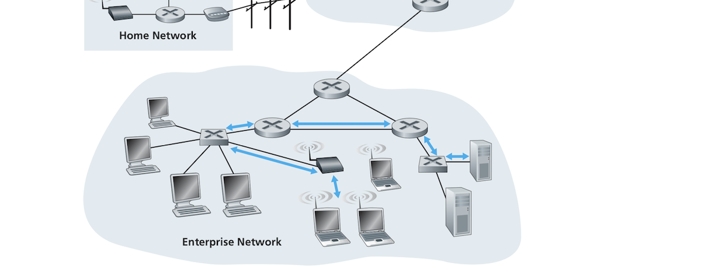
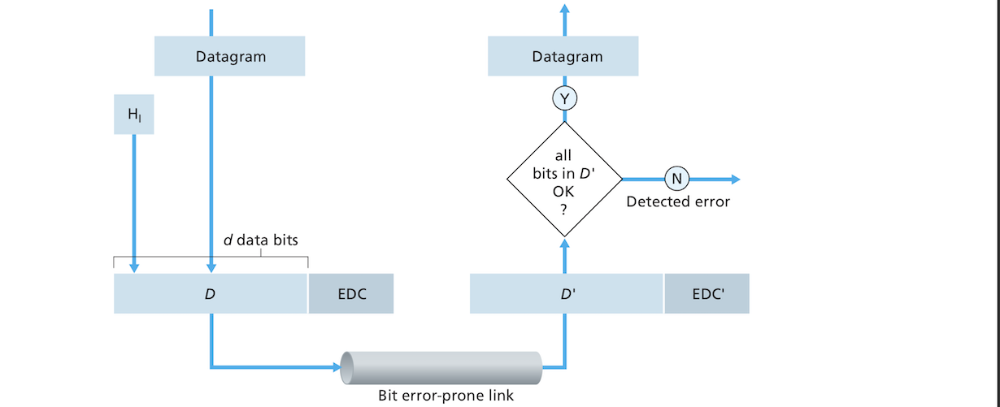
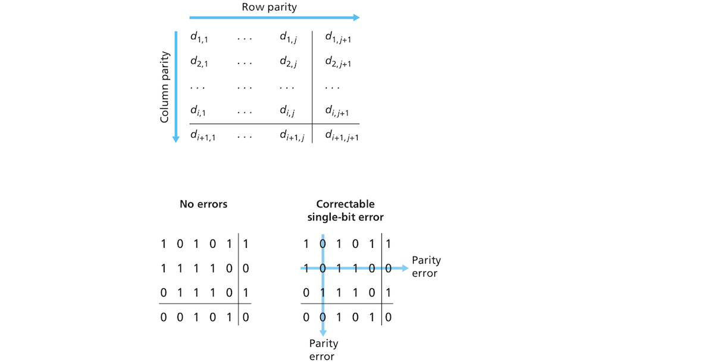

# The Link Layer: Links, Access Networks, and LANs:
## Introduction:
- In the network layer, we saw how a packet travels from a source host to a destination host traversing a series of links (wired or wireless) and packet switches (routers or and switches).
- When thinking about what goes below the network layer at the *link layer*
	- How does a datagram ravel through each one of the *individual links* that make up its end-to-end path?
	- How are network layer datagrams encapsulated in link layer frames for transmission over a link?
	- Do links in a path use different link-layer protocols?
	- How does a switch differ from a router?
	- Does link layer use addressing and how does this addressing interoperate with the network-layer addressing?
- These questions and others will be answered in this document. While trying to answer these questions we will familiarize ourselves with the two fundamental types of link-layer channels:
	- *Broadcast* channels which connect multiple hosts and are used in wireless LANs, satellite networks and hybrid fiber-coaxial cable (HFC). The fact that multiple hosts are connected to the same broadcast channel requires the use of medium access protocols to coordinate frame transmission. 
	- *Point-to-point* links such as a long-distance link connecting two routers or a host and an Ethernet switch. The point-to-point (PPP) is used to coordinate frame transmission in this kinda link.
- Other topics we will touch upon include:
	- Error detection and correction.
	- Multiple access networks especially the famed Ethernet.
	- Virtual LANS.
	- Data center Networks.
- We will not discuss WiFi but leave it to another day when discussing wireless networking.

## Preliminaries:
- Let's start with a few definitions:
	- A **node** in a link-layer context is any device that runs a link-layer protocols. This includes hosts, switches, and WiFi access points. 
	- **Links** are the communication channels connecting adjacent nodes along a communication path. "In order for a datagram to be transferred from source host to destination host, it must be moved over each of the individual links in the end-to-end path." The following figure shows the path of a datagram from a wireless host and a server. It passes through six links:
		1. A WiFi link between the sending hot and a WiFi access point.
		2. An Ethernet link between the WiFi access point and a link-layer switch. 
		3. A link (probably Ethernet) between the link-layer switch and a router.
		4. A link between the aforementioned router and another router.
		5. An Ethernet layer connecting the previous router to a link-layer switch.
		6. An Ethernet link connecting the switch to the server.

	- A node encapsulates a datagram into a **link-layer frame** and transmits it into the link. 
- The book provides a nice analogy of the relationship between the link layer and network layer, but you know I hate analogies!

### The Services Provided by the Link Layer:
- The basic role of the link layer is moving a datagram from node to an adjacent node over a single communication link, but the details of what services can be offered vary from one protocol to another. Common services offered by link-layer protocols include:
	- **Framing**: Most link-layer protocols encapsulate datagrams in frames. A frame consists of a data field which contains the datagram and a set of header fields. The structure of a frame differs from one link-layer protocol to the next. We will soon see some link layer protocols and their frame structures. 
	- **Link access**: A **medium access control (MAC)** protocols defines the rules by which a frame is is transmitted into the link. For point-to-point links, the MAC is simple or nonexistent since the link has a single receiver at one end and a single destination at the other. The sender can send frames whenever the link is *idle*.
	- **Reliable delivery**: A link-layer protocol guarantees moving a datagram through a link without error! This is similar to what TCP does at the transport layer, but does it only over a single link and not end-to-end because the link layer only operates over a single link between two adjacent nodes. Reliable delivery is also achieved by acknowledgments and retransmissions just like TCP. Reliable delivery is used in links prone to high error rates such as wireless links, but many wired links don't have these errors so protocols used in some wired links don't bother about reliable delivery. 
	- **Error detection and correction**: *This might seem like a subset of reliable delivery!!* Hardware signal noise can cause bit errors in frames. Many link-layer protocols provide mechanisms for detecting and correcting such errors. This is done by appending error-detection bits by the sender in each frame and having the receiver do error checks. Link-layer error detection is more sophisticated than what we saw in TCP and it's done in hardware. The receiver detects when and exactly where an error occurred in a frame and then corrects this error!! *Wow, interesting! Does this mean there is no reason to retransmit the frame?*

### Where Is the Link Layer Implemented?
- Where do hosts implement the link layer? Is it implemented in software or hardware, and how does it interact with the other components of the computer's hardware and software? The link layer is implemented in a hardware piece called the **network adapter** or the **network interface card (NIC)**. At the heart of the NIC is the *link-layer controller* which is a special-purpose chip that implements link-layer services such as framing and error detection. NICs used to be separate components, but are mostly now integrated into the computer's motherboard. 
- On the sending side, the controller encapsulates a datagram into frame, a possibly adds error bits to the frame, and transmits the frame into the link. On the receiving end, the controller receives the frame, possibly performs error checking and then extracts the datagram from the frame.
- For the computer, the NIC and the controller are an IO device. Most of the of link layer functionality is implemented in the NIC hardware, but some is also implemented in software running on the host's CPU. Such functionality includes assembling link-layer addressing :confused:, and activating the controller. On the receiving host, link-layer software in the CPU responds to controller's interrupts,  handles errors and passes the extracted datagram to the network layer. 

## Techniques of Error Detection and Correction:
- **Bit-level error detection and correction** refers to detecting and correcting the corruption of bits in a link-layer frame that has been sent from a node to a physically adjacent node over a link. Both detection and correction are often provided by the link layer but not always. 
- We will only grate the surface of this subject here as there whole books dedicated to it.
- The following figure shows the steps of how link-layer error detection and correction is done:

- As the figure shows, before sending the data D (this also include other frame header fields, etc.), the sending node augments it with error-detection and error-detection bits (EDC).
- The receiving node receives a sequence of bits D' and EDC' which might differ from the original D and EDC due to possible link transit bit corruption. The receiver needs to determine whether D' and EDC' are the same as D and EDC'. The receiver can only determine if an error has been detected which is different from determining if the error has or has not occurred. EDC can only sometimes determine if an error has occurred. It cannot always detect an actual error. There can acktchyually be **undetected bit errors**! Wow! This results in some corrupt datagrams. The goal is to have error-detection and correction schemes that keep the probability of undetected bit errors low, but such schemes can lead to larger overhead. 
- The following subsections will give overview of some common error-detection and correction techniques. 

### Parity Checks: 
- The simplest form of error detection can be done with a single **parity bit**. You can either use an even or odd parity bit. In even parity, we add an extra bit to D such that the total number of bits in EDC whose value is 1 is even. The receiving node counts the number of bits whose value is 1, and if they are odd, the node determines there was an error. At least one bit error has occurred, or more precisely: an odd number of errors has occurred. If an even number of errors has occurred, then the errors go undetected. 
- Experience has shown that, rather than occurring independently of each other, bit errors occur in bursts meaning that single bit parity checks are next to useless. 
- The one-bit parity scheme can be generalized into a *two-dimensional parity* scheme for more robustness. The bits in D can be divided into i columns and j rows and a parity value is calculated for each row and each column as the following figure shows:

- If an error occurs at a given bit, both the row and column where it occurred will be affected. The receiver can detect the error and also locate exactly where it happened and then correct it. 2D-parity matrices can also detect and correct errors in the parity bit themselves although I have no idea how! 
- The ability of the receiver to both detect and correct errors is called **forward error correction (FEC)**. This technique is used in audio storage and playback devices such as CDs. They can be used by themselves or with other techniques such as retransmission in the way we saw with TCP to recover from errors. The good thing about FEC is that it allows for immediate error correction and reduces the number of retransmissions. This is especially useful for real-time applications. 

### Checksumming Methods:
- With checksumming (we've seen it in the transport document), the bits of a packet are treated as a sequence of k-bit integers. These k-bit integers can be added together to produce a sum which is used for error detection. The 1s complement of this sum is sent as a checksum with the data. The receiver takes the 1s complement of the received data (including the checksum). The result should be all 1 bits, but if any of the bits is 0 this means an error has occurred. 
- Checksumming is used in transport layer with TCP, but not in the link layer which uses the more robust cyclic redundancy check (CRC). The latter requires more computations so it is implemented in hardware. 

### Cyclic Redundancy Check(CRC):
- The basic idea of **cyclic redundancy check (CRC)** is follows:
	- The data to be sent can be represented by D. 
	- The sender and receiver agrees on an r + 1 bit pattern called a *generator* which we can represent by G.
	- The sender chooses r bits R and appends them to D such that the resulting d + r bit pattern is exactly divisible by G (The remainder is 0).
	- The receiver divides the received pattern by G. If the result is a nonzero, the receiver detects an error.
- The idea seems fairly basic and clear, but the authors love to waffle on about details.

## Multiple Access Links and Protocols: 
- As we've mentioned earlier, there are two types of links, point-to-point links and broadcast links. Broadcast links (examples include wireless LANs and Ethernet) connect multiple sending and receiving nodes that all share the same broadcast channel. This type of link is considered *broadcast*, because when a node sends a frame each other nodes receives a copy of it.
- This section will try to touch (at a theoretical level e)on the interesting problem facing broadcast links which is the so-called **multiple access problem**: how to coordinate the access of multiple sending and receiving nodes to a shared broadcast channel. 
- Television is one example of broadcasting, but it is a one-way type of broadcasting where television sets only receive signal. A room full of people engaged in a conversation, or conversations. These guys need some kinda protocol to make their conversation possible: not all talking at the same time, listening while another talks, signaling the desire to speak, etc.
- Computer networks also use protocols which allow nodes to coordinate packet transmission into shared broadcast channels. These protocols are called **multiple access protocols**.
- More than one node can transmit frames into the broadcast channel at the same time. The result is that other nodes can receive multiple frames at the same time. Frames in this case are said to **collide** and the receiving nodes cannot make sense of them. Frames that collide lost and the broadcast channel *bandwidth* was wasted during collisions.
- Multiple access protocols' job is to coordinate the transmission of multiple nodes hence reducing collisions and the associated waste of broadcast channels. There are many of these protocols, but they can be broadly classified into 3 categories: **channel partitioning protocols**, **random access protocols**, and **taking turns protocols**.
- If we try to devise our own multiple access protocol, we should ideally make it satisfy the following requirement for a broadcast channel of rate R bits per second:
	- If only one node is sending data, the node has a throughput of R bps.
	- If M nodes have data to send, each node as an average throughput R/M bps.
	- The protocol is decentralized. No master node controls it.
	- The protocol is simple and inexpensive!

### Channel Partitioning Protocols:
- A broadcast channel can be partitioned by nodes using one of the following techniques:
	- **Time division multiplexing (TDM)**: Given a channel with R bps transmission rate that supports N nodes, "time is divided into frames of fixed duration, and each frame is divided into" N "time slots" (these time frames have nothing to do with the link-layer packets called frames). Each time slot is assigned to one of the N nodes. A node must wait for its assigned time slot before it can send a packet. TDM is fair and eliminates collision. Each node gets a dedicated fixed rate of R/N bps. This can be problematic, because a node can only send one packet but it needs to send more and no other node is using the channel at the same time. The node needs to wait for its time to send more data even though the channel sits idle. 
	- **Frequency division multiplexing (FDM)**: An R bps channel supporting N nodes is divided into different Frequencies each with an R/N bandwidth. "FDM thus creates N smaller channels of R/N bps out of the single, larger R bps channel". Like TDM, FDM has the combined advantage of collision avoidance and the fair sharing of bandwidth between the N nodes. It also has the same disadvantage. A node is limited to an R/N bandwidth even if the other nodes are sitting idle!
	- **Code division multiple access (CDMA)** assigns a *code* to each node, just TDM assigns time slots and FDM assigns frequencies. Each node encodes its signal in its assigned code. CDMA allows sending nodes to send signal simultaneously and enables receiving nodes that know the code to receive signal correctly without collision even though signal is entangled. We will see more about CDMA in the mobile chapter. 

### Random Access Protocols:
- Random access protocols allow nodes to send at the full transmission rate of the channel (R bps). When a collision occurs, the sending node retransmits its packet repeatedly until it gets through without a collision. The retransmission doesn't occur immediately after the collision but takes place after a *random delay*. If two nodes have sent colliding frames, each of the two nodes chooses an independently random delay so their frames to be retransmitting would be less likely to collide again. 
- There is a ton of random access protocols. Here we will describe the *ALOHA* and *carrier sense multiple access (CSMA)* protocols.

#### Slotted ALOHA:
- The **slotted ALOHA** protocol is one of the simplest random access protocols. In this scheme, all frames have a fixed size L bits. Time is divided into L/R slots (the time it takes for a frame to be transmitted). Nodes can start transmitting frames at the beginnings of time slots. Nodes in the channel are synchronized so they know when the time slot starts. If two or more frames collide during the current time slot, all the nodes detect the collision before the current slot ends. 
- When a node has a new frame to send, it waits until the beginning of the next time slot and then sends the frame. If there is no collision, the frame is sent successfully and the node can proceed into sending another frame if it has one. If there is a collision, the node retransmits its frame with probability p (between 0 and 1) until that frame is transmitted.
- The probability p is akin to tossing a biased coin (biased towards the retransmission of the frame) so heads (p) would mean retransmit the frame and tails (1 - p) is for waiting until the next time slot to toss the coin again and proceed from there. All nodes involved in the collision toss their coins independently.
- Slotted aloha seems better than channel partitioning protocols like TDM and FDM because it at least allows a node to transmit data at full speed when it is the only active one. It eliminates idle time. It is also decentralized. Each node decides when to retransmit independently of other nodes. 
- When multiple nodes active some problems arise:
	* Slots involved in a collisions are effectively wasted.
	* Other slots will also be wasted/empty because of the probabilistic transmission policy. A retransmitted frame might again collide with a retransmitted or fresh frame, I think!!
- The book went through some mathy voodoo to  conclude that when a large number of nodes are active concurrently, the maximum capacity of a channel using slotted ALOHA is capped 0.37 R bps.
- Slotted ALOHA is itself a modified synchronized of an older unslotted pure *ALOHA* protocol that was unslotted and unsynchronized but there is really no point in discussing it here!

#### Carrier Sense Multiple Access (CSMA):
- In the ALOHA protocols, slotted and otherwise, every node would attempt to transmit packets whenever it has one, independently of one or more of the other nodes are also transmitting their own packets at the same time. ALOHA is akin to a conversation among impolite imbeciles who all talk at the same time. They can be more polite:
	* *Listen before speaking*. This is equivalent to **carrier sensing** in networking lingo. A node listens to the channel. If frames are being sent, the node waits until it detects no transmission is being carried out for a short time and then it starts transmitting its frame. 
	* *If someone else begins talking at the same time, stop talking* or **collision detection**. When a node is transmitting bits, it listen simultaneously to the channel and if it senses that another node is transmitting data it stops a random amount of time before it resumes "the sense-and-transmit-when-idle cycle". 
- These two rules are used in a family of protocols: **carrier sense multiple access (CSMA)** and **carrier sense multiple access with collision detection (CSMA/CD)** protocols. There are different variations of these and here we will focus on their main features.
- One confusing question one might have is "why is there collision in the first place, if nodes do carrier sensing before sending their bits?" The answer is simple: It takes time for bits a node to another to arrive to other nodes. This time is called **channel propagation delay**. Although bits are moving close to light speed or something, they still take time. The larger the channel propagation delay, the less efficient it is and the more and worse collision CSMA suffers from.

#### Carrier Sense Multiple Access with Collision Detection (CSMA/CD): 
- CSMA continues to transmit a frame in its entirety even after a collision is detected which can be wasteful. In CSMA/CD, on the other hand, the nodes involved in a collision cease to transmit bits a short time after detecting a collision. They don't continue to transmit a damaged frame in its entirety. 
- The actions of a node attached to a broadcast channel using CSMA/CD can be summarized as follows:
	1. The node's adapter receives an IP datagram, wraps it in a frame and has it ready for transmission.
	2. The adapter listens on the channel. If the channel is idle (no other node is transmitting data through the channel), the node starts transmitting its frame. If the channel is busy, the node waits until the channel is idle to start transmitting its frame.
	3. While transmitting its frame, the node keeps listening for the presence of signal from other nodes.
	4. If no signal is detected from other nodes, the node continues to transmit its frame until the whole frame is transmitted. If the node detects a collision, it aborts transmission and waits a *random amount of time* before returning to step 2. 
- It is necessary for the wait time after a collision to be random because otherwise the colliding nodes will try to retransmit frames at the same time and re-collide forever! Choosing an interval of time from which to pick a random delay is kinda tricky. If it is small and there are many nodes, the nodes will try to retry to retransmit at near the same time which means they will most likely collide again. If this backoff time is large with a few nodes, the wait before the retransmission will be unnecessarily long. We need a backoff time that is short when there are a few colliding nodes and large when there are many of them. The **binary exponential backoff** is an algorithm that does just this. It is used in Ethernet. When retransmitting a frame that has experienced ***n*** collisions (in the past/number of retransmissions), the node picks a random delay ***K*** from the the interval ***{0, 1, 2, ...., 2n - 1}***. For Ethernet, the actual wait time is ***k · 512 bit times*** (the amount of time needed to send 512 bits through Ethernet). The maximum value of ***n*** is 10.
- The node can still sneak new frames through regardless of whether there are frames waiting to be retransmitted. 

### Taking-Turns Protocols:
- It is ideal if the channel's capacity is equal to R bps when there is only one active node, and R/N bps when there are N active nodes. The **taking-turns** protocols (there are several) try to reach this ideal. 
- One popular taking-turns protocol is the  **polling protocol** which designates a master node which polls the other nodes continuously. The master node sends a message to node 1 telling it it can start transmitting up to a maximum number of frames. When the master node detects lack of signal in the channel it determines that node 1 has stopped sending frames, so it moves on to instruct node 2 to start sending its packets. This continues on forever!
- Advantages of the polling protocol include the elimination of empty slots and collisions. The protocol, however, has its drawbacks which include:
	* Polling delay. If a node is the only active node and after sending its maximum number of frames, the master node takes over and polls all other nodes before returning to the active node and let it resume sending its frames.
	* If the master node fails, the entire channel fails. 
- Bluetooth and 802.15 are examples of polling protocols.
- Another taking-turns protocols is the **token-passing protocol**. In this protocol, there is a small special-purpose frame called a **token** which is exchanged among nodes in a fixed manner. Node 1 sends the token to node 2, node 2 to node 3, etc. and node N back to node 1. If a node has no frames to transmit, it immediately forwards the token to the next node. If the node has frames, it transmits up to a maximum number of frames and then it releases the token for the next node. This scheme is decentralized and very efficient, but suffers for a problem similar to the polling delay problem. If a node fails, the whole channel may fail. If a node fails to release the token, then something need to be done to recover the token.

## Switched Local Area Networks:
### Link-Layer Addressing and ARP
### Ethernet:
### Link-Layer Switches:
### Virtual Local-Area Networks (VLANs):

## Link Virtualization: Network as a Link Layer:
-

## Data Center Networking:
-

## Actual Day in the Life of a Web page Request:
-

