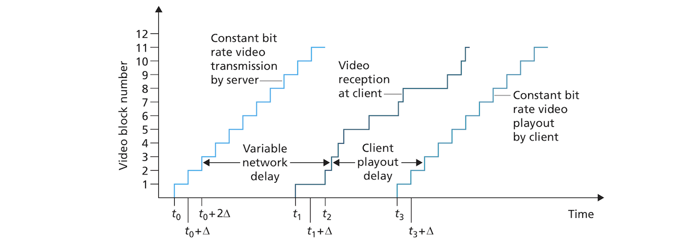
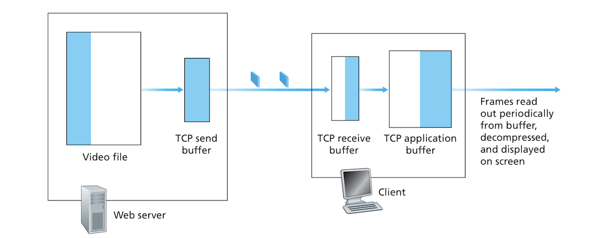
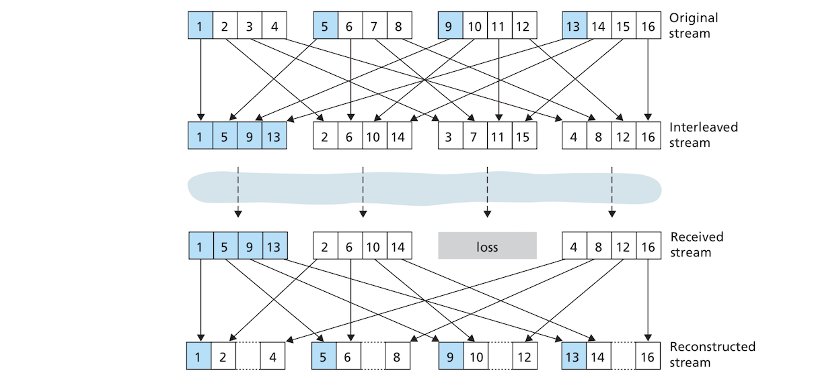

# Multimedia Networking:
## Table of Contents:
* [Introduction](#introduction)
* [Multimedia Networking Applications](#multimedia-networking-applications)
	+ [Properties of Video](#properties-of-video)
	+ [Properties of Audio](#properties-of-audio)
	+ [Types of Multimedia Applications](#types-of-multimedia-applications)
		+ [Streaming Stored Audio and Video](#streaming-stored-audio-and-video)
		+ [Conversational Voice- and Video-over-IP](#conversational-voice--and-video-over-ip)
		+ [Streaming Live Audio and Video](#streaming-live-audio-and-video)
* [Streaming Stored Videos](#streaming-stored-videos)
	+ [UDP Streaming](#udp-streaming)
	+ [HTTP Streaming](#http-streaming)
		+ [Prefetching Video](#prefetching-video)
		+ [Client Application Buffer and TCP Buffers](#client-application-buffer-and-tcp-buffers)
		+ [Early Termination and Repositioning the Video](#early-termination-and-repositioning-the-video)
	+ [Adaptive Streaming and DASH](#adaptive-streaming-and-dash)
	+ [Content Distribution Networks](#content-distribution-networks)
		+ [CDN Operation](#cdn-operation)
		+ [Cluster Selection Strategies](#cluster-selection-strategies)
* [Voice-over-IP](#voice-over-ip)
	+ [Limitations of the Best-Effort IP Service](#limitations-of-the-best-effort-ip-service)
		+ [Packet Loss](#packet-loss)
		+ [End-to-End Delay](#end-to-end-delay)
		+ [Packet Jitter](#packet-jitter)
	+ [Removing Jitter at the Receiver of Audio](#removing-jitter-at-the-receiver-of-audio)
		+ [Fixed Playout Delays](#fixed-playout-delays)
		+ [Adaptive Playout Delays](#adaptive-playout-delays)
	+ [Recovering from Packet Loss](#recovering-from-packet-loss)
		+ [Forward Error Correction](#forward-error-correction)
		+ [Interleaving](#interleaving)
		+ [Error Concealment](#error-concealment)
* [Protocols for Real-Time Conversational Applications, RTP](#protocols-for-real-time-conversational-applications-rtp)
		+ [RTP Packet Header Fields](#rtp-packet-header-fields)
* [Network Support for Multimedia](#network-support-for-multimedia)

## Introduction:
- We all want to know how to create a video streaming service or a live video chatting application like WhatApp!! This chapter will cover the networking issues of transmitting sound and video through the network.
- We will start by dividing networked multimedia services into 3 broad categories and look at the special challenges they pose that differ from traditional elastic applications such as email or web browsing:
	- Streaming stored videos.
	- Conversational voice/video over-IP.
	- Streaming live video/audio.
- We will look at content distribution networks (CDNs) and they are the backbone of streaming services.

## Multimedia Networking Applications:
- A multimedia applications is any that involves audio or video. In this section we will look at the special characteristics of video and audio that make them different from other types of media, and then we will study the different types of networked multimedia applications.

### Properties of Video:
- The following table shows different types of network applications (around 2012), their bit rate and their bandwidth consumption:

| Application types | Bit rate | Bytes transferred in 67 minutes |
| --- | --- | --- |
| Facebook photos | 160 Kbps | 80 MB | 
| Music streaming | 128 Kpbs | 64 MB | 
| Video streaming | 2 MBbps | 2 GB | 

- Compared to other types of network applications, streaming video has a very high bit rate (more than 10 times), and consumes a huge amount of bandwidth.
- Videos are also excellent candidates for compression. A digital video is a series of still images being displayed at a constant rate of say 60 per second. An image itself is an array of pixels and each pixel is encoded into bits that represent *luminance* (What!! :confused:) and color. Videos contain a lot of redundancy that can be exploited by video compression to get the desired bit rate. There two types of redundancy, *spatial redundancy* which are repeated pixels or patterns within a single image, so if the image is all white, then we can simply indicate somehow that without encoding each pixel with repetitive pixel encoding. *Temporal redundancy* refers to changes in pixel from one frame to the next. If the following frame is the same as the current one, then there is no need include the next frame but simply indicate it's the same as the current one. There are many of the shelf software products that do compression to any bit rate. Video compression, more often than not, results in the reduction of video quality.
- A single video can be compressed into different bit rates and offered to be streamed in all these bit rates. The user can choose the appropriate bit rate that best fit their bandwidth, or the streaming provider can change the bit rate dynamically based on the user's Internet speed.

### Properties of Audio:
- Audio has a much lower bit rate than video, but it also has its own special quirks that make it special. Let's first see how audio is converted from its original analog format to a digital format:
	- Audio is *sampled* :confused: at a fixed rate, e.g. 8000 samples per second. The value of each sample is a real number. 
	- The sample values are rounded to "one of a finite number of values", a process called *quantization*. The number of finite values is a power of 2, for examples there can be 256 quantization values.
	- Each quantization value is represented by a fixed number of bits. If there are 256 quantization values, then each sample is represented by one byte. If an a analog audio sound is sampled at 8000 samples per second and each sample is encoded in 8 bits, the resulting digital signal will have a bit rate of 64,000 bps.
- This encoding technique we just described is called *pulse code modulation*. Audio CDs are encoded using 44,100 samples per second using 16 bits for each sample, which results in a bit rate of 705.6 Kbps for mono and 1.411 Mbps for stereo. 
- PCD is rarely used in the Internet, but it's compressed instead. A popular audio compression that somehow still preserve high audio quality is **MPEG layer 3**, more commonly called **MP3**. MP3 encode to different bit rates, with 128 bps being the most popular as it produces very little degradation.
- People can tolerate video glitches, but are somehow very sensitive to audio glitches. Live or sored videos that have many audio glitches are mostly unusable, while video glitches are OK.

### Types of Multimedia Applications:
- Networked multimedia applications can be divided into 3 broad categories: **streaming stored audio/video**, **conversational voice/video-over-IP**, and **streaming live audio/video**. Each one of these categories has its own restrictions and challenges.

#### Streaming Stored Audio and Video:
- We will focus on streaming video (which mostly also contain audio). Streaming stored audio is similar to streaming stored video but at a lower bit rate!
- YouTube and Netflix are classic applications for streaming stored video. Prerecorded video content is stored in some server somewhere and users send requests to view such content.
- Streaming stored video has three main characteristics:
	- *Streaming*: The user starts playing the video shortly after video content is received. The user can continue to play the video while later parts of the video are being received. This is as opposed to first downloading the video file and then playing it.
	- *Interactivity*: The user can pause, play, fast forward, etc.
	- *Continuous playout*: This probably refers to freezes experienced when data hasn't been downloaded "no buffering".
- A good streamed video is one with a good average throughput which at least equal to the bit rate of the streamed video. Prefetching and buffering (we will see these later) allow for continuous playout even when throughput fluctuates but with the condition that the average rate (over 5 to 10 seconds stays higher than the video's bit rate).

#### Conversational Voice- and Video-over-IP:
- Conversational voice over the Internet is also called *Internet telephony* as it acts as a transmitter of voice just like a telephone does. It is also commonly called **voice-over-IP (VoIP)**. It often involves video as well and involve more than just two users but many (in so-called teleconferences).
- Conversational VoIP applications needs to pay close attention to two requirements:
	- *Timing considerations*: These applications are *delay sensitive*. A conversation can be become really hard if it experiences delays more than 400 milliseconds as the user cannot know if their interlocutor is still listening or has already started speaking. The user starts speaking only to receive the voice of the interlocutor and then apologizes, etc. 
	- *Loss tolerance*: Conversational applications can tolerate occasional loss of data which appears in the form of video and audio glitches such as those of Skype.
- Conversational VoIP applications are the opposite of elastic applications such as websites and email. The latter can tolerate a lot of delay, but cannot tolerate data loss.

#### Streaming Live Audio and Video:
- This is like broadcasting TV/radio, but over the Internet. It allows for live transmission of audio/video. 
- Live streaming is delivered through application-level multicast (By CDNs) or through "multiple separate unicast streams".
- Live streaming of video is largely similar to streaming audio/video, but with a little time constraint. Since it's live, the video being streamed needs to be available almost immediately, but while conversational VoIP has a timing constraint of a couple 100 milliseconds, a live streamed video can have 10 seconds or more of delay and be still usable.

## Streaming Stored Videos:
- Streaming video applications such YouTube and Netflix involves having Prerecorded videos stored in servers, and users sending requests to the servers to watch these videos. These videos are also interactive in the sense that the user can stop them before they end, watch their entirety or reposition them to different scenes both forward and backward.
- There are three types of video streaming, **UDP streaming**, **HTTP streaming**, and **adaptive HTTP streaming**, with the latter two being the more common ones, and UDP streaming becoming a legacy technology.
- One very important aspect of video streaming is the use of client video buffering which is used to fix fluctuations in delay and changing bandwidth between the server and client. **Buffering** basically means, the client "build[s] up a reserve of video in an application buffer. Once the client has built up a reserve of several seconds of buffered-but-not-yet-played video, the client can then begin video playout." *Client buffering* offers 2 valuable conveniences: 1) It absorbs the varying delay. 2) If the bandwidth occasionally drops below the consumption rate of the video, the use can keep enjoying a smooth playback of the so-far-buffered content. The following graph sheds some light on why buffering is necessary. The rate at which video blocks arrive at the client can make playing it directly a frustrating experience full of glitches. Buffering takes that mess allow it to be played at the rate it was sent from the server, and at the rate it's to be played in the client.

### UDP Streaming:
- A central and interesting feature of UDP streaming is that the server transmits video at a rate "that matches the client’s video consumption rate by clocking out the video chunks over UDP at a steady rate". UDP doesn't have congestion control, so the server can push video bits at the consumption rate of the client. UDP streaming also uses a small client buffer that can hold less than a second of video content.
- The server first uses the *real-time transport protocol (RTP)* (which we will see in conversational apps) to encapsulate video chunks in special transport packets used for transporting video and audio. These packets are then passed to UDP.
- The server also keeps a parallel separate control connection with the client. This control connection is used to send command by the client to the server about state changes such as pause, resume and reposition. This parallel connection is similar to the one used in FTP.
- UDP streaming suffers from 3 main drawbacks, however:
	- The supposed constant-rate streaming of UDP can fail to create continuous playback due to the ever unpredictable an fluctuating available bandwidth.
	- UDP streaming requires a media control server such as *real-time streaming protocol (RSTP)* that keeps track of client-to-server interactivity and state changes in the client for each client. As you can easily tell, this introduces such much overhead, cost and complexity.
	- Many firewalls block UDP, thus preventing users from consuming video streamed over UDP.

### HTTP Streaming:
- In HTTP streaming, a video is stored as a regular file in a server and is given a specific URL. The client establishes a TCP connection with the server, and sends an HTTP GET request to that URL. The server responds by sending the video file immediately or until a congestion (if there is one) is relieved. The client starts collecting bytes from the received video in a buffer and after reaching a certain threshold start playing the video. The application grabs frames from the buffer, decompresses them and starts displaying them on screen!
- TCP suffers from higher delay than UDP due to congestion control and retransmission. It was widely believed that video streaming wouldn't work over TCP; they chose UDP, instead, but they learnt with time that buffering and *prefetching*.
- HTTP over TCP doesn't get blocked by firewalls and NATs like UDP. Another massive advantage of streaming over HTTP is that it doesn't require a media control server such as RTSP, thus making it less costly and less complex. This is why popular streaming services such as YouTube use HTTP streaming.

#### Prefetching Video:
- **Prefetching** simply means the application downloads video at a rate higher than the rate it consumes the video. The prefetched bytes are stored in the client buffer. The client builds a reserve of buffered data, so that if the bandwidth drops momentarily below the consumption rate, the reserved bytes can be still played without freezes. Prefetching is easy to implement with TCP since the latter's congestion avoidance techniques always try to use all available bandwidth. 

#### Client Application Buffer and TCP Buffers:
- The following diagram shows how the client and server interact during HTTP streaming:

- On the server side, the white area in the video file represents the part of the video that has already been sent to the server's socket, while the shaded area in blue represents the remaining parts of the video that hasn't been sent yet. Bytes are placed in a TCP send buffer before being sent to the client. The TCP send buffer is all shaded meaning it's full so the application cannot pass anymore of the video bytes to it through the socket. As for the client side, the client application reads bytes from the TCP receive buffer and puts them in application's buffer. Simultaneously, the application can also grab frames from the application buffer to display them on screen.
- If the client application buffer is larger than the video file, then the streaming of the file is effectively equivalent to a regular file download.
- *(I am  assuming here that the video is larger than the buffer).* What happens when the user stops the video while it's being streamed. buffered bits will not be removed from the buffer after they are displayed on screen, but new bits will keep flowing into the buffer from the server. If the buffer size is "finite" (which usually the case, I believe), the buffer becomes full which causes a "back pressure" that goes all the way back to the server. This back pressure happens in a few steps:
	- When the application buffer becomes full, bytes from the TCP receive buffer destined for the application buffer can no longer be sent to it, so these bytes cannot be removed from the TCP buffer. The latter becomes full too.
	- The server's TCP send buffer cannot send bytes to a full TCP receive buffer. So it becomes full too.
	- The server application cannot send bytes into a socket with a full send buffer, so it's effectively blocked from sending anymore bytes until maybe the user resumes the video.
- An application buffer can become full even without the video being paused. In such a case, too, a back pressure will reverberate back to the server blocking it or slowing its send rate. When the buffer is full, the server send rate can not be larger than the consumption rate of the client, because to receive *ƒ* bits, you need to remove *ƒ* bits from the client buffer. 

#### Early Termination and Repositioning the Video: 
- HTTP streaming services use the **HTTP byte-range header** in HTTP GET requests. This header specifies the byte range the user wants from a given video. When you reposition the video (jump forward), a new HTTP request is sent. This HTTP request indicates in its byte-range header the byte in the video from which the video file should start. When the server receives a new HTTP requests, it forgets all what went before and starts sending bytes starting at the byte indicated in the byte-range header. 
- Early termination of a video and repositioning to a future point in the video results in wasting all previously buffered bytes. This can be very costly. This is the reason why buffers are made small. Small buffers limit the amount of prefetched data that can go unused.

### Adaptive Streaming and DASH:
- Simple HTTP streaming is amazing and all, but it suffers from a major drawback: it serves video at a uniform bit rate to different clients, and to the same client over time, without considering the fluctuating available bandwidth. This is a problem in today's world where mobility is major feature of networking in general. Technologists figured a new way to battle this shortcoming and they called it **dynamic adaptive streaming over HTTP (DASH)**. In DASH, the server content different versions of the video that are encoded in different bit rates that have different levels of quality, and the client can dynamically request chunks from the different versions. When the bandwidth is high, chunks of higher bit rates are requested, and when the bandwidth is low, the client goes for chunks with lower bit rates.
- DASH stores each version of the video in the server and provides with it the **manifest file** which gives the URL of each version of the video and its bit rate. When the client first accesses the video, it requests its manifest file to learn about the different available versions. The client then can request a chunk from a given version with a GET request specifying the version's URL and a byte-range (does it really do this for each chunk?!!). As the chunks are being downloaded, the application measures the bandwidth runs a so-called *rate determination algorithm* to select the chunk to request next. The client requests high quality chunks when the bandwidth is high and when it has a lot of buffered video, and the reverse is true. The client switches between different versions almost seamlessly. It even gradually requests chunks with the next lower quality and doesn't just suddenly jump from a very high quality chunks to the lowest one. The user might not even realize the change in quality.
- Advantages of DASH include:
	- Allowing video playout to continue without freezing or skipping regardless of the fluctuating and uncertain bandwidth.
	- The fact that the client manages which chunks to request frees the server from such a chore making servers very scalable.
- DASH also stores different audio versions with their own URLS for each video. Upon a request, the client downloads both video and audio chunks and synchronizes them locally.

### Content Distribution Networks:
- How can a service like YouTube serve many many hours of streamed video each day to millions if not billions of clients each day? How can this happen all over the world?
- You can store a video for streaming in a single data center, but that has several disadvantages that have to do mainly with networking:
	- Users around the world who stream a video from your service can be far away from your data centers. This means the content has to cross many communication links. If the throughput of one link is below the bit rate of the video, the end-to-end throughput will also be below that bit rate. The more links there are in an end-to-end communication line, the more likely it is to have such a low throughput link.
	- A popular (or *viral*) video will be sent over the same path over and over again which is such a waste of bandwidth and money, as your service will pay for such high bandwidth usage for identical copies of the same data
	- Using a single data center also means having a *single point of failure*. If that data center fails or is cut from the Internet for whatever reason, the video is not available for streaming for anybody. 
- The alternative to this is the use of a **content distribution network (CDN)**. A CDN maintains a network of geographically distributed servers, and stores copies of content (which can be audio, video, text, or whatever), and direct traffic to optimal servers that are closest to the user.
- A CDN can be private, so Google has its own CDN that distributes YouTube and its other content. There can also be third-party CDNs such as Akamai CDN which has been or is still used by Netflix and Hulu, and I think early YouTube used it, too.
- Two major philosophies guide the placement of servers in a CDN:
	- **Enter deep**, championed by Akamai, means deploy server clusters in access ISPs all over the world and get as close to the user and ubiquitous as possible.
	- **Bring home**: deploy server clusters in key locations cluster to higher tier ISPs and whatnot, and connect these clusters or data centers with a private high speed network. This approach is easier to maintain, but this comes at the expense of service quality to the user who gets higher delay, etc.
- CDNs copy content across clusters, but they don't copy arbitrarily, as some content is popular in some regions only. Some CDNs use a *pull strategy*, where the video is stored in a central repository and is only sent to a cluster when a user close to that cluster requests it. The cluster stores a copy of that video as it serves it to that user. Clusters do even act like caching systems, sometimes! A video that is rarely used can be deleted from the cluster. 

#### CDN Operation:
- When you request a video or something using a specific URL, the CDN intercepts your requests and:
	1. Determines the right CDN cluster suitable for your at that specific time.
	2. Redirects your request to a server in that cluster.
- DNS is a major piece of infrastructure that the CDNs rely on to operate. The following image shows how DNS is involved in CDNs ability to intercept and redirect a client's request to a specific server cluster. The user is using a streaming service called NetCinema which on its part relies on a third-party CDN called KingCDN:

- In the NetCinema website, each video is assigned a unique identifier which is its URL. When the user requests this URL, six steps take place:
	1. User goes to NetCinema web page.
	2. User clicks on a movie URL, and a DNS query is sent for a specific domain within the NetCinema containing the given video.
	3. The local DNS server (LDNS) relays the query to an authoritative DNS server for NetCinema. NetCinema needs to 
	"handover" the DNS query to KingCDN so it returns to the LDNS a specific URL such as `a1105.kingcdn.com`.
	4. From now on, the DNS query is in the hands of KingCDN private DNS system. The LDNS sends a second DNS query but this time to KingCDN at URL `a1105.kingcdn.com`. KingCDN CDN responds with the IP addresses of KingCDN servers to the LDNS. The client will start receiving video from this CDN server.
	5. The LDNS sends the IP address of the CDN server to the host.
	6. The host establishes a TCP connection with the server at the specified IP address, and issues an HTTP request for the video. If the NetCinema uses DASH, the client will first receive a manifest file with a list of URLs for the different versions of the video and their bit rates and it can start to dynamically select chunks from these different versions.

#### Cluster Selection Strategies:
- An important question is "how does the CDN select a specific server cluster to redirect traffic to?" CDNs use propriety cluster selection strategies, but wee can guess who they do it. Approaches to this include:
	- Assigning the client to a cluster that is **geographically closest**. LDNS IP addresses are mapped to locations and the client is assigned to a cluster that is within the fewest possible kilometers. This doesn't always work well as a geographically close cluster can be far away in terms of the network path. Another problem is that some clients use LDNSs that are far from them. This approaches also ignores the fact that the path to a cluster can have different bandwidth over time, and an optimal cluster at a point of time can be really a bad choice at other times.
	- CDNs instead can perform periodic**real-time measurements** to assess the current traffic conditions. They can track delay and less to determine optimal paths between clients and clusters through, for example, probe queries to LDNSs. Many LDNSs don't respond to such probes, however. The clients can also be redirected to other clusters until a really optimal cluster is found for a client. There are other ways doing these measurements.
- CDNs must also not put too much pressure on specific clusters that are otherwise excellent candidates to direct traffic to. There are also business considerations concerning CDN contractual relationships with ISPs. Some ISPs might be cheaper than others so an optimal cluster maybe ignored because the ISP it uses is too costly. 

## Voice-over-IP:
- Real-time conversational voice over the Internet is also called telephony, because it somehow acts like circuit-switched telephone service. Nerds call it **voice-over IP (VoIP)**.

### Limitations of the Best-Effort IP Service:
- IP tries its best effort to get a packet from host A to host B as quickly as possible, but it offers no guarantees whatsoever about when the packet will arrive or if it will even arrive. This approach works fine for most applications, but it is very bad for VoIP due to the fact that a natural conversation between two people cannot tolerate large amounts of delay or missing sounds. This section will describe the challenges best-effort IP poses to VoIP applications, and how a application-level techniques are used to overcome such challenges. 
- We will discuss these limitations in the context of a specific example that has the following characteristics:
	- The sender generates sounds at the rate of 8,000 bytes per second.
	- Every 20 milliseconds, a chunk of these bytes if gathered and encapsulate into a UDP datagram through a call to the socket interface. This means each chunk has a size of 160 bytes.
	- A chunk is sent every 20 milliseconds.
- If each chunk arrives after a constant end-to-end delay, then the receiver receives a chunk every 20 milliseconds. But this doesn't happen in the real world. Some packets go missing, and many might have different delays so they don't arrive in the order they were sent. The receiver need to decide when to play a chunk (some reordering might be needed), and what do about missing chunks.

#### Packet Loss:
- We all know IP packets get lost, so what can we do about these lost packets. We might use TCP, but TCP retransmission and congestion control can really really delay what's being said and making a conversation almost impossible.
- Data loss is normal in the Internet, and a loss rate between 1 and 20% is fine and doesn't have a huge effect on a conversation over IP if the loss is well concealed at the receiver and based on the encoding and transmission scheme used. VoIP applications use *forward error correction (FEC)* to conceal packet loss. With EFC, the sender sends redundant information along with the original data, so original data can be recovered with the help redundant ones. If the loss rate is too high, then there is nothing we can do but suffers through a glitchy unintelligible conversation.

#### End-to-End Delay:
- **End-to-end delay** is the sum of all types of delay a packet suffers from before it reaches its destination: transmission, processing and queuing delays in routers + propagation delays in links + end-system processing delays, etc. I don't know where they got these numbers, but 150 milliseconds of delay are not really perceived by humans, 150 to 400 milliseconds are irritating but acceptable, and anything above 400 milliseconds is practically unusable. Receivers set a threshold, such 400 millisecond, and they ignore any packets with delays larger than this threshold.

#### Packet Jitter:
- Due to the varying delays caused by packet queuing in routers, an interesting and annoying phenomenon called **jitter** occurs. Jitter means the period of time between the sending and receiving of a packet fluctuates from a packet to another. The result is that the spacing between the consecutive received packets is not uniform. In our example, there is a 20-millisecond space between sent a packet and next packet. Spaces between received packets can very from distances much larger than 20 milliseconds, or smaller. I believe packets can even arrive out of order (although I don't know why the writer insists on ignoring this fact). To mitigate jitter, VoIP applications use such techniques as **sequence numbers**, **timestamps**, and **playout delay**.

### Removing Jitter at the Receiver of Audio:
- To recover from jitter, applications combine the following two mechanisms:
	- The sender prepends each chunk with a **timestamp** when the chunk was created.
	- The receiver **delays playout** of received chunks. There needs to be long enough delays before playing received audio chunks. Such delays can be fixed or change adaptively during the conversation. 
- THe rest of this section will study how combining timestamping with delayed playout (both fixed and delayed) can reduce if not remove the effects of jitter altogether.

#### Fixed Playout Delays:
- In a fixed playout delay scheme, the receiver plays each chunk with time stamp *t* after exactly a given period of *q* milliseconds(after, let's say 150 milliseconds). Each chunk is played at *t + q*. If a chunk arrives after its scheduled playout, it is discarded. 
- What is a good fixed playout delay? 400 can be tolerable but results in bad user experience, but a very small delay can result in the loss of many chunks, also leading to bad user experience. If the delay is large and varies a lot, the fixed delay can be fixed at 400, but with end-to-end paths with small delays with little variation, it's preferable to make playout delays smaller than 150 milliseconds.

#### Adaptive Playout Delays:
- This delay is dynamic and changes probably through the conversation. At the beginning of each talk spurt (whatever this means), network delay and variation is examined and a suitable playout is chosen so periods of silence are either compressed or elongated, etc. Some algorithms are used to govern this adjustment of the delay.

### Recovering from Packet Loss:
- A lost packet can be defined as either a packet that never arrived at the receiver or a packet that arrived after its scheduled playout. VoIP applications uses techniques called *loss anticipation schemes* to preserve audio quality in spite of packet loss. Examples of such schemes include: **forward error correction (FEC)** and **interleaving**.

#### Forward Error Correction:
- FEC adds redundant information to the original packet stream so if a packet is lost, an approximation of that packet might be reconstructed. Simple FEC methods include:
	- A redundant chunk is sent after every *n* chunks. The redundant chunks created by XORing the *n* original chunks. If a packet of the *n + 1* packets is list, the missing chunk can be fully reconstructed. This method cannot recover from the loss if two ore more packets are lost. If *n* is too small it increases the transmission rate greatly. Transmission rate added by the redundant packet is equal to *1/n*. If *n = 3*, then the transmission increases by 33 %. A large *n* is also bad as it increases delay. The receiver must wait *n* packets before playout.
	- The second method involves sending as second lower-resolution stream along with the original normal quality stream. The lower-resolution stream here is called the redundant stream. The application creates the *n*th packet by taking the *n*th chunk from the high-resolution stream and appending to it the *(n - 1)*th chunk from redundant stream (*Wow, genius!! I love these hacky tricks!!!*). Now when there is a nonconsecutive packet, loss, the receiver can hide this fact by playing the redundant version of the lost packet that is appended to the next packet. Yes, that chunk will have low quality, but a stream of mostly high quality chunks peppered by a few lower-quality chunks is mostly good. The receiver only needs to wait two packets before it starts playout (as opposed to 8 of the previous method), and the transmission rate will most probably increase by much as the redundant chunks use a low bit rate and are thus much smaller than the high-resolution stream chunks. *(n - 1)*st, and *(n - 2)*nd, etc. can be appended to the *n*th packet to mitigate consecutive packet loss. This can greatly improve the overall quality of the conversation, but it comes at the expense of increasing the transmission bandwidth and delays.

#### Interleaving:
- Interleaving is kinda genius as well. Basically, as the following image shows, the sender slices each one of multiple consecutive (e.g 4) chunks (each with 20 milliseconds of audio), into 4 (which equals the number of consecutive chunks) units of 5 millisecond units, and then scrambles/interleaves these units among the consecutive chunks. The receiver reconstruct the original chunks from the received interleaved ones. If a packet was lost, maybe one unit from each chunk is lost. A chunk will be missing a tiny unnoticeable chip:

- Interleaving adds little overhead and can greatly improve audio quality, but can also increase latency. 

#### Error Concealment:
- Error concealment attempts to produce replacements for lost packets that are similar to the original audio. Audio signal tends to displayed a lot of short-time similarity especially human speech (don't take my word for it; I'm just parroting here). But these only work for very short times like 15 milliseconds. The larger the loss, the harder it is to conceal. A simple error concealment techniques is done through repetition. a lost packet is replaced by the chunk immediately preceding it. It performs well and is also easy from a computational perspective. A more computationally complex approach of error concealment is based on interpolation, where audio from the packet preceding the lost one and the packet following it are somehow used to interpolate a replacement of the lost packet. This works well, but is costly!

## Protocols for Real-Time Conversational Applications, RTP:
- Open standards have been developed to support real-time conversational applications. The most important ones are **RTP** and **SIP**. We will only look at RTP here.
- The RTP protocol defines such things as the sequence number and timestamps fields appended to video/audio chunks we've seen earlier, and it is used in transporting real time audio/video. It can be used with common formats such MP3 or proprietary formats. 
- RTP runs over UDP. The sender adds an *RTP header* to  a video or audio chunk to create an *RTP packet*. The RTP header contains such information as the sequence number, timestamp, and audio/video encoding. The RTP packet is wrapped into a UDP segment, and the UDP packet is sent to the socket interface. The receiver unwrap the UDP segments and reads to header fields to properly decode and play the received media.
- RTP allows each source to be assigned its own RTP stream. In a teleconference between two people, there can be 4 streams, one for video and one for audio in each direction. If audio and video are bundled into one as in MPEG4, then there are only 2 streams.

#### RTP Packet Header Fields:
- Important header fields of an RTP packet include:
	- The *payload type* field indicates the type of encoding used in the media being streamed. This allows the receiver to use the appropriate decoder to consume the received bytes. The sender can decide in the middle of conversation to change the encoding it uses. It indicates that by changding the payload type field, and the user can make note of that and immediately change its decoding method.
	- *Sequence number* is used to detect packet loss and probably even  the arrival of out-of-order packets.
	- *Timestamp field* indicates when each chunk has been created. It helps the receiver recover from jitter as we've seen and to synchronize playout.
	- *Synchronization source identifier (SSRC)* is used to identify each stream source in an RTP session.  

## Network Support for Multimedia:
- *This section revolves around the authors' grandiose dreams about a brave new world. The Internet as it stands today is working well and there is really no point in messing with the network!!*
