# The Network Layer:
## Introduction:
- The process-to-process communication in the transport layer depends on services provided by the layer under it, the *network layer* which is responsible for host-to-host communication. This is probably the most important and interesting layer in the networking stack. While the application and transport layers are implemented only in the end systems, the network layer is implemented across the whole network, so every router in the network has to process it. 
- The network layer is both complex and interesting and in this document we will try to capture some of this complexity by covering various topics which include:
	- An overview of the network layer and the services it provides.
	- The two main approaches to network-layer packet delivery: the datagram and virtual-circuit model.
	- The role of addressing in packet delivery.
	- Forwarding and routing, how they differ and what their role in packet delivery.
	- Looking inside a router and how it's used in packet delivery. 
	- Diving deep in the Internet Protocol (IP) and such things as IPv4, NAT, ICMP, IPv6, etc. 
	- Routing algorithms and how they are used to make the network efficient.
	- Different routing protocols such as RIP, OSPF, etc.
	- Multicast and broadcast routing.

## The Network Layer:
### Forwarding and Routing:
- The role of the network layer is deceptively simple: moving packets from host A to host B. This involves two important network layer functions:
	- **Forwarding**: is basically moving a packet from an input link to the appropriate output link. 
	- **Routing**: is determining the route/path that a packet needs to take to get from a sending host to a receiving host. These paths are calculated by **routing algorithms**.
- Some people might use the terms forwarding and routing interchangeably, but these terms are totally different. If we use the analogy of driving between two distant cities, forwarding is passing through each interchange in the route, and routing is planning the trip using a map. 
- Every router has a **forwarding table**. The router forwards a packet, through examining some value in the header of the packet and using this value as an index into the forwarding table. The value stored in the corresponding entry in the forwarding table indicates the output link interface to which the packet is to be forwarded. Depending on the network-layer protocol, the packet header value could be either the destination address of the packet or an "indication of the connection to which the packet belongs". 
- The following figure shows how a packet is forwarded by the router. A packet with the header value ***0111*** arrives to the router which uses the that value as an index in its forwarding table.  It determines that the outgoing link interface is 2. It then forwards the packet to interface 2. 
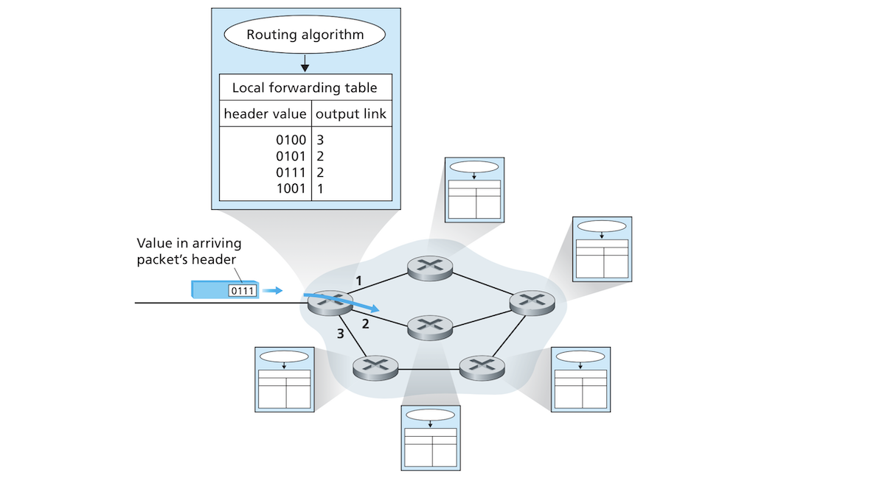
- How does the router build the forwarding table? The figure above shows a **routing algorithm** which determines the values that are inserted into the router forwarding table. The routing algorithm can be either centralized where it's processed in one place and then routing information is downloaded to routers. It might also be decentralized where multiple routers would process different pieces of the algorithms. In both the centralized and decentralized cases, a router receives *routing protocol messages* :confused:, which are used to configure the forwarding table in that router. 
- Don't mix **link-layer switches** with routers. Switches work at the link-layer and base their forwarding on link-layer frame headers. Some might call routers layer 3 switches which is just confusing!! Anyways, routers must implemented layer 2 protocols because the network layer depends on the services provided by the link-layer. This document will also use the term *router* to refer to packet switches in virtual-circuit networks.

#### Connection Setup:
- In addition to routing and forwarding, some network-layer architectures also provide **connection setup**. These architectures, e.g. *ATM*, require routers in the chosen path to handshake to establish state before data can start flowing between source and destination. 

### Network Service Models:
- When it comes to the services provided by the network layer to the transport layer, what kinds of services can the transport layer expect from the network layer, namely:
	- Can the transport layer expect the network layer to deliver a packet to the destination host?
	- Can packets arrive in the order they were sent?
	- Is the time between the sending of two packets the same as time between the receiving of these two packets?
	- Does the network layer offer any mechanism of congestion monitoring or control?
- Answers to these questions are determined by the *network service model*, which defines the characteristics of end-to-end transport of packets between the sending and receiving systems. Possible services that the network layer might provide include:
	- *Guaranteed delivery* of the packet to the destination.
	- *Guaranteed delivery with bounded delay*, in say a 100 milliseconds. 
	- *In-order packet delivery*. 
	- *Guaranteed minimal bandwidth*. The network layer can guarantee a minimal bit rate similar to that found in transmission links (such as 1 Mbps). As long as the host sends bits at a rate smaller than this bandwidth, no packets are dropped. 
	- *Guaranteed maximum jitter* guarantees that time separating the sending of two packets is equal to the time separating the receiving of those two packets (or equal within a time window).
	- *Security services*: The network layer can use a secret session key known only by the source and destination hosts, so the payloads of packets can be encrypted by the sender and decrypted by the receiver. 
- This is just a glimpse of the services that the network can possibly provide.
- The Internet's network layer provides a single service called **best-effort service** which basically means none of the services we mentioned earlier such as security, guaranteed delivery, in-order delivery, etc. are provided as the following table shows:

| Network<br>architecture | Service<br>model | Bandwidth<br>guarantee | No-loss<br>guarantee | Ordering | Timing | Congestion<br>indication |
| --- | --- | --- | --- | --- | --- | --- |
| Internet | Best effort | None | None | Any order<br>possible | Not<br>maintained | None |
| ATM | CBR | Guaranteed<br>constant rate | yes | In order | Maintained | Congestion<br>won't occur |
| ATM | ABR | Guaranteed<br>minimum | None | In order | Not maintained | Congestion<br>indication provided |

- The best-effort service model seems useless, but there are some great reasons why it works and dominates the world!! 
- Some other network-layer architecture go beyond the best-effort service model and offer other models with more services. The ATM architecture offers service models that are less bare-bone than the Internet network, which we will look at briefly just to illustrate that there are alternatives to best-effort:
	- **Constant bit rate (CBR) ATM network service**: has the goal of "to pro- vide a flow of packets (known as cells in ATM terminology) with a virtual pipe whose properties are the same as if a dedicated fixed-bandwidth transmission link existed between sending and receiving hosts." It is kinda similar to telephone
	- **Available bit rate (ABR) ATM network service** is a slightly better than best-effort service. Packets can be lost but are never reordered. A minimum packets transmission rate (MCR) is also guaranteed. If the network has excess resources at a given time, it sends packets at a rate higher than MCR. ATM ABR can also notify the sender of the existence of congestion and maybe tells it to adjust its sending rate according to the level of congestion. 

## Virtual Circuit and Datagram Networks:
- Just like the transport layer, the network layer can offer a connection-oriented service and a connectionless service, but the similarities between the transport and network layers connectionwise is only skin-deep, and there are some fundamental differences between the two:
	- In the network layer connection(-less) services are host-to-host services provided by the network to the transport layer, while the transport connection(-less) services are process-to-process services offered to application by the transport layer.
	- A network architecture can only offer a connectionless host-to-host service or a connection host-to-host service but can never offer both. Networks providing only connection services at the network layer are called **virtual circuits (VCs)**, and those offering connectionless services only are called **datagram networks**.
	- Transport connection facilities are implemented in the edge at the end-systems, while network connection is implemented at the core in routers as well as the edge in end-systems.

### Virtual-Circuit Networks:
- We all know and interact daily with the Internet network which is a datagram network, but there are other networks which belong to the virtual-circuit architecture such as the ATM and *frame relay* networks. 
- A VC consists of:
	- 1. A *path* consisting of a series of links and routers connecting the source to the destination. 
	- 2. *VC numbers*, one for each link along the path.
	- 3. Entries in the *forwarding table* of each router along the path.
- A VC packet carries a VC number in its header. Each VC router along the packet's path changes the VC number of the packet using the router's forwarding table.
- Consider the following virtual circuit network:
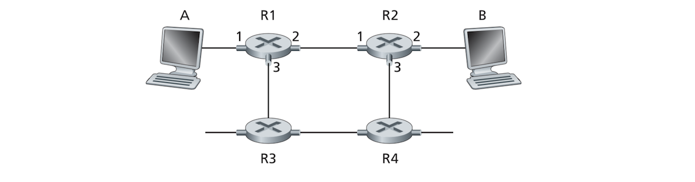
- In the figure above, we see a host A and host B, and 4 routers. Routers R1 and R2 have 3 link interfaces each. Imagine host A wants to establish a virtual circuit between itself and host B at the path A-R1-R2-B, and also assigns VC numbers 12, 22, 32 to the three links in the path for this VC. 
- How does the router determine the replacement VC number of a packet going through the router? Well, Each router's forwarding table has a *VC number translation* which looks something like the following table (for R1):

| Incoming interface | Incoming VC # | Outgoing interface | Outgoing VC # |
| --- | --- | --- | --- |
| 1 | 12 | 2 | 22 |
| 2 | 63 | 1 | 18 |
| 3 | 7 | 2 | 17 |
| 1 | 97 | 3 | 44 |
| ... | ... | ... | ... |

- Whenever a new VC is established across a router, a corresponding entry is added to the forwarding able. When the VC terminates, entries in each router's forwarding table in the path are removed. 
- Why complicate things by changing a packet's header for each link it crosses? There are two reasons for this:
	- 1. It reduces the length of the VC field in the packet's header.
	- 2. It also greatly simplifies the *VC setup* (whatever this :confused:). With multiple VC numbers for each packet, each link in the path can choose a VC number independent of VC numbers chosen at other links along the path. If we have one common VC for all links along a certain path, routers in that path need to communicate and make sure that number is not being in use by another connection at these routers. 
- Being connection-oriented, a VC network's routers must maintain **connection state information** for current connections. Each time a connection is established through a router, a connection entry must be added to that router's forwarding table, and each time a connection is disbanded, the corresponding connection entry in the router's forwarding table must be removed. maintaining state information about the VC connection might be the most important feature of such type of network. 
- The life cycle of a VC connection goes through 4 phases:
	- **VC setup**: The sending transport layer contacts the network layer, giving it the receiver's address. The network determines the path between the sender and receiver, gives each link along the path a VC number, and adds an entry in the forwarding table of each router along the path. The network layer might also reserve resources such as bandwidth along the path.
	- **Data transfer**: Once a VC is established, packets can start flowing through the circuit as the figure blow shows.
	- **VC teardown**: Once the sender or receiver wishes to terminate the connection, it tells the network to tear the VC down. The network informs the other end system of this wish to terminate and updates the forwarding tables in routers along the path to show that the VC doesn't exist anymore.
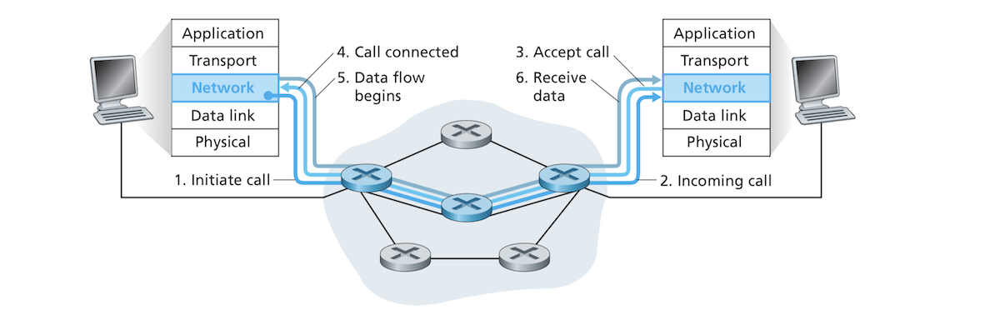
- One important difference between VC setup and transport layer connection setup is only the two end systems are aware of and involved in the set up of a transport layer connection, while in a VC, every router in the VC path is aware of all the VC passing through it.
- Messages that end systems send to setup and teardown a VC and the messages exchanged between routers to setup this connection are called **signaling messages** and are governed by **signaling protocols** and we will not cover them here. 

### Datagram Networks:
- In a **datagram network**, a packet is given an address of the destination end system and is placed in the network where the address will be used by routers to get it get the packet to the desired destination.
Datagram networks are connectionless, so they don't need a VC setup, and routers don't have to maintain VC state information as the following image shows:
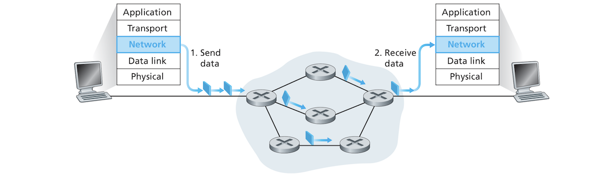
- As a packet traverses the network, it passes through  a series of routers which use the packet's address to forward it. Each router has a forwarding table that maps destination addresses to link interfaces. A router uses the destination address of a packet to lookup the right link interface in the forwarding table. The router, then, forwards the packet to that link interface. 
- How does the lookup operation works in datagram networks. Let's say that a destination address is 32-bit long. A naive implementation of a forwarding table in such a system would have an entry for every possible address. Such a table would have over 4 billion entries which is extremely inefficient. 
- Let's also suppose we have a router with 4 links numbered 0 through 3, and that packets are to be forwarded as follows:

| Destination range | Link interface |
| --- | --- |
| 11001000 00010111 00010000 00000000<br>through<br>11001000 00010111 00010111 11111111 | 0 |
| 11001000 00010111 00011000 00000000<br>through<br>11001000 00010111 00011000 11111111 | 1 |
| 11001000 00010111 00011001 00000000<br>through<br>11001000 00010111 00011111 11111111 | 2 |
| otherwise | 3 |

- For such an arrangement we don't really need all 4 billion address but we need only a 4-entry table:

| Prefix match | Link interface |
| --- | --- |
| 11001000 00010111 00010 | 0 |
| 11001000 00010111 00011000 | 1 |
| 11001000 00010111 00011 | 2 |
| Otherwise | 3 |

- In this type of forwarding tables, a router matches the **prefix** of a destinations address with a entry in the table. If there is a match, the router forwards the packet to the corresponding link interface. Let's say the destination address of a given packet is ***11001000 00010111 00010110 10100001***. We see that the first 21-bits of the address matches the first entry in the table, so the packet will be forwarded to the link interface 0, or would it?? If you examine the whole table, you'd notice the address matches all 3 entries? So how would the router decide which link to forward the packet to? In fact, when there are multiple matches, the router uses the **longest prefix matching rule**. The router finds the longest matching entry in the table and forwards the packet to the link interface associated with the matching entry. 
- Although datagram networks don't maintain information about connection state, they keep forwarding state information in their tables. However, the rate at which datagram network forwarding tables are updated is very slow. These tables are updated by forwarding tables every one to five minutes. VC forwarding tables are updated whenever a connection is established or torn down.. This can literally happen in microseconds!
- Because forwarding tables in datagram networks can be updated at any time, the paths that packets sent from one system to another can follow different paths and arrive out of order!

### Origins of VC and Datagram Networks:
- THe VC network has its origins in telephony systems which actually use real circuits instead of virtual circuits. It is much more complex than the datagram network because it connects dumb end systems so the network is burdened with maintaining a connection.
- Datagram networks were designed from the get go to connect complex computers. Networks were made as simple as possible. Upper layers of the network stack that reside in the sophisticated end system take care of functions that make the network usable such as packet reordering, reliability and congestion control. Datagram networks are inversion of VC networks. 
- This simple design of datagram networks demands little requirements from the networks which leads to fact that such a network can interconnect networks relying on different link-layer technologies that use different media such as radio, Ethernet, fiber, etc.
- Complex functionality that depends on datagram networks is all implemented in end systems and is not hindered by complex network constraints. It's easy to develop complex applications on the edge on the network without having it mixed with complexities of the network's core.

## Inside a Router:
- How do routers **forward** packets? i.e. How do they transfer packets from their incoming links to their outgoing links? The terms *forwarding* and *switching* are often used interchangeably and it looks like we'll be doing the same from now on.
- The following figure shows a high-level generic view of router architecture:
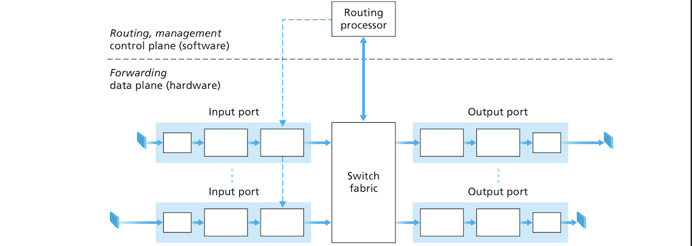
- Your generic router generally consists of:
	- **Input ports**: perform several functions:
		- At the physical layer, the input port *terminates* the incoming physical link.
		- At the link layer, the lookup function is performed at the input port. "It is here that the for- warding table is consulted to determine the router output port to which an arriving packet will be forwarded via the switching fabric", Control packets, *whattt :confused:!!* such as those carrying routing information get forwarded from the input ports to the routing processor. 
	- **Switching fabric**: connects the input ports to output ports. It is completely contained within the router. It is a network inside the network's router.
	- **Output ports**: stores packets received from the switching fabric and transmits these packets on the outgoing link by performing the physical and link layer functions we've touched on for input ports. With bidirectional links which transmit data in both directions, an output port is paired with an input port "on the same line card (a printed circuit board containing one or more input ports, which is connected to the switching fabric)".
	- **Routing processor**: executes the *routing protocols*,  maintains *routing tables* (what :confused:!!) and attached link information. It also computes the forwarding table of the router and performs network management which we will not talk about in this chapter. 
- As we've seen earlier, a router perform two functions: routing and forwarding. The image above showing router's architecture illustrates this distinction where we can see how the router is divided into a **router forwarding plane** and a **router control plane**.
- The router's input ports, output ports and switching fabric are part of the forwarding plane and are almost always implemented in hardware. Implementing the forwarding plane in hardware rather than software is due to the fact that a typical router needs to forward large amounts of packets in a few nanoseconds. Implementing the forwarding functionality in software would make it slower.
- Unlike the forwarding plane, the router control plane which executes router protocols executes at a scale of milliseconds and seconds. They are implemented in software that runs on the routing processor which a typical CPU.
- There are many things to consider when designing a self-respecting router! how do routers handle packet jams? What if many packets all want to go through a specific output port? Are there priorities governing the flow of packets? We will see some answers to these questions in the following more detailed subsections about the internals of routers.

### Input Processing:
- The following diagram shows a detailed description of how input ports work:
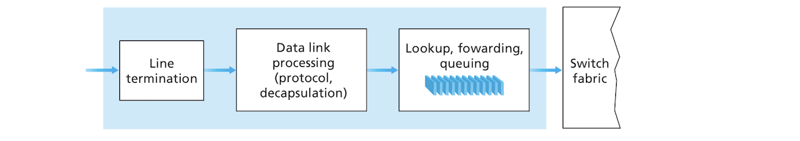
- An input port implements the physical-layer and link-layer for an individual input link. The lookup function is executed at the input port. It is in the input port that the router uses the forwarding table to decide which output port to forward a packet to via the switching fabric. The router processor computes and updates the forwarding table but a *shadow copy* of the forwarding table is usually stored in each input port. The forwarding table is copied to the "line cards" (*whatever these are!!*) over a separate bus. The shadow copies of the forwarding table in each port allow each port to make forwarding decisions locally without referring to the routing processor for each packet.
- The ports don't just search the forwarding table linearly as they can receive several Gbps of data which they need to process in mere nanoseconds. The lookup is done in hardware and specialized algorithms are used to do such lookup. Embedded on-chip DRAM and SRAM memories are also used to speedup lookup. There is talk of a certain *ternary content address memories (TCAMs)* which returns a forwarding table entry in constant time. Each input port has its CAM or TCAM.
- Once the lookup determines which output port the packet needs to be forwarded to, it sends the packet to the switching fabric. Sometimes, a packet might be blocked temporarily from entering the switching fabric because packets from another input port are passing through the fabric. Blocked packets are queued and scheduled to be passed to the switching fabric at a later time. Queuing can be done in both input and output processors as we will see later. A few other operations are performed at the input router such as checking packet checksum, version number and time-to-live, etc.
- Input port processing which involves looking up an address (*match*) and sending a packet into the switching fabric (*action*) is a specific case of general abstraction called *match plus action*. Other network components also use this abstraction such as link-layer switches which do destination addresses lookup before sending frames to the switching fabric, and firewalls which would filter packets that don't match certain criteria such as a combination of source/destination IP addresses and transport-layer port numbers.

### Switching:
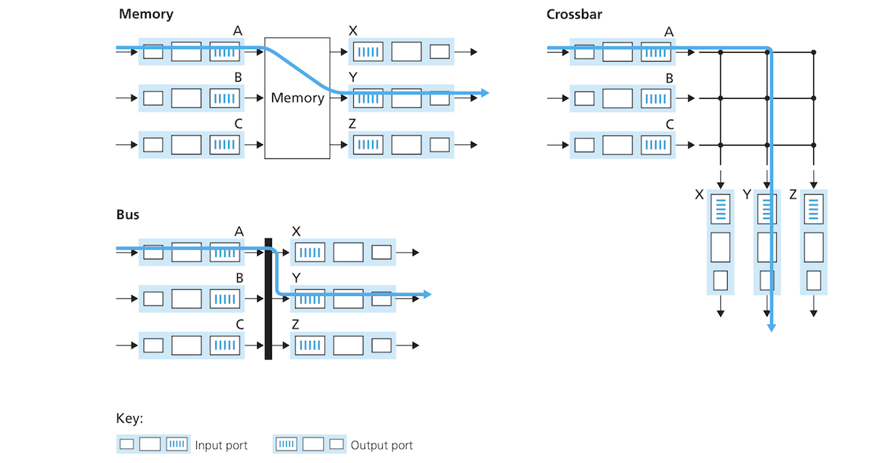
- The switching fabric is a fundamental component of the router which uses it to switch (forward) packets from input ports to output ports. As the image above depicts, switching can be done in one of 3 ways:
	- **Switching via memory**: Earlier routers were simple and acted like traditional computers. Switching was done directly by the CPU (routing processor). Input and output ports acted as IO devices. When an input port received a packet, it signaled the routing processor with an interrupt, which copied the packet to main memory, extracted its destination addresses, looked up the output port in the forwarding table, and then copied it to the output port's buffer. Memory acted as a bottleneck in this system and only one packet could be forwarded at a time because only one memory read/write operation could be done over the shared system bus. Routers still perform switching via memory, but instead of doing it in the routing CPU, the lookup and storage in appropriate memory locations is done by processing on the *input line cards*. I believe in this scheme multiple packets can be written read concurrently, but don't take my word for it. 
	- **Switching via a bus** involves moving a packet directly from the input port to the appropriate output port through a shared bus by prepending the packet with a header that indicates the destination output port. All the output ports will receive the packet, but only the port with the matching label keeps the packet while others discard it. The label is then stripped from the packet because that label is only used within the switch. If multiple packets arrive at the router input at the same time (even when targeting different input ports), they all must wait but one packet because only one packet can pass through the shared bus at a time. The switching speed in such switches is bottlenecked by the speed of the bus. Such routers are OK for small local networks and enterprise networks. 
	- **Switching via an interconnection network**: The limitations of a single shared bus can be replaced by the use of an interconnection network. In a router with ***N*** input ports and ***N*** output ports, there are ***2N*** buses connecting the two types of ports. These buses have switches that get opened and closed by the switching fabric controller. Multiple packets arriving at multiple different input ports and destined for multiple different output ports can be forwarded simultaneously.

### Output Processing:
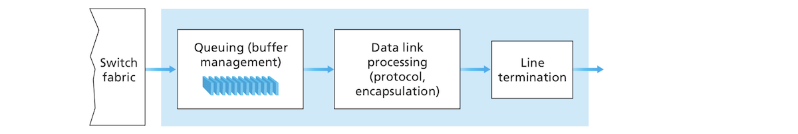
- The image above shows a how output port's processing is done. It takes packets stored in the output port's memory and transmits them to the output link after it selects them and dequeues them for transmission. 

### Where Does Queuing Occur?
- Theoretically, queuing can occur both in input and output ports and this depends on a variety of factors such as traffic load, the speed of the switching fabric and the line speed *(I don't know what line they are referring to, is it the port itself or the link terminated by the port??!!)*. When a port's memory is filled and can't store any more packets, **packet loss** occurs. 
- If the switching fabric is fast, at least as fast as the sum of all the pairs of input and output ports in the router, the queuing will most likely occur at the output ports because a flood of packets might be directed to one output port from multiple input ports all at once and these packets will flow unhindered by the fast switching fabric resulting in queuing at output ports.
- A consequence of output queuing is a **packet scheduler** which chooses the next packet from the queue to transmit. This can be as simple as *first-come-first-served (FCFS)* scheduling, or can be more sophisticated such as *weighted fair queuing (WFQ)* "which shares the outgoing link fairly among the different end-to-end connections that have packets queued for transmission". Packet scheduling is important in so called *quality-of-service guarantees* which seems to be important for multimedia networking such as video streaming, I believe!
- When memory can't queue any more packets, the router or output port must decide to drop packets. When the queue is full, newly arriving packets can get dropped (a policy called **drop-tail**). Already queued packets might also be dropped to make room for new packets. Packet dropping policies can get fancier and start dropping or marking packets before queuing buffer is full and this is done to send a congestion signal to the sending node. Policies for packet-dropping and packet-marking are called **active queuing management (AQM)** algorithms.
- When the switch fabric is too slow to forward all arriving packets to the appropriate output ports, then queuing happens at the input ports. One result of input port queuing is a phenomenon called **head of the line (HOL) blocking**. Packets behind blocked packets are also blocked inside the buffer, even though they can otherwise move freely through the switch fabric. Geniuses have proposes solutions to manage the HOL phenomenon which we, mere mortals, won't understand. 

### Routing Control Plane:
- The routing control plane resides in the router's routing processor. The network wide control plane is distributed with different pieces of it residing and executing in different routers and interacting by sending routing messages to each other. 

## The Internet Protocol: Forwarding and Addressing in the Internet:
- We've been discussing the the generic addressing and forwarding mechanics of the network layer in general, but will now discuss one specific network-layer protocol, the **Internet Protocol (IP)** which governs the the **Internet**. 
- There are two versions of IP, IP version 4 or **IPv4** and IP version 6 or **IPv6** and we will discuss both in this section with a focus on IPv4. 
- The following diagram shows the main components of the Internet's network layer:
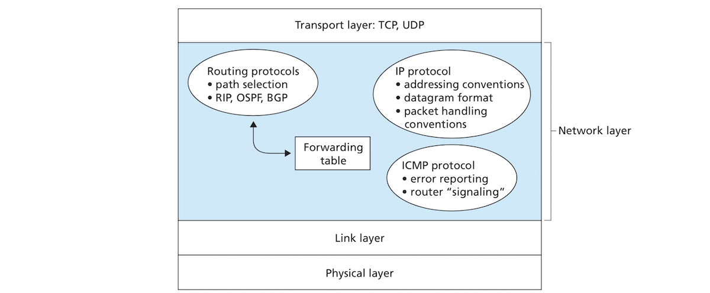
- The Internet's network layer has three main components:
	- The IP protocol which will be the subject of this s
	- Routing.
	- Error reporting in the network.

### Datagram Format:
- The following image shows the structure of an IPv4 datagram which a self-respecting student of networking should probably know by heart:
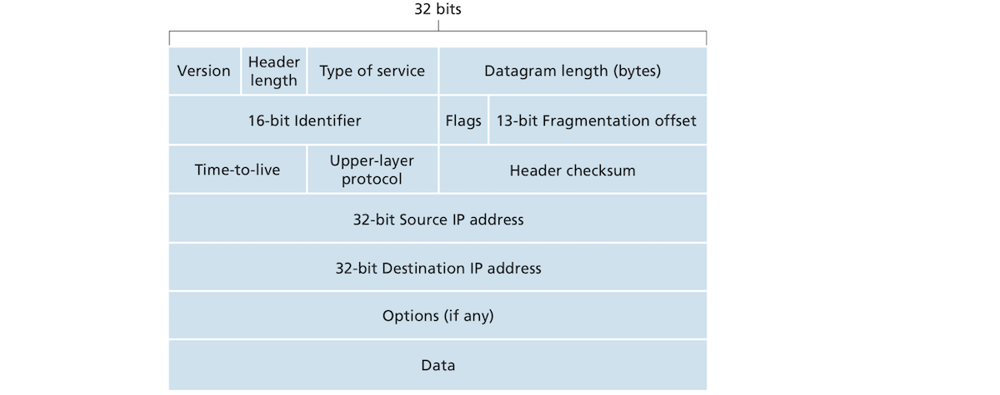
- Important IPv4 datagram fields, as the image above shows, include:
	- **Version number**:consists of 4 bits and is used by the router to determine the IP version of a datagram, which in turn is used to determine how the datagram is to be interpreted as different IP versions have different datagram formats. There are different IP versions and the image above shows a datagram of IPv4.
	- **Header length**: uses 4 bits. IPv4 datagram's header can contain a variable number of options which means datagrams have variable header lengths. The header length field is used to determine where the actual datagram data starts. Most datagrams have no options meaning the header length is usually 20 bytes.
	- **Type of service (TOS)**: is an 8-bit field used to distinguish between different types of datagrams such as those requiring low delay and those requiring reliability, etc. 
	- **Datagram length**: is 16 bits in length. It indicates the total length of a datagram (header + data). Based on the number of bits in this field, a datagram can theoretically be 65,535 bytes in length, but an actual datagram is rarely over 1,500 bytes.
	- **Identifier, flags, fragmentation offset**: are fields that have to do with *IP fragmentation* which we will see later.
	- **Time-to-live (TTL)**: has 8 bits and is included to prevent a datagram from circulating forever in the network such as in the case of a long routing loop. This field is incremented by 1 each time it is processed by a router. When it is equal to 0, the datagram is dropped.
	- **Protocol**: is 8-bit long. This field is used only when the datagram reaches its destination host. It indicates to which to which transport layer the datagram's data belongs to. For example, the value 6 indicates the datagram's data goes to TCP, while 17 is for UDP. This fields binds the network layer to network and transport layers together.
	- **Header checksum**: is 8-bit long. It is used by a router to detect errors in an IP datagram. It is computed by treating each 2 bytes in the header as a number and summing these numbers using 1s complement. Each router computes the header checksum of a datagram and drops the datagram if the checksum header field doesn't equal the result of this computation. Each router recomputes and stores the header checksum because the TTL and probably the options too might change. Why does TCP/IP computes a checksum at both the network and transport layer? It seems a little redundant. There are several wise reasons for such apparent which include:
		- Only the datagram header is checksummed at the at the IP layer, while the whole segment is checksummed at the TCP/UDP layer.
		- TCP/UDP protocols don't have to belong to the same stack as IP. IP can be used for other transport layer protocols, while UDP/TCP can theoretically run on an ATM network. 
	- **Source and destination IP addresses**: are both 32-bit long. These two fields contain the sender and receiver host IP addresses. The sender inserts its own address into the source field, and does the same with the destination address which it usually obtains through a DNS lookup.
	- **Options**: allow the IP header to be extended to include possible extra data. Options were meant to be used  rarely, that's why they are not included in every datagram. Datagrams that  contain options incur extra overhead because they need more processing. The complicated nature of options led to dropping them altogether in IPv6. 
	- **Data (payload)**: is of a variable length and it contains the actual data in the datagram. It usually consists of a transport segment, but it can also consist of other types of data such ICMP messages which we will see later in this document.
- The header of a datagram that doesn't have options is 20-byte long. If the datagram has a TCP segment, the segment's header is also 20 bytes in length. Such a datagram, then, has 40-bytes of
header data not including the transport segment's payload!   

#### IP Fragmentation:
- Different link-layer protocols can carry packets of different sizes. Ethernet can carry up to 1500-byte frames, while some WAN links can only carry 576-byte frames, but others can carry jumbo frames that can be as big as 5000 bytes. The maximum amount of data that can be carried by a link-layer frame is called the **maximum transmission unit (MTU)**. The MTU of a link limits the maximum size an IP datagram can have. What results from this is that as a packet traverses the network to its destination it crosses links that use different protocols with different MTUs. What if the datagram too big for a link's MTU?
- When a datagram is larger than the  outgoing link's MTU, the datagram is fragmented into two or more smaller datagrams and is encapsulated into separate frames that can be passed to the given outgoing link.  
- Fragments need to be reassembled before they can be used in the transport layer as UDP/TCP expect unfragmented datagrams. Reassembling datagrams can be costly if it's done in routers can put a lot of overhead on the network, that's why the designers of IPv4 decided to do the reassembly of packets on the destination end system rather than routers to keep the network's core simple and performant.
- When a series of datagrams are received by the destination host, the host needs to determine if any of these datagrams are fragments of some original larger datagram. It also needs to determine if it has received the last fragment of an original packet. It must also determine how such fragments are to be reassembled into the original datagram. To perform all these tasks, the network uses the 3 IPv4 fields: *Identifier, flags* and *fragmentation offset*. Fragmentation and reassembly are done in the following steps:
	- The sending host stamps each datagram with an *identification* number as well as a source and destination address. This number identification with each new datagram to be sent (I don't know exactly when the incrementation starts, each time a process starts making use of the network?!!).
	- When a router fragments a datagram, it stamps each fragment with the identification number, source and destination addresses of the original datagram. 
	- When destination receives a series of datagrams, it examines their identification numbers to determine if they are fragments of a larger original datagram. Because the IP protocol is unreliable a fragment might never arrive to its destination. To be sure that the last fragment has been received, it has a *flag* bit set to 0, while all other fragment flag bits are set to 1 (does this also mean that a non-fragmented datagram has that flag bit set to 0. They haven't explained how the destination can tell the difference between a fragment and a non-fragment). Tom determine the order of fragments and if a fragment is missing, the receiving host uses the *offset* field to place a fragment in its proper position in the original datagram. 
- The following figure shows how a datagram is fragmented en route and then reassembled at its destination:
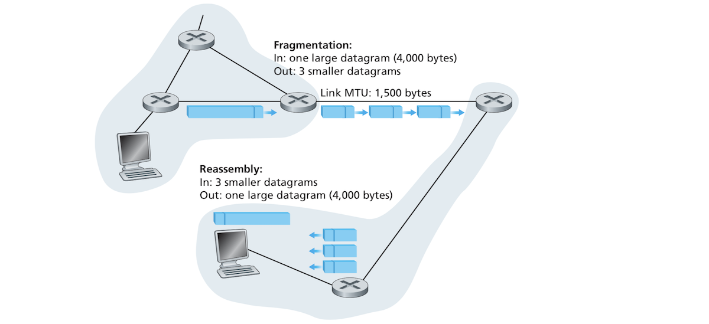
- A few little considerations about fragmentation is apart from the last fragment, the sizes of all other fragments must be multiples of 8. The offsets must also be specified in 8-byte units. If the second fragments starts after byte 1,480 its offset is 185 because *1480 = 185 · 8*.
- Fragmentation seems innocent but it has some costs:
	- It complicates the lives of routers which have to fragment datagrams and end systems which have to do extra work to reassemble fragments.
	- Hackers have found ways to exploit fragmentation to Dos systems:
		* In a *Jolt2* attack, a hacker sends to the target system a stream of small packets none of which has an offset of zero. The system might crash as tries to reassmeble datagrams out of these packets.
		* In another type of attacks, hackers send streams of overlapping fragments, fragments whose offsets don't overlap. Some operating systems get confused by these fragments and crash. 
- As we've mentioned earlier, IPv6 dropped fragmentation altogether to simplify the network further and to avoid the aforementioned security vulnerabilities. 

### IPv4 Addressing:
- IPv4 addressing is not as simple and straightforward as it seems, but can complex and really interesting. 
- Let's first survey a few preliminary points before delving into IPv4 addressing. How are hosts and routers connected to the network. A host usually has a single link into the network. IP sends datagram to the host over this link. The  boundary between the host and physical link is called an **interface**. A router, on the other hand, has 2 or more links because their job is to receive datagrams from some links and forward them to other links. Being connected to multiple links means a router has multiple interfaces. IP requires every host and every router interface to have its own unique IP address to be able to send and receive datagrams. An IP address is associated with an interface and not the router or host containing that interface. 
- An IPv4 address is 4 bytes in length (32 bits) so there is 2<sup>32</sup> (roughly 4 billion) possible addresses. IP addresses are commonly written using the **dotted-decimal notation** where each byte in the address is written in a decimal form and separated by a dot from the rest of the address's bytes. The IP address ***193.32.216.9*** is equivalent to binary ***11000001 00100000 11011000 00001001***.
- Each interface on a host or a router must have its own unique IP address (except for interfaces behind Nats which we will see later). IP addresses are also not arbitrary, but portions of an IP address are dictated by the *subnets (la quoi?)* they are connected to.

#### Subnets:
- The following figure shows an example of IP addressing and interfaces:
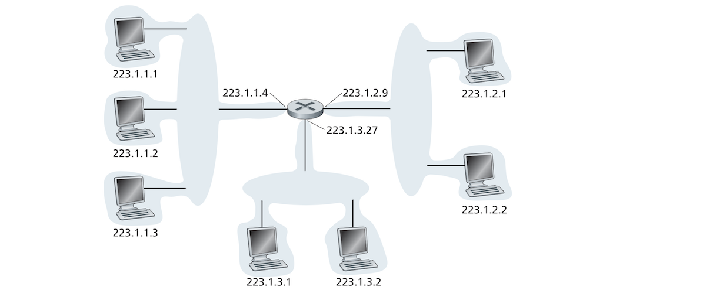
- In the figure above, one router is used to interconnect 7 hosts. There are patterns you can easily notice in the IP addresses of these hosts. The 3 hosts on the upper-left side of the image all have addresses of form ***223.1.1.xxx***. They have the same leftmost 24 bits in their IP addresses. These 3 hosts are also connected in a network that doesn't contain a router. These 3 hosts could be connected an Ethernet LAN using an Ethernet switch, or by a wireless access point. Such a network is represented here by a cloud but we will see how these works in chapters about the link layer and wireless networking. 
- This network containing 3 hosts and one router interface is called a **subnet** which is also called an **IP network** or simply a **network**. IP addressing assigns to this subnet and address ***223.1.1.0/24*** where ***/24*** is called a **subnet mask**. The subnet mask indicates that the leftmost 24 bits of the 32-bit address define the address of the subnet. The subnet ***223.1.1.0/24*** consists of 4 interfaces: 3 host interfaces ***223.1.1.1***, ***223.1.1.2***, ***223.1.1.3***, one router interface ***223.1.1.4***. Any host that becomes part of the subnet ***223.1.1.0/24*** must have an address of the form ***223.1.1.xxx***. You can also see that the network above has two additional subnets with subnet masks ***223.1.2.0/24*** and  ***223.1.3.0/24***.
- The IP definition of a subnet is not restricted to Ethernet segments connecting multiple hosts to a single router interface. Consider the following document. It shows 3 routers connected by *point-to-point*links (we will see this in link layer chapter), and each of the 3 routers is connected to 2 hosts. Each of the 3 routers has 3 interfaces: 2 for 2 point-to-point links connecting to the two other routers and one *broadcast link* connecting it to two hosts. In this diagram we have 3 subnets similar to those we saw earlier where a single router interface is connected to multiple hosts. These are: ***223.1.1.0/24***, ***223.1.2.0/24***, and ***223.1.3.0/24***. There are also 3 additional subnets covering connections between routers. These are: ***223.1.9.0/24*** for the interfaces connecting routers R1 to R2, ***223.1.8.0/24*** for the interfaces connecting routers R2 to R3, and ***223.1.7.0/24*** for the interfaces connecting routers R3 to R1.
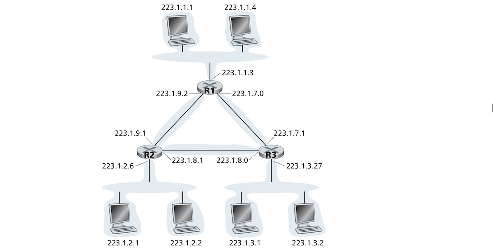
- A concrete definition of a subnet can be summed as: "*To determine the subnets, detach each interface from its host or router, creating islands of isolated networks, with interfaces terminating the end points of the isolated networks. Each of these isolated networks is called a **subnet**.*"
- An organization can have multiple subnets based Ethernet segments and point-to-point links, and although these subnets can be different, they have a lot of things in common due to how IP addressing is done. 
- Internet's address assignment is done using a strategy called **classless interdomain routing (CIDR )** (pronounced as *cider*) which is a generalized form of address subnetting. In this scheme the IP address is divided into two parts and looks as follows: ***a.b.c.d/x*** and where the first part is the dotted-decimal form of the address, and ***x*** indicates the number of bits in the first part of the address.
- The x most significant bits of an address in ***a.b.c.d/x*** are its prefix and they "constitute the network portion of the IP address." An organization is usually assigned a block of contiguous addresses, that is a range of addresses with a common prefix so device addresses in the organization all have the same prefix. Outside the organization's network, routers only consider its prefix bits. This consideration reduces routing tables sizes considerably since a single entry in a router is sufficient for routing datagrams to any destination belonging to an organization.
- The rest ***32 - x*** bits of the address are used to distinguish between the different devices in the organization. They are used to forward packets within an organization. They may or may not have further subnetting structures. 
- Before the adoption of CIDR, **classful addressing** was used. Classful addressing allowed the network portion to only be 8, 16 or 24 bits in length and accommodated classes A, B and C networks (hence the name). The rapid growth of small and medium organization made this scheme useless. A class C (/24) could only accommodate a few ***2<sup>8</sup> - 2 = 254*** addresses (2 addresses are reserved for special uses), while class B (/16) allowed for too many addresses (65,634). An organization needing 2000 addresses was given a class B class subnet which quickly depleted available class B subnets and was too wasteful as the other 63,635 addresses sat by idle used for nothing. The adoption of CIDR solved this problem.
- A special type of IP address is the IP broadcast address ***255.255.255.255***, when a host sends a datagram to this address, the message is delivered to all hosts on the same subnet.
- The following section will treat the issue of how address blocks are assigned to an organization and subnets in general and how hosts within a subnet are assigned individual addresses.

#### Obtaining a Block of Addresses:
- If we, a random organization, want a block of IP addresses within an ISP's subnet, we contact that ISP which will give us a block of addresses within a larger block that has been assigned to the ISP. Let's say we have an ISP that has been allocated the address block ***200.23.16.0/20***. If the ISP divides this address block further into 8 contiguous address blocks and gives one block to each one of these organizations, we would obtain the following result (the subnet parts are in bold type):

| Entity | Subnet | Start of address block |
| --- | --- | --- |
| ISP’s block | 200.23.16.0/20 | <u>11001000 00010111 0001</u>0000 00000000 |
| Organization 0 | 200.23.16.0/23 | <u>11001000 00010111 0001000</u>0 00000000 |
| Organization 1 | 200.23.18.0/23 | <u>11001000 00010111 0001001</u>0 00000000 |
| Organization 2 | 200.23.20.0/23 | <u>11001000 00010111 0001010</u>0 00000000 |
| ... | ... | ... |
| Organization 7 | 200.23.30.0/23 | <u>11001000 00010111 0001111</u>0 00000000 |

- ISPs are not the only organizations that can provide address blocks; in fact ISPs themselves obtain their address blocks from a global authority whose job is to manage the global IP address space. This authority is called **Internet Corporation for Assigned Names and Numbers (ICANN)**. It is a non-profit organization that also manages DNS root servers in addition to IP address block allocation. 

#### Obtaining a Host Address: the Dynamic Host Configuration Protocol:
- When an organization obtains an address block, it can start assigning individual addresses to host and router interfaces of the organization. A system administrator might configure addresses manually, probably remotely with a network management tool. Assigning individual addresses is, however, often done today using the **dynamic host configuration protocol (DHCP)**. DHCP allows hosts to obtain addresses automatically. An admin can configure a host so that it obtains the same IP address each time it's connected to the network, or that it's assigned a **temporary IP address** each time the host gets connected. In addition to being assigned an IP address, DHCP allows a host to know a few things about the network it belongs to such as its subnet mask, the address of its *first hop-router* (also called *default gateway*), and the address of its local DNS server.
- DHCP, a plug-and-play protocol, enjoys widespread popularity today because of its ability to automate the repetitive task of assigning IP address especially in residential Internet access networks and wireless LANs where devices join and leave the network frequently. Assigning arbitrary addresses to devices connecting and leaving for short periods of time is served greatly by DHCP. 
- DHCP is a client-server protocol where the client is a newly connected host needing to network configuration information including an IP address. In simple cases, a subnet has its own DHCP server, but when such a server is not available in the subnet, we need a *DHCP relay agent* (usually a router) that knows a DHCP server in the network. To simplify things, let's just assume our subnets have their own DHCP servers.
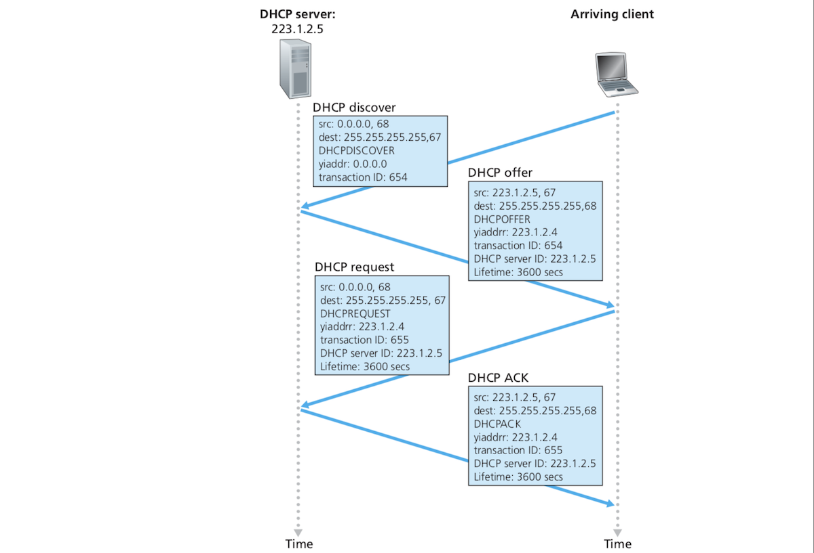
- As the image above shows, When a host newly connects to the network, a four-step process takes place  in which DHCP assigns an address to the host and gives it related network configuration information:
	- **DHCP server discovery**: The host needs to first find a DHCP server by sending a **DHCP discover message** in UDP packet to port 67. This UDP packet is encapsulated in an IP datagram, but should the host sends it? The host doesn't know anything about the network. The destination address of this datagram is ***255.255.255.255***, meaning it'll be broadcast to all devices in the work and the source address is ***0.0.0.0*** meaning this device, itself (I think the host mac address is its actual identifier). This IP packet is passed to the link layer which packages it in a frame and broadcast to all devices in the subnet.  
	- **DHCP server offer(s)**: When the DHCP server receives the discover message, it responds by broadcasting a **DHCP offer message** to all nodes in the subnet. There might be several DHCP servers in a subnet and the client might have to choose one of them. The offer message contains:
		- A **transaction ID** of the received request message. 
		- The proposed IP address of the client.
		- The network mask.
		- The IP **address lease time** (the amount of time for which the address will be valid which usually lasts between hours and days).
	- **DHCP request**: The client selects one offer and responds to the selected server with a **DHCP request message**. This message copies the information contained in the server offer message. 
	- **DHCP ACK**: The server responds to the client with a **DHCP ACK message** which confirms the requested configuration parameters. 
- Once the client receives the ACK message, the client start using the allocated IP address for the period given in the least address lease time. 
- Amazing as DHCP is, it has a few shortcomings such as the fact that a TCP connection cannot be maintained when moving between different subnets (considering that much of networking is done today in mobile phones). *Mobile IP* is the solution to this problem where devices are offered permanent IP addresses that are not affected when moving between different subnets.

#### Network Address Translation:
- **Network address translation (NAT)** is another popular IP address conservation strategy (CIDR was one we've seen earlier). NAT was adopted as a response to the meteoric proliferation of *SOHO* (small office, home office) networks. Should we allocate a range of addresses for each SOHO? How many addresses should a SOHO have, and what if we run out of allocated addresses? How can SOHO networks be administered? etc. Some and other issues are answered with NAT. 
- The following figure shows how a NAT-enabled router works and what it does. 
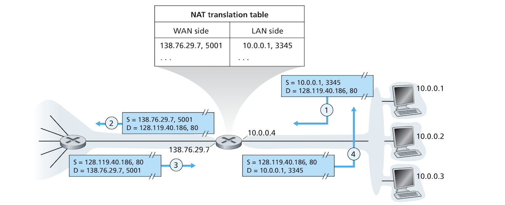
- You can see that the SOHO network on the right of the network belong to the subnet address ***10.0.0.0/24***. This network include 3 hosts and one interface from a NAT-enabled router. These addresses belong to the reserved address space ***10.0.0.0/8*** which is reserved for a **private network** (also called a **realm with private addresses**). There are two other private address spaces as defined in RFC 1918. These are:
```
10.0.0.0        -   10.255.255.255  (10/8 prefix)
172.16.0.0      -   172.31.255.255  (172.16/12 prefix)
192.168.0.0     -   192.168.255.255 (192.168/16 prefix)
``` 
- In a private network, addresses have meaning only within that network. Hundreds of thousands of SOHO networks can use the address same space ***10.0.0.0/24***. Devices within this such networks can send packets to each other in their private realms, but these addresses don't mean anything outside these private networks because many other networks use this same address space. How can these addresses be meaningful in the global Internet which require addresses to be unique. 
- To the outside world, a NAT-enabled router seems like a single device with a single address. In the image above all traffic entering the private network has the destination IP address ***138.76.29.7*** and all traffic leaving it has the source IP address ***138.76.29.7***. A NAT-enabled router basically hides the traffic details inside the private network. How are the private network computers  assigned their private addresses and how does the NAT-enabled home router itself obtain its address? This is done with good old DHCP. The ISP assigns the router an address from its DHCP server and the private network's computers are obtained from a DHCP server run by the NAT-enabled router.
- How do datagrams coming from the global Internet to the public facing interface of a NAT router get to a host in the private network even though the whole network has a single public IP address? This is done with a **NAT translation table**. This table uses both IP addresses and port numbers *(This is a little weird cos we've said routers are not supposed to be aware of any layers above the network layer!! Maybe NAT-enabled routers are a special case).*
- When a host in the private network with a private IP address in the space ***10.0.0.0/8*** sends a datagram with a given transport source port, the NAT-enabled router generates an arbitrary transport-layer source port that is not currently in use by the router. The router then:
	- Replaces the source port of the datagram with the source port the router has generated.
	- Replaces the source IP address of the datagram with the router's WAN (publicly facing) IP address. 
	- It adds an entry to its NAT translation table containing these WAN and LAN address and port pairs.
	- It sends the datagram to its destination. 
- Because a port number is 16-bit long, the NAT-enabled router can support more than 60,000 simultaneous connections. 
- When the NAT-enabled router receives a datagram on its WAN interface, it looks up its NAT translation table, finds the appropriate entry and translates the port number and IP address to correspond to the appropriate private address.

#### Problems with NAT and UPnP:
- *(This is extremely brief and unclear. Needs further research and details).*
- In spite of the widespread adoption of NAT, it suffers from a few shortages that the IETF dislike deeply and argue that:
	- Ports are meant to distinguish between processes rather than between hosts. This causes problems if you want to run a server behind a NAT-enabled router because servers wait for connections on specific ports.
	- NAT-enabled routers process layer 4 packets even though routers in general are only meant to process up to layer 3 packets. 
	- NAT violates the *end-to-end* argument where hosts are meant to talk directly to each other with no intermediary nodes modified IP datagrams and port numbers.
	- We have IPv6 which provides a more than satisfying answer to the problem of IP address shortage.
- A major problem with NAT is that it interferes with P2P applications because a host behind it cannot act as a server and accept TCP connections. This can be circumvented through different hacks known collectively as **NAT traversal**.
- **universal plug and play (UPnP)** is a more modern and easy way of doing NAT traversal. It basically allows the application to choose a mapping between the private and public port/address pairs so the machine can start acting as a server host and the address/port pair can be advertised as a server of sorts that clients can initiate connections to it.

### Internet Control Message Protocol (ICMP):
- In addition to the IP protocol discussed earlier, and the routing protocols (RIP, OSPF, and BGP) which we will be talking about later, the Internet's network layer also consists of ICMP which we will discuss in this section.
- The ***Internet control message protocol (ICMP)*** is used by hosts and routers to communicate network-layer information to each other. The most important of these information is error reporting. When you encounter an error message such as "Destination network unreachable" while running a Telnet or FTP session, you are dealing with a message that has its origins in ICMP. What happened is that an IP router couldn't find a path to the specified destination so it created a type-3 ICMP message and sent it back to your host telling it about the error. 
- ICMP is popularly considered as part of IP but it is not exactly. It lies above IP in the stack because ICMP messages are carried as IP datagram payload just as a transport layer segment is an IP datagram payload. When a host receives an IP datagram with ICMP as an upper-layer protocol, it demultiplexes the datagram content to ICMP just as it does with TCP/UDP packets. 
- An **ICMP message** consists of a **type** field, a **code** field, and the header of the datagram that caused the error along with the first 8 bytes of that datagram. The following table shows some ICMP message types (you should notice that they are not all for error reporting):

| ICMP type | Code | Description |
| --- | --- | --- |
| 0 | 0 | echo reply (to ping) |
| 3 | 0 | destination network unreachable |
| 3 | 1 | destination host unreachable |
| 3 | 2 | destination protocol unreachable |
| 3 | 3 | destination port unreachable |
| 3 | 6 | destination network unknown |
| 3 | 7 | destination host unknown |
| 4 | 0 | source quench (congestion control) |
| 8 | 0 | echo request |
| 9 | 0 | router advertisement |
| 10 | 0 | router discovery |
| 11 | 0 | TTL expired |
| 12 | 0 | IP header bad |

- The famous `ping` program sends an ICMP message of type 8 and code 0 to a given host. The destination host responds with an ICMP message of type 0 and code 0 which is an echo reply. 
- The *source quench* message which is rarely used is another way of congestion control where a congested router sends a host a message forcing it to reduce its transmission rate. We've seen how congestion control is done at the transport layer by TCP. 
- The Traceroute program which we might have seen before and which is used to trace the path from a host to any destination host is also based on ICMP messages. To determine the names and addresses of routers in the path, Traceroute sends a series of IP datagrams with increasing TTLs starting with TTL 1, then 2, then 3, etc. These datagrams carry UDP segments with unlikely port numbers. Traceroute also starts timers for each of these datagrams. When a router receives a datagram it knows that its TTL has expired so it discards it and sends back an ICMP message back to the source telling it about the problem (type 11, code 0). This ICMP message contains the name and address of the router. The round-trip of the packet is obtained from the timer the Traceroute set for each datagram. The timer is stopped when the corresponding  IMCP is received. When a datagram reaches the destination host, because it has an unlikely UDP port number, the destination host sends back to the source a "port unreachable" ICMP message (type 3, code 3). This message signals to Traceroute that it should stop sending datagrams. Traceroute can do this because, it can instruct the operating system to generate UDP messages with with specific TTL values, and can get notified by the OS that it has received ICMP messages. 

### IPv6 Addressing:
- IPv6 was developed in the early 1990s to be a successor to IPv4 mainly because IPv4 adresses were (and are still) being depleted quickly. In addition to responding to IPv4 address shortage, IPv6 is also trying to mitigate some of the disadvantages that IPv4 suffers from.

#### IPv6 Datagram Format:
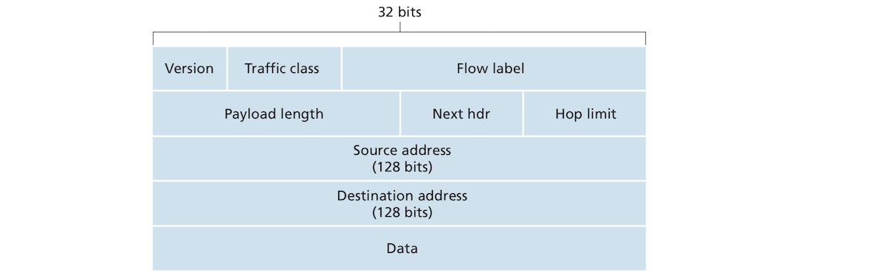
- As the image above shows, the IPv6 datagram format provides several improvements over its predecessor IPv4:
	- **Expanded addressing**: Instead of the 32-bit IPv4, IPv6 introduced 128-bit addressing meaning "every grain of sand on the planet can be IP-addressable". In addition to unicast and multicast addressing, IPv6 has introduced a new type of address called **anycast address** "which allows a datagram to be delivered to any one of a group of hosts".
	- **Streamlined 40-byte header**: Several fields have been dropped or made optional. An IPv6 datagram have a fixed 40-byte header making processing it easier and faster. 
	- **Flow labeling and priority**: IPv6 allows for labeling datagrams belonging to different **flows**. Certain types of flow like real time video streaming is considered as flow while email or file transfer is not!! WHATT :confused:. Another field, **traffic**, is used to give different priorities to datagrams from different applications.
- It is easy to notice that IPv6 datagram has a simpler format than that of IPv4:
	- **Version** (4 bits): It obviously has the value 6 and changing to 4 doesn't magically turn an IPv6 datagram into an IPv4 datagram.
	- **Traffic class** (8 bits): Acts like the TOS field in IPv4.
	- **Flow label** (20 bits):  Identifies the a flow of datagrams.
	- **Payload length** (16 bits): An unsigned integer that gives the number of the bytes in the datagram following the fixed-length 40-byte header.
	- **Next header** (8 bits): Gives a number identifying the protocol to which the contents of the IP datagram belongs to such as TCP, UDP, etc. This is similar to the protocol field of IPv4 and uses the exact same numbers. 
	- **Hop limit** (8 bits): the contents of this field are decremented by 1 for each router the datagram traverses. When this field's value reaches 0, the datagram is dropped.
	- **Source and destination addresses** (128 bits each).
	- **Data**.
- Streamlining IPv6 means dropping several fields and complications associated with them:
	- **Fragmentation and Reassembly**: Routers cannot fragment or reassemble IPv6 datagrams. If a router receives a datagram that is too big to pass through the outgoing link, it is dropped and an ICMP message is sent to the source host asking it for smaller datagrams. Removing the overhead of fragmentation/reassembly makes IP significantly faster.
	- **Header checksum**: This operation is completely redundant because it is done in the link layer and done again in transport layer. What's worse is because of the TTL field that changes after every router hop, the checksum has to be recomputed at every router introducing significant unnecessary overhead. Removing this field has made IPv6 faster.
	- **Options**: Options are not part of the header anymore, but an IPv6 datagram can have extra optional headers. The *next header* field in the standard header can point to this header exactly as it would point to upper layer header such as TCP. This is why IPv6 has a fixed-length header of 40 bytes. 
- IPv6 also has a newer version of ICMP, called ICMPv6 which extends ICMP with functionality IPv6 needs such as the "Packet too big", and "Unrecognized IPv6 options" messages. 

#### Transitioning from IPv4 to IPv6:
- How will the IPv4-based Internet transition to IPv6? IPv6-capable systems can be backward-compatible and process IPv4 datagrams, but IPv4 only systems have no idea about IPv6 or how it works. One way the transition might be effectuated is through declaring a flag day when all systems and the whole Internet moved to IPv6 but this is almost impossible. When the world moved from NCP to TCP many years ago, it was very hard to do even when there were only a few wizard running the Internet which consists of far fewer systems. Instead of such a mess, two approaches that can be used separately or together have been proposed are in actual use now which aim to gradually replace IPv4 with IPv6.
- The first and straightforward approach, **dual-stack**. A node in this approach implement both IPv4 and IPv6 so that it can send both IPv4 and IPv6 datagrams. It sends and receives an IPv4 when dealing with IPv4-only node, and IPv6 otherwise! To take these decisions, an IPv6-capable node must also be able to determine if another node is IPv6-capable; this it does using DNS. DNS will return to  to a requesting node the up address of a given node name which it can determine if it’s IPv6 or IPv4.
- In the dual-stack approach, both nodes need to be IPv6-capable to be able to exchange IPv6 datagrams, otherwise if one is not, the two can only exchange IPv4 datagrams. Due to the nature of the Internet and the changes a datagrams undergoes between the two versions, two IPv6 capable nodes might end up exchanging only IPv4 datagrams. The following diagram shows how this can take place:
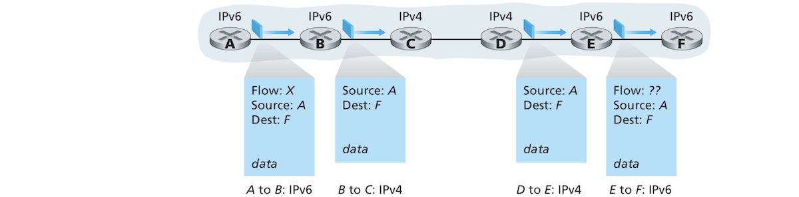
- The problem with dual-stack is that translating IPv6 to IPv4 results in loss of IPv6-specific fields such as the flow field so when an ivp4 datagrams which was originally IPv6 is attempted to translate into IPv6, those fields are lost and cannot be reused.
- the answer to the loss of header information in dual-stack is in the second approach: **tunneling** which can be illustrated by the following diagram:
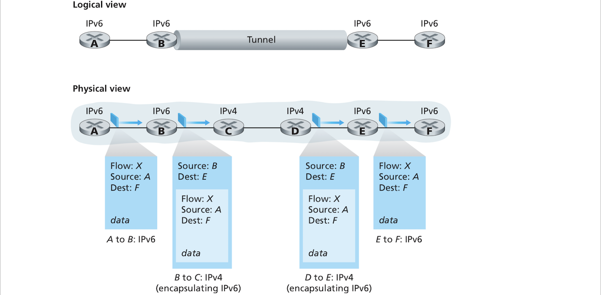
- Basically when two IPv6-capable systems want to exchange IPv6 datagrams but are connected by IPv4 nodes (This intervening set of IPv4 routers is called a **tunnel**), the sending IPv6-capable node simply wraps the IPv6 datagram as a payload inside an IPv4 datagrams. The receiving IPv6 node checks the IPv4 datagram sees if contains an IPv6 datagram. This approach retain all the IPv6 datagram metadata.

### IP Security:
- IP was designed without security in mind, but with the growing dangers in the digital world and rising importance of security, researches has started designing network-layer protocols that are focused on security. One of these protocols is known as **IPsec** which is widely used in so-called VPNs (virtual private network). We will see IPsec in a chapter about [networking and security](security.md)!

## Routing Algorithms:
- We've seen how forwarding is done using forwarding tables. These forwarding tables are built and updated using routing algorithms. One interesting feature of routing algorithms is that they run in a distributed manner where different routers exchange information. 
- The basic job of a routing algorithm is to determine the path from a sender to a receiver, regardless of whether this network is based on datagrams  where the datagrams can take different paths in different instances or on virtual circuits where the path is mostly the same. This needs to be a good path and not any path as there are costs associated with each path such as speed and distance.
- A host is typically attached directly to one router which is called its **first-hop router** or **default router**. The source host default router is called the **source router** while the destination host default router is called the **destination router**. Routing a packet from the source host to the destination host “boils down” to routing from the source router to the destination router. Given a set of routers with links connecting these routers, the goal of a routing algorithm is to find a good path from source router to destination router. A good path is one with the least cost. In reality, however, there are policy issues that also complicate routing such as routers belonging to certain organization not allowing packets from certain organizations to be routed, etc.
- A graph is a good data structure for formulating routing problems. A graph ***G = {N, E}*** is a set of ***N*** nodes and a collection of ***E*** edges where each edge is a pair of nodes from N. In the context of networking, a node represents a router and an edge represents a physical link connecting two routers. The following diagram shows such as a representation:

- The image above shows that edges have costs associated with them. Cost can mean several things such as distance, speed or monetary costs of a link. For our purposes, we will assign random costs to links and we don't have to worry about how they are determined. For any edge ***(x,y)*** in ***E***, we use ***c(x,y)*** to represent the cost of that edge. If the pair ***(x,y)*** does not belong to ***E***, we set ***c(x, y) = ∞***. IN this section we will only consider undirected graphs where the edge ***(x, y)*** is the same as ***(y,x)***. If both ***(x,y)*** belongs to ***E*** then ***x*** and ***y*** are said to be **neighbors**. 
- What would make a good path? Between two nodes in a graph, it's likely that there are multiple paths connecting these two nodes. A good path is basically one with the **least cost**, which in terms of a graph is the minimum sum of the costs of edges that make up a path between the source and destination. If multiple paths are least-cost, then the shortest path (one with least ) is the least-cost path.
- There are two main classes of routing algorithms based on where they are run:
	- A **global routing algorithm** computes the least-cost path between a source and destination using complete global knowledge about the network. It takes connectivity between all nodes and costs of all edges as inputs. This information must be obtained before the calculation takes place. The calculation can take place in one site or replicated over multiple sites. What distinguishes this type of algorithm is that it has global knowledge about connectivity and edge costs. Global routing algorithms are generally known as **link-state (LS) algorithms** because they need to be aware of the costs of each link in the network. 
	- In a **decentralized routing algorithm** calculating least-cost path is done in an “iterative, distributed manner” where no single node has complete knowledge about about the connectivity and costs of all nodes and edges. Nodes begin with a knowledge about only the links directly attached to them and then build from there through an iterative process of calculation exchange of information with their neighbors, they gradually calculate least-cost paths. The decentralized algorithm we will cover in the rest of this section is called **distance vector algorithm (DV)** because “each node keeps a vector of estimates of all the costs
- Routing algorithms can also be classified based on whether they are dynamic and static. In **static routing algorithms**, routes change very slowly over time, usually as a result of human manual intervention. **Dynamic routing algorithms** changes path as the traffic loads or topology changes (whatever that is!!). Routing algorithms can also be categorized according to their load-sensitiveness. Earlier routing used to be load-sensitive reflecting and changing current or recent costs caused by congestion in links, but this no more the case with modern routing algorithms such as RIP, OSPF and BGP.

### The Link-State (LS) Routing Algorithm:
- In a link-state algorithm, the topology of the network and all the link costs are available in advance as inputs to the algorithm. The algorithm itself is run in the node to determine lowest path cost to each one of the other nodes in the network. How does a node obtain this input (network topology + all links)? This is done by having each node in the network broadcast link-state packets to all other nodes in the network. These link-state packets contain the identities of nodes and costs of all their attached links (we will see broadcast algorithms later). The result of this all-to-all broadcast is that each node in the network has a complete knowledge of the network and runs the same least-cost paths to each other node.
- The algorithm used in the Dijkstra's shortest path algorithm but modified to work with a weighted graph and instead of calculating the shortest path, it calculates the least-cost path to a node. Understanding how Dijkstra's algorithm really works requires a little grounding in dynamic programming and it is generally considered was one of the more advanced algorithms operating on an advanced data structure, graphs! 
- Let's just think of Dijkstra's algorithm as a black box that takes all other node identities and attached link costs as an input and gives us the shortest path to each one of the nodes in the network. Less edges separating our origin node from destination nodes does not necessarily mean lower costs as a, for example, 2 links might with costs 1 and 3 form a lower cost path than a single link with cost 5.   

### The Distance-Vector (DV) Routing Algorithm:
- Contrary to the global LS algorithm where a router has global knowledge about all links in a network, **distance vector (DS)** algorithm is "iterative, asynchronous, and distributed". It is:
	+ **Distributed** in that each node receives information from one or more of its neighbors, does some calculations and then distributes information to its neighbors. 
	+ **Iterative** in that the calculations and exchange of information continues until there is no more information to exchange. 
	+ **Asynchronous** in that there is no coordination between the different operating nodes and each node can send information regardless of what some other neighbors or non-neighbors are doing! 
- ***I really don't understand how this works! Will come back later!!***

### Hierarchical Routing:
- So far, we've been talking about the network (e.g. the Internet) as consisting of a collection of indistinguishable routers that run the same algorithms and perform routing in the same way, but this is a very simplistic description of how the Internet works for two reasons:
	- *Scale*: The Internet has many many routers. It is hard to store and process routing information and least-cost path changes if all routers belong to a single network using the same routing algorithm and communicating with all other routers in the network. 
	- *Administrative autonomy*: Organizations maintaining and running their own routers can choose how they run these routers, e.g. they cab choose the routing algorithm or hide aspects of their internal network information from the rest of the Internet. The organization should be able to run its internal network as it pleases while also being able to communicate with other networks. 
- To solve these two problems of scale and administrative autonomy, routers are organized into **autonomous systems (AS)**. An autonomous system consists of a group of routers under the same administrative control (run by the same ISP or belonging to a single company/organization). The routers belonging to an AS run the same routing algorithm. Such a routing algorithm is called an **intra-autonomous routing protocol**. To connect a ASs with each other, one or more routers in the AS have the capability of forwarding packets outside an AS. Such a router is called a **gateway router**. The following diagram shows a group of interconnected ASs:
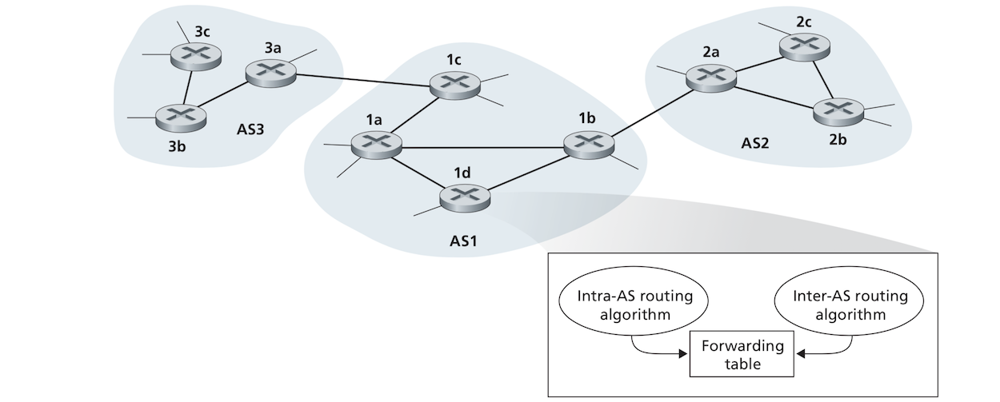
- How can a router within an AS forward a packet to a destination outside the AS? The book claims this is easy if the AS has only one gateway router. A router in the AS will forward the packet to the gateway router through the shortest path (which has already been calculated by the AS routing algorithm), and the gateway will forward the packet outside the AS to another gateway router in an another AS which forwards the packed somewhere inside the new AS. What if an AS has more than gateway routers connecting to multiple other ASs (which it often does)? In such a case an AS must determine which destinations are reachable through each of the ASs directly connected to it with their gateway routers and "to propagate this reachability information to all the routers within" the AS so that each router can configure its own forwarding table to handle addresses outside the AS. An **inter-AS routing protocol** does just this: obtains reachability information from neighboring ASs and propagating this reachability information to routers inside the AS. For two ASs to communicate, they must run the same inter-AS routing protocol. In the Internet, all ASs use the same inter-AS routing protocol, called BGP4 which we will discuss later. As the image above shows, each router receives receives information from an intra-AS protocol and an inter-AS protocol and uses this information to configure its forwarding table. 
- Suppose that a certain destination subnet is reachable through two different ASs directly connected to the current AS. A router needs to cheese which AS to route the packets through. The AS propagates information about all gateway routers, so our router receives both. It determines which gateway to route to by finding the gateway with the shortest path to it (it use the intra-AS protocol to choose between the two gateways and get the one with the shortest AS-internal path). This is called **hot-potato routing** where the AS just wants to get rid of the packet and deliver it to another AS as fast as possible. It then enters this route into its forwarding table.
- An AS also advertises to its neighboring ASs that given subnets are reachable through them (details of exactly when and how haven't been discussed). 
- ASs don't exactly correspond to ISPs. An ISP might consists entirely of a single AS or it might be broken up into multiple interconnected ASs. 

## Routing in the Internet:
### Intra-AS Routing in the Internet with RIP:
### Intra-AS Routing in the Internet with OSPF:
## Broadcast and Multicast Routing: