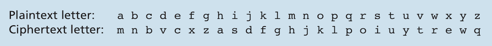

# Security in Computer Networks
## Table of Contents:
## Introduction:
- This chapter will be mainly about secure communication over IP and how to defend it against various types of attacks.
- This chapter will use the famed characters Bob and Alice as two ends of a communication line, and might introduce other characters such as Trudy the intruder. Alice and Bob can be either two routers, a server and a client or two nodes, etc. Alice will be the sender and Bob the receiver, mostly!
- Security can mean a bunch of things, but our focus in this chapter will be about secure communication and security over the network. Topics we will cover include:
	- Communication between Alice and Bob remains secret from busybodies.
	- Bob and Alice are actually communicating with each other, and Trudy is not masquerading as one of them.
	- If communication is tampered with, the tampering is detected.
	- The fundamentals of cryptography, and how cryptography is used to to encrypt communication, authenticate communicators, and maintaining message integrity.
	- How to secure applications, TCP connections, IP and LANs using among cryptography among other things.
	- Organization network security and how it's done through firewalls and intrusion detection systems.

## Network Security:
- **Secure communication** has the following characteristics:
	- **Confidentiality** means only the sender and receiver can understand the meaning of messages they exchange, and no eavesdropper can. This means the messages need to be **encrypted**.
	- **Message integrity** refers to ensuring that a message in transit hasn't been altered either maliciously or accidentally. This is an extension to checksumming, but a more involved one and has to me mainly with security against clever interceptors.
	- **End-point authentication** means the sender and receiver need to first confirm the identities of each other. 
	- **Operational security** is concerned with security in the context of organizations and enterprise networks. Organization networks are prime targets for different types of hacks. To counter such attacks, organizations networks uses *firewalls* and *intrusion detection systems*, which will we see later in this chapter.
- Now that we have an idea about network security, let's have a look at the different ways they can mess with it and exploit it. The following image shows a typical line of communication involving Bob and Alice who exchange data messages and *control messages* (The latter are akin to TCP messages that create or dismantle a connection, but don't carry actual payload). Trudy is an intruder that can do nasty things when the line of communication is not secure.

- Trudy can do the following:
	- **Eavesdropping** which can involve listening to and recording exchanged messages.
	- **Modification, insertion** and **deletion** whole messages or their content.
- Alice and Bob don't necessarily have to be to humans using end systems, but can be devices like routers or switches or anything really!

## Principles of Cryptography:
- Cryptography is a vast field in itself requiring its own book or books. This section will give an overview of important aspects of cryptography and how it's used in networking.
- An important role cryptography plays in secure communication is its role in maintaining confidentiality. Cryptography transforms a message into an unreadable mess that cannot be read by anyone except the receiver of the message. 
- A message in its original form is called **plaintext** or **cleartext**. Alice needs to *encrypt* her message using an **encryption algorithm** before sending it. The encrypted message is called **ciphertext**. 
- Encryption techniques and algorithms are know to everybody, so what is preventing Trudy from breaking Alice's ciphertext if encrypting it is common knowledge? This is the work of so-called keys. Alice, the sender, needs to provide a **key**, ***KA***, which is a string of characters and/or numbers as an input to the encryption algorithm. The encryption algorithm takes the cleartext message ***m*** and the key as inputs, and it outputs the ciphertext as an output. We can represent the ciphertext as ***KA(m)***, which we obtained by encrypting the message ***m*** using the key ***KA***. The Subscript ***A*** refers to Alice. The encryption algorithm is evident from the context. Bob on his part must provide a key ***KB*** to the **decryption algorithm**, which takes the ciphertext and the key to produce the original cleartext message. In other words, Bob decrypts the encrypted message ***KA(m)*** by computing **KB(KA(m)) = m**. 
- There are two types of encryption systems based on the keys:
	- **Symmetric key systems**, where Alice and Bob's keys are identical and are also secret.
	- **Public key systems**, where each of the two, Alice and Bob, has two keys, a private key known only to its owner, and a public key known to everybody else.
- We will go into more details on how these two types of keys work.

### Symmetric Key Cryptography:
#### Caesar Cipher:
- All cryptography involves changing cleartext into a different text using a key. One of the oldest and simplest symmetric key algorithms is the so-called **Caesar cipher**. The Caesar cipher involves shifting each letter in the alphbet by ***k*** positions and allowing for wrap around, meaning the alphabet is a kind of a ring where *z* is followed by *a*. E.g. If we use ***k = 3 *** as our key for Caesar cipher *a* becomes *d*, *b* becomes *e*, *z* becomes *c*, etc. If you know that Caesar cipher is used, it is very easy to break messages encrypted with it because there only 26 letters in the English alphabet.

#### Monoalphabetic Cipher:
- An advanced version of the Caesar cipher is the **monoalphabetic cipher**, which instead of shifting characters by by a uniform ***k*** value, each substitutes another arbitrary letter, but each must have a unique substitute letter, as the following figure shows:

- A monoalphabetic cipher is much more robust than a regular Caesar cipher, as brute force breaking it will require 26! or (1026) attempts.
- This cipher can however be broken using statistical analysis of letter frequencies. Letters 'e' and 't' occur very frequently. Some other grouping of letters like 'ion', 'ing', and 'the' occur very frequently. If the intruder has some knowledge about the content of the messages such as the names 'Bob' and 'Alice', it would be even easier to break such ciphers. The more the intruder can correctly guess of the these letters and groupings of letters plus the ancillary information about the message contents, the easier it become to brute force the rest. 
- Based on what and how much information the intruder can obtain about a monoalphabetic cipher, she can break the code in one of three ways:
	- *Ciphertext-only attack* happens when the intruder has no external information about the intercepted message except what can be derived from statistical analysis
	- *Known-plaintext attack* happens when the intruder knows some plaintext-ciphertext pairings, like If Trudy knows that 'Alice' and/or 'Bob' for sure occurred in the messages. This can be more severe if Trudy records all the intercepted messages, and then discovers a plaintext version of one of these ciphertexts. This would allow her to know a bunch of letters and then easily break the code.
	- *Chosen-plaintext attack* happens when the intruder decides a plaintext and somehow gets its ciphertext. If Trudy somehow tricks Alice to send "The quick brown fox jumps over the lazy dog" to Bob, then Trudy has managed to completely break the code.

#### Polyalphabetic Encryption:
- Polyalphabetic encryption is also an improvement on monoalphabetic cipher. It uses multiple monoalphabetic ciphers for different letters based on their positions in the text. Take the following figure as an example:

- The figure above has two Caesar ciphers (***k = 5***, and ***k = 19***). We can use the two Caesar ciphers ***C1*** and ***C2*** in a certain repeating pattern such as ***C1, C2, C2, C1, C2***. ***C1*** uses ***k = 5***, and **C2** uses ***k = 19***. What results from this is that the same letter in the ecnrypted messages have different meanings based on its position. *Genius!* This is especially resilient to statistical analysis, it seems. 

#### Block Ciphers:
- Symmetric keys are still used today. Today, two types of symmetric-key based encryption schemes exist, **stream ciphers** which we will see later, and **block ciphers** which we will look at now. Block ciphers are very important in network security. They're used by IPsec, TLS (SSL at the time of the writing of the book) and PGP.
- Block ciphers seem a little similar in principle to monoalphabetic ciphers. In this cipher, a message is processed in blocks of ***k*** bits, and each block is mapped to a different block of ***k*** bits. If we have ***k = 3***, we use a one-to-one mapping that maps 3-bit blocks of plaintext to 3-bit blocks of ciphertext as the following table shows:

| Input | Output |
| --- | --- |
| **`000`** | **`110`** |
| **`001`** | **`111`** |
| **`010`** | **`101`** |
| **`011`** | **`100`** |
| **`100`** | **`011`** |
| **`101`** | **`010`** |
| **`110`** | **`000`** |
| **`111`** | **`001`** |

- These 3 bits can represent ***23 = 8*** pieces of informations. There are ***8! = 40,320*** possible mappings with these 3 bits. Each one of the 8 mappings shown in the table above is a key that Alice and Bob can use to encrypt and decrypt the exchanged messages.
- 3-bit block mappings can be easily cracked, but larger blocks such as 46-bit blocks are extremely hard to crack. The problem, though, with large blocks is that they require really huge tables of predetermined mappings which is unfeasible.
- The alternative is to "use functions that simulate randomly permuted tables." The following figure shows how one of such functions work. The function first divides a larger block of 64 bits into 8 smaller bits of 8-bit length each. Each 8-bit block is mapped using an 8-bit to 8-bit table (just as we described earlier, *28 = 256* is a manageable table size). These 8 8-bit chunks are then reassembled into a new 64-bit block. (*Not very clear, but it says: "The positions of the 64 bits in the block are then scrambled (permuted) to produce a 64-bit output"* :confused:). This 64-bit output is then fed back to the function and another cycle begins. After *n* cycles, the function outputs the final ciphertext. The repeated rounds affect most if not all the bits of the original 64-bit input. If we apply only one round to the cleartext, that would only affect only 8-bits groupings within the 64-bit block and it would be easy to crack it. The key to this ciphertext is the 8 8-bit mapping tables, and the scramble function is publicly known.

- Popular block ciphers in use today include *data encryption standard (DES)* and *advanced encryption standard (AES)* which are very hard to crack.

#### Cipher-Block Chaining:
- The problem with block ciphers is that they are used to encrypt messages containing repeated patterns such as `HTTP/1.1`. Malicious actors can exploit this knowledge and other pieces of knowledge about the messages and might even be able to crack the whole message. 
- The solution to this problem is to mix in some randomness into the ciphertext to allow identical plaintext blocks to produce different ciphertext blocks. 
- Some random numbers are generated and combined with the ciphertext to scramble identical patterns in the message.
- *I won't into more detail! Cryptography needs its own book, and maybe someday I'll read one! For the moment, we at least have a general idea about how how symmetric-key encryption works and some of the challenges it needs to respond to.*

### Public Key Encryption:

## Message Integrity and Digital Signatures:
## End-Point Authentication:
## Securing E-Mail:
## Securing TCP connection with TLS/SSL:
## Network Layer Security, IPsec and VPNs:
## Securing Wireless LANs:
## Operational Security, Firewalls and Intrusion Detection Systems: