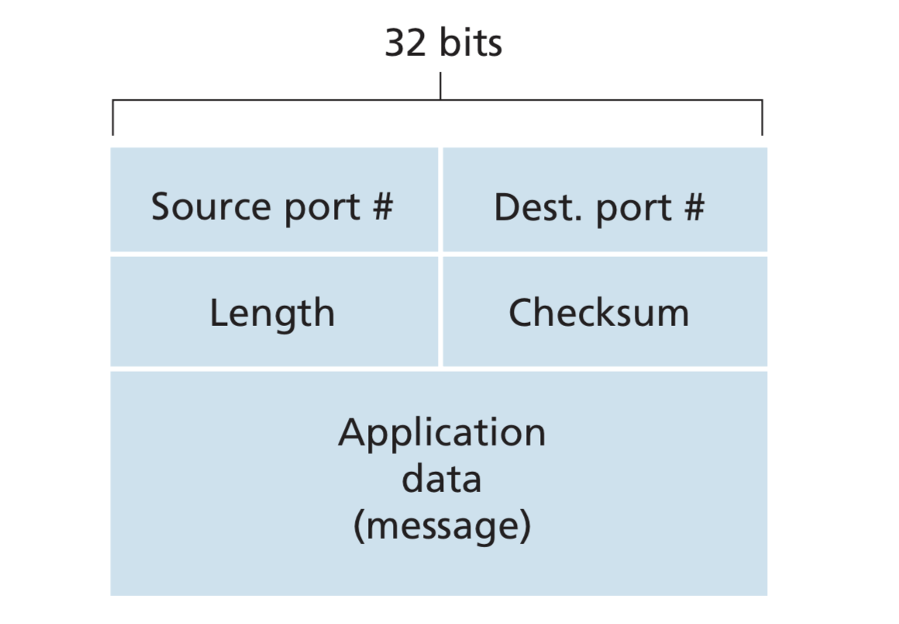
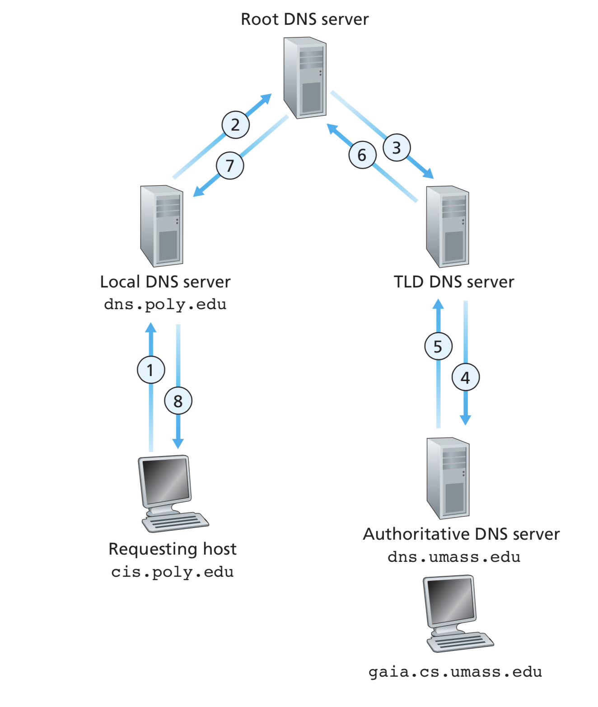
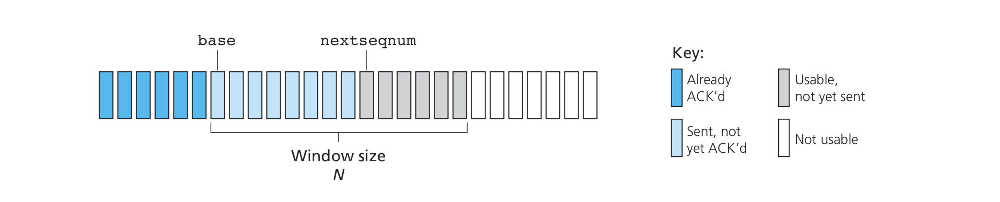
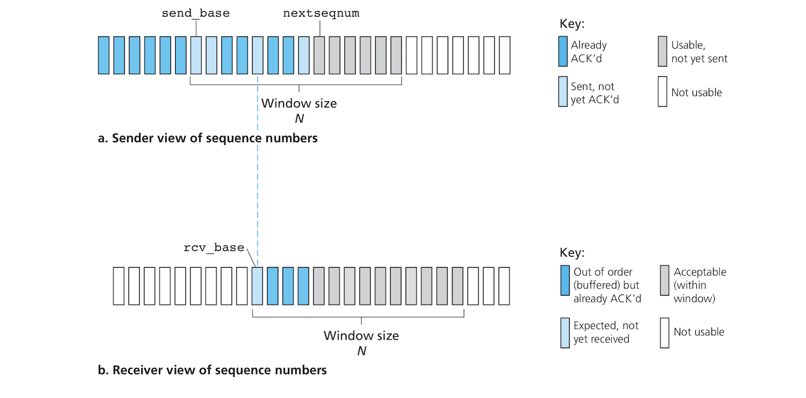
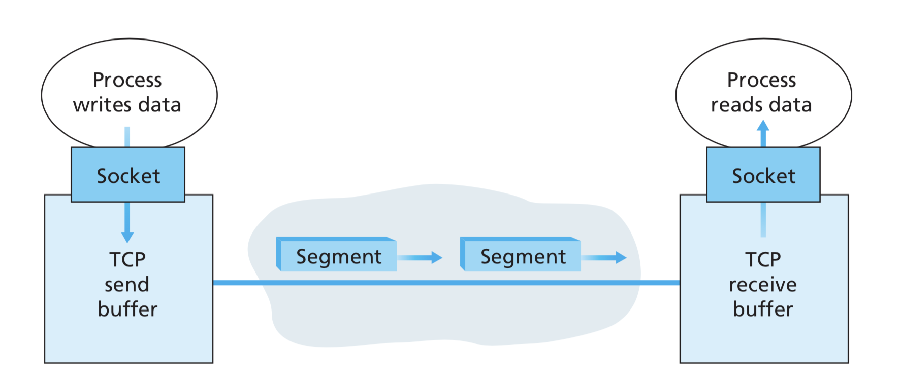
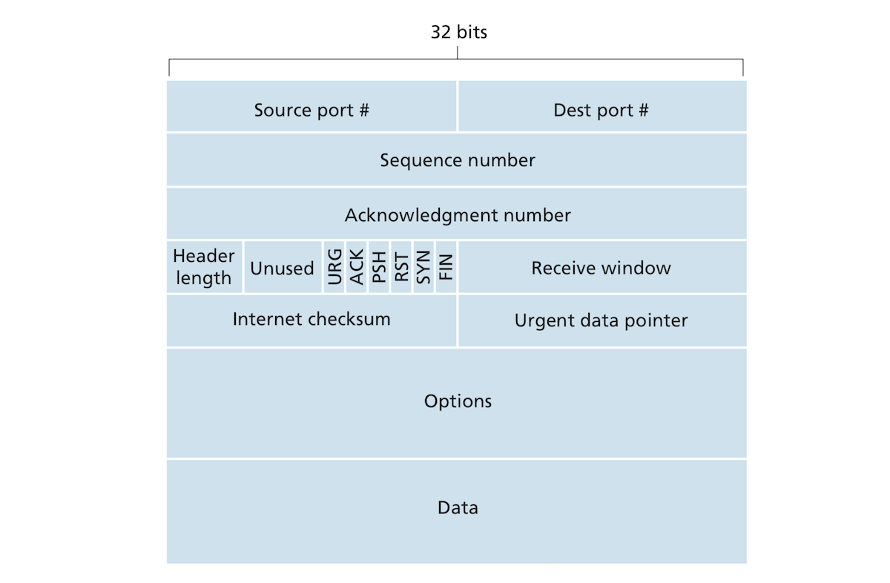
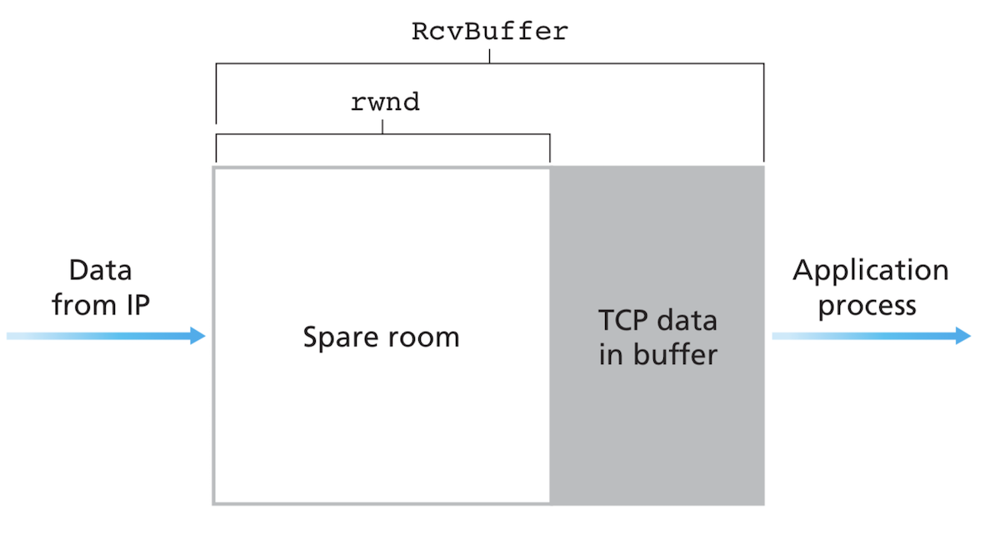

# Transport Layer:
- This article will be on the **transport layer** which is responsible for transmitting data between different processes in the layered network architecture. It will discuss the principles of transport and how these are implemented in actual protocols (specifically **UDP** and **TCP**).
- The article will discuss the following topics in order:
	+ The relationship between the network and transport layer and how the transport layer extends network layer's function of connection different hosts to actually connecting different processes running on these hosts. This part will also include a discussion of UDP as a basic transport protocol.
	+ This part will discuss how can data be transferred reliably between different processes residing in different hosts. A deep discussion of TCP will supplement the topic of data transfer reliability.
	+ A discussion of congestion, it's causes and ways to control it. This discussion will also involves TCP's specific techniques of congestion control. 

## Transport-Layer Services, an Intro:
- The transport layer provides *logical communication* between processes running on different end systems: this enables "connecting" the two processes even though they are running in different that might be geographically distant from each other. Thanks to the transport layer protocols, the processes communicate with each other without having to worry about the physical realities of the network or the hosts they run on. 
- How does the transport layer relate to the layers immediately surrounding it? When a process in the application layer pushes a messages down to the transport layer, the messages get sliced into small chunks to which transport headers are added to create transport layer **segments**. The segments themselves are passed down to the network layer where network headers are added to them to create **datagrams**. The datagrams are transported through the network from the current host. Before reaching the destination host, the datagrams are examined by routers which direct them toward their final destination. Routers don't understand transport segments but are only concerned with datagram headers where they have information for routing packets. Once a datagram arrives to the destination host, segments are extracted and pushed up to the transport layer. The transport layer processes the segments, probably reassembles back into messages, and pushes them up to the destination process.

### Relationship Between the Transport and Network Layers:
- While the transport layer provides logical communication between processes, the network layer provides logical communication between hosts. The difference between the two layer as in as far as being mechanisms from transmitting data from one end to the other is subtle but crucial. If the network is the mail service that move letters and packages between different buildings, let's just say the transport is some kinda secretary who also distributes mail within a building.
- The transport layer is constrained by the network layer. The bandwidth and delay guarantees that transport can provide to applications are constrained by the bandwidth and delay guarantees provided to it by the network layer. 
- The transport layer can, however, provide services that make up for the shortcomings of the network layer's services. The transport layer can provide the ability to transfer data reliably between different processes even though the network layer usually corrupts, drops and duplicates packets. The transport layer can also provide encryption which the network layer can't do.

### Transport Layer in the Internet, an Overview:
- The Internet and any typical TCP/IP network provide two main transport protocols: **UDP**, an unreliable, connectionless protocol and **TCP**, a reliable connection-oriented protocol. 

#### IP:
- The Internet's network layer's protocol is called **IP (Internet Protocol)**. IP is the protocol that provides logical communication between hosts connected to the Internet. It is a **best-effort delivery service**. IP tries its best to deliver packets but it *makes no guarantees*. IP might:
	* Lose segments.
	* Fail to provide orderly delivery of segments.
	* Fail to guarantee the integrity of the data in the segments. 
- IP is an **unreliable service**. 
- Every host must have a *unique IP addresss*. 

#### Internet Transport Protocols:
- The most important service provided by UDP and TCP is to extend IP's delivery service between two hosts into a a delivery service between processes. Elevating the host-to-host delivery to a process-to-process delivery is called **transport-layer multiplexing/demultiplexing**. 
- Another important service TCP and UDP provide is *integrity checking* which is done by including error checking fields in segment headers. 
- TCP, unlike, UDP goes further to provide **reliable data transfer**. TCP ensures data is delivered from the sending process to the receiving process correctly and in order. 
- TCP also provides **congestion control**.

## Multiplexing and Demultiplexing:
- Multiplexing/demultiplexing basically refers to extending the network's host-to-host communication to the transport's process-to-process communication. How does the transport layer sort the segments it receives from the network layer and direct each one to the appropriate process? 
- The transport layer doesn't deliver data to a process directly but uses an intermediary *socket*. Each socket has a unique identifier. When the transport layer receives a segment from the network layer, it examines the segment's header fields to identify the receiving socket. **Demultiplexing** refers to delivering a segment to the correct socket. **Multiplexing**, on the other hand, refers to the process of gathering data packets from different sockets, wrapping them with transport headers to create segments, and sending them down the stack to the network layer. 
- The **source port number field** and **destination port number field** are the unique identifiers which indicate which socket a segment is to be delivered to. A port number is a 16-bit value whose value could be between 0 and 65535. Port numbers between 0 and 1023 are **well-known port numbers** which are reserved for well-known application protocols such HTTP, FTP, etc. 
- Each socket has a port number assigned to it. When the transport layer receives a segment, it checks its designation port number and directs it to the socket with the same port number. The segment data is then passed up to the socket's process. This is roughly how it's down in UDP but TCP is kinda more complex. The following subsections will discuss how multiplexing/demultiplexing in UDP vs TCP.

### Connectionless Multiplexing and Demultiplexing:
- I don't understand why these guys keep repeating the same themselves!!!!
- When a socket is first created, the transport layer assigns a port number between 
1024 and 65535 to it or the developer pre-assigns (*binds*) a specific port to it. You might notice that server sockets are assigned specific port numbers by the developer, while client sockets are automatically assigned port numbers by the transport layer. 
- Once a socket has a port number assigned to it, it can start sending and receiving application data to and from another socket. The transport layer now takes application data, add a destination	port number and a source port number to it and some other header data. It then passes the segment to the Network layer which adds own headers and sends the datagram. The reverse of this operation is done on the receiving host: a segment is extracted from the datagram, pushed up to the transport layer, the transport layer examines the destination field of segment and directs the data to the appropriate process (the segment is demultiplexed).
- A UDP socket is identified by a two-tuple consisting of an IP address and a port number. Segments arriving to the host whose *destination* IP addresses and *destination* port numbers both correspond to the UDP socket's IP address and port number will be directed to that socket.
- The *source* port number in a socket doesn't have a role in identifying a segment, but serves the "return address". While clients are aware of the server's socket's address even before they first communicate with it, but the server doesn't have a "pre-knowledge" about the clients it serves. To keep track of the clients and reply to their messages, it extract their source port numbers and add incorporate them into the destination addresses (IP addresses and port numbers) of the segments they send to these sockets/processes.

### Connection-Oriented Multiplexing and Demultiplexing: 
- One important difference a TCP socket and UDP	socket is that the TCP socket is identified by a four-tuple, namely: the source IP address, the source port number, the destination IP address, the destination port number. The host uses all 4 values to direct a segment toward the appropriate socket. Unlike UDP where only the destination IP address and destination port number are used to direct a segment to a socket, TCP does also use the source IP address and port number for such a task. Two segments that share the same destination information but have different source information will be directed to different sockets (except for a TCP segment carrying the original connection-establishment message). 
- Why do we need all 4 pieces of information for TCP instead of just 2 like UDP? Remember the server creates one TCP connection for each one of its clients? There might be multiple clients connecting to the server all at once. Each connection has its own socket the four fields are used to identify these different clients and demultiplex data correctly. You can think of all 4 pieces of information as some kind of state that the server keeps about the client during the lifetime of a connection, that is the life time of application message transmission. If we think of a a connection as a pipe, then we need to look at all those four fields because they tell us something about where the pipe starts and where it ends.

### Web Servers and TCP:
- All segments received by a web server go to port 80. Both the connection-establishment segments and message carrying segments are directed to port 80. However, segments are distinguished by their source IP addresses and source port numbers. 
- High performance web servers like Apache, don't spawn a new process for each connection. Instead, they run only one process but spawn a new thread with a connection socket for each client. Threads are lightweight and cheaper than full-blown processes. 
- *A reminder*: Non-persistent HTTP might wreak havoc in a server as they require the opening and closing of much more connections with all the bloated unnecessary overhead. 

## Connectionless Transport with UDP:
- UDP is a minimal transport protocols. It provides the bare minimum that transport can provide. The network layer is not enough for applications running on different hosts to talk to each other. The network layer can transmit packet from machine to machine, but a minimum, applications also need multiplexing and demultiplexing to direct packets to the appropriate applications. UDP does just that and some error checking! It's as minimal as a transport protocol can be. It's as if the application is talking directly to IP. 
- Several applications reply on UDP rather than TCP such as DNS. A DNS client sends its queries through UDP and if it doesn't get a reply, it either resends the query or informs the application that it didn't get a reply.
- Why would an application use UDP over TCP in spite of all the reliability provided by TCP? There a few reasons for doing so:
	+ *Finer control over what data the application sends and when*: When data is passed from the application to the transport layer, it's wrapped in a UDP, then in IP and then sent immediately. TCP interferes with the timing as it implements a congestion control which slows packet transmission. TCP will also tirelessly resend the packet long after it was supposed to be sent. Real-time applications are time sensitive and can tolerate some data loss, so they prefer UDP which is usually faster than TCP. It's possible that applications implement additional functionality that makes up for the shortcomings of UDP.
	+ *No connection establishment*: The lack of the three-way handshake needed for a connection eliminates much of the delay and overhead TCP suffers from. DNS would be a nightmare if it were built on top of TCP. 
	+ *No connection state*: TCP keeps state through the lifetime of a connection and several pieces of data have to be exchanged and kept in sync between the two end systems communicating over TCP. This state burden is not present in UDP, making lighter and faster. 
	+ *Small packet header overhead*: TCP has 20 bytes of header overhead while UDP has only 8.
- The general common sense on why to favor UDP to TCP is if you can tolerate some data loss and want a faster data transmission, go for UDP. Internet phone and teleconferencing prefer UDP. Streaming multimedia has for a while relied more on UDP, but as the Internet infrastructure is getting better, TCP is increasingly replacing UDP in streaming. 
- Using UDP for streaming is controversial because of the lack of congestion control. UDP can flood the network and doesn't care if the network is congested leading to the loss of data and turning the network useless for everybody. Some suggest forcing all end system to participate in the congestion control effort including those sending UDP packets.
- Applications can communicate reliable over UDP if they implement their own application-level reliability mechanisms (they can take care of retransmission and all). They might not do congestion control, however which leads to the same problems discussed in the previous paragraph.

### UDP Segment Structure:
- The following figures how a UDP segment is structured:

- The UDP segment data payload goes into the **data field**
- The UDP header has 4 fields. Each field is 2 bytes in length. 
	+ **Source port number**: Used as a return address.
	+ **Destination port number**: Allows the segment to demultiplexed. 
	+ **Length**: Is the total length of bytes in the segment (both the data and the header). It's needed because segments can differ in length.
	+ **Checksum**: Used by the receiving end system to check if errors have been introduced to the segment while in transit. 

### UDP Checksum:
- The checksum is used to detect errors. A packet might get corrupt while in transit because of noise or in the routers, etc. The sender calculates the checksum and adds it to the segment.
- THe checksum is obtained by performing the 1s complement of the sum of all the 16-bit words in the segment with any overflow wrapped around. Let's say we have a segment with the follow 3 16-bit words:
	**0110 0110 0110 0000**
	**0101 0101 0101 0101**
	**1000 1111 0000 1100**
- Let's first add all the three words. With wrapping the overflow around we get the following result:
	**0100 1010 1100 0010**
- Doing the 1s complement on this value (inverting 0s to 1s and vice-versa) results in the checksum which is:
	**1011 0101 0011 1101**
- The checksum is placed in the checksum field and the segment is sent. The receiving host calculates the sum of the segment including the checksum. Since the checksum is the sum of segment bits inverted, the result must be **1111 1111 1111 1111** for the segment to be deemed correct. If there is any 0s in this number, that means the packet has been corrupted. 
- The data link layer also provides some form of data checking for packets, which makes the transport layer error checking kinda redundant. In fact, the link layer is not error proof. Only some link layer protocols like Ethernet provide error checking and some others do not. Moreover, even errors are checked through a link, bits can be corrupted in router memory (error checking is only done over single links and not end to end). What makes transport layer error checking, including the one used in UDP, is its *end-end* nature.
- Although UDP provides error checking, it doesn't do anything to mitigate or recover from such errors. Some implementations of UDP discard corrupt segments, while other pass warnings with segments to the application. 

## Principles of Reliable Data Transfer:
- *Reliable data transfer* is one of the most important issues in networking. Reliable data transfer means that no transferred data may be corrupted, lost or arrive out of the original order they were in before being sent. 
- Before jumping to discussing TCP, we will first try to build an increasingly more complicated data transfer reliability protocol of our own and discuss the general principles of data transfer reliability along the way. 
- This framework will recover from packet corruption and packet loss. We will assume packets will be received in order so we don't have to deal with packet ordering just to make things simple. We will also assume we have a unidirectional data channel between the two hosts with a machine that only sends data and another machine that only receives data, again, to simplify things!! 
- The following figure shows the general structure of our rdt (reliable data transfer) framework:

- Our framework is composed of the following functions:
	+ **`send()`** gets invoked from the application layer. It sends data through the channel.
	+ **`rcv()`** gets called when a packet arrives from the network. 
	+ **`data_deliver()`** delivers the data received (reliably?!!) to the application layer.
	+ **`udt_send()`** is used to exchange control data between the two hosts bidirectionally. This channel is unreliable. udt stands for *unreliable data transfer*. 

#### RDT Over a Channel with Bit Errors:
- Imagine that we have a channel which transmits all packets but bits within the packets can get corrupted for a variety of reasons mostly at the physical layer: waves interference, electric interference, etc. 
- To ensure reliability on a transport protocol that sits on such bit-messing channel, the two communicating hosts can implement an *acknowledgments* mechanism that informs them of the status of transmitted packets. When the receiver receives a packet correctly, it can notify the sender that everything is OK through a **positive acknowledgment**. When the received packet is corrupted, the receiver notifies the sender that the packet has been corrupted and needs to be retransmitted! The protocols that perform such retransmissions are called **ARQ (automatic retransmission reQuest)** protocols. Such protocols must have the following capabilities:
	* *Error detection*. This is basically the *checksum* operation we've seen in UDP.
	* *Receiver feedback*. The receiver can tell the sender if it received a corrupt or intact packet with a positive acknowledgment (*ACK*) or a negative acknowledgment (*NAK*). A single bit can be used to represent acknowledgment, so might use 1 for an ACK and a 0 for a NAK.
	* *Retransmission*. Packets with corrupt bits are resent to receiver.
- How does this scheme transmits data reliably?! When our framework receives data from the application using it, it encapsulates the data in a packet, performs a checksum, add the checksum to the packet and sends it. After sending the packet, it waits for an acknowledgment form the receiver (an ACK or a NAK). If an ACK is received by the sender, it goes back to waiting for more bits to be handed down to it by the application. If the sender receives a NACK, however, it resends the packet. 
- This framework can't accept data from the application while it is engaged in sending and resending a packet. It can only start processing application data again after it has finished sending the packet correctly. This behavior is called **stop-and-wait**. 
- The receiver sends back an ACK or a NAK depending on if the packet hasn't been altered in transmission. 
- This scheme might seem great, but it's actually deeply flawed. How does the receiver know if the ACK/NAK is not corrupted? Acknowledgments can get corrupted as well. We can add checksums to acknowledgment packets, but how can the framework recover from a corrupt acknowledgment packet? The following 3 scenarios might be thought of as solutions to the this problem:
	1. If the sender receives a corrupt acknowledgment packet, it can send an acknowledgment message of its own asking the receiver to resent the acknowledgment, but what if the sender's acknowledgment packet itself arrives corrupted to the receiver? The receiver in this case has to ask for another acknowledgment!!! This is a real mess and can easily descend into an abyss of acknowledgment exchange! 
	2. *Add enough checksum bits to allow the sender to both detect and recover from bit errors*. I don't know exactly how this would be done!!!! Anyways, provided that this succeeds, this framework can now recover from corrupt packets but not from dropped packets.
	3.  The sender can also simply resend the packet when it receives a garbled ACK/NAK from the receiver. This will result in **duplicate packets**. The problem with duplicate packets is that the receiver doesn't know if its ACK/NAK has been garbled, so it doesn't know if the received packet is a new one or a duplicate.
- The 3rd scenario seems like a promising one. One sure way to distinguish between a new and a retransmitted packet is to add a **sequence number** to each packet. If two packets have the same number, the second one is a retransmission (this is actually used in TCP). Because we are using a stop-and-wait protocol, there is only one packet to handle at a time. A 1 bit sequence is enough in this case (an arithmetic modulo-2 which results in either 0 or 1). The ACK/NAK packets don't need sequence numbers because we are assuming our framework doesn't drop packets. When the sender receives an ACK/NAK, it knows this was a response to the last packet it has sent.
- Packets can arrive out of order to the receiver which causes acknowledgment packets to confuse the sender. The sender has no idea which packet an ACK/NACK packet is associated with if these are not in order. To solve this problem, we can attach sequence numbers to the ACK/NAK packets to keep them in sync with data packets. 
- This is slowly starting to feel and act like TCP.

#### Reliable Data Transfer over a Lossy Channel with Bit Errors: 
- A more realistic channel does also *lose/drop packets* in addition to corrupting bits. How would our framework detect and recover from packet loss? Recovering from  packet loss can be done with the use of a combination of checksumming, sequence numbers, ACK packets and retransmissions! Detecting packet loss requires a new technique.
- There are many ways to detect and recover from packet loss. We will make the sender responsible for this task!
- If either the data packet from sender or the ACK packet from the receiver is lost, the sender will not receive an ACK back. The sender can simply wait for certain period and then resend that packet. How long should the sender wait to make sure a packet is still in transit and hasn't been dropped? Ideally or hopefully, the sender should wait at least a round-trip worth of delay before retransmitting the packet, but the network fluctuates and there is no way the sender can tell with certainty. The retransmission should also happen fast for our framework to be usable! The sender should choose a timeout period "judiciously", after which it resends the packet. The packet might be still in transit and hasn't been lost which will result in a duplicate packet. This shouldn't be a big deal as our framework already knows how to recover from duplicate packet issues through the use of sequence numbers.
- Retransmission is a general remedy for several possible problems: either the data packet has been lost or is taking too long, or the ACK packet is lost or taking too much time. For our time-based retransmission, the sender should be able to implement a **countdown timer** that interrupts the sender, triggering a retransmission! The sender needs the countdown timer to start each time a packet is sent, respond to the timer's interrupts and stop the timer.

### Pipelined Reliable Data Transfer Protocols:
- The stop-and-wait is a very limited framework!! Its **utilization** (how much it uses of the network resources it has access to) rate is very low It doesn't take full advantage of the network's capacity and so much time is wasted to transfer just one packet. Why should you wait for a single packet to be transmitted at a time when you could transmit many many more?
- The solution to this problem is **pipelining** which refers to the act of sending multiple packets before waiting for acknowledgments. This substantially increases the utilization of the sender.
- Pipelining has some ramification which include:
	* The range of sequence numbers must increase since there are multiple packets in transit at any time.
	* The sender and receiver must buffer multiple packets, especially unacknowledged transmitted packets in the sender.
	* The range of sequence numbers and buffer requirements depend on how the framework responds to lost, corrupt and delayed packets. Pipelined error recovery can be done in one of two ways: **Go-Back-N** and **Selective Repeat**.

### Go-Back-N (GBN):
- In a Go-Back-N protocol, the sender is allowed to send multiple packets at a time without waiting for an acknowledgment, but is constrained by a maximum number N of unacknowledged packets in the pipeline!
- The following figure shows the the sender's view of sequence numbers in GBN:

- In the figure above the **`base`** is the sequence number of the oldest unacknowledged packet and **`nextseqnum`** is the smallest unused sequence number (the number of the next packet to be send). Using these two numbers, we can divide totality of the container of packets (I guess it's the buffer we talked about earlier) into 4 regions:
	+ **`[0, base - 1]`**. The sequence numbers in this range are of packets that have been sent and acknowledged.
	+ **`[base, nextseqnum -1]`**. These packets have been sent but not acknowledged yet.
	+ **`[nextseqnum, base + N - 1]`**. Used for packets that can be sent immediately
	+ Packets with sequence numbers greater than or equal to **`base + N`** can't be used until an unacknowledged packet (the packet whose sequence number is **`base`**) is acknowledged.
- If you look at the figure above carefully, you will see that the **`N - base`** is some of sort of a sliding window that contains sent but unacknowledged sequence numbers and a space of permissible sequence numbers that can grow and shrink depending the situation. This window slides forward over the sequence numbers and N is called the **window size**. The GBN protocol is considered a **sliding-window protocol**. Imposing the sliding window constraint on an RDT protocol has several benefits such as aiding in congestion control as we will see later.
- The sequence number of a packet resides in a fixed-length header field. The range of possible sequence numbers is limited by the length **`k`** of such field. The range of sequence numbers then is **[0, 2k - 1]**. All arithmetic involving sequence numbers must be done with modulo **2k** because we can't have a number larger than **2k - 1**. The sequence number space is a ring of size **2k** where  **2k - 1** is immediately followed by a **0**. TCP has a 32-bit sequence field where sequence numbers count bytes instead of packets!! Hemm, interesting!
- How will our RDT framework work using the GBN paradigm? We will remove NAKs and keep ACKs only!
- When our RDT framework is called by the process residing in the application layer, it checks if the window is full. If it's not full, it creates a packet, sends the data and updates the `nextseqnum`. If it's not full, it returns the data up to the application. The application tries to send the data later. The sender might buffer the data when the window is full or it might have a flag to notify the application that it's and can't accept bits until the flag is removed.  When the sender receives an ACK, it takes it as an **cumulative acknowledgment** meaning that considers all the packets up to  and including the packet with this last sequence number are acknowledged. The base is updated to include this last sequence number. Our GBN RDT also uses a timer that runs for every sent packet that has been sent but not acknowledged yet. In the case of a timeout because a packet is lost or its acknowledgment is delayed, the framework will resend it. GBN takes its name from the fact that it retransmits packets (Go-Back-N).
- The receiver's job is even easier. If it receives a intact packet that is in order, it sends the packet's payload up to the application. Otherwise, the receiver discards the packet and resends an ACK for the most recently received in-order packet. Keeping things in order is in alignment with the *accumulative acknowledgments* we talked about earlier. This means that the receiver discards every packet it receives out of order. This seems wasteful, but it's actually useful because it's simple. The receiver needs only keep track of the next in-order packet's sequence number. The sender does the bulk of the work but it's also rewarded every acknowledgment it receives back will be in order making it easier to move its sliding window.
- TCP uses many of the techniques we used in GBN. 

### Selective Repeat (SR):
- GBN fills "the pipeline". Many unacknowledged packets can be in the pipeline especially when the bandwidth-delay and window size are high for one reason or another. In this case, a single error in some packet may cause the retransmission of many packets.
- **Selective repeat** avoids unnecessary retransmissions by retransmitting only the packets it suspects have been corrupted or lost. This requires the receiver to also do more work than in the case of GBN. It needs to individually acknowledge all the correctly received packets regardless of the order they've arrived in. 
- An SR sender does also have a window that limits the number of sent but unacknowledged packets in the pipeline, but this window also contains acknowledged packets. The SR sender differs from the GBN sender in that each packet has its own timer. It also differs in how handles the pipeline's window and packet acknowledgments. When it receives an ACK, it marks the packet associated with that ACK that is inside the window as received. If the ACK equals the **`send_base`** as in the figure below, the sliding windows moves forward to the unacknowledged packet with the smallest sequence number. 

- As for the receiver, it will acknowledge correctly received packets even if they are come out of order. out-of-order packets are buffered until any missing packets (packets with lower sequence numbers) are received. when the lower indexes of the buffer are filled with the missing packets, the buffer content is delivered as an ordered batch of packets to the application.
- The receiver might have to re-acknowledge some packets to allow the sender's window to slide forward (these are the packets whose sequence numbers are in the range **` [rcv_base-N, rcv_base-1]`**. This is mainly caused by the fact that the sender and receiver don't always have an identical view of what has and hasn't been correctly. a delayed packet might. The receiver might advance far but the sender's window won't move forward without receiving acknowledgments for packets it sent.
- The window size must be equal to or less than half the sequence number space to avoid problems associated with the window not being able to distinguish between two packets that have the same sequence number.

## Connection-Oriented Transport with TCP:
- The TCP protocol relies on many of the principles and techniques we described in the previous section.

### The TCP Connection:
- TCP is **connection-oriented** in the sense that before two processes can start sending data to each other, they must first *handshake* each other, i.e. send preliminary segments to "establish the parameters of the ensuing data transfer".
- TCP lives entirely in end systems and intermediate network equipment such as routers and link layer switches are entirely oblivious to its existence and don't keep a TCP connection state. 
- TCP is **full-duplex** meaning that data flows bidirectionally between two processes running in two different machines.TCP is also a **point-to-point** rather than a *multicasting* protocol. Only two processes can engage in a TCP connection.
- How is a TCP connection established? When a client process wants in some host wants to initiate a connection with a server process in another host, it informs the transport layer in the server host of its wish to connect. TCP in the client then starts establishing a connection with TCP in the host. 3 special segments are exchanged between the two: the client sends the first one, the server sends the second segment, and the client sends the third one. Te first two segments have no payload (application data), but the third segment might have a payload. TCP is a **three-way handshake** protocol, since it requires 3 segments to establish a connection. 
- Once the connection is established between the client and server processes, the client passes down through the socket to TCP. TCP in the client then passes this data to the connection's **send buffer**. TCP also grabs data from the send buffer from time to time and passes it down to the network layer. TCP can send data to the network layer "at its own convenience". 

- The maximum data that can be grabbed from the buffer and stuffed in a segment is limited by the **maximum-segment size (MSS)**. The MSS size itself is limited by the largest link-layer frame that can be sent by the sending host which is called the **maximum transmission unit (MTU)**. The MSS refers to the amount of application layer in a segment not the size of TCP segment. The payload is added to the TCP/IP header (is this a TCP header for the segment and an IP header for the datagram??!!) which is 40 bytes in length to reach the MTU. Ethernet and PPP link-layer protocols have an MSS of 1500 bytes.
- The receiving host has receiver buffers where received segments are placed for later processing.

### TCP Segment Structure:
- The following figure shows how a TCP segment is structured:

- A TCP segment has several header fields and a data field. The data field has a chunk of application data that is limited by the MSS. When a large file like a JPEG image is sent with TCP, it is broken into chunks of MSS size, except for the last chunk which is most probably smaller than MSS. Interactive apps such Telnet packs only a very small amount of data in a segment, as little as 1 byte, probably for performance.
- The TCP segment header has the following fields:
	* A **source port number** and a **destination port number**, the same as UDP.
	* A **checksum** field for checksumming.
	* A 32-bit **sequence number** field and 32-bit **acknowledgment number** field which are used to establish reliable data transfer (as we will see later).
	* A 16-bit **receive window** field used to indicated the number of bytes the receiver is willing to accept. 
	* A 4-bit **header length** field which specifies the length of the header fields in 32-bit words. The TCP header length can be variable because of the optional *options* field which is usually empty making the header length 20 bytes in length. 
	* An optional and variable-length **options** field that can be used to negotiate the MSS between the sender and receiver and some other things!
	* The **flag** field is 6 bits in length and contains the following flags. The **ACK** bit indicates that the acknowledgment field is valid, meaning that the current segment contains an acknowledgment for a segment that has been successfully received. The **RST**, **SYN** and **FIN** are used to setup and a teardown a connection. The **PSH** bit indicates that the receiver should pass the data up to the application layer immediately. The **URG** bit indicates that the segment contains data marked by the sender as urgent. 
	* The **urgent data pointer** field is used to indicate the last byte of urgent data.
- PSH, URG flags and the urgent data pointer are legacy artifacts that are not actually used. 

#### Sequence Number and Acknowledgment Number:
- These two fields are some of the most important TCP header fields. TCP views data as an unstructured but order stream of bytes, so the **sequence numbers** are there to mark and order the stream of bytes, not a series of segments. So if the sender is sending a message whose size is 500,000 bytes at an MSS of 1000 bytes, the sequence number of the first segment is that of the first byte (byte 0), the second sequence number is the 1000th byte, the third is the 2000th byte, etc. 
- **Acknowledgment numbers** can be tricky. Since TCP is full duplex, data can flow from host B to host A and vice-versa over the same connection. Each segment that arrives from host B to host A has a sequence number for the data it carries from B to A. "The acknowledgment number that host A puts in its segment is the sequence number of the next byte host A is expecting from host B". If host A receives bytes 0 through 999, the acknowledgment number it puts in the segment it sends to B is 1000. If host B receives a segment with a sequence number larger than what it expects, it will continue sending acknowledgments only for the missing sequence number until it gets it. TCP is said to provide **cumulative acknowledgments** because it only sends acknowledgments up to the first missing byte in the stream.
- Out of order segments pose a problem. How should the receiver handle out of order segments. The TCP specification doesn't specify how such segments are handled. The implementers of TCP can choose one of two ways:
	1. Drop out of order segments, hence simplifying the receiver logic.
	2. Keep out of order segments and wait for earlier segments to fill in the gaps. This more efficient and is the favored approach in the real world. 
- The actual initial sequence number is not really 0. TCP chooses a random initial sequence number to minimize that a hanging segment from an earlier connection between the same ports is confused for a segment valid for the current connection. 
- A segment can solely serve the purpose of acknowledgment and not contain any data. A server carrying data can also be used for an acknowledgment. The acknowledgment in such as a case is to be **piggybacked** in the segment. 

### Round-Trip Time Estimation and Timeout:
- TCP implements a "timeout/retransmit mechanism to recover from lost segments". The timeout should be larger than the connection round-trip time (RTT) to avoid unnecessary retransmits, but how can RTT be estimated? Should each unacknowledged segment have its own timer?
- TCP measures RTT with so called **sample RTT** which is the period between when the segment is passed down to IP and the time when an acknowledgment for that segment is received. TCP doesn't measure sample RTT for every segment, but does only for one at a time. Sample RTTs fluctuate so TCP uses an average of such values called **estimated RTT**. estimated RTT is obtained through the following formula:
	**`EstimatedRTT = (1 - α) .  EstimatedRTT + α . SampleRTT`**
- In the formula above the new **`EstimatedRTT`** is a weighted combination of the previous **`EstimatedRTT`** and the new value of **`SampleRTT`**. **`α`** is some constant, the recommended value for which is 1/8. The formula including this recommanded value is:
	**`EstimatedRTT = 0.875 .  EstimatedRTT + 0.125 . SampleRTT`**
- **`EstimatedRTT`** is a weighted average of **`SampleRTT`** values that puts more emphasis on recent samples. This is useful because the level of network congestion is more likely to be similar to the recent levels. 
- In addition to estimating average RTT with estimated RTT, we need to also estimate the RTT variation for which there is another boring formula and I am sick of formulas already!
- With EstimatedRTT and DevRTT (which is a measure of RTT variation) we can calculate the TCP timeout interval. The timeout interval should be larger than EstimatedRTT to avoid unnecessary segment retransmits, but must also not be too large so the transmits occur quick enough. The timeout interval should then be equal to the EstimatedRTT plus a margin equal to DevRTT. This allows the the timeout interval to be dynamic and accommodate different rates of RTT fluctuations. The following formula shows how timeout intervals are estimated:
	**`TimeoutInterval = EstimatedRTT + 4 . DevRTT`**
- the use of 4 wasn't explained!!! The initial value of **`TimeoutInterval`** should be set to 1 second. If a timeout occurs, the timeout value is doubled to avoid a premature timeout but when the next segment is received, the timeout is recalculated using the last formula!! 
- *I was trying to avoid reading this section about timeouts and RTT but this was amazing!!*

### Reliable Data Transfer:
- The Network layer doesn't offer data transfer reliability. Datagram get corrupted, arrive out of order or get lost in transit between two hosts. TCP remedies these shortcomings of the IP protocol and provide solid data transfer reliability so that the segments are not corrupted, lost or out of order.
- TCP only use on retransmission timer instead of a retransmission timer for each transmitted but not yet acknowledged segment.
- a TCP has to handle three major events as far as segment transmissions and retransmissions is concerned
	1. TCP receives data from the application layer, encapsulates it in a TCP segment and passes it to IP. If the timer is not running, TCP starts it when the segment is passed to IP. The timer is meant to run of the oldest transmitted but not yet acknowledged segment.
	2. If a timeout occurs, TCP retransmits the timed-out segment and restarts the timer.
	3. An acknowledgment (ACK) segment arrives and the corresponding segment is marked as acknowledged. The timer is restarted for another unacknowledged segment.
- Retransmissions occur due to several reasons including lost acknowledgments. A whole segment carrying data from the sender to the receiver needs to be retransmitted because a small segment carrying an acknowledgment is lost or delayed. 
- Remember that when a timeout occurs, the timeout for the retransmission is doubled for each retransmit. Recurring retransmissions means the network is probably congested and the doubling of the timeout provides some kind of congestion control.
- Retransmissions can cause a lot of delay. Fortunately, TCP receivers resend acknowledgments to the sender when their receive segments with sequence numbers larger than expected. THis allows the sender to realize that a segment has been lost so the sender resends the segment before its timer expires in a process called **fast retransmit**. There is more detail to this process but this is the general idea of how it works. 
- *This is getting a little bit messy. I am skipping the discussion of whether TCP is SR or GBN*. 

### Flow Control:
- Hosts on each side of a TCP connection set up receive buffers. Bytes from segments that are correct and in order are placed in these buffers. The application layer process doesn't have to immediately read data from this buffer but does it at "its own convenience" as mentioned before. If the process is slow reading bytes from the receive buffer, the sender can easily flood it and cause it to overflow. To mitigate this problem, TCP provides a **flow-control service**. This is basically an operation of speed matching between the rate at which the receiver read data from its receive buffer and the rate at which the sender sends streams of bytes. More precisely, it's a slowing-down (throttling) of the sender to allow the receiver to catch its breath. Don't confuse flow control with congestion control, however! Both are meant to the throttle the sender, but they do it for totally different purposes. Congestion control is meant to relieve a congested network, while flow control is meant only to not flood a busy receiver. The receiver might be doing many other things while its buffer is being filled.
- The **receive window** is a variable kept in each sender to keep track of the receiver's receive buffer and how much of it is still free to receive more bytes. The following figure illustrates how the receive window is used to throttle the sender

- In the figure above, **`RcvBuffer`** refers to the receive buffer size. **`rwnd`** refers to the empty part of the buffer which is the also the receive window which the sender keeps track of. The size of the spare room in the buffer is equal to the difference between the last received byte and the last read byte. When you subtract this difference from the receive buffer, you get the spare room (i.e. the receive window). **`rwnd`** is dynamic and its size fluctuates based on the spare room in the receive buffer.
- So how is the receive window used to to control the flow? Imagine `Host A` is sending data to `Host B`. `Host B` puts the value of **`rwnd`** in the TCP segment's receive window field. The initial value of **`rwnd`** is equal to the receive buffer. `HostA` keeps track of the last byte it sent and the last acknowledged byte it received from `Host B`. To not overflow the receiver's receiver window, it makes sure that it the difference between the last sent byte and the acknowledged byte is smaller than **`rwnd`** (whose value resides in the receive window field in the segments it receives from `Host B`). 
- There is one interesting edge case that needs some work. When the receiver's receive buffer is filled up, **`rwnd`**'s value becomes 0. `Host A` can't send any more segments to `Host B` because **`rwnd`** is 0, and `Host B` stops sending data to `Host A` because there is nothing to acknowledge and for other reasons. In this case `Host A` is blocked from sending more data to `Host B` because there is no way for it to know that **`rwnd`** has become larger than zero and the receive buffer has emptied. To mitigate this problem, TCP implementations require that the receiver keeps sending segments with 1 byte of data to the sender. The sender will examine these segments and discovers when the receivers buffer starts to empty up and then begins sending it data. 

### TCP Connection Management:
- When we talk of TCP connection management we mean the ways a TCP connection is established or torn down. It is an important topic since it contributes greatly to perceived delay and hackers have found ways to exploit TCP connection vulnerabilities such as the infamous *SYN flood* attacks. 
- How does a TCP connection get establishment? A process in the client informs the client TCP that it needs to establish a connection with a process in the server. The TCP in the client establishes a connection with TCP in the server through the following three steps:
	1. The creates a special TCP segment that has no data. It sets its one-bit **SYN** flag to 1 (this is why this special segment is called a **SYN segment**). It also picks a random initial sequence number and places it in the segment's sequence number field. The segment gets wrapped in an IP datagram and gets sent to the server.
	2. Once the datagram arrives at the server, the server unpacks the TCP SYN and allocates variables and buffers for the connection and sends a connection-granted segment to the client (allocating these variables and buffers before step 3 of the 3-way handshake makes TCP vulnerable **SYN-flooding** DOS attack). This connection-granted segment doesn't have a data but has the following 3 important pieces of information:
		a. The SYN flag is set to 1.
		b. The acknowledgment field is set to `"initial client sequence number" + 1`.
		c. The server picks its own initial sequence number and places it in the segment's sequence field number.
	This is called a **SYNACK segment**.
	3. When the client receives the SYNACK segment, it allocates variables and buffers. It also sends a segment to the server in which it acknowledges the SYNACK segment by placing `"initial server sequence number" + 1` in the segment's acknowledgment filed. The SYN flag is set to 0 and since the connection is established, this segment might carry client-to-server data.
- Once this **three-way handshake** is complete, the connection is officially established and the two processes can start exchanging data, but once the data exchange is also complete, either one of the two hosts can close the connection. Ending the connection leads to the deallocation of its **resources** that is its buffers and variables. Let's say the server process wants to close the connections. It issues a close command which causes the client TCP to send a special segment to the client. This special segment has its FIN flag bit set to 1. When the client receives this segment, it sends an acknowledgment to the client. The client, then, sends its own shutdown segment whose SYN bit is set to 1 to the server. The server acknowledges the client's shutdown segment.

#### Problems with TCP Connection:
- When both the client and server try to initiate or shut down a connection, some messed up stuff can happen, I believe!! This might be a reason why TCP hangs!!!
- What happens when a host receives a TCP segment whose source IP or port number don't match with any outgoing sockets in the host? In such case, the host will respond with a special **reset segment** whose **`RST`** flag is set to 1. The host basically tells the sender "I don't have a socket for this segment. Please don't send me this segment again!!"

#### Hacking, How the nmap Tool Works:
- It's easy to understand how the port-scanning utility namp works now that we've digested all this cool TCP stuff. When npam is used to examine a specific port, it sends an a SYN segment to the given port and gets one of 3 responses:
	1. We receive a SYNACK back from the target. This means the port is open and probably vulnerable.
	2. We receive a RST segment. The port is not open, but the host is not running a firewall that would block unauthorized connection attempts. 
	3. We receive nothing meaning the our segment never reached the target, probably because it was blocked by a firewall.
- nmap allows us to the find open TCP and UDP ports and get information about the operating system and application versions. This is useful as it helps us find the vulnerabilities of our systems and fix them before we get hacked.

#### SYN Flood Attacks:
- When a server sets receives a SYN segment, it sets up variables and buffers and sends a SYNACK. It then waits for an ACK form the client. The server will spend a minute or two with a half-opened connection waiting for the ACK and will terminates after that. Hackers figured how to flood a server with SYN segments that were not followed by ACKs resulting in wasting the allocated resources. This was one of the earliest DOS attacks. 
- To counter SYN flooding, major operating systems have implemented so called **SYN cookies**. With SYN cookies, upon receiving a SYN segment the server doesn't know if the segment is coming from a legitimate or a SYN flooding server. Instead of a creating a half-open TCP connection, it construct a sequence number that is an elaborate hash of the source and destination's IP addresses and port numbers and a secret number known only by the server. The server sends a SYNACK segment to the client with this special sequence number (which is the "cookie" this trick is named after). The server doesn't keep state of the cookie the SYN segment it responds to. A legitimate client engaging in a legitimate TCP connection sends back an ACK segment. While the server doesn't keep state about a SYN segment, it uses the cookie which has all the information it has. The acknowledgment number of the SYNACK must be equal the SYN sequence number plus 1. The server runs the same hash function on the IP addresses and port numbers of the connection and its secret number and adds 1 to the result of the hash. If this result equals the acknowledgment number, the server determines this is based on an earlier SYN segment. A full connection gets created now by the server. Bogus SYNs don't do any harm since no resources were allocated immediately following the reception of a SYN segment. 
- *We is hacking, mate!*

## Principles of Congestion Control:
- Data retransmission cures network congestion symptoms. The cause of congestion is too many end-systems trying to send too much data at the same time resulting in overflowing routers which leads to data loss. 
- This section revolves around congestion and is followed by a section on how TCP controls congestion.

### Causes and Impact of Congestion:
- The transmission rate (or capacity) of a link gets divided among the different computers/connections that are using simultaneously. A link with capacity R that is used by 10 hosts to send data to the nearest router gives these hosts a capacity of R/10 each. As the bits per second transmitted through this link approaches R/10, the amount of delay the bits experience approaches infinity. Router queuing/buffering is another problem causing (and caused) by sending too much data through a network.
- Network routers has finite buffers which when filled up start dropping packets resulting in packet loss. The overhead associated with the transport's reliable data transmission (as in TCP) leads to even higher delay as lost data need to be retransmitted and useless data keep flowing through the network congesting the network further even to get lost at a later stage. 
- In a complex network with many links and routers where a packets needs to make several hopes before arriving at its destination, congestion results in a lot of waste. There might be some parts of the network that are congested while others stay idle doing nothing... meehhhh!!

### Approaches to Congestion Control:
- There are two general approaches to congestion control:
	* **End-to-end congestion control**: In this approach, the transport layer infers the presence of congestions from indicators such as packet loss and delay, etc. This is used by TCP. 
	* **Network-assisted congestion control**: In this model, the network layer provides feedback on the congestion state of the network. A router can either send a ***choke packet*** back to the sender or it can mark a field in packet coming from the sender to the receiver. The receiver can then mark a field in the next packet it sends back to the sender telling it of the congestion state of the network. The network approach has been proposed for use in TCP. 

## Congestion Control with TCP:
- TCP uses the *end-to-end* approach to congestion control. 
- TCP reacts to congestion by increasing its sending rate when there is little congestion and decreasing send rate when there is congestion. In this section we will see how TCP changes the rate at which it sends data and how it perceives that there is congestion.
- When congestion is detected, TCP uses the **congestion window** field in the sender to limit the the rate at which it sends traffic into the network. More specifically, the amount of unacknowledged segments might not the exceed the minimum of the congestion window and the receive window. 
- The sender can infer that there is congestion in the sender-to-receiver path from "loss events" (a loss event for the sender means the occurrence of a timeout or receiving three duplicate ACKs). 
- How can the TCP senders make efficient and full use of the network without congesting it? Can they avoid and decrease congesting, while not abstaining from using the full available bandwidth?!! How can this goal be achieved by the collective of senders? Are these senders coordinated or they adjusting their sending rates based only on local information? TCP use the following  principles to answer these questions:
	- *A lost segment means congestion, so the sender's send rate must be decreased when a segment is lost.* 
	- *An acknowledged segment means that the network is delivering the sender's segments to the receiver. What follows is that the sender's send rate is increased when an ACK is received for a previously unacknowledged segment.*
	- *Bandwidth probing*: In a dynamic fashion, TCP increases the sneder's sending rate while ACKs are arriving until a segment loss occurs, at which point it starts decreasing the sending rate. 
- The principles above are used in the **TCP congestion-control algorithm**, which has 3 major components: **slow start**, **congestion avoidance**, and **fast recovery**. Slow start and congestion avoidance are mandatory but fast recovery is recommended but no really required. 

### Slow Start:
- In slow start, the initial congestion window size is 1 MSS (maximum-segment size). This makes the sending rate 1 MSS/RTT, so if MSS is 500 bytes and RTT is 200 milliseconds, then the sending rate is 20 kbp for the initial send. An MSS is added to the congestion window for every acknowledgment received by the sender. This results in increasing the sending rate exponentially. The slow start can end in one of 3 ways:
	+ When TCP first encounters a segment-loss event, the sender's congestion window is collapsed back to size 1 MSS and a new variable called "slow start threshold" is set. The "slow start threshold" is equal to half the congestion window before the first loss event was encountered.
	+ If the the congestion window reaches or surpasses the value of the "slow start threshold", TCP enters the *congestion avoidance phase* and stops growing uncontrollably. In the congestion avoidance phase, the congestion window grows "cautiously". 
	+ If the sender detects 3 duplicate ACKs, TCP performs a fast retransmit and enters the fast recovery phase.

### Congestion Avoidance:
- In the congestion avoidance phase, TCP is careful about how it increases the congestion window. Instead of doubling it, it increases its by one MSS for every RTT. After all the "congestion could be just around the corner!"
- *I'm DONE with this :shit:!!!!*
