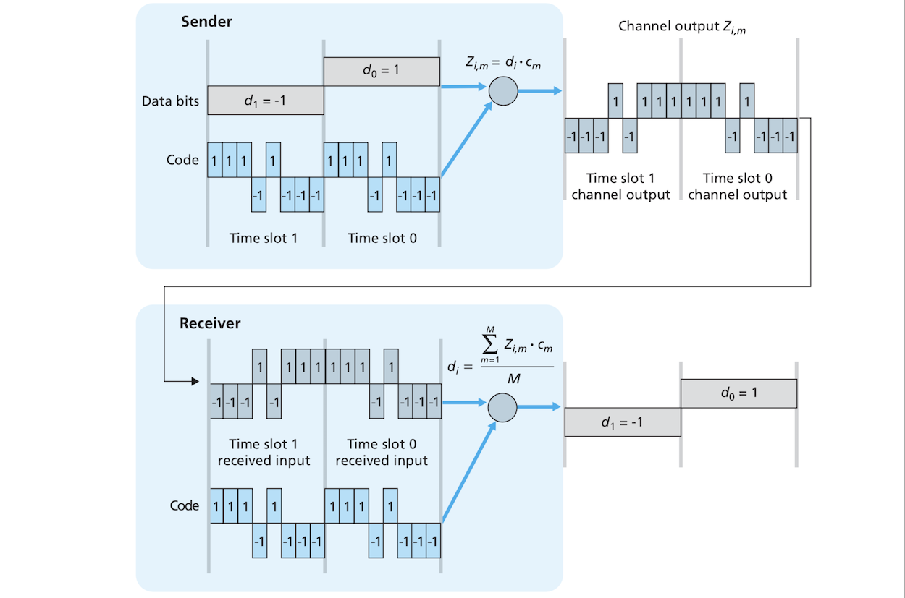
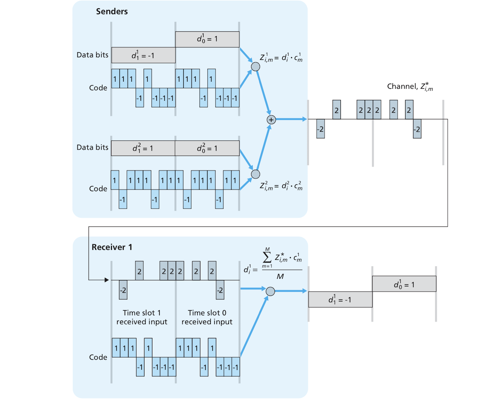
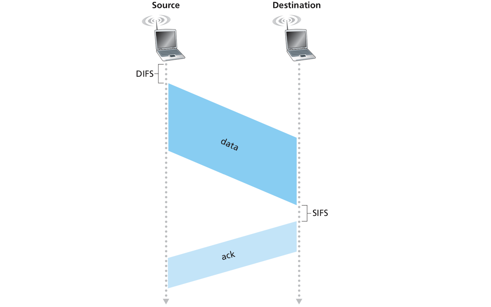
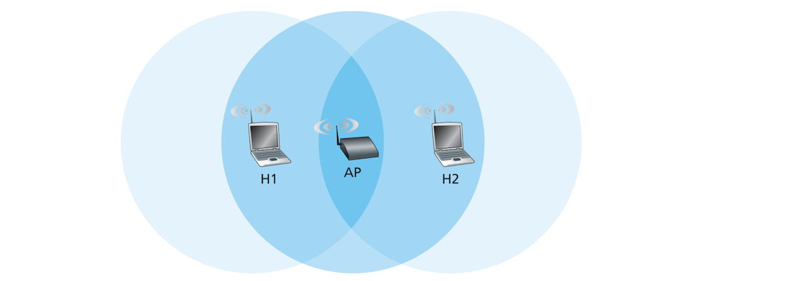
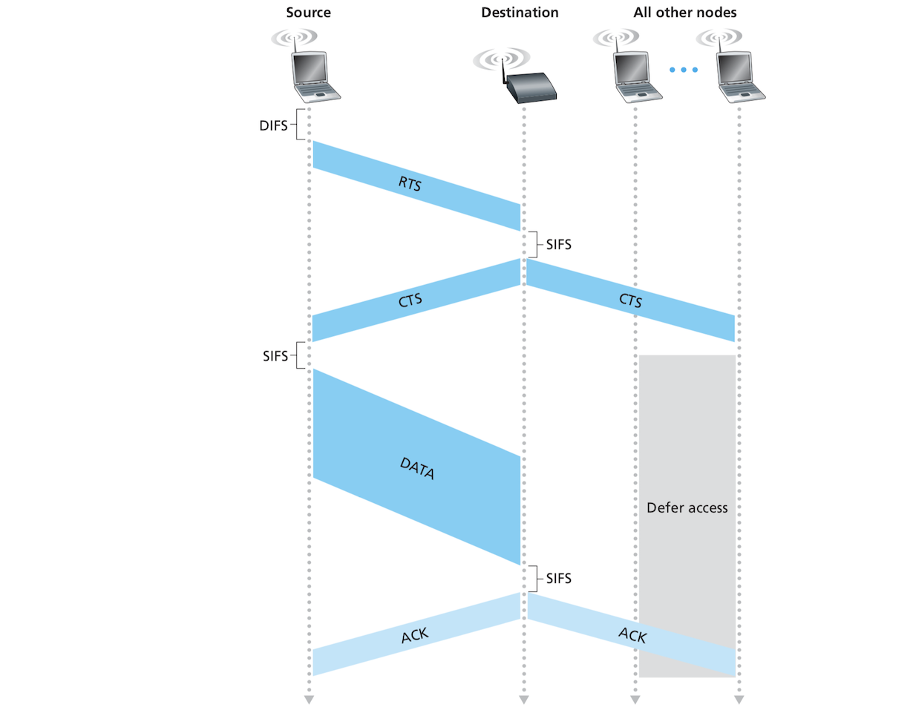
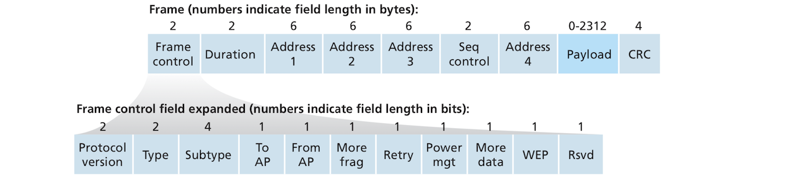

# Wireless and Mobile Networks:

## Table of Contents:
- [Wireless and Mobile Networks](#wireless-and-mobile-networks)
	* [Table of Contents](#table-of-contents)
	* [Introduction](#introduction)
	* [Components of a Wireless Network](#components-of-a-wireless-network)
	* [Wireless Links and Network Characteristics](#wireless-links-and-network-characteristics)
		+ [CDMA](#cdma)
	* [WiFi 802.11 Wireless LANs](#wifi-80211-wireless-lans)
		+ [The 802.11 Architecture](#the-80211-architecture)
			+ [Channels and Association](#channels-and-association)
		+ [The 802.11 MAC Protocol](#the-80211-mac-protocol)
			+ [Link-layer Acknowledgment Scheme](#link-layer-acknowledgment-scheme)
			+ [How CSMA/CA Avoids Collisions](#how-csma/ca-avoids-collisions)
			+ [Dealing with Hidden Terminals through RTS and CTS](#dealing-with-hidden-terminals-through-rts-and-cts)
			+ [802.11 as a Point-to-Point Link](#80211-as-a-point-to-point-link)
		+ [The IEEE 802.11 Frame](#the-ieee-80211-frame)
			+ [Payload and CRC Fields](#payload-and-crc-fields)
			+ [Address Fields](#address-fields)
			+ [Sequence Number, Duration, and Frame Control Fields](#sequence-number-duration-and-frame-control-fields)
		+ [Mobility in the Same IP Subnet](#mobility-in-the-same-ip-subnet)
	* [Mobility Management Principles](#mobility-management-principles)
	* [Mobile IP](#mobile-ip)

## Introduction:
- Wireless is king in our days. The reason a separate chapter was dedicated to to wireless networking is that it poses challenges that are different from the challenges encountered in traditional wired networks at both the data link and network layers. 
- This chapter will try to tackle the wireless networking and the issue of mobility and how wireless networking relates and compares to traditional wired networking. 
- Specific topics we will see include:
	- How a device connects to the network through a wireless link.
	- How multiple access is done in wireless links, with a focus on CDMA.
	- How wireless LANs work at the link level with such protocols as IEEE 802.11 (WiFi).
	- The issue of mobility and networking and how it's tackled with mobile IP.
	- The effect of wireless links and mobility on transport-layer protocols and networked applications. 
- *I will just skim over these topics and not spend to much time trying to summarize the material*.

## Components of a Wireless Network:
- A wireless network (regardless of whether it covers a large area such as a cellular network or a smaller one like WiFi) generally consists of:
	- **Wireless hosts**.
	- **Wireless communication links** that connect wireless hosts and base stations. Communication links differ mainly in their *transmission rates* and *coverage areas*. WiFi for example covers a small area of a few dozen meters, but has a high transmission rate, as opposed to to some cellular network (2G)links which cover areas with radii of several kilometers but has a lower transmission rates. These characteristics are not static, however, as WiFi and cellular technologies evolve over time and acquire higher transmission rates and might cover larger areas. 
	- **Base station** is the point in a wireless network that is responsible for sending and receiving data from wireless hosts. The base station coordinates transmission between hosts, and connects the hosts to the larger network infrastructure. The base point basically acts as a link-layer relay between the hosts and the larger "Internet" infrastructure. Examples of base stations include *cell towers* in cellular networks and *access points* in 802.11 wireless LANs. 
- The presence or absence of a base station external to hosts that controls the wireless network where these hosts exist means there are two types of networks:
	- **Infrastructure mode**: where the base station controls network services such as routing and IP address assignment to wireless hosts.
	- **Ad hoc mode**: where the wireless hosts themselves control such services.
- The mobility issue rises mainly in cellular networks. How would an IP connection be handled while you're driving and your connection in handed off from one cell tower to another? How are you located in the network? This is one aspect of the mobility issue that will talk about later. 
- Generally speaking, experts divide networks into 4 types depending on two factors: (1) whether a wireless network runs in infrastructure or ad hoc mode, and whether a packet crosses one or multiple wireless hops. These types are:
	1. *Single-hop, infrastructure-based*: which has a base station  connected to the Internet, and all communication in such network is between each host and the base station. Examples include 802.11 LANs and 3G cellular networks.
	2. *Single-hop, infrastructureless*: lacks a base station connected to the Internet. One of the hosts participating in this network may coordinate the communication between devices. Examples include Bluetooth and 802.11 running in ad hoc mode.
	3. *Multi-hop, infrastructure-based*: Includes a base station connected to the Internet, but nodes can be used as relay packets from and to the base station. Examples include *wireless mesh networks* :confused:.
	4. *Multi-hop, infrastructureless*: has no base station and nodes can be used as relays. Nodes might also be mobile. Examples include *mobile ad hock networks (MANETS)* and *vehicular ad hoc networks (VANET)*.
	- The rest of this chapter will focus on single hop infrastructure-based networks. 

## Wireless Links and Network Characteristics:
- Differences between a wired and a wireless network lie obviously in the physical and link layers while the upper layers such as the network layer are the same. Some of the more important differences include: 
	- **Decreasing signal strength**: Radio signal gets weaker as it passes through thick matter such as WiFi passing through some thick walls. It also decreases even in free space as the distance between the sender and receiver gets larger. 
	- **Interference from other sources**: Radio signal sources transmitting in the same band interfere with each other. 2.4 GHz wireless phones for example interfere with 802.11 wireless LANs. Electromagnetic noise from nearby sources such as a microwave or a motor is a larger problem in wireless than wired networks.
	- **Multipath propagation**: This is caused by signal reflecting off objects. It arrives blurred to the receiver :confused:.
- These characteristics mean that wireless channels are more prone to errors. To mitigate these errors, wireless protocols such 802.11 provide strong error detection. It even provides *link-level reliable data transfer* which retransmits corrupted frames.
- The signal that arrives at the receiving host is not as clean and nice as when it was sent. It undergoes all the side effects we've just mentioned (decreasing signal strength, interference and multipath propagation), so the receiver receives distorted signal mixed with background noise. This requires the wireless protocols to employ strong CRC error detection and link-layer reliable data transfer techniques to retransmit corrupt frames.
- The received signal then is a mix of a degraded version of the original signal (degraded due to multipath propagation and interference with other signal) and background noise. The degradation and background noise might be too high that the strength of the original signal is severely reduced. How can we measure the strength of this signal? **Signal-to-noise ratio (SNR)** is one indicator used by engineers to measure the strength of the received signal. There is technical voodoo involved in this SNR that my feeble brain and can't and probably shouldn't even try to understand. Anyways, higher SNR means stronger signal which also means it's easier for the receiver to extract the transmitted signal from the background noise.
- Another measure of signal strength is **bit error rate (BER)** which measures the probability that a transmitted bit is in error. There is also another thing called modulation and I have no idea what it is, but let's just say that different modulation schemes have different transmission rates.
- Considering these three physical-layer factors (SNR, BER, modulation technique transmission rate), we can say that the physical layer of wireless networking have the following characteristics:
	- *"For a given modulation scheme, the higher the SNR, the lower the BER."* Increasing SNR requires higher transmission power (e.g phone battery). It might be wasteful to keep increasing SNR beyond a certain threshold because you are using more energy and not getting any lower BER. Even worse, very unnecessarily high SNR of a sender might interfere with other senders.
	- *"For a given SNR, a modulation technique with a higher bit transmission rate (whether in error or not) will have a higher BER"*
	- *"Dynamic selection of the physical-layer modulation technique can be used to adapt the modulation technique to channel conditions."* SNR (and as a result BER) change due to mobility. We need a higher transmission rate with the least possible BER. Wireless protocols use what is called adaptive modulation where modulation techniques are selected dynamically while a device is moving around signal sources. The device tries to use the modulation technique with the highest transmission rate and the lowest BER. 
- Another characteristic or problem that wireless networks suffer from is the so-called **hidden terminal problem** where two stations A and B cannot communicate with each other due to fading (long distance between the two stations) or due to a physical barrier, but there is a third station C which is visible to both. The signal from A and B interfere at station C and have undetected collisions. This can make multiple access in wireless networks more challenging than wired ones.

### CDMA:
- We've seen in the link layer chapter that when devices share a communication medium, they need a way to prevent interference of lines of communication. There are 3  classes of protocols and techniques for solving this problem: channel partitioning, random access and taking turns.**Code division multiple access (CDMA)** belongs to the channel partitioning class is one of the most important protocols in wireless networking. 
- As the following diagram shows, each bit to be sent in CDMA is multiplied by a signal (code) that has a much faster bit rate (so-called *chipping rate*). The rate at which the encoder receives the bit to be sent is the unit of time. Each bit to be sent requires a one-bit slot time. The receiver decodes the received signal through dividing it by that same code to get the original bits:

- Different senders use different codes to send their bits. Each encoder multiply its bits by its code and multiple encoded bit streams from different senders are added up. The receivers use the sender codes and somehow manage to disentangle the messages meant for them as the following diagram shows:

- CDMA is a channel partitioning protocol in that it partitions the codespace (the different codes overlapping with the bit slot time) of a bit between different senders rather than time or frequency.
- This is a world in itself and it's very briefly and inadequately explained in the book. It sounds interesting but it is really beyond the scope of this summary.

## WiFi: 802.11 Wireless LANs:
- ّWireless LANs are everywhere today! They are dominated by one standard, or rather a class of standards called **IEEE 802.11 wireless LAN**, i.e. **WiFi**.
- The following table shows different WiFi standards and some of their characteristics:

| Standard | Frequency range (in USA) | Data rate |
| --- | --- | --- |
| 802.11b | 2.4 - 2.485 GHz | up to 11 Mbps |
| 802.11a | 5.1 - 5.8 GHz | up to 54 Mbps |
| 802.11g | 2.4 - 2.485 GHz | up to 54 Mbps |
- 802.11g was and might be still very widely used. Newer standards such 802.11n and 802.11ac might also be very popular today.
- 802.11 standards use the medium access protocol *CSMA/CA*, and share the same special frame structure. They can reduce their transmission rates to reach larger distances. They can also all run in either infrastructure or ad hoc modes.
- Differences between these different standards stem mainly from the frequencies they run on. Some run on lower frequencies, so their transmission rate is lower, but others run at higher frequencies so they have higher transmission rates but over smaller areas, etc. 

### The 802.11 Architecture:
- A basic 802.11 infrastructure wireless LAN consists of a **basic service set (BSS)**. A BSS consists of one or more wireless stations and a central base station (also called an **access point (AP)**). The following figure shows 2 BSSs each centered around an AP and the APs are connected to a router (which could also be a switch) which connects the wireless BSS to the Internet. 
- Home networks usually have APs and routers integrated into one device. 
- Each wireless station has a a 6-byte MAC address stored in the firmware of its 802.11 network interface card. Each wireless device also has a separate MAC address for its wireless interface. These wireless MACs are managed by IEEE and are in theory globally unique. Why in theory?! 
- An ad hoc wireless LAN doesn’t require an AP that is wired through a router or a switch to the rest of the Internet. Such a LAN can be formed by a group of wireless devices that find themselves in proximity to each other without the presence of an AP. So there is no central control and no connection to the Internet which can be done with the AP. An ad hoc LAN allows the devices to share data among themselves.

#### Channels and Association: 
- A wireless station needs to first associate with an AP before it can send and receive network-layer packets. We will discuss how association is carried out in the 802.11b/g specifications. 
- When it’s first set up, an AP is assigned a **service set identifier (SSID)** by the admin. The SSID is composed of one or two words. When you look at a list of available WiFi points in your host, what you see is a list of SSIDs. 
- In addition to the SSID, an AP must also be assigned a channel number. So what is a channel and what is a channel number. 208.11b/g operates in the frequency range between 2.4 and 2.485 GHz. This 85 MHz band is divided into 11 partially overlapping channels. Two channels are considered non-overlapping only if they are separated by at least 4 channels. This means the only non overlapping channels are 1, 6 and 11.
- A **WiFi jungle** takes place when a wireless station receives sufficiently strong signal from 2 or more APs because it's in close proximity to all such APs. To access the Internet, the wireless station needs to join exactly one subnet, so it must **associate** with exactly one AP. Association basically means creating a virtual wire or link between the wireless station and the AP. The wireless device can exchange frames with the Internet only through the associated AP. For the association to happen, and for the wireless station to even discover the APs around it, APs are required to periodically send **beacon frames**. A beacon frame contains the AP's SSID and MAC address. The wireless station needs to scan the 11 aforementioned channels looking for beacon frames. Some beacon frames might be sent from different APs on the same channel. The user of the wireless station or the station itself can then selects one AP to associate with. 
- The 802.11 standard doesn't have an algorithm for selecting a specific AP from a WiFi jungle. The manufacturers of the hosts decide such an algorithm, but generally speaking, the host selects the AP with the strongest signal. An AP with strong signal might be overloaded, but an AP with weaker signal might deliver better signal because it has less users. Research has proposes solutions to such a situation and might already be in use!
- Listening for beacon frames is called **passive scanning**. An alternative is called **active scanning** whereby the wireless station broadcasts a **probe request frame** to all the APs within range. The APs receive the probe frame and respond with **probe response frames**. 
- After selecting an AP, the host sends an **association request frame** to the AP. The AP, on its part, responds with an **association response frame**. After the association is effectuated, the host wants to join the IP subnet of the AP. It does this through sending a DHCP message to the subnet through the AP so it can get an IP address in the subnet. Once the host obtain that IP address, it can communicate with the rest of the Internet from within that subnet. 
- A lot of WiFi hot spots require the host to authenticate themselves to associate with the APs. Some APs use device MAC addresses for authentication, and others require usernames and passwords. Authentication will be treated in the security chapter. 

### The 802.11 MAC Protocol:
- After a wireless station successfully associates with an AP, another problem arises. There might be multiple wireless stations and APs within wireless range. How can all these wireless devices communicate at the same time over the same channel/s? 
- Multiple access is achived in 802.11 through a random access protocol called **carrier sense multiple access with collision avoidance (CSMA/CA)**. It's inspired by Ethernet's CSMA/CD. The difference between the two is that Ethernet uses collision detection, while 802.11 uses collision avoidance. CSMA/CD only detects collisions and doesn't really do much to avoid them, but with CSMA/CA "each station senses the channel before transmitting, and refrains from transmitting when the channel is sensed busy". In addition to collision avoidance, CSMA/CA uses a link-layer acknowledgment/retransmission (ARQ) technique (similar to that used in TCP). The use of ARQ is a response to the high bit error rates found in wireless links as opposed to the far more reliable Ethernet.
- In a collision detection scheme like Ethernet, a host transmits bits while listening on the channel so if it senses that another host is transmitting it stops for a random short of time before resuming transmission. 802.11 doesn't implement collision detection because it is costly and mostly pointless. The result is that once a host starts sending a frame, it continues to send the whole frame. This can be costly when there are a lot of collisions, so 802.11 uses some techniques for avoiding collisions. We will see these techniques shortly.

#### Link-layer Acknowledgment Scheme:
- A frame is not guaranteed to arrive intact to its destination, hence the need for the link-layer acknowledgment scheme. 802.11 tries to remedy this problem through the use of acknowledgments. As the following diagram shows, when the destination receives an intact frame, it it waits for a short period of time called a **short inter-frame spacing (SIFS)** before it sends an acknowledgment frame back to the sender. The sender waits a certain amount of time for the acknowledgment and if it doesn't receive one, it retransmits the frame. If the the sender doesn't receive an acknowledgment after a certain number of retransmissions, it simply discards the frame. 

#### How CSMA/CA Avoids Collisions:
- A station trying to transmit a frame follows these steps:
	1. When the sending station senses that the channel is idle, it transmits its frame after a short period of time called the **distributed inter-frame space (DIFS)**. 
	2. If the channel is busy, the station "chooses a random backoff value using binary exponential backoff [...] and counts down this value when the channel is sensed idle". While the channel is busy, this counter stops.
	3. When the counter reaches zero which can only happen when the channel is idle, the station sends the frame and waits for an acknowledgment.
	4. If an acknowledgment is received, the station knows it was received correctly and sends another frame if it has one following similar steps. If no acknowledgment is received, the station enters the backoff phase described in step 2 but uses a larger random countdown number??? (*This is a little unclear! Does the station have to wait for an acknowledgment before sending the next frame??!!!*)
- An interesting observation about CSMA/CA is that a station doesn't transmit its frame during the countdown even if it sense the channel is idle, and instead waits until the countdown reaches zero; this is as opposed to CSMA/CD which starts transmitting as soon as it senses the channel is idle. This is a way to avoid collisions as much as possible. CSMA/CA cannot abort the transmission of a frame like CSMA/CD, so if two station try to send their frames while third station is sending its data, once the third machine stops transmitting the two would first jump and try transmitting at the same time which will result in a costly collision because both will send whole frames. If they wait until their countdowns reach zero (which will hopefully be different times), once will start sending its frame before the other. Collisions will still occur because the two stations might be hidden from each other, or the random countdowns might end at moments very close to each other, so close that one of the stations might not sense that the other channel has already started using the channel (delay and all).

#### Dealing with Hidden Terminals through RTS and CTS:
- We've briefly described the hidden terminals problem where two stations can communicate with a third station without being aware of each other as the following image illustrates (The AP in the image can see both stations, but the stations can't see each other):

- The hidden terminal problem results in collisions that can't be avoided by what we've described so far of how CSMA/CA works. In the figure above, H1 can starts can transmit data to AP and H2 cannot sense the channel is busy. H2 can never tell if H1 is using the channel. C
- SMA/CA provides an optional enhancement that answers collisions caused by the hidden terminal problem. This enhancement uses the so-called **request to send (RTS)** and **clear to send (CTS)** control frames which are used to reserve access to the channel.
- The following figure shows how it works:

- When a station wants to send a DATA frame, it sends an RTS frame to the AP. The RTS frame contains information about the time required to transmit the data frame and the acknowledgment. When the AP receives the RTS frame it broadcasts a CTS frame which tells the requesting station that it now has permission to use the channel, and also tells other stations that the channel has been reserved for a given period of time. The sending station, then, sends its data frame.
- RTS/CTS improves performance because it reduces the number of collisions as the channel is reserved for one station at a time. Collisions can happen between CTS and RTS frames, but these are not as costly because they are small, mostly much smaller than the jumbo data frames. 
- RTS/CTS does however introduce delay and some avoids altogether, while some only use it for really large data frames that go beyond a certain threshold. 

#### 802.11 as a Point-to-Point Link:
- If two stations have directional antennas (*what!!?*), they can point the two antennas toward each other and turn 802.11 protocol into a point-to-point link. These links can cover distances of 10s of kilometers. This is great since 802.11 hardware is cheap.

### The IEEE 802.11 Frame:
- The following image shows the structure of an 802.11 frame:

- An 802.11 frame shares a few similarities with an Ethernet frame, but is also very different and much more elaborate. Several fields in the 802.11 frame are specific to the world of wireless transmission and some fields have subfields. This subsection will touch on a few of the more important fields.

#### Payload and CRC Fields:
- The payload can contain and IP or ARP packet. It has a maximum length of 2,312
bytes, but most payloads are less than 1,500 bytes in length. The CRC field is used for detecting bit errors just as in Ethernet. The CRC field is more important in 802.11 because of the higher rate of bit errors in wireless communication.

#### Address Fields:
- Unlike Ethernet, 802.11 frame doesn't have only two address fields, but have four instead. At least 3 addresses are required to get a datagram from a wireless station to a router interface through an AP. The fourth address is used in ad hoc WiFi. The first 3 addresses are defined as follows:
	- **Address 2** is the MAC address of the station that transmits/sends the frame.
	- **Address 1** is the address of the station meant to receive the frame. 
	- **Address 3** is the router that connects the subnet to which the BSS belongs to other subnets. The need for address 3 comes from the fact that APs are link-layer devices that don't know IP. The router doesn't see the AP and sees all the wireless stations it connects to as part of a subnet. When a router receives an IP datagram meant for a host in the subnet, it places it in an Ethernet frame and sends it to the AP. The converts the Ethernet frame into an 802.11 frame, inserts its MAC address into address 2, inserts the destination host MAC address in address 1, and inserts the MAC address of the router in address 3. The reverse of this takes place. We can say that address 3 allows for the inter-operation between the wireless BSS and the wired part where the AP is connected to a router through a wire. 

#### Sequence Number, Duration, and Frame Control Fields:
- The **sequence number** allows the receiver to distinguish newly received frames from old retransmitted frames, just as in TCP. *But why??!!*
- The **duration** field is used to by RTS and CTS frames to indicate the duration of a channel reservation.
- The **control field** is composed of sever subfields which include:
	- The **type** and **subtype** fields are used to distinguish the different types of fields such if they are CTS, RTS, association, ACK or data frames.
	- The **to** and **from** subfields define the meaning of address fields. The meaning of address fields change depending on weather the network is ad hoc or infrastructure, or if the device in an infrastructure network is an AP or a wireless station. 
	- The **WEP** indicates whether encryption is used or not. 
 
### Mobility in the Same IP Subnet:
- If a device moves between to BSSs that are part of the same subnet, there is no interruption of TCP sessions because the device is still in the same subnet and has the same IP, but if the device moves between two different BSSs belonging to two different subnets, services using IP might be interrupted because the IP address has changed. 
- When a device moves away from a given BSS 1 towards a BSS 2, it senses the signal is weakening so it starts looking for associating with a new BSS. It receives a beacon frame from BSS 2 and and associates with it while keeping its IP address. This is made easier by the fact that BSSs in the same subnet would usually have the same SSID, so the handoff is seamless. 
- BSSs in the same subnet are connected through switches and while switches are smart and update their MAC address tables, they might think the device hasn't moved to a new BSSs. A hacky solution to this is when a device associates with the new BSS, the AP of the new BSS broadcasts an Ethernet frame to the switch instructing its to update its table the device can be reached through this new AP in this new BSS.

## Mobility Management Principles:
- *I've skipped the section on cellular networks because it was mostly about how cellular networks work and has very little information about the Internet.*
- The issue of mobility is especially important and interesting in the context of a cellular Internet, and not much of a problem in wireless LANs. From a network's perspective, mobility doesn't mean movement through space, but moving from one wireless network (BSS in LANs) to another or moving between cells in a cellular network (a cell can be described as something similar to a BSS but covers a larger area probably around a cell tower). One doesn't need to maintain a TCP connection when carrying a laptop from home to office, but maintaining a TCP while driving a car or in train while using 3G or LTE data is expected. 
- I've always wondered how IP works when one is moving between different cell coverage areas. Joining a new WiFi network definitely means changing one's IP address which will interrupt a TCP connection, but that's not the case in cellular networks. 
- One way cellular networks handle IP is that a device is allotted a permanent address which doesn't change based on the cell where it currently resides. The device does also have a home network which is probably the initial cell it used or the one which it uses mostly. Other cells that it occasionally visits are called visited networks. Each time the device visits one of these networks, these visited networks or the device itself tell the home network that the given device has joined them. THe foreign networks also creates and gives the device a *care-of address (COA)* and the COA is also sent to the home network. 
- It seems like the wider Internet is not aware of what goes inside the cellular network. So how can a datagram be forwarded to a mobile node using cellular Internet? Two approaches are used to achieve this:
	- In **indirect routing**, some node sends datagram to the mobile device's permanent address. The home network receives the datagram. The home network knows the device's COA, so it wraps the datagram in a second datagram whose destination is the COA, the address of the foreign network where the device resides. The foreign network extracts the original datagram and forwards it to the device. When the mobile device wants to send a datagram to the Internet, this datagram can go directly to the foreign network and doesn't have to go through the home network.
	- **Direct routing** solves the inefficiencies introduced of indirect routing where datagrams need to go through the home network and then the foreign network even though there are more efficient routes. Direct routing is kinda more complex, however! In direct routing, the node wishing to exchange datagrams with our mobile node or something called a *correspondent age* queries the home network of the mobile node for the COA. The correspondent agent, then directly tunnels the datagram to the foreign network. There is a problem, however, with direct routing. The correspondent agent only queries the home network for the COA at the beginning of a session, so how can we still keep track of the mobile node if it moves to a new foreign network? This solved by turning the first foreign network the mobile found itself in into a so-called **anchor foreign agent**. Every time the mobile device moves to a new foreign network, the anchor foreign agents is informed of the new COA of the device. Datagrams basically start getting *indirectly rerouted* trhough the anchor foreign agent (in a similar way to how home network is used in indirect routing). Most cellphone users it seems are using their phones within a single cell for most of the time, so there is still a lot of efficiency gained from this!

## Mobile IP:
- **Mobile IP** refers to the Internet architecture and protocols used to support mobility. RFC 5944 specifies how mobile IP works (for at least IPv4) and uses indirect routing we discussed eaerlier. It is a vast topic that we will only cover briefly here. Mobile IP consists of 3 main subjects:
	- **Agent discovery** which concerns how foreign and home agents advertise their services to mobile devices, and how mobile devices request such services.
	- **Registration with the home agent** encompasses the protocols used by foreign agents and mobile nodes to register and de-register COAs with the home agent.
	- **Indirect routing of datagrams** refers to how datagrams are forwarded by home agents to mobile nodes, including encapsulation an de-encapsulation, errors and datagram forwarding.