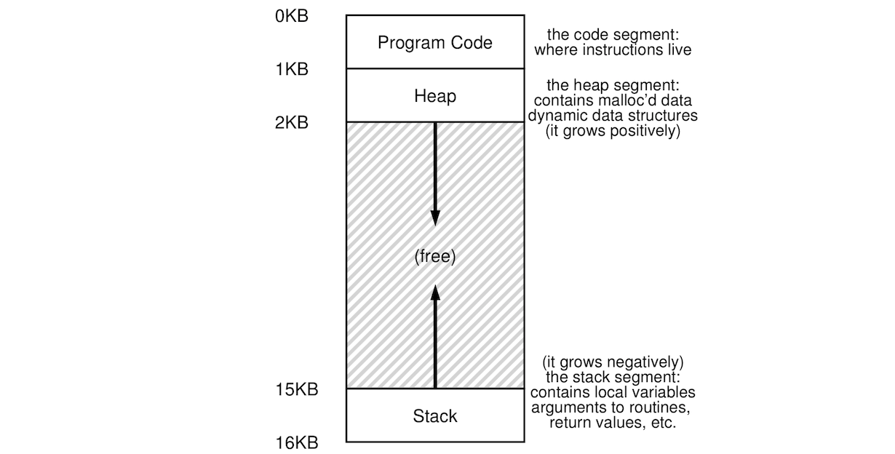

# Basics of Virtual Memory
## Table of Contents:
## Intro:
- Virtual memory is one of the most important services offered by a self-respecting operating system. Dealing directly with physical memory can be very frustrating as it requires you to keep track of so many things. OS designers thought of automating some this away and figured this thing called virtual memory. Virtual memory basically means that addresses programs are all virtual. Each address is a virtual address that can at some point have a corresponding physical address. This book claims that virtual memory has two main benefits:
	- *Ease of use*, as the user doesn't have to trundle through directly the muddy perilous physical memory. Every process has available to a large array of bytes that is easy to use. All processes have a uniform virtual address space. This makes programs simple and easy to use, modify, etc.
	- *Isolation and protection*. Each process has its own independent address space that it can modify as it pleases, but it cannot mess with other processes address spaces.

## Address Spaces:
- An address space can be viewed as a program's of view of the system's memory. It is a foundational abstract probably as important as the process abstraction. 

## Unix Memory API:
-

## Address Translation:
-

## Segmentation:
-

## Free-Space Management:
-