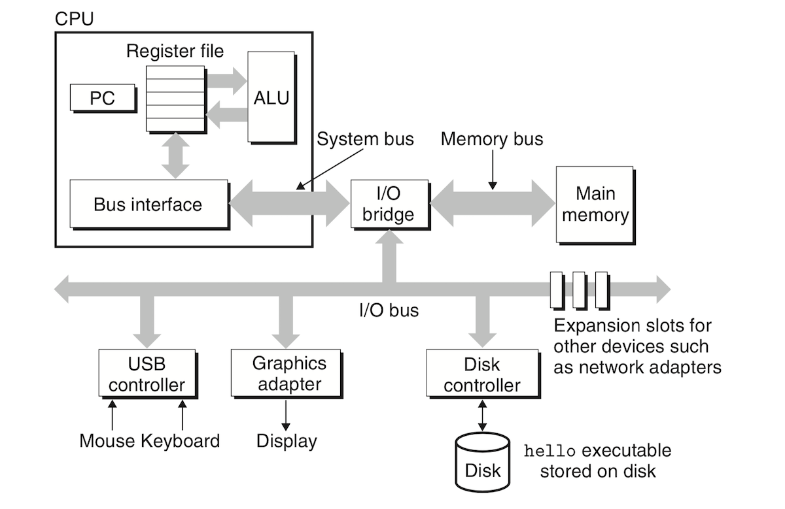
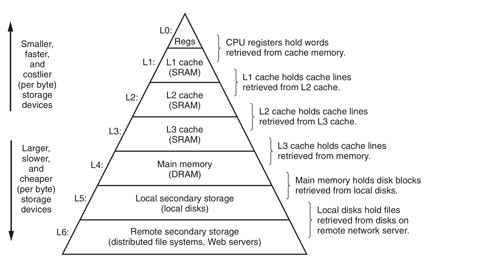
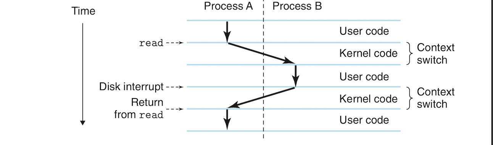

# An Overview of Computer Systems: 
- **Computer systems** consists of the hardware and systems software that allow application software to work. Computers are very diverse from mainframes to personal computers to smart watches.. etc. However, they all consist of almost the same basic components. 
- Learning about computer systems concepts can make one a power programmer with an eye for performance and security. These concepts are consistent across different implementations and keep resurfacing whether one is dealing with low or high level programs. 
- In this document, we will run a survey of what computer systems are all about using the following program. We will follow the lifetime of this program from the moment its created until it's executed and shows a `Hello, world!` on the terminal:
```c
#include <stdio.h> 

int main(){
    printf("Hello, world!\n");
    return 0;
}
```

## 1. Information is Bits Plus Context:
- The `hello` program starts as a **source program** (also a **source file**), created with an **editor** like Vim or Sublime Text and a saved in a file named, say, *hello.c*. This file is a sequence of bits which can be either a **1** or **zero**. These bits are organized into **bytes** which are chunks of 8 bits. Each character represents a text character. 
- Most computers represents text characters using the ASCII standard which represents each character with a byte-size integer value.
- A file containing exclusively ASCII characters is called a **text file**, while all other files are **binary characters**
- All information in a system consists of a bunch of bits. Only the context in which these bits are viewed determines what they represents. The same sequence of bytes might represent text, an integer, a floating-point value or a machine instruction. 
- The way computers represent numbers is not exactly the way we understand numbers. Machines representations of numbers are approximations that don't always behave as we expect.

## 2. Programs Are Translated by Other Programs into Different Forms:
- Our `hello.c` program can be read by humans but can't be executed by machines! This program needs to be translated into low-level **machine-language instructions**. There are certain programs that can translate this C program into sequences of low-level machine-language instructions and repackage them into a form called an **executable object program** and stored as a binary disk file. Such program is also called an **executable object file**.
- We use a **compiler driver** to translate a source file to an executable object file. Translating a source file to an object file is done with a **preprocessor**, a **compiler**, an **assembler**, and a **linker**. These four programs are known collectively as a **compilation system**. `gcc` is one of the most popular compilation systems. We can use in a Unix-like machine to translate our `hello.c` program into an executable through the following terminal command:
```sh
gcc -o hello hello.c
```
- The command above tells `gcc` to translate our source file into an object file. This translation follows these 4 phases:
	1. **Preprocessing phase**: The preprocessor(`cpp`, short for C preprocessor) modifies the original C file through replacing directives starting with `#` such as `#include <stdio.h>` with the actual contents of the file `stido.h`. The result of preprocessing is another C file with the suffix `.i`: `hello.i`.
	2. **Compilation phase**: The compiler (`cc1`) translate the text file `hello.i` into the text file `hello.s` which contains an **assembly language program**. In assembly, low-level machine instructions are represented in a textual form. They are human readable and different high-level languages can compile to the same assembly language.
	3. **Assembly phase**: The assembler (`as`) translates the text file `hello.s` into machine language instructions, puts that in a form called **relocatable object program** and stores the result in an object file `hello.o`
	4. **Linking phase**: When a function is called from an external file, it needs to be merged with our `hello.o` program. The `printf` function for example resides in an object file called `printf.o` which is part of the *standard C library* provided by `gcc`. The linker (ld) merges `printf.o` into our `hello.o` resulting in an executable object file `hello` (also simply called an **executable**). The executable is ready to be used by the system.

## 3. The Importance of Understanding How Compilation Systems Work:
- The benefits of understanding how compiler systems work include:
	* *Optimizing program Performance*: Compilers have become so smart that they already do a lot of optimization, but we can still do a lot of optimization manually for what the compiler misses. We need to understand how machine code works and which C statements result in machine good with better performance. Examples of performance tweaking includes such as decisions as choosing between `switch` and `if-else` statements and figuring if one is always better than the other. Is a `while` loop faster a `for` loop? What is the cost of a function call? What are the performance cost of using pointer references vs. array indexes? Optimization is done better when you gain some familiarity with machine language and an understanding of how the compiler translates C constructs into machine language instructions. You can also actively choose which constructs to use in a given situation to help the compiler get optimum results. An understanding of memory hierarchy and how for example the compiler stores arrays in memory is also an important step towards getting optimized code.
	* *Understanding linking-time errors*: Linking is an overlooked but fundamental and problematic step in compilation. When working on a large projects perplexing linking errors emerge. Examples of such errors have to do with things like global variable conflicts. There will be more on linking and linking errors in the following sections. 
	* *Avoiding security problems*: **Buffer overflows** have wrecked many a system over the years. Such attacks arise because many programmers are not careful about restricting data they accept from untrusted sources. To avoid security problems one has to understand the program's stack and how it stores the data and control information of the program. In the following sections we will study how the compiler, operating system and the programmer work together to lessen the threats of attacks. 

## 4. Processors Read and Interpret Instructions Stored in Memory:
- Let's now trace the life of the executable file `hello` which is stored somewhere in disk. To run this program we are going to use the so-called *shell* as follows:
```sh
./hello
``` 
- The shell is a command-line interpreter that waits for you to type a command, then it executes it. If the first word you type is not a built-in shell command, the shell assumes it is a an executable file and it loads it and then runs it. You can equally just type `hello` and it works equally fine.

### Hardware Organization of a Systems: 
- To really understand what happens to our `hello` program when it runs in a system, we need to know something about the hardware organization of the system where it runs. The following diagram shows system based around modern Intel processors. All or most other systems are more or less the same:

- **Buses** are electrical conduits that carry bytes between the different components of the system. Buses are designed to transfer fixed-size chunks of bytes called **words**. The **word size** (the number of bytes in a word) is a fundamental parameter of the system. Most systems today have a word size of either 4 bytes (32 bits) or 8 bytes (64 bits).
- **I/O devices** are what connects our system to the external world. The system in our diagram, we have 4 I/O devices: a mouse and a keyboard, a display for output, and a disk for long term storage (the disk is both an input and output device). Before it runs, our `hello` program resides in the disk. I/O devices are connected to I/O bus with either **controllers** or **adapter**. Controllers are chip sets that make part of the motherboard itself, while adapters are cards that plug into a slot in the motherboard. Both are there to transfer information between the I/O bus and I/O devices. 
- **Main memory** is a temporary storage device that holds the program and the data it manipulates while the processor executes the program. Physically, the main memory is a collection **dynamic random access memory** chips. Logically, memory is arranged as a linear array of bytes, each with its unique address (which is an array index) starting with zero. Each machine instruction of a program can consist of a variable number of bytes. This is caused by the fact that data items have different lengths which also depend on the C types they correspond to. 
- **Processor** or the **CPU (central processing unit)** is the brain of a computer system that executes the instructions stored in the main memory.  An important component of the CPU is a **register** (some storage device we will talk about later) called the **program counter (PC)**. At any point in time, the program counter points to (i.e. contains the memory address) to some machine language instruction in the main memory. While a computer is powered on, the processor repeatedly executes the instruction pointed to by the PC, and updates the the PC to point to the next instruction. A processor *appears* to execute instructions according to a simple model defined by the processor's **ISA (instruction set architecture)**. In our model, instructions execute in a strict sequence and each executing each instructions involves a series of steps:
		+ The processors read the instruction from memory pointed at by the PC. 
		+ It then interprets the bits in the instruction.
		+ Performs the operation in the instruction.
		+ Updates the PC to point to the next instruction. The next instruction might or might "contiguous in memory to the instruction that was just executed".
- A processor can only perform a few set of simple operations. These operations revolve around the **register file**, **ALU (arithmetic/logic unit)** and the main memory. The register file is a small storage device consisting of a collection of word-size (mind you, word size of a our 64-bit CPU is 64) registers. Each register has its unique name. Registers themselves are similar to memory cells but much faster. The ALU computes new data and address values. Examples of instructions the CPU carries out include:
	+ **Load**: copies a byte or a word from memory into a register, overwriting the existing contents of the register. 
	+ **Store**: Copies a byte or a word from a register into memory overwriting the existing content at the given memory location.
	+ **Operate**: Copies the content of two registers into the ALU, performs an arithmetic operation on the two words and stores the result into a register, overwriting its preexisting content. 
	+ **Jump**: Extracts a word from the instruction itself and copies that word into the program counter, overwriting the previous value of the PC. 
- A processor only *appears* to be a simple implementation of its instruction set architecture (ISA), but modern processors use complex tricks to speed up execution. While the ISA describes the effects of instructions, a processor's **microarchitecture** describes how the processor is implemented.

### Running the `hello` Program: 
- At a basic level, this is what happens while our `hello` program is being executed:
	+ The shell program is running and waiting for us to type our commands.
	+ As we type each character of our command, each one character is read by the shell program into a register and then stored into memory.
	+ When we hit the `enter` key, the shell knows we have finished typing our command.
	+ The shell then loads the contents of the executable file `hello` into memory by execution a sequence of instructions that copies the code and data in the file from disk to memory. The data include the `Hello, world!\n` string. Through **DMA (direct memory access)**, data passes directly from disk to memory without passing by the processor. We will discuss DMA later.
	+ When the code and data from the `hello` object file are loaded into memory, the processor starts executing the instructions in the `hello` program's `main` routine. These instructions copy bytes in the `Hello, world!\n` string from memory to the register file, and from there to the display device where they get displayed on the screen. 

## 5. Cache is the Shit:
- It is easy to observe that much of a program's execution revolves around moving data from location to another. `hello` is first stored in desk. When the program is loaded it is copied from disk to memory. When the program starts executing, instructions are copied from main memory to the to the processor and data is copied from main memory to the register file then to the display. There is much of this moving of data from one location another. These movements are also costly and present a lot of overhead that drags down the speed of the actual work of the processor. System designers do a lot of work to make such copying from one location to another fast. 
- Larger storage devices are necessarily slower than smaller storage devices. Faster storage devices are also much more expensive and harder to make. It might take the processor 10 million times longer to read directly from disk than from memory.
- The register file can only hold a few hundred bytes large while main memory can hold billions of bytes. However, accessing registers is 100 times faster than main memory. Memory speed does sometimes seem to progress much slower than processor speed. 
- To reduce burden of processor-memory speed gap, modern systems include smaller storage devices called **cache memories** or **caches**. Caches are as a rule much faster than main memory and they serve as a staging area for information that are likely to be used by the processor in the near future! The following figure shows the different caches that can be found in a modern system and their hierarchical arrangement:

- **L1 cache** is built directly into the processor chip. It can hold tens of thousands of bytes and can be accessed almost as fast registers. The **L2 cache** is larger as it can hold hundreds of thousands to millions of bytes. It's connected to the processor with a special bus. It takes about 5 times slower to access data in L2 cache than L1 cache; however, L2 is some 10 times faster than main memory. L1 and L2 caches are implemented using a technology  called **SRAM (static random access memory)**. Newer and cooler systems do also use a third cache layer: L3 which is also implemented using SRAM. 
- The motivation behind using cache is we can use both very large and very fast memory through exploiting so called **locality**. Programs tend to access data and code "in localized regions". Data that is more likely to be frequently accessed is stored in cache, thus significantly reducing the overhead of going to the main memory. 
- The programmer can actually exploit the cache capabilities of the system and obtain some amazing performance. 

## 6. Storage Devices Form a Hierarchy:
- Storage devices in every computer system are organized into a **memory hierarchy** as the figure above shows. Moving from the top of the pyramid towards the bottom, the devices become slower, larger and cheaper. Registers occupy level 0 in the hierarchy (they are L0 memory). L1, L2, L3 occupy levels 1, 2 and 3 in the hierarchy. Memory occupies level 4 and so and so forth.
- Each level in this hierarchy acts as a cache for the level below it, so registers are a cache for L1, L1 is a cache for L2 and so on. Towards the bottom of the pyramid, the local disk acts as a cache for information stored in other systems in a networked systems.
- Understanding this memory hierarchy and how the different pieces of memory interact is key to writing better and faster programs. 

## 7. The Operating System Manages the Hardware:
- When the shell loaded the `hello` program and when the latter ran, neither the shell nor `hello` accessed the keyboard, display and main memory or disk directly. The two programs made use of services provided the **operating system**. The OS is a layer of software sitting between application programs and the hardware. "All attempts by an application program to manipulate the hardware must go through the operating system."
- The OS has two main functions:
	1. It protects the hardware from misuse by rogue applications. 
	2. It provides applications with a simple and uniform and simple interface for manipulating complicated and differing hardware devices. 
- Operating systems achieve these two goals with 3 fundamental abstractions: **processes**, **virtual memory**, and  **files** as the following figure shows:

- The figure above shows how a files are an abstraction for I/O devices, virtual memory is an abstraction for main memory and I/O devices (especially other storage devices such as disk), and processes are an abstraction for the processor, main memory and I/O devices.

### a. Processes:
- When a program like `hello` is running on a given system, the operating system gives us the illusion that it: 
	+ Is the only program running in the system.
	+ Is the only program having exclusive access to the processor, main memory and I/O devices.
	+ The processor appears to execute the program's instructions one after the other without interruption.
	+ The code and data of the program appears to be the only objects in memory. 
- "The illusions [above] are provided by the notion of a process, one of the most successful ideas in computer science". 
- A **process** is the operating system's abstraction of a running problem. Processes can run concurrently in a system and each process appears to have exclusive use of the hardware.
- Processes run **concurrently**, meaning that the instructions of one process are "interleaved" with the instructions of another. 
- Even multi-core systems with multiple CPUs do often have more processes running at time than the numbers of CPUs they have. Systems with single CPUs can only run one program at a time. How does a system achieve concurrency with a single processor? The processor switch between multiple processes running at the same time. The OS provides the ability to switch between multiple processes through a mechanism called **context switching**.
- The OS keeps track of every process's state information . The state of a process is called the **context**. It includes such information as the current PC value of the process, the register file and the content of the main memory. At any point in time, the processor can execute the instruction of one and only one process. When the OS decides to transfer control from one process to another , it makes a **context switch** by saving the context of the current, restoring the context of the new process and transferring control to the new process. "The new process picks up exactly where left off".
- The following figure shows how context switching is done:

- The figure above shows two processes running concurrently: Process A (shell program) and process B (our `hello` program). The shell is running waiting for input in the command line. When we ask it to run the `hello` program, the shell invokes a special function called a **system call** which passes control to the OS. The OS saves the context of the shell process and creates a new `hello` process and its context and then passes control to it. After the `hello` process terminates, the operating system restores the context of the shell process and passes control back to it. 
- It is the OS's **kernel** that manages context switching. The kernel is the part of the system code that always resides in memory. When an application program needs something from the OS, it executes a system call instruction, thereby transferring control to the kernel. The kernel then executes that operation and returns control back to the process.
- The kernel itself is not another process. Instead, it is a collection of code and data structures that the system uses to manage all processes.


### b. Threads:
- Basic as the process is, it is still not the smallest execution unit. A process in modern computers can have multiple control flows, meaning that it can consist of multiple execution units called **threads**. Multiple threads can run in the context of a single process and share its code and global data. There is more demand for the use of threads, especially in networked servers. It is easier to share between different threads than between processes because they share the same context. Threads are also more efficient due to the lack of context switching. In multiprocessor systems, multi-threading can make programs run faster.

### c. Virtual Memory:
- **Virtual memory** is an abstraction that makes it appear as if a process has exclusive use of the main memory. Each processes has the same view of memory which is called its **virtual memory space**. The following figure shows the layout of process virtual memory space in a typical Linux system which is more or less the same for all Unix-like systems:

- As you can see in the document above, the top region of the virtual memory space contains data and code from the operation system that is common to all running processes. In the lower region are the code and data defined by the process. The addresses also increase from the bottom to the top.
- The virtual memory space of each process consists of very well defined regions, each with a specific purpose. These regions from the bottom to the top are as follows:
	+ **Program code and data**. Code begins at the same memory address for all processes, followed by data locations corresponding to C global variables. The code and data contents of this region are initialized directly from the executable `hello`. We will see more about this content in the section about linking.
	+ **Heap** is all about runtime. The previous code and data region is fixed in size once the process starts running, but the heap expands and shrink at runtime as a result of calls to C library routines suchh as `malloc` and `free`. 
	+ **Shared libraries** occupy a region near the middle of the virtual memory space. This area holds code and data for libraries such as the C standard library. The notion of shared libraries is powerful but difficult to understand. We will see this in the linking section.
	+ **Stack** (also *user stack*) is used to perform function calls. It also expends/contracts dynamically during runtime. When we call a function, the stack expands and when we exit that function it contracts.
	+ **Kernel virtual memory**. This region is reserved for the kernel. Application programs are not allowed to to write or read from this region or directly call functions defined in the kernel code. They can instead invoke the kernel to perform these operation. 
- For the virtual memory to work, complex interactions take place between the system software and hardware such as translating between hardware addresses and processor generated addresses. The main idea of virtual memory is to store the code and data of a process in disk and use the main memory as a cache for that. We will see more of this.

### d. Files:
- A file is a sequence of bytes. Every I/O device including keyboards, mice, displays, disks and networks are modeled as files. Inputs and outputs are done by reading and writing files using system calls known as Unix I/O.
- This simple scheme is powerful in that it provides a uniform interface to the different I/O devices. It offers high portability whereby the same code works in different systems regardless of how an I/O device works. The programmer just deals with a file instead of knowing about the internals of an I/O device. 

## 8. Systems Communicate with Each Other through Networks:
- Systems don't exist in isolation anymore, almost! For while now, most systems are connected through **networks**.
- From an individual system's perspective a network is another I/O device. The system copies a sequence of bytes from from the main memory to the network adapter. The bytes travel through the network to another machine where the sequence of bytes are copied from the adapter to disk or main memory of the receiving system.
- Networks are a fact of our modern lives. We can't live without them. 

## 9. Important Themes:
- This section deals with a few concepts that are essential to understand and appreciate the beauty and power of computer systems.

### Amdahl's Law:
- Amdahl's law, formulated by Gene Amdahl, simply states that the overall effect of improving a specific part of a system depends on two factors: how that significant that part of the system is and by how much its performance has been sped up.
- Suppose we have a system where running an application requires time ***T<sub>old</sub>***. Suppose also that a certain part of the system takes ***α*** fraction of the running time of the application and we have improved the performance of this part by a factor of ***k***. This means the program originally took 
***αT<sub>old</sub>*** and now takes ***αT<sub>old</sub>/k***. The overall execution time is:
	- ***T<sub>new</sub> = (1 - α)T<sub>old</sub> + (αT<sub>old</sub>)/k***
    - ***= T<sub>old</sub>[(1 - α) + α/k]***
- From the formula above we can compute the speedup ***S = T<sub>old</sub>/T<sub>new</sub>*** as:
***S = 1 / ((1 - α) + α/k)***
- To really speed up the system, we need to improve the performance of large parts of the system. This law can be used to manage priorities and decide whether improving the performance of certain parts of the program are really worth the cost. 
- It looks like I've been using Amdahl's law to prioritize what school subjects to spend more time studying since primary school!

### Concurrency and Parallelism:
- **Concurrency** refers to the fact that a system does multiple things simultaneously, and **parallelism** refers to using concurrency to make programs run faster. Parallelism can be exploited at different levels to make programs run faster. Here we list these levels from the highest to the lowest:
	+ **Thread-level Concurrency**: In traditional *uniprocessor* systems, concurrency was achieved through having the single processor switch context continually between multiple processes. This constant context switching allowing multiple users to share the same system. It also allowed one user to have multiple processes to appear as if they are running simultaneously. In the more modern *multiprocessor* and *multi-core* systems, multiple CPUs are controlled by a single kernel. **Hyperthreading** refers to a processor's ability to run more than work flow simultaneously. hyperthreading in a multi-core processors allows for parallelism and a faster execution of programs.
	+ **Instruction-level Parallelism**: Executing a single instruction used to take multiple clock cycles in older processors. Modern processors can execute multiple instructions in a single clock cycle in what is called **instruction-level parallelism**. This is done through such tricks as *pipelining??*?? These processors that execute more than 1 instruction per clock cycle are known as *superscalar* processors. Programmers can write programs that take advantage of such a feature. 
	+ **Single-instruction, Multiple Data (SIMD) Parallelism** allows a single instruction to cause multiple operations in parallel. For example, a single instruction can add several pairs of floating-point numbers in parallel. Compilers try to and might exploit this feature, but the programmer can guarantee having it exploited.

### The Importance of Abstractions in Computer Systems:
- The use of *abstractions* is fundamental in computer systems and computer science in general. An example of this is APIs which are simple functions that allow programmers use programs without having to worry about the complex internals of these programs. They serve the purpose of hiding the complexity of implementations while allowing programmers to use programs. We've seen how ISA abstracts the more complex actual implementations of processors and how something like files abstract the complexity and diversity of I/O devices. 
- One important abstraction we haven't seen is **virtual machine** which provides an abstraction for entire computers including the OS, hardware, the processor and programs. These are becoming more and more popular.


