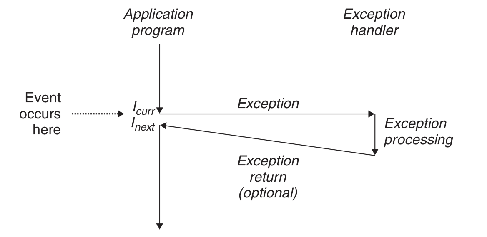
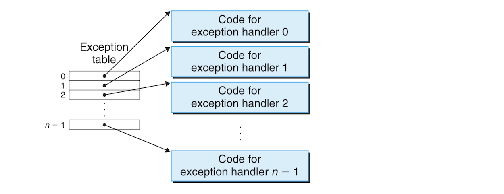
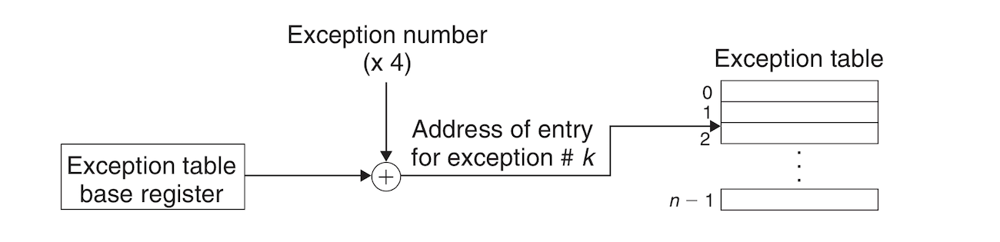
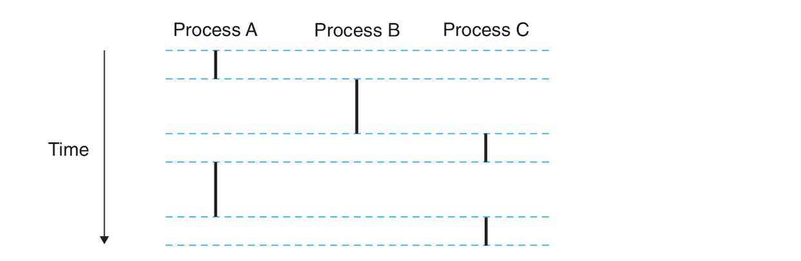
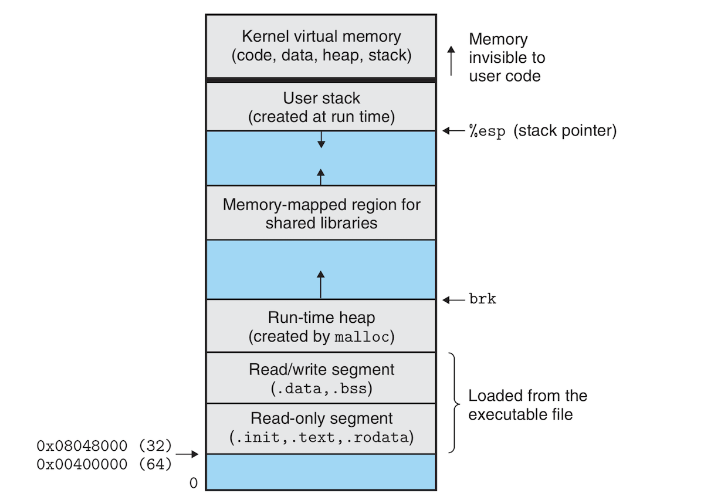

# Exceptional Control Flow:

## Introduction:
- From the time a computer is powered on until it is turned off, the program counter takes a sequence of values where each value is the address of an instruction. Each transition from one PC value to the next is called a **control transfer**. A sequence of control transfers is called **control flow**. A simple control flow involves instructions that are stored in adjacent memory locations. This simple flow is interrupted from time to time leading to situations where the instructions being executed are not in adjacent memory locations. Such situations involve instructions like jumps, calls or returns. They occur as reactions to changes in the program's state. 
- Systems do also react to changes in system state that are not related to internal program variables or the execution of a program. Examples of such reactions include packets arriving at a network adapter and getting stored in memory, or requesting data from disk and sleeping until such data arrived or parent processes being notified when their child processes have terminated.
- Modern systems make these reactions through abrupt changes to control flow called **exceptional control flow (ECF)**. ECF happens at all levels:
	- At the hardware level, "events detected by the hardware trigger abrupt control transfers to exception handlers."
	- At the OS level, the kernel transfers control from once user process to another through context switches.
	- "At the application level, a process can send a signal to another process that abruptly transfers control to a signal handler in the recipient".
	- "An individual program can react to errors by sidestepping the usual stack discipline and making **nonlocal jumps** to arbitrary locations in other functions." *(:confused: A lot of big words).*
- Reasons why ECF is important include:
	- Understanding ECF is an important prerequisite to understanding important systems and OS concepts. ECF is  fundamental building block in IO, processes and virtual memory.
	- Understanding ECF is important to understand how applications interact with the OS. Applications use **traps** (also called **system calls**) to request services from the OS such as writing/retrieving data from disk and network, creating and terminating processes, etc. Such system calls are based on ECF.
	- Understanding ECF allows you to go beyond the basics to create interesting applications that fully exploit the services provided by the OS. Example applications include shell programs and web servers.
	- Understanding ECF allows you understand concurrency.
	- Understanding ECF allows you to have a better understanding of how exceptions in software and higher level languages work. 
- The previous chapters were about application interaction with the hardware, but from now on we will focus more on application interaction with the OS. This chapter will start discussing exceptions which are an application-hardware form of ECF. We then move on to system calls which give apps access to the the OS. We then describe processes and signals, and then wrap up with nonlocal jumps which are app-level exceptions.

## Exceptions:
- An **exception** is an *abrupt* change in control flow in response to a change in the process's state. It is a form of ECF that is implemented partly by the hardware (HW) and partly by the OS. Exception implementations differ from system to system but the general principles of exceptions and exception handling the same. *Warning: exceptions can be a confusing!!!*
- The following image illustrates how an exception works:

- The processor in the image is executing the current instruction ***I<sub>curr</sub>*** when a change in the processor's *state* occurs. e processor's state is encoded in various bits and signals. This change in state is called an **event**. The event might be directly related to the current instructions; for example, the instruction might incur an arithmetic overflow or tries to divide by zero. The event might also be unrelated to the current instruction such as an IO request or a system timer going off!! :confused: *What!!*
- When the processors detects an event, it makes an *indirect procedure call (the exception)* through a jump table called the **exception table**, to an OS subroutine called the **exception handler** which is designed to handle this kind of event.
- When the exception handler finishes processing, one of 3 things can happen depending on the type of event that caused the exception:
	1. The exception returns control to the current instruction ***I<sub>curr</sub>*** that was executing before the exception occurred.
	2. The exception handler returns control to ***I<sub>next</sub>***, the instruction that was going to execute after ***I<sub>curr</sub>*** if the exception hadn't occurred.
	3. The handler aborts the interrupted program.

### Exception Handling:
- Exception handling can be confusing because it requires a close cooperation between the hardware and the OS and it's not always easy to tell which part is doing what. 
- Each exception is assigned a unique nonnegative integer called an **exception number**. Some exception numbers are assigned by the processor designers such as "divide by zero, page faults, memory access violations, break- points, and arithmetic overflows." Other exception numbers are designed by OS kernel designers such system calls and IO signals. 
- When a system boots, the OS allocates and initializes a jump table called **exception table**. Each entry ***k*** in the exception table contains the address of the handler of exception ***k***. The following image shows the structure and functionality of an exception table:

- At run time (when the system is executing a program), the processor detects an event has occurred and determines the corresponding exception number ***k***. The processor then triggers the exception by making an indirect procedure call, through entry ***k*** from the exception table, to the corresponding handler. The following image shows how the exception table is used to get the memory address of the appropriate exception handler. The exception number ***k*** is an index into the exception table whose starting address (address of what??!!! table or the first address in the table) is in a special CPU address called the **exception table base register**

- An exception is similar to a procedure call but with a few differences:
	- The processor pushes a return address on the stack before starting the handler just as in a procedure call, but the return address is either the current instruction or the next instruction depending on the type of the exception. 
	- The processor pushes additional processor stack on the stack that is necessary to restart the interrupted program when the handler returns. For example, IA32 pushes the EFLAGS register which contains current condition codes and other things onto the stack. 
	- If control is being transfered from a user program to the kernel, all of the pushed items are pushed onto the kernel's stack instead of the user's stack. 
	- Exception handlers run in **kernel mode**, meaning they have complete access to all system resources. 
- Once the exception is triggered, the act of exception handling is done in the software by the exception handler. When the handler finishes processing the event, it optionally returns to the interrupted program by executing a special *return from interrupt* instruction. This instruction pops state back onto the processor and data registers and restores the state to **user mode** if the exception has interrupted a user program and yields control back to the interrupted program.

### Classes of Exceptions:
- There are 4 classes of exceptions: **interrupts**, **traps**, **faults**, and **aborts**. The following table summarizes the characteristics of these exceptions:

| Class | Clause | Async/Sync | Return behavior |
| --- | --- | --- | --- |
| Interrupt | Signal from I/O device | Async | Always returns to next instruction |
| Trap | Intentional exception | Sync | Always returns to next instruction |
| Fault | Potentially recoverable error | Sync | Might return to current instruction |
| Abort | Nonrecoverable error | Sync | Never returns |

#### Interrupts:
- **Interrupts** occur **asynchronously** as result of signal from IO devices external to the processor. They are asynchronous because they are not caused by a program instruction but are caused by external signal. Exception handlers for interrupts are called **interrupt handlers**.
- An interrupt occurs as follows:
	- An IO device such as a network adapter or disk controller triggers an interrupt by "signaling a pin on the processor chip" :confused: on the processor and putting into the system bus the exception number identifying the the device that caused the interrupt.
	- The current instruction finishes executing. 
	- The processor notices the "interrupt pin has gone high," gets the exception number from the system bus and transfers control to the interrupt handler.
	- The interrupt handler does it what does and then returns to the next instruction in the running program. The program resumes executing as if the interrupt never happened. 
- The other 3 classes of exceptions are **synchronous** meaning they occur as a result of executing the current instruction. Such an instruction is called a **faulting instruction**. 

#### Traps and System Calls:
- **Traps** are **Intentional** exceptions that occur as a result of an executing instruction and they return control to the next instruction. Traps role in life is to provide a procedure-like interface between user programs and the kernel called **system calls**. 
- User programs sometimes need to request services from the kernel such reading files (`read`), creating a new process (`fork`), loading a new program (`execve`) or terminating the current process(`exit`). Processors provide access to such services through the special **`sycall` *n*** instruction which the user programs can execute when they want to request service ***n***. Executing `sycall` causes a trap to a trap handler which decodes the argument and calls the right kernel function.
- From the programmer's perspective, a system call is identical to a regular function call, but their implementations are different. Regular functions run in ***user mode*** which restricts the type of instructions they can use and access the same stack as other regular functions. System calls run the other hand run in kernel mode.

#### Faults:
- **Faults** occur because of errors that a fault handler might be able to correct. If the fault handler is able to correct the error, it returns control to the faulting instruction and re-executes it. Otherwise, the handler returns control to an **`abort`** routine in the kernel which terminates the program that caused the fault. 
- A *page fault* exception is a good example of a fault. It occurs when a virtual memory address whose physical counterpart is not in memory and must be retrieved from disk. The fault handler loads the page from disk and returns control to the faulting instruction. When the instruction re-executes, it can access the page and run normally to completion.

#### Aborts:
- **Aborts** occur because of unrecoverable fatal errors such as hardware errors where DRAM	or SRAM are corrupted. Abort handlers don't return control to the application program, but return control to an `abort` routine that terminates the application program.

### Exceptions in Linux/IA32:
- There are 256 exception types in both x86-64 and IA32. Numbers in the range 0-31 correspond to exceptions defined by the Intel processor designers, while 32-265 correspond to exceptions defined by the Linux OS.

#### Faults and Aborts in Linux/IA32:
- **Divide error** (exception 0) occurs when attempting to divide by zero, or when the result of a divide is too big for the destination operand. Unix aborts programs causing divide errors while Linux reports them as "Floating exceptions."
- **General protection fault** (exception 13) is common and occurs for many reasons but it usually occurs when trying to reference a undefined virtual memory area or write to a read-only area. Linux doesn't try to recover from such errors and reports them as *segmentation fault*.
- **Page fault** (exception 14). We've described this earlier. 
- **Machine check** (exception 18) occurs when a fatal hardware error is detected while executing the faulting instruction. Machine check handlers never return control to the application program.

#### Linux/IA32 System Calls:
- Linux has hundreds of system calls doing all kinds of things from process management to IO and file access, etc. 
- C programs can invoke any system call directly through the **`int` *n*** function (This is **`syscall`** in x86-64), but this is rarely used because the C standard library provides function wrappers around system calls. "The wrapper functions package up the arguments, trap to the kernel with the appropriate system call number, and then pass the return status of the system call back to the calling program." From now on, we will call system calls and their wrapper functions *system-level functions*.
- By studying how system calls work inn Linux, we might have a better understanding of the inner workings of the system. Arguments are all passed onto registers rather than the stack. "The stack pointer %esp cannot be used because it is overwritten by the kernel when it enters kernel mode." Consider the following program that prints something to standard output, but using the system-level functions `write` instead of the familiar wrapper `println`:
```c
int main(){
    write(1, "Hello, world!\n", 13); // For Some reason new line is not printed
    exit(0);
}
```
```
.section .data
string:
    .ascii "hello, world\n"
string_end:
    .equ len, string_end - string

.section .text
.globl main
main:
    # First, call write(1, "hello, world\n", 13)
    movl     $4, %eax        # System call number 4   
    movl     $1, %ebx        # stdout has descriptor 1
    movl     $string, %ecx   # Hello world string
    movl     $len, %edx      # String length
    int      $0x80           # System call code

    # Next, call exit(0)
    movl     $1, %eax        # System call number 0  
    movl     $0, %ebx        # Argument is 0     
    int      $0x80           # System call code       
```
- The system call `write` has 3 arguments:
	- The first argument `1` sends output to `stdout` (standard output).
	- The second argument is the sequence of bytes to write.
	- The third argument is the number of bytes to write. 
- In the compiled code we see how the system call numbers `$4` for the `write` system call and `$0` for the `exit` system call are pushed into register `%eax`. The system calls themselves are done with `int $0x80`.

## Processes:
- Exceptions are the building blocks allowing operating systems to have **processes**, "one of the most profound and successful ideas in computer science." *I've heard this somewhere before 🤔*.
- Processes are the one abstraction that allows a program to appear as if it is the only one running in a system and having exclusive use of the processor and memory. 
- A **process** is an instance of a program in execution. Each program in the system runs in the context of some process. The context is made of the state that the program needs to run correctly. This state includes the program's data and code stored in memory, its stack, the contents of its general-purpose registers, its program counter, environment variables and open file descriptors. 
- When a user runs a program by typing the name of an executable on the shell, the shell creates a new process and runs the executable file in the context of this process. Any application program can create a process and either run its own code or the code of another application in this newly created process. 
- The implementation of process won't be discussed here! It is the subject of an OS book. This section will be about two abstractions the process offer to applications:
	- An independent *logical control flow* that gives the illusion that the program has exclusive use of the processor.
	- A private address space giving the illusion that the program has exclusive use of memory. 

### Logical Control Flow:
- If you single step the execution of a program with a debugger, you'll see a series of PC values corresponding to instructions contained in the program's executable object file. This sequence of PC values is called **logical control flow** or **logical flow**. 
- The following image shows a system running three processes. The single physical control flow is divided into three logical flows, one for each process. Each one of the vertical lines in the image represents a portion of the logical flow of a process. The three processes are interleaved. Each one runs for some times, then processing jumps another portion of another process, then jumps back, etc. 

- The 3 processes in the image take turns in processing. At any point in time a process is either running or is **preempted** (temporarily suspended). A program might seem to have exclusive use of the processor. "The only evidence to the contrary is that if we were to precisely measure the elapsed time of each instruction, we would notice that the CPU appears to periodically stall between the execution of some of the instructions in our program." However, when the processor resumes running a process, it does so without any changes to the memory locations or registers
- A logical flow can be anything from an exception handler, process, signal handler,thread or Java process.  

### Concurrent Control Flow:
- A logical flow that overlaps in time with another logical flow is a **concurrent flow** and the two flows **run concurrently**. 
- The phenomenon of multiple flows running concurrently is called **concurrency** or **multitasking**. Each time period that a process executes a portion of its logical flow is called a **time slice**. Multitasking is also called **time-slicing**.
- Concurrency is independent of the number of processor cores in a system. If two flows overlap in time, they are concurrent regardless of whether they are running in the same processor or multiple processor cores. Concurrent programs that run in different processor cores or different computers are better called **parallel flows** (or they *run in parallel*).

### Private Address Space:
- A processes gives the illusion that a program has exclusive use of the system's address space. In a system with ***n***-bit addresses, the **address space** is set of ***2<sup>n</sup>*** possible addresses. Each process provides a program with its own **private address space**. Other processes cannot read or write bytes into the memory associated with this process. 
- The memory associated with each private address space differs from one process to another but it's generally organized according to the same principles. The following image shows the general organization of a private address space of a process in Linux with x86:

- The bottom portion of the address space is reserved for the user program, including its text, data, heap and stack portions. "Code segments begin at address `0x08048000` for 32-bit processes, and at address `0x00400000` for 64-bit processes." The top segment of the address space is reserved for the kernel. It includes the code, data and stack that the kernel uses when it executes instructions on behalf of the process (during a system call for example).

### User and Kernel Mode:
### Context Switches:

## System Call Error Handling:
## Process Control:
## Signals:
## Nonlocal Jumps:
## Tools for Manipulating Processes:
