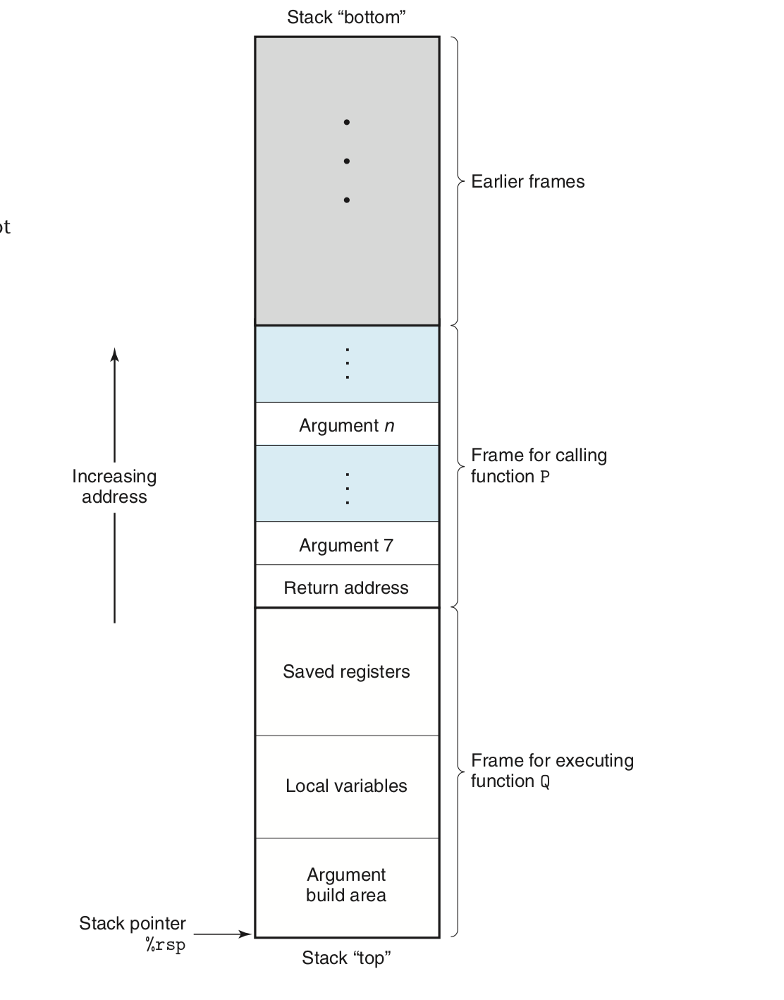
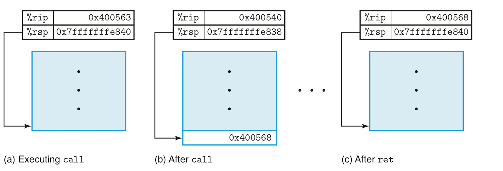
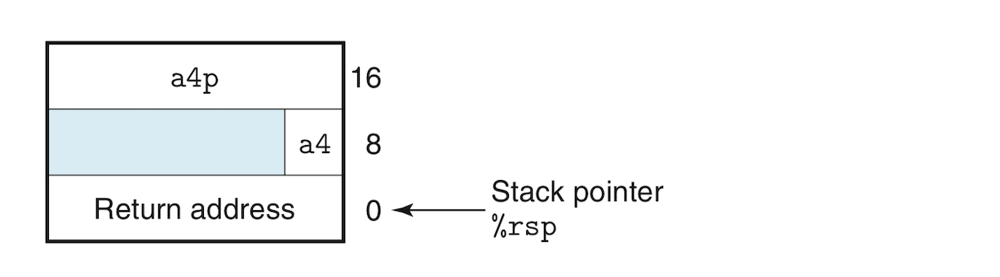
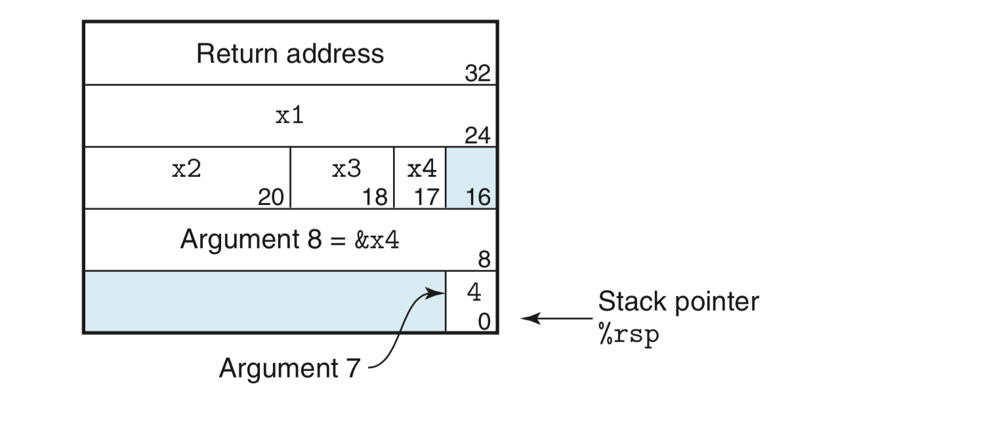
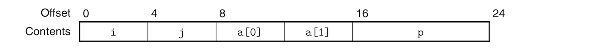
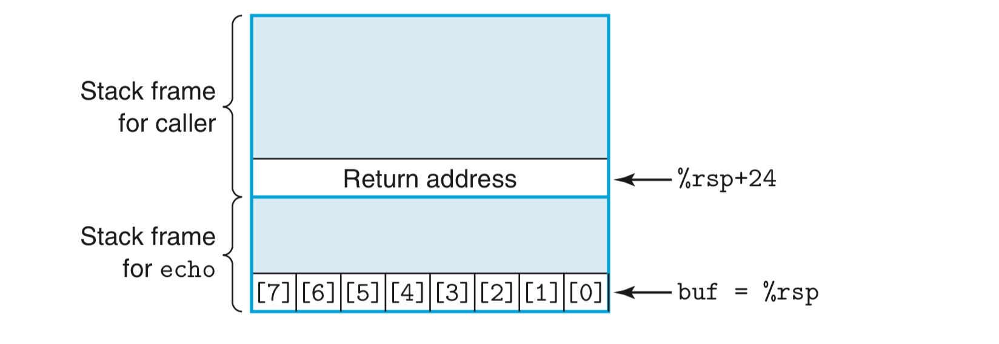
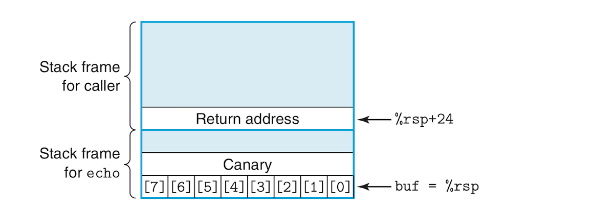

# Machine-Level Representation of Programs:
- This document will delve into machine code and its human-readable representation, assembly code.
- ّWhy learn about assembly when compilers can do it all and nobody has to write assembly anymore? Understanding the assembly code generated by the compiler allows you to:
	+ Rewrite your high-level code for better compiler optimization.
	+ Better understand the runtime behavior of your code. This behavior might be hidden by the high-level language abstraction and is only visible in its machine-level representation. 
	+ Write more secure code because security vulnerabilities can be better understood through its machine-level representation.
- This document is not about writing assembly code but about reading and understanding assembly generated by compilers and trying to the understand its links to the original high-level C code. This is more about *reverse-engineering*, sorta!
- This document will also be about the ***x86-64*** processor. It's a complex beast but the focus will be on GCC and Unix (mainly Linux).
- A quick summary of what will be discussed in this document is as follows:
	- A tour of the relationship between C, assembly and machine code.
	- The representation and manipulation of data and implementation of control constructs such as `if` and and `while` statements.
	- The implementation of procedures details, such as how they maintain a runtime stack or store local variables or pass data to other processes, etc.
	- How data structures such as arrays and structures are implemented.
	- The reasons behind out of out-of-bounds memory references and how buffer overflow attacks and other vulnerabilities happen. 
	- How floating-point data and operations work at the machine level. 

## Program Encoding:
- We've covered what happens when a C program is compiled with the GCC compiler [here](computerSystems.md/#2-programs-are-translated-by-other-programs-into-different-forms).
- To better understand the relationship between C code and compiled assembly, we use the **`-Og`** option with GCC to produce machine code that is not optimized and close in structure to the original C code.

### Machine-Level Code:
- Two very important machine-level Programming abstractions are:
	1. The ISA (*instruction set architecture*) which defines the processor state, the format of the instructions and the effect these instructions have on the state. These instructions appear to execute in sequence but in effect the processor might execute them simultaneously while making sure they behave as if they execute in sequence.
	2. *Virtual memory* which gives the illusion the process has access to a very long array of bytes but that array is an abstraction of a combination of multiple hardware memories and operating system software.
- However, the machine code that you see in the form of assembly is not as abstracted as high-level C and doesn't hide many of the things that you are totally oblivious to when only coding in high-level languages. Examples of these things which have to do with the processor's state include:
	- The **program counter (PC)**: known as **`%rip`** in x86-64. It indicates the address of the next instruction to be executed. 
	- The integer **register file** contains 16 registers storing 64-bit values. These registers can hold addresses (C pointers) and integer data. They are used to keep track of critical parts of the program's state and hold temporary data such as local function data and data to be returned.
	- The condition code registers hold information about most recently executed logic or arithmetic instructions. These information are used for the control of data flow during loops and conditionals.
	- A group of vector registers used to hold one or more integer or floating-point values. 
- While your run-of-the-mill high-level language declare and allocate in memory objects of different data types, assembly only sees a large byte-addressable array. Aggregate data such as arrays and structures are collections of contiguous bytes and scalar data such as integers and floats are all the same. Assembly doesn't differentiate between signed and unsigned integers or between pointers and integers. 
- The program's memory contains:
	- The executable code of the program. 
	- Information required by the OS.
	- Run-time stack for managing procedure calls and returns.
	- Blocks of memory allocated by the user through the `malloc` function.
- Our assembly operates on the virtual memory which an abstraction that hides and simplifies the inner workings of hardware memory. The OS manages translating between virtual memory and the complexities of the metal.
- Machine instructions perform very basic actions such as adding two numbers stored in registers, moving data from memory to a register or branch to a new instruction address. The compiled code is a sequence of such instructions.

### Code Examples
```c
long mult2(long, long);

void multstore(long x, long y, long *dest){
    long t = mult2(x, y);
    *dest = t;
}
```
- To get the assembly output of the above C program (let's say it's in a pogram named `wawa.c`), we use the following command:
```sh
gcc -Og -S wawa.c
```
- In this command we instruct the gcc to output the files's assembly equivalent. **`-Og`** as know prevents optimization. The assembly output should looks as follows:

```
multstore:
	pushq	%rbx
	movq	%rdx, %rbx
	call	mult2
	movq	%rax, (%rbx)
	popq	%rbx
	ret
```
- I tried this on OS X and got a different output that shares a lot with this one. I also tried on Ubuntu Linux and it was essentially the same as this one bar the directives that I have removed. 
- Each indented line in the assembly code represents a single machine instruction. Notice how all variable names and data types have been stripped away. 
- Using the following command, you can generate an object code from the C file:
```bash
gcc -Og -c wawa.c
```
- The generated object file `wawa.o` contains the machine code we saw earlier but it's in binary format consisting of the following 14-byte sequence:
```
53 48 89 d3 e8 00 00 00 00 48 89 03 5b c3
```
- We can use a *disassembler* to disassemble the object file `wawa.o` to get this binary format along with its assembly mnemonics. Linux favorite disassemble is **`objdump`** which we'd use with the option **`-d`** as follows:
```sh
objdump -d wawa.o
```
- `objdump` outputs the following:
```
0000000000000000 <multstore>:
   0:	53                   	push   %rbx
   1:	48 89 d3             	mov    %rdx,%rbx
   4:	e8 00 00 00 00       	callq  9 <multstore+0x9>
   9:	48 89 03             	mov    %rax,(%rbx)
   c:	5b                   	pop    %rbx
   d:	c3   
```
- To the left are the 14 bytes we saw earlier in the `wawa.o` object file. and to the right are the instructions they correspond to in assembly. You can notice how binary instructions range between 1 and 5 bytes in length an that they hhave a slightly different format from the assembly generated by gcc such as that gcc's `pushq` is replaced by `push`.
- If we create a `main.c` file and populate it with a `main` function and a definition fo `mult2` function and compile it along with `wawa.c` and have everything linked together, and then disassembled we will obtain a file that contains something similar to the following code:
```
000000000040054 <multstore>:
   400540:	53                   	push   %rbx
   400541:	48 89 d3             	mov    %rdx,%rbx
   400544:	e8 00 00 00 00       	callq  40058b <mult2>
   400549:	48 89 03             	mov    %rax,(%rbx)
   40054c:	5b                   	pop    %rbx
   40054d:	c3                   	retq
   40054e:	90                   	nop
   40054e:	90                   	nop
```
- This is similar to the the isolated object dump of `wawa.o`, but does also have some important differences:
	- Addresses on the left of each instruction in this program are different. They kinda look real as opposed to the earlier *placeholders*.
	- The address of the function to be called by `callq` instruction is filled up and `<multstore+0x9>` is replaced by `<mult2>`.
	- The final two instructions are just fillers to grow the code to be 16 bytes instead of just 14. This will allow for a better placement of the next block of code which is better for performance :confused:. (*You can say that walking down a stair with uniform-sized steps is better than if steps had different sizes*).
 
### Formatting:
- The following snippet is of the full assembly code generated by gcc:
```
	.file	"lala.c"
	.text
	.globl	multstore
	.type	multstore, @function
multstore:
.LFB0:
	.cfi_startproc
	pushq	%rbx 
	.cfi_def_cfa_offset 16
	.cfi_offset 3, -16
	movq	%rdx, %rbx
	call	mult2@PLT
	movq	%rax, (%rbx)
	popq	%rbx
	.cfi_def_cfa_offset 8
	ret
	.cfi_endproc
.LFE0:
	.size	multstore, .-multstore
	.ident	"GCC: (Ubuntu 7.3.0-27ubuntu1~18.04) 7.3.0"
	.section	.note.GNU-stack,"",@progbits
```
- This code has a lot of information the programmer doesn't care about or need, but also lack a lot of information about how this code works or what it's doing!
- From now on we will ignore stuff we don't need to know such as directives which start with **`.`** such as `.size	multstore, .-multstore`. On the other hand comments will be added to lines corresponding to the C code as the following example shows for a single instruction (the comment follows the symbol `#`):
```
movq	%rax, (%rbx) # Copy dest to %rbx
``` 
- Since we live in a Unix/Linux world, we use the ATT assembly format rather than Intel's format which is encountered in Micosofty stuff and Intel's documentation. It's a little different in that has a reversed order of operands to that ATT, doesn't use size indicators such as `q` at the end of `pushq`, etc.

## Data Formats:
- The following table shows the different x86-64 representations corresponding to C data types:

| C declarations | Intel data types | Assembly-code suffix | Size in bytes |
| --- | --- | --- | --- |
| <code>char</code> | Byte | <code>b</code> | 1 |
| <code>short</code> | Word | <code>w</code> | 2 |
| <code>int</code> | Double word | <code>l</code> | 4 |
| <code>long</code> | Quad word  | <code>q</code> | 8 |
| <code>char *</code> | Quad word | <code>q</code> | 8 |
| <code>float</code> | Single precision | <code>s</code> | 4 |
| <code>double</code> | Double precision | <code>l</code> | 8 |

- The first x86 processor used a 16-bit architecture, that's why 2 bytes are called a **word**, 32 bits are a **double word** and a 64-bit bit vector is called a **quad word**.
- Instructions can operate on words of different lengths, hence the different assembly suffixes such as **`b`**, **`q`**, and **`s`**.

## Accessing Information:
- x86-64 CPUs have 16 **general-purpose registers** which are used to store 64-bit values of integer and pointer data types. These registers names start with **`%r`** are shown in the following table:

| Functionality | 63-0 | 31-0 | 15-0 | 7-0 |
| --- | --- | --- | --- | --- |
| Return value | <code>%rax</code> | <code>%eax</code> | <code>%ax</code> | <code>%al</code> |
| Callee saved | <code>%rbx</code> | <code>%ebx</code> | <code>%bx</code> | <code>%bl</code> |
| 4th argument |<code>%rcx</code> | <code>%ecx</code> | <code>%cx</code> | <code>%cl</code> |
| 3rd argument |<code>%rdx</code> | <code>%edx</code> | <code>%dx</code> | <code>%dl</code> |
| 2nd argument |<code>%rsi</code> | <code>%esi</code> | <code>%si</code> | <code>%sil</code> |
| 1st argument |<code>%rdi</code> | <code>%edi</code> | <code>%di</code> | <code>%dil</code> |
| Callee saved |<code>%rbp</code> | <code>%ebp</code> | <code>%bp</code> | <code>%bpl</code> |
| Stack pointer |<code>%rsp</code> | <code>%esp</code> | <code>%sp</code> | <code>%spl</code> |
| 5th argument |<code>%r8</code> | <code>%r8d</code> | <code>%r8w</code> | <code>%r8b</code> |
| 6th argument argument |<code>%r9</code> | <code>%r9d</code> | <code>%r9w</code> | <code>%r9b</code> |
| Caller saved |<code>%r10</code> | <code>%r10d</code> | <code>%r10w</code> | <code>%r10b</code> |
| caller saved |<code>%r11</code> | <code>%r11d</code> | <code>%r11w</code> | <code>%r11b</code> |
| Callee saved |<code>%r12</code> | <code>%r12d</code> | <code>%r12w</code> | <code>%r12b</code> |
| Callee saved |<code>%r13</code> | <code>%rd13</code> | <code>%r13w</code> | <code>%r13b</code> | 
| Callee saved |<code>%r14</code> | <code>%rd14</code> | <code>%r14w</code> | <code>%r14b</code> |
| Callee saved |<code>%r15</code> | <code>%rd15</code> | <code>%r15w</code> | <code>%r15b</code> |

- The The table also shows the historical registers found in 32-bit and 16-bit older generations x86 processors. These older generation registers accommodating different architectures can still be used in x86-64 and their conventions show the evolution of x86 architecture. 
- The original x86 16-bit registers were were expanded with the IA32 to hold 32 bits and names were changed so **`%ax`** became **`%eax`** and **`%bp`** became **`%ebp`**, etc. With IA64, these registers started holding 64 bits of data and names like **`%ebp`** became **`%rbp`**. 8 new registers were added and you can refer to the table above on how they were named. 
- Instructions can use these registers to operate on different data sizes, so byte instructions operate on the least significant byte in the register, word operators can use use the least significant 16-bits, etc. 
- The table above also shows the functionality and purposes of these registers. The stack pointer **`%rsp`** is unique. It indicates the end of the run time stack of a program, whatever that means! Some instructions are specialized to read from and write to this register. The other registers are more flexible. Some of them have specialized instructions and some are used for managing the stack such as returning values from functions or passing arguments.. etc. We will see more about these!

### Operand Specifiers:
- Most instructions have one or more operands that specify the source values used in the operation and the destination location where to place the results. Source values can be constants or read from registers or memory. Results can be stored in registers or memory. 
- The following table shows the different forms operands can take:

| Type | Form | Operand value | Name |
| --- | --- | --- | --- |
| Immediate | *$Imm* | *Imm* | Immediate | 
| Register | *r<sub>a</sub>* | R[r<sub>a</sub>] | Register | 
| Memory | *Imm* | M[*Imm*] | Absolute | 
| Memory | *(r<sub>a</sub>)* | M[R[r<sub>a</sub>]] | Indirect | 
| Memory | *Imm(r<sub>b</sub>)* | M[*Imm* + R[r<sub>b</sub>]] | Base +  Displacement | 
| Memory | *(r<sub>b</sub>, r<sub>i</sub>)* | M[R[r<sub>b</sub>] + R[r<sub>i</sub>]] | Indexed | 
| Memory | *Imm(r<sub>b</sub>, r<sub>i</sub>)* | M[*Imm* + R[r<sub>b</sub>] + R[r<sub>i</sub>]] | Indexed | 
| Memory | *(, r<sub>i</sub>, s)* | M[R[r<sub>i</sub>] · *s*] | Scaled Indexed | 
| Memory | *Imm(, r<sub>i</sub>, s)* | M[*Imm* + R[r<sub>i</sub>] · *s*] | Scaled Indexed | 
| Memory | *(r<sub>b</sub>, r<sub>i</sub>, s)* | M[R[r<sub>b</sub>] + R[r<sub>i</sub>] · *s*] | Scaled Indexed | 
| Memory | *Imm(r<sub>b</sub>, r<sub>i</sub>, s)* | M[*Imm* + R[r<sub>b</sub>] + R[r<sub>i</sub>] · *s*] | Scaled Indexed | 

- There are 3 types of operands:
	- *Immediate* is used for constant values. It uses **`$`** followed by standard C notation for integers as in **`$-14`** or **`0xFD2`**. Remember that different instructions allow for different ranges of values. 
	- *Register* denotes the contents of registers. In the table above, an arbitrary  register ***a*** h *as the symbol**r<sub>a</sub>***. It's part of the machine's set of registers ***R*** and in this respected represented by ***R[r<sub>a</sub>]***.
	- *Memory reference* where we access a memory location using a computed address (also called *effective address*). Memory is viewed as a large byte of array which is denoted by ***M<sub>b</sub>[Addr]***. This notation references the *b*-byte value stored in Memory starting at address ***Addr***. The subscript *b* is not necessary since we know it's all about bytes. 
- The table above shows how there are many different *addressing modes* allowing for different ways of referencing memory. The most general form is at the bottom of the table and is denoted by ***Imm(r<sub>b</sub>, r<sub>i</sub>, s)***. It has an immediate register ***Imm***, a *base register* ***r<sub>b</sub>***, an *index register* ***r<sub>i</sub>*** and a *scale factor* ***s***. ***s*** must be either 1, 2, 4 or 8. The base and index must be 64-bit registers. The effective address is computed as ***Imm* + R[r<sub>b</sub>] + R[r<sub>i</sub>] · *s***. This form is used when referencing elements of arrays. The other forms are specialized forms of this general form where certain parts of the annotation are removed. 

### Date Movement Instructions:
- Generally speaking, instructions that perform the same type of operation but differ in their operand sizes can be grouped together in so called *instruction classes*.
- Much of machine code is about moving data from one location to another. The simplest data movement instructions belong to the class ***MOV***. These instructions simply copy data from a source location to a destination location without any transformation. The class has 4 instructions **`movb`**, **`movw`**, **`movl`**, **`movq`**. The only difference between the 4 instructions is that they move 1, 2, 4, 8 bytes of data respectively. The following table details their behavior:

| Instruction | Effect | Description |
| --- | --- | --- |
| MOV *S, D* | *D ← S* | Move |
| &nbsp;&nbsp;&nbsp;&nbsp;<code>movb</code> |  | Move byte |
| &nbsp;&nbsp;&nbsp;&nbsp;<code>movw</code> |  | Move word |
| &nbsp;&nbsp;&nbsp;&nbsp;<code>movl</code> |  | Move double word |
| &nbsp;&nbsp;&nbsp;&nbsp;<code>movq</code> |  | Move quad word |
| <code>movabsq</code> *I, R* | *R ← I* | Move absolute quad word |

- Let's also just establish that an instruction in Att assembly follows this general syntax:
```
instruction    source    destination
```
- The source of a ***MOV*** instruction can be an immediate value or a value stored in memory or a register. The destination can only be a register or memory. You also cannot have both ***MOV*** operands as memory location. To copy data between two locations in memory, you need two instructions: One to copy (load) the data from the first memory to a register and a second one to copy data from that register to the other location in memory. 
- Register operands can be  the named portions of these registers with sizes 1, 2 , 4 or 8 bytes. These portions must match the last character of the operation name (`b`, `w`, `l` or `q`) :confused:. Generally, ***MOV*** only updates the bytes of a register or memory indicated by the destination operand. The exception to is the **`movl`** instruction which will update the higher order 4 bytes of a register to 0. 
- **`movq`** can only have an immediate source operand that is 32-bit long in 64-bit architecture. This value is then sign extended to produce a 64-bit value for the destination :confused:. The **`movabsq`** instead can have a 64-bit immediate source but it can also only have a register as a destination. 
- I think the instruction's ending must match the size of the destination if the destination is a register, otherwise it matches a source register if the destination is memory.
- The following example shows how data movement changes destination registers (note how **`movl`** changes the upper bytes to zeros):
```
movabsq $0x0011223344556677, %rax    # %rax = 0011223344556677
movb    $-1, %al                     # %rax = 00112233445566FF
movw    $-1, %ax                     # %rax = 001122334455FFFF
movl    $-1, %eax                    # %rax = 00000000FFFFFFFF
movq    $-1, %rax                    # %rax = FFFFFFFFFFFFFFFF
```
- You can also copy a source value to a larger destination using two different classes of instructions. These instructions can only copy data from a register or a memory location to a register. 
- The first of thes two classes is ***MOVZ***. It copies data and fill the higher order bytes of the destination with zeros as the following table shows. Notice there is no **`movzlq`**. The reason is that instructions with a 4-byte source and an 8-byte register as a destination fill up the upper bytes with zeros, so **`movl`** will do here. This is not the case with sign-extension, though as the sign-extended class ***MOVS*** support all 3 sizes. The following table describes these instructions:

| Instruction | Effect | Description |
| --- | --- | --- |
| MOVZ *S, R* | *R ← ZeroExtend(S)* | Move with zero extension |
| &nbsp;&nbsp;&nbsp;&nbsp;<code>movzbw</code> |  | Move zero-extended byte to word |
| &nbsp;&nbsp;&nbsp;&nbsp;<code>movzbl</code> |  | Move zero-extended byte to double word |
| &nbsp;&nbsp;&nbsp;&nbsp;<code>movzwl</code> |  | Move zero-extended word to  double word |
| &nbsp;&nbsp;&nbsp;&nbsp;<code>movzbq</code> |  | Move zero-extended byte to quad word |
| &nbsp;&nbsp;&nbsp;&nbsp;<code>movzwq</code> |  | Move zero-extended word to quad word |

- THe ***MOVS*** class of instructions fill the upper bytes by sign extension, copies of the source's most significant bit. The following table describes these operations:

| Instruction | Effect | Description |
| --- | --- | --- |
| MOVS *S, R* | *R ← SignExtend(S)* | Move with sign extension |
| &nbsp;&nbsp;&nbsp;&nbsp;<code>movsbw</code> |  | Move sign-extended byte to word |
| &nbsp;&nbsp;&nbsp;&nbsp;<code>movsbl</code> |  | Move sign-extended byte to double word |
| &nbsp;&nbsp;&nbsp;&nbsp;<code>movswl</code> |  | Move sign-extended word to  double word |
| &nbsp;&nbsp;&nbsp;&nbsp;<code>movsbq</code> |  | Move sign-extended byte to quad word |
| &nbsp;&nbsp;&nbsp;&nbsp;<code>movswq</code> |  | Move sign-extended word to quad word |
| &nbsp;&nbsp;&nbsp;&nbsp;<code>movslq</code> |  | Move sign-extended double word to quad word |
| <code>cltq</code> | <code>%rax</code> *←* SignExtend(<code>%eax</code>) | sign-extend <code>%eax</code> to <code>%rax</code> |

- The **`cltq`** only has **`%eax`** as a source and **`%rax`** as a destination. It has the same effect as **`movslq %eax, %rax`** but is more compact.
- The following table shows examples of how **`MOVZ`** and **`MOVZ`** change destination addresses:
```x86asm
movabsq $0x0011223344556677, %rax    # %rax = 0011223344556677
movb    $0xAA, %dl                   # %rax = AA (this hex for binary 1010. Bit sign is 1)
movb    %dl,  %al                    # %rax = 00112233445566AA
movsbq  %dl, %rax                    # %rax = FFFFFFFFFFFFFFAA
movzbq  %dl, %rax                    # %rax = 00000000000000AA
```

### Date Movement Examples:
- The following two snippets show an example of data movement in both C and assembly:
```c
long exchange(long *xp, long y){
	long x = *xp;
	*xp = y;
	return x;
}
```
```x86asm
# long exchange(long *xp, long y) = xp is in %rdi, y in %rsi
exchange:
    movq    (%rdi), %rax    # put get value of x frm xp and sets it as return value
    movq    %rsi, (%rdi)    # store y at xp
    ret                     # return
```
- Let's dissect this program and see what is going on in assembly and how it corresponds to the C code:
	- When the procedure begins execution, C variables **`xp`** and**`y`** are stored in registers **`%rdi`** and **`%rsi`**. 
	- An instruction reads **`x`** pointed to in memory by register **`%rdi`** and stores it in **`%rax`**. The value stored in **`%rax`**, which is **`x`**, will be returned.
	- The next instruction writes the value of **`%rsi`** or **`y`** into **`xp`**.
- This code demonstrates that:
	- Pointers are memory addresses. 
	- Dereferencing pointers is copying memory values into registers. 
	- Local variables are copied into registers for faster retrieval. 

### Pushing and Popping Stack Data:
- There are also data movement instructions specialized in pushing data to and popping it from the program's stack. I don't know what that mysterious stack is but the book states that it is important in procedure calls. 
- The image below illustrates how an x86-64 stack works. The stack is stored in some region in memory. It grows downward such that its top element has the lowest memory address among its element addresses. The stack is usually drawn with its top in the bottom (it's upside down) as the following figure shows:

- The **`%rsp`** register is the **stack pointer**. It holds the address of the top element of the program's stack. 
- The following table shows the two stack instructions and their behavior:

| Instruction | Effect | Description |
| --- | --- | --- |
| <code>pushq</code> *S* | R[<code>%rsp</code>] *←* R[<code>%rsp</code>] - 8;<br> M[R[<code>%rsp</code>]] ← *S* | Push quad word
| <code>popq</code> *D* | *D* *←* M[R[<code>%rsp</code>]];<br> R[<code>%rsp</code>] R[<code>%rsp</code>] + 8 | Pop quad word

- **`pushq`** allows you to push data onto the stack. It takes a single operand, the source data to be pushed onto the stack. This instruction involves decrementing the value of the stack pointer by 8 bytes (remember that the stack grows towards the lower memory addresses), and then writing the source data into the new top-of-stack address. This is equivalent to the following two instructions:
```
subq    $8, %rsp      # Decrement stack pointer
movq    %rbp, (%rsp)  # Store %rbp on the stack
```
- **`popq`** plucks the top of the stack and places it in its destination operand. Like **`pushq`**, **`popq`** also takes only one operand, but it's a destination operand. This instruction reads data from the top of the stack and writes it to its destination operand and then increments the stack pointer by 8 bytes (meaning the stack's size is reduced). The data in that region of memory that is no longer part of the stack stays there until it's overwritten by another operation, probably another **`pushq`**. The top of the stack, however, is always indicated by the **`%rsp`** register.
- The stack is part of the same memory as the rest of the program and its data. This means the program can access arbitrary parts of the stack (maybe without having to refer to the stack pointer; maybe changing parts of the stack and stack pointer not in the intended way :confused:).  

## Arithmetic and Logical Operations:
- The following table shows several logic and integer arithmetic instructions. The table only shows instruction classes because there are specific instructions for each data size, except for **`leaq`** which is the only instruction in its instruction class. The instruction class ***ADD*** has instructions **`addb`**, **`addw`**, **`addl`** and **`addq`** for adding bytes, words, double words and quad words respectively. As you can see there different types of instruction classes which are equivalent to their counterparts in higher-level languages such as *unary*, *binary* and *shift* instructions:

| Instruction | Effect | Description |
| --- | --- | --- |
| <code>leaq</code> *S, D* | *D ← &S* | Load effective address |
| INC *D* | *D ← D + 1* | Increment |
| DEC *D* | *D ← D - 1* | Decrement |
| NEG *D* | *D ← -D* | Negate |
| NOT *D* | *D ← ~D* | Complement |
| ADD *S, D* | *D ← D + S* | Add |
| SUB *S, D* | *D ← D - S* | Subtract |
| IMUL *S, D* | *D ← D · S* | Multiply |
| XOR *S, D* | *D ← D ^ S* | Exclusive-or |
| OR  S, D* | *D ← D* \| *S* | Or |
| AND *k, D* | *D ← D & S* | And |
| SAL *k, D* | *D ← D << S* | Left shift |
| SHL *k, D* | *D ← D << S* | Left shift(Same as SAL) |
| SAR *k, D* | *D ← D >> <sub>A</sub>S* | Arithmetic right shift
| SHR *k, D* | *D ← D >> <sub>L</sub>S* | Logical right shift |

### Load Effective Address:
- The **load effective address** **`leaq`** is similar kinda similar to **`movq`**. It loads data from memory to a register, but it does "not reference memory", whatever that means :confused:. It doesn't copy the content of that memory location but copies the effective address. For example, if register **`%rdx`** contains ***x***, the the instruction **`leaq 7(%rdx,%rdx,4), %rax`** copies the value ***5x + 7*** to **`%rax`**. The destination operand of **`leaq`** is always a register. - The compiler finds interesting ways to use **`leaq`** for all kinds of optimizations. The following C program and its assembly counterpart are an example of how **`leaq`** is used to perform basic arithmetic such as addition and multiplication. It should be fairly obvious what is happening here:
```c
long scale(long x, long y, long z){
	long t = x + 4 * y + 12 * z;
	return t;
}
``` 
```
scale:
	leaq	(%rdi, %rsi, 4), %rax
	leaq	(%rdx, %rdx, 2), %rdx
	leaq	(%rax, %rdx, 4), %rax
	ret
```

### Unary and Binary Operations:
- Unary instructions take one operand which functions both as a source and a destination. The operand can be a register or a memory location. **`incq (%rsp)`** increments the value of the element at at the top of the stack. It is equivalent to the **`++`** operator in C.
- In binary operations, the second operand is both a source and a destination while the first operand is just a source. They are similar to the C construct **`x -= y`**. 
- Binary instructions look weird in non-commutative operations such as **`subq %rax, %rdx`** which should be read as *subtract **`%rax`** from **%rdx***.
- The first operand can be immediate, a register or memory location, but the second operand can only be a register or memory location. 
- The two operands cannot be both memory locations. When the second operand is a memory location, the value is extracted first from memory, the operation is carried out and the result is put back in that memory location.

### Shift Operations:
- In shifting instructions, the first operand is the value to make the shift with, while the second operand is the value to be shifted. 
- You can do both an arithmetic and logical right shifts.
- The shift amount can be specified by either an immediate or the the one-byte register **`%cl`**. This one byte register can encode ***2<sup>8</sup> - 1 = 255*** values. x86-64 determines the value of shift from the lower-order bits of register **`%cl`** so if the value of **`%cl`** is ***0xFF***, **`salb`** will cause a ***7***-bit shift,  **`salw`** will cause a ***15***-bit shift, **`sall`** will cause a ***7***-bit shift, **`sall`** will cause a ***31***-bit shift, and **`salq`** will cause a ***63***-bit shift.
- The destination operand can be either a register or a memory location.
- ***SAL*** and  ***SHL*** are identical, but ***SAR*** is for arithmetic right shifts while ***SHR*** is for logical right shifts.

## Control:
- In addition to *straight-line* code where instructions are executed one after another, there are also loops, conditionals and switches whose execution depend one way or another on the outcomes of tests applied to data. Machine code implements conditional  behavior in two forms: it tests the data and then changes either the control flow or data flow based on the results of these tests.
- Normally, instructions execute sequentially, but this flow can be altered with a ***JUMP*** instruction which transfers control to another part of the program based on the result of some test. 

### Condition Codes:
- We've seen one type of registers so far. The CPU does also have another set of one-bit regisers called **condition registers**. These registers describe the attributes of the latest arithmetic or logic operation. These registers are then test to perform conditional branching.
- Some of the more common condition registers are:
	- **`CF`**: **Carry flag**. It indicates that the most recent operation caused a carry out of the most significant bit. It is used to detect an unsigned overflow.
	- **`ZF`**: **Zero flag**. It indicates that the most recent operation resulted in a zero.
	- **`SF`**: **Sign flag**. It indicates that the most recent operation resulted in a negative value.
	- **`OF`**: **Overflow flag**. It indicates that the most recent operation caused a two's-complement overflow (either positive or negative).
- If we are testing the C expression **`t = a + b`**, you can think of these condition registers as performing following C operations:
	- **`CF`**: **`(unsigned) t < (unsigned) a`**
	- **`ZF`**: **`(t == 0)`**
	- **`SF`**: **`(t < 0)`**
	- **`OF`**: **`(a < 0 == b < 0) && (t < 0 != a < 0)`**

- The logic and arithmetic operations we saw [earlier](#arithmetic-and-logical-operations) alter condition codes, except for **`leaq`** because it only manipulates addresses but not their contents. These operations alter condition codes according to certain rules that I am not sure about. For example, "`xor`, the carry and overflow flags are set to zero":confused::confused:, why??! Shifts set the carry flag to the last bit carried out, etc. 
- There are also 2 instruction classes that only change condition codes and have no effect on their operands.
	- The ***CMP*** instructions set the condition codes based the differences between the operands. It acts like ***SUB*** but doesn't alter the destination operand. Be careful about the order of the operands in the ATT notation we use here. These instructions set the zero flag if the two operands are equal. The other condition codes can be used to determine ordering between the operands.
	- The ***TEST*** instructions act like ***AND*** but don't alter their destination operands. They usually involve repeating an operand as in **`tesq %rax, %rax`** or one of the operands can be a mask for testing certain bits.
- The following table details how ***CMP*** and ***TEST*** instructions work:

| Instruction | Effect | Description |
| --- | --- | --- |
| CMP *S<sub>1</sub>, S<sub>2</sub>* | *S<sub>2</sub> − S<sub>1</sub>* | Compare |
| &nbsp;&nbsp;&nbsp;<code>cmpb</code> |  | Compare byte |
| &nbsp;&nbsp;&nbsp;<code>cmpw</code> |  | Compare word |
| &nbsp;&nbsp;&nbsp;<code>cmpl</code> |  | Compare double word |
| &nbsp;&nbsp;&nbsp;<code>cmpq</code> |  | Compare quad word |
| TEST *S<sub>1</sub>, S<sub>2</sub>* | *S<sub>2</sub> & S<sub>1</sub>* | Test |
| &nbsp;&nbsp;&nbsp;<code>testb</code> |  | Test byte |
| &nbsp;&nbsp;&nbsp;<code>testw</code> |  | Test word |
| &nbsp;&nbsp;&nbsp;<code>testl</code> |  | Test double word |
| &nbsp;&nbsp;&nbsp;<code>testq</code> |  | Test quad word |

### Accessing Condition Codes:
- Instead of reading condition codes directly, there are three ways they can be used:
	- A single byte can be set to ***1*** or ***0*** based on a combination of condition codes.
	- A jump to another part of the program can be conditionally effectuated.
	- Data can be conditionally transferred. Transferred where?! :confused:.
- The following table shows instructions that set a single byte to ***0*** or ***1*** based on certain combinations of condition codes:

| instruction | Synonym | Effect | Set condition |
| --- | --- | --- | --- |
| <code>sete</code>  *D*| <code>setz</code> | *D ← <code>ZF</code>* | Equal / zero |
| <code>setne</code>  *D*| <code>setnz</code> | *D ← <code>~ZF</code>* | Not equal / not zero |
| #### |  |  |  |
| <code>sets</code>  *D*|  | *D ← <code>SF</code>* | Negative |
| <code>setns</code>  *D*|  | *D ← <code>~SF</code>* | Nonnegative |
| #### |  |  |  |
| <code>setg</code>  *D*| <code>setnle</code> | *D ← <code>~(SF ^ OF) & ~ZF</code>* | (Unsigned >) |
| <code>setge</code>  *D*| <code>setnl</code> | *D ← <code>~ (SF ^ OF)</code>* | (Unsigned >=) |
| <code>setl</code>  *D*| <code>setnge</code> | *D ← <code>SF ^ OF</code>* | (Unsigned  <) |
| <code>setle</code>  *D*| <code>setng</code> | *D ← <code>(SF ^ OF) OR ZF</code>* | (Unsigned <=) |
| #### |  |  |  |
| <code>seta</code>  *D*| <code>setnbe</code> | *D ← <code>~CF & ~ZF</code>* | Above (signed >) |
| <code>setae</code>  *D*| <code>setnb</code> | *D ← <code>~CF</code>* | Above or equal (signed >=) |
| <code>setb</code>  *D*| <code>setnae</code> | *D ← <code>CF</code>* | Below (signed <) |
| <code>setbe</code>  *D*| <code>setna</code> | *D ← <code>CF OR ZF</code>* | Below or equal (signed <=) |

- These instructions belong to the ***SET*** class. They differ in the combinations of condition codes that they consider. The suffixes of these instructions don't refer to operand sizes but refer to conditions so **`setl`** refers to "set less", etc. 
- The destination of a ***SET*** instruction is either the lower-order byte of a register or a single-byte memory cell which is set to either 1 or 0. To generate a 32-bit or 64-bit value from this single byte we musts also set the higher-order bits to zeros as the following example shows:

```
# int comp(data_t a, data_t b)
# a in %rdi, b in %rsi

comp:
	cmpq	%rsi, %rdi 	# Compare a:b
	setl 	%al 		# Set low-order byte of %eax to 0 or 1
	movzbl	%al, %eax 	# Clear rest of %eax (and rest of %rax)
	ret
```
- An interesting feature of the of the ***SET*** class is that the same instruction might have multiple names as the table above shows. For example, **`setae`** (set above or equal) is the same as **`setb`** (set not 
below).

### Jump Instructions:
- A ***JUMP*** instruction causes execution to jump to a n out of order position in the program instead of following the normal flow where each instruction follows the one before it. Jump destinations are indicated by a ***label***. They act like the C **`goto`** construct as the following example shows:
```
	movq 	$0, %rax		# Set %rax to 0
	jmp 	.L1				# Jump statement, goto .L1
	movq	(%rax), %rdx	# Null pointer dereference (skipped)
.L1:
	popq 	%rdx			# Jump target
```
- The **`jmp .L1`** instruction causes the program to skip over **`movq`** and resume execution at **`popq`**. The assembler determines addresses for labels and replaces **jump targets** with the right addresses.

| instruction | Synonym | Jump Condition | Description |
| --- | --- | --- | --- |
| <code>jmp</code>  *Label* |  | <code>ZF</code> | Direct jump |
| <code>jmp</code>  **Operand* |  | <code>ZF</code> | Indirect jump |
| #####  |  |  |  |
| <code>je</code>  *Label* | <code>jz</code> | <code>ZF</code> | Equal / zero |
| #####  |  |  |  |
| <code>jne</code>  *Label* | <code>jnz</code> | <code>~ZF</code> | Not equal / not zero |
| #####  |  |  |  |
| <code>js</code>  *Label* |  | <code>SF</code> | Negative |
| <code>jns</code>  *Label* |  | <code>~SF</code> | Nonnegative |
| #####  |  |  |  |
| <code>jg</code>  *Label* | <code>jnle</code> | <code>~(SF ^ OF) & ~ZF</code> | Greater (signed >) |
| <code>jge</code>  *Label* | <code>jnl</code> | <code>~(SF ^ OF)</code> | Greater or equal (signed >=) |
| <code>jl</code>  *Label* | <code>jnge</code> | <code>SF ^ OF</code> | Less (signed <) |
| <code>jle</code>  *Label* | <code>jng</code> | <code>(SF^OF) OR ZF</code> | Less or equal (signed <=) |
| #####  |  |  |  |
| <code>ja</code>  *Label* | <code>jnbe</code> | <code>~CF & ~ZF</code> | Above (unsigned >) |
| <code>jae</code>  *Label* | <code>jnb</code> | <code>~CF</code> | Above or equal (unsigned >=) |
| <code>jb</code>  *Label* | <code>jnae</code> | <code>CF</code> | Below (unsigned <) |
| <code>jbe</code>  *Label* | <code>jna</code> | <code>CF OR ZF</code> | Below or equal (unsigned <=) |

- The table above shows a variety of jump instruction types. The **`jmp`** instruction is *unconditional*, meaning you can use it to jump somewhere for no reason at all. It is equivalent to **`goto`**. It can be either *direct* meaning the jump target is encoded directly in the instruction with a name of the label, or indirect where the jump target is stored in a register or memory location. The syntax of direct and indirect jumps is as follows:
	- Direct Jump: **`jmp .L`** where **`.L`** is a label.
	- Indirect Jump: **`jmp *%eax`** for a register and **`jmp *(%eax)`** for a memory location. Notice the asterix **`*`** preceding the operand. 
- The other jumps are *conditional*: they either skip or continue normal sequential execution based on combinations of condition codes. The names of these jumps closely resemble those of the ***SET*** instructions. The conditions under which these jumps are executed also match those of the ***SET*** operations. Conditional. jumps can also only be direct. 

### Implementing Conditional Branching with Conditional Control:
- Jumps are the mechanism by which conditional control is transfered to another part of the program. We can use jumps to create conditional code (`if` statements). 
- To have an intimate understanding of how conditionals are implemented, we will first look at some C code involving conditionals, re-express that code using the **`goto`** construct which is very similar to the machine-level representation generated by a compiler.The following 3 examples show code that does the same thing. The first C function `absdiff_se` computes the absolute value of the difference between two long numbers. It also increments one of two counters based which of the function's arguments is bigger. The C function `gotodiff_se` does the exact same thing but relies on `goto` and labels rather than the more usual if-statements. The second snippet is the compiler-generated assembly of`absdiff_se`:
```c
long lt_cnt = 0;
long ge_cnt = 0;

long absdiff_se(long x, long y){
	long result;
	if(x < y){
		lt_cnt++;
		result = y - x;
	}
	else {
		ge_cnt++;
		result = x - y;
	}
	return result;
}

long gotodiff_se(long x, long y){
	long result;
	if (x >= y)
		goto x_ge_y;
	lt_cnt++;
	result = y - x;
	return result;
	x_ge_y:
		ge_cnt++;
		result = x - y;
		return result;
}

```
```
absdiff_se:
	cmpq 	%rsi, %rdi
	jge 	.L2
	addq 	$1, lt_cnt(%rip)
	movq 	%rsi, %rax
	subq 	%rdi, %rax
	ret
.L2:
	addq 	$1, ge_cnt(%rip)
	movq 	%rdi, %rax
	subq 	%rsi, %rax
	ret 
```
- The *goto code* is only useful to demonstrate the structure of assembly code as it has a very similar order of instructions/statements, other than that avoid gotos like the plague!
- The general form of an if-else statement in C is"
```
if (test-expr)
	then-statement
else:
	else-statement
```
- For some reason the assembly flow reverses that order and starts with a negation. I don't know if this always holds or if using jump synonyms would yield something similar in structure to the traditional if-else statement. Answer I got got from the exercise is that there are no specific reason, but it can be compact and less verbose. Anyways, the assembly flow expressed of an if-else statement re-expressed in C is as follows:
```
	if (!test-expr)
		goto false;
	then-statement
	goto done;
false:
	else-statement
done:
	...
```

### Implementing Conditional Branching with Conditional Moves:
- Transferring control instead of data as we saw in the previous section is simple and is the conventional way of handling conditionals, but it can also be inefficient. 
- The other way of branching is the conditional transfer of data. Both outcomes of a conditional operation are computed and then one of them is selected if satisfy the condition. This method can only be used in special situations. In such special situations, this method can be done with **conditional move** instructions which delivers better performance in modern processors.
- The following snippets show code for calculating the absolute value of the difference between two numbers in normal C code, assembly transcribed in C and the compiled assembly of the normal C version: 
```c
long absdiff(long x, long y){
	long result;
	if (x < y)
		result = y - x;
	else
		result = x - y;
	return result; 
}

long cmovdiff(long x , long y){
	long rval = y - x;
	long eval = x - y;
	long ntest = x >= y; 
	if (ntest)
		rval = eval;
	return rval;
}
```
```
absdiff:
	movq 	%rsi, %rax
	subq 	%rdi, %rax
	movq 	%rdi, %rdx
	subq 	%rsi, %rdx
	cmpq 	%rsi, %rdi
	cmovge 	%rdx, %rax
	ret
```
- The basic idea illustrated by the code above is that we perform possible calculations ahead of time and then take a decision later. When we decide which outcome to use, the results we need are already calculated, but how is this condition data transfer better than control transfer in modern machines? Well, it is all because of so-called **pipelining** which we haven't talked about yet. The basic idea of pipelining is that the execution of each instruction is divided into smaller stages (such as fetching the instruction from memory, determining its type, getting its operands, writing its results, etc.). Then, instead of waiting for each instruction to finish before the next one starts, stages from multiple instructions can run in parallel and there is no need for waiting until a whole instruction finishes executing. This scheme reduces idle time when the processor is doing less than it can! This scheme requires the processor to know ahead of time which instructions to execute to keep the pipeline full. With conditional jumps, the processor doesn't know ahead of time which instructions to execute causing temporary emptying of the pipeline. While, the processor can guess correct instructions to execute ahead of times when it encounters conditional jumps and usually get the guesses right at a 90% rate, it might also make wrong guesses, in which cases it must discard mis-predicted instructions which is wasteful. This results in serious degradation of the program's performance. This makes condition data moves superior to control transfers in a modern pipelined processor. 
- The following table shows the different kinds of conditional moves and their behavior. We might consider that these instructions belong to the ***CMOV*** class! These instructions can operate on 16, 32, and 64 bit words but not on single byte words. Notice how these instructions largely mirror the behavior of the **SET** and jump instructions:

| instruction | Synonym | Effect | Set condition |
| --- | --- | --- | --- |
| <code>cmove</code>  *S, R*| <code>cmovz</code> | <code>ZF</code> | Equal / zero |
| <code>cmovne</code>  *S, R*| <code>cmovnz</code> | <code>~ZF</code> | Not equal / not zero |
| #### |  |  |  |
| <code>cmovs</code>  *S, R*|  | <code>SF</code> | Negative |
| <code>cmovns</code>  *S, R*|  | <code>~SF</code> | Nonnegative |
| #### |  |  |  |
| <code>cmovg</code>  *S, R*| <code>cmovnle</code> | <code>~(SF ^ OF) & ~ZF</code> | (Unsigned >) |
| <code>cmovge</code>  *S, R*| <code>cmovnl</code> | <code>~ (SF ^ OF)</code> | (Unsigned >=) |
| <code>cmovl</code>  *S, R*| <code>cmovnge</code> | <code>SF ^ OF</code> | (Unsigned  <) |
| <code>cmovle</code>  *S, R*| <code>cmovng</code> | <code>(SF ^ OF) OR ZF</code> | (Unsigned <=) |
| #### |  |  |  |
| <code>cmova</code>  *S, R*| <code>cmovnbe</code> | <code>~CF & ~ZF</code> | Above (signed >) |
| <code>cmovae</code>  *S, R*| <code>cmovnb</code> | <code>~CF</code> | Above or equal (signed >=) |
| <code>cmovb</code>  *S, R*| <code>cmovnae</code> | <code>CF</code> | Below (signed <) |
| <code>cmovbe</code>  *S, R*| <code>cmovna</code> | <code>CF OR ZF</code> | Below or equal (signed <=) |

- Conditional moves, however, are not as general as conditional jumps. Some conditional expressions cannot be turned into conditional moves. This is especially apparent when the conditional expression might cause an error condition or generate a side effect (the C code in the previous conditional control transfer section deliberately included the incrementing side effect to force the compiler to generate jumps instead of conditional moves).
- For code where possible errors prevents the use of conditional moves, consider the following example. A conditional move compilation of the following code will still deference an invalid pointer and causes an error even before the condition is tested. In a conditional jump version of this code, the validity of the pointer is always checked before dereferencing it:
```c
long cread(long *xp){
	return (xp ? *xp : 0);
}
```  
- Conditional moves do not always improve performance and might even make it worse. Consider situations where the *if-then* or *if-else* require significant computations. This means a lot of wasted processing when the other cheap condition holds. The gcc compiler seems to only use conditional moves for simple instructions like additions.
- Generally speaking, even though conditional data transfers can only be used in some situation, these situations are very common that they have a great effect on the performance of modern processors.

### Loops:
- The C's *do-while*, *while* and *for* loops are translated into machine code using combinations conditional tests and jumps. We will tackle these starting with ones that have simpler machine-code implementations.

#### Do-While Loops:
- Do-whiles evaluate a body-statement and then evaluate a test-expression:
```
do 
	body-statement
	while (test-expression)
```
- The body-statement will execute repeatedly until the test-expression is not valid anymore. The body-statement will also execute at least once. This can be translated into a combination of a gotos and a conditionals as follows:
```
loop:
	body-statement;
	if (test-expression)
		goto loop;
```
- The following code illustrates a function that calculates the factorial of a long integer ***n*** such that ***n > 0***. The code is in normal C, a goto version and the compiled code for the original C code:
```c
long fact_do(long n){
	long result = 1;

	do {
		result *= n;
		n -= 1;
	} while (n > 1);

	return result;
}

long fact_do_goto(long n){
	long result = 1;

	loop:
		result *= n;
		n -= 1;
		if (n > 1)
			goto loop;

	return result;
}
```
```
fact_do:
	movl 	$1, %eax
.L2:
	imulq 	%rdi, %rax
	subq 	$1, %rdi
	cmpq 	$1, %rdi
	jg 		.L2
	rep; ret
```
- The examples are fairly obvious and there is not much to explain here. 

#### While Loops:
- While loops are more natural and make more sense than do-while loops. I personally never used do-while to do anything useful. Their machine-level representation, however, might be a little more complex.
- While loops follow this general format:
```
while (test-expression)
	body-statement
```
- We see that the test-expression is evaluated before the body-statement and the loop might finish without the body-statement executing at all. There are multiple ways of translating while loops into machine code. While the loop part of the code stays the same as in do-while loops, implementing the initial test differs from an implementation to another.
- The first method of translating a while loop into machine code is called can be referred to as a *jump to the middle*. It performs the initial test with an unconditional jump to the test which comes after the loop:
```
	goto test;
loop:
	body-statement;
test:
	if (test-expression)
	goto loop;
```
- The following C and machine code show how the *jump to the middle* implementation of a while loop is done to calculate a factorial:         
```c
long fact_while(long n){
	long result = 1;

	while (n > 1){
		result *= n;
		n--;
	}

	return result;
}

long fact_while_goto(long n){
		long result = 1;
		goto test;
	
	loop:
		result *= n;
		n--;
	
	test:
		if (n > 1)
			goto loop;
		
		return result;
}
```
```
fact_while:
	movl 	$1, %eax
	jmp 	.L5
L6:
	imulq 	%rdi, %rax
	subq	$1, %rdi
L5:
	cmpq 	$1, %rdi
	jg 		.L6
	rep; ret
```
- The second machine-level implementation of a while loop is called *guarded do*. It involves translating the code into a do-while and adding to it a test o skip the loop if the first test fails. It follows this general template:
```
	if (!test-expr)
		goto done;
	do
		body-statement;
		while(test-expr);
done:
```
- A goto re-expression of this is as follows:
```
	if (!test-expr)
		goto done;
loop:
	body-statement;
	if (test-expr)
		goto loop;
done:
```
- This is probably more optimal because, we only do the initial test when that initial test doesn't hold rather than jumping and then testing. The following C and assembly examples illustrate how a *guarded do* is implemented:
```c
long fact_while(long n){
	long result = 1;

	while (n > 1){
		result *= n;
		n--;
	}

	return result;
}

long fact_while_goto(long n){
		long result = 1;
		
		if (n =< 1)
			goto done;
	loop:
		result *= n;
		n -= 1;
		if (n != 1)
			goto loop;

	done:	
		return result;
}
```
```
fact_while:
	cmpq 	$1, %rdi
	jle 	.L4
	movl 	$1, %eax
.L3:
	imulq 	%rdi, %rax		
	subq 	$1, %rdi
	cmpq 	$1, %rdi
	jne 	.L3
	rep; ret
.L4:
	movl 	$1, eax
	ret

```

#### For Loops:
- The general form of a for loop in C is as follows:
```
for (init-expr; test-expr; update-expr)
	body-statement;
```
- This is almost identical to the following C general while-loop:
```
init-expr;
while (test-expr)
	body-statement;
	update-expr;
```
- Reexpressing this in a jump-to-the middle goto style yields the following:
```
	init-expr;
	goto test;
loop:
	body-statement;
	update-expr;
test:
	if (test-expr)
	goto loop;
```
- This is getting a little too repetitive. The idea is to translate everything down to do-while loop and re-express that using gotos.So a for loop can get turned to either a jump-to-the-middle or guarded-do style while loop which involves a do-while loop. This can be re-expressed in terms of gotos. 

## Procedures:
- I can probably safely call procedure's machine-level equivalent of functions and methods in other higher-level languages. They are a way of packaging code for later reuse. They are abstractions that hide internal	 implementation details of certain code while offering a clear and concise way to interface with it. 
- Many things are considered when in machine code that involves procedure. How do procedures call other procedures and how do their pass control to other procedures. Some of the things that need be considered when working with procedures include:
	- *Passing control*: A program counter must be set to the starting address of the code of a called subroutine when calling it and then set in the calling program to in the instruction immediately following the called program after returning. 
	- *Passing data*: A procedure must be able to pass parameters to a subroutine it calls. The subroutine must also be able to return some value to the calling procedure. 
	- *Allocating and deallocating memory*: The subroutine being called must be able to allocate memory space when it begins execution and free that memory when it's done. 
- x86-64 has several instructions and conventions in place to handle procedures. Its designers claim to emphasize reducing the overhead incurred by procedures. In this section we will look at control transfer, data transfer and memory allocation/deallocation.

### The Run-Time Stack:
- C's procedure-calling mechanism revolves around a call stack. Let's say we have a procedure ***P*** calling a procedure ***Q***. The Q procedure is placed at the top of the stack. P's execution is suspended while Q is executing. All procedures in the stack except for Q are suspended. Only Q can allocate memory for its local variables, but when it returns, it gives back control to P and all its memory is freed. The program manages procedures with this stack and registers which keep information needed to pass control and data and allocate memory. 
- We've talked [before](#pushing-and-popping-stack-data) about how the stack grows downward toward smaller addresses, and how the *stack pointer* **`%rsp`** points to the top of the stack. Data can be stored on the stack using the **`pushq`** instruction and removed with **`popq`**. *"Space for data with no specified initial value can be allocated on the stack by simply decrementing the stack pointer by an appropriate amount."* It can also be deallocated by incrementing the stack pointer. 
- Excess data that can't be held in registers is memory allocated in the stack. This is called the procedure's **stack frame**. The following image shows the structure of the runtime stack and how it's partitioned into stack frames. The frame for the currently running procedure is always at the top of the stack. When P calls Q, it pushes the return address onto the stack. The return address indicates where within the P procedure the program should resume executing after Q returns. The return address is part of the P procedure because it holds data relevant to P. Once control is passed to Q, it allocates space required for its own stack frame by increasing the size of the frame. In this space, Q saves values of registers, allocate memory for its local variables and sets up arguments for procedures it calls. Stack frames are fixed for most procedures but some procedures might require variable-size stack frames (We will see that later). P can pass up to 6 integral values (pointers and integers) on the stack. If P needs more arguments, they can be stored by P's stack frame before calling Q :confused:.

- x86-64 tends to follow a minimalist approach in its handling of procedures, so it allocates only the portions of the stack that it needs. Since most functions have 6 or less arguments, the arguments are not allocated and instead are all placed in registers. Some functions do not need stack frames at all, because they may have a few local variables that can all be stored in registers and are *leaf procedures* that don't need to call any other functions. All the functions we worked with so far didn't have stack frames. 

### Control Transfer:
- One key instruction involved in transferring control from one procedure to another is the **`call`** instruction. Control is transferred from procedure P to Q through the instruction **`call Q`**. This instruction pushes an address ***A*** unto the stack and updates the PC to point to the beginning of Q. The ***A*** address is called the **return address**. It is the address of the instruction immediately following the the **`call`** address. Another instruction that cooperates with **`call`**, is the **`ret`** instruction. **`ret`** pops the address ***A*** from the stack and sets PC to ***A***. 
- The following table illustrates the general structure and behavior of the **`call`** and **`ret`** instructions:

| Instruction | Description |
| --- | --- |
| <cod>call</cod> *Label* | Procedure call |
| <cod>call</cod> **Operand* | Procedure call |
| <cod>ret</cod> | Return from call |

- **`call`** and **`ret`** are referred to as **`callq`** and **`retq`** respectively in the output of objdump. This is meant to clarify that these are meant for x86-64 rather than IA32. 
- The call instruction has one operand which indicates the address where the procedure to be called starts. Just like a jump, **`call`** can be either direct or indirect. Direct involves a label, while indirect involves an operand preceded by an asterisk **`*`** followed by an operand specifier that can be a register, memory location or maybe an immediate. 
- The following image illustrates the behavior of **`call`** and **`ret`** in a function we've seen before. Forget the details about the functions and what they are doing and focus on the transfer of control from the the calling procedure `main` and called `multstore` function:

- The following code is the disassembled version of `multstore` and `main`:
```
# Beginning of function multstore
0000000000400540 <multstore>:
    400540:  53                        push    %rbx
    400541:  48 89 d3                  mov     %rdx, %rbx    

    ...

    # Return from function multstore
    40054d:  c3                        retq

    ...

    # Call to multstore from main
    400563:  e8 d8 ff ff ff            callq   400540 <multstore>
    400568:  48 8b 54 24 08            mov     0x8(%rsp), %rdx
```
- In this code and the image above, the **`callq`** instruction at address ***0x400563*** calls the `multstore`. The **`callq`** instruction causes the return address ***0x400568*** which is the address of the instruction immediately follow the address of **`callq`** to be pushed to the stack as part b) in the images shows. It also causes execution to jump to address ***0x0400540*** which is the start of the `multstore` procedure .`multstore` then continues to execute until it hits **`retq`** at which point it pops the address ***0x400568*** from the stack jumps to it, thus resuming the execution of main starting at the instruction following **`callq`**.
- The following objdump and table offer a more detailed example of of how control is passed around from one procedure to another. The code shown in the objdump consists of two procedures `top` and `leaf` and part of the `main` function. Each instruction is labeled with a comment denoting its procedure and its order of execution within the procedure itself, so T1 is the first instruction in the `top` procedure and L3 is the 3rd instruction in the `leaf` procedure. The table traces the execution of the code when `main` calls `top(100)`:
```
0000000000400540 <leaf>:
    400540: 48 8d 47 02              lea      0x2(%rdi), %rax  # L1: z + 2
    400544: c3                       retq                      # L1: Return
                        
0000000000400545 <top>:
    400545: 48 83 ef 05               sub     0x5, %rdi        # T1: x - 5
    400549: e8 f2 ff ff ff            callq   400540 <leaf>    # T2: Call leaf(x-5)       
    40054e: 48 01 c0                  add     %rax, %rax       # T3: Double result
    400551: c3                        retq                     # T4: Return

...
    # Call to top from function main
    40055b: e8 e5 ff ff ff            callq   400545 <top>     # M1: Call top(100)
    400560: 48 89 c2                  mov     %rax, %rdx       # M2: Resume
```

<table>
  <tr>
    <th colspan="3">Instructions</th>
    <th colspan="4">Status values (at beginning)</th>
    <th></th>
  </tr>
  <tr>
    <th>Label</th>
    <th>PC</th>
    <th>Instruction</th>
    <th><code>%rdi</code></th>
    <th><code>%rax</code></th>
    <th><code>%rsp</code></th>
    <th>*<code>%rsp</code></th>
    <th>Description</th>                    
  </tr>
  <tr>
    <td>M1</td>
    <td><code>0x40055b</code></td>
    <td><code>callq</code></td>
    <td>100</td>
    <td>--</td>
    <td><code>0x7fffffffe820</code></td>
    <td><code>--</code></td>
    <td>Call top(100)</td>
  </tr>
  <tr>
    <td>T1</td>
    <td><code>0x400545</code></td>
    <td><code>sub</code></td>
    <td>100</td>
    <td>--</td>
    <td><code>0x7fffffffe818</code></td>
    <td><code>0x400560</code></td>
    <td>Entry of top</td>
  </tr>
  <tr>
    <td>T2</td>
    <td><code>0x400549</code></td>
    <td><code>callq</code></td>
    <td>95</td>
    <td>--</td>
    <td><code>0x7fffffffe818</code></td>
    <td><code>0x400560</code></td>
    <td>Call <code>leaf(95)</code></td>
  </tr>
  <tr>
    <td>L1</td>
    <td><code>0x400540</code></td>
    <td><code>lea</code></td>
    <td>95</td>
    <td>--</td>
    <td><code>0x7fffffffe810</code></td>
    <td><code>0x40054e</code></td>
    <td>Entry of <code>leaf</code></td>
  </tr>
  <tr>
    <td>L2</td>
    <td><code>0x400544</code></td>
    <td><code>retq</code></td>
    <td>--</td>
    <td>97</td>
    <td><code>0x7fffffffe810</code></td>
    <td><code>0x40054e</code></td>
    <td>Return 97 from <code>leaf</code></td>
  </tr>
  <tr>
    <td>T3</td>
    <td><code>0x40054e</code></td>
    <td><code>add</code></td>
    <td>--</td>
    <td>97</td>
    <td><code>0x7fffffffe818</code></td>
    <td><code>0x400560</code></td>
    <td>Resume top</td>
  </tr>
  <tr>
    <td>T4</td>
    <td><code>0x400551</code></td>
    <td><code>retq</code></td>
    <td>--</td>
    <td>194</td>
    <td><code>0x7fffffffe818</code></td>
    <td><code>0x400560</code></td>
    <td>Return 194 from top</td>
  </tr>
  <tr>
    <td>M2</td>
    <td><code>0x400560</code></td>
    <td><code>mov</code></td>
    <td>--</td>
    <td>194</td>
    <td><code>0x7fffffffe820</code></td>
    <td><code>--</code></td>
    <td>Resume <code>main</code></td>
  </tr> 
</table>

- A lot is going on in this table, but a few things stand out:
	- Once can see the interplay between the contents of stack pointer (denoted here as * `%rsp`) and the program counter. For example, when `main` calls `top`, the address immediately following the call is added to the stack and is pointed to by the stack pointer. Another address is stacked on to of that when `top` calls `leaf`, and once `leaf` returns, that address at the stop of the stack is plucked from the stack and placed in the PC. `top` resumes execution and when it returns, the stack is again popped and the value pointed to by the sack pointer is PC again and that PC is the address of the instruction right next to the call to `top`. I know, you just witnessed the death of English and verbal communication :disappointed:.
	- In this particular example, the stack expands and shrink based only on the return address. The stack expanded when `main` called `top` and expanded further when `top` called `leaf`. When `leaf` returned and `top` returned, the stack shrank to the original size it had before `main` called `top`. By size, I mean the number of stack frames and not necessarily the real size of the stack in bytes. 
	- Notice also how the scope of the state of registers is kinda "global" among different procedures. For some reason, I used to have the idea that maybe some register state gets discarded each time a new procedure is entered and that previous procedure data only gets stored in memory. For example if a called procedure doesn't modify **`%rax`** it stays the same and keeps holding the same data.

### Data Transfer:
- In addition to control transfer, data can also be passed from one procedure to another. A procedure might pass arguments to another procedure and a possible value might be returned by the called procedure. Data transfer is done mainly through registers. We have seen many examples where arguments are placed in registers **`%rdi`**, **`%rsi`** and sometimes in **`%rdx`**. We've also stored return values in **`%rax`**. When procedure P calls procedure Q, it first copies arguments to proper registers, and before Q returns control tom P it copies the return value to the **`%rax`** register. There are general conventions that govern data passing between procedures. We will study these conditions in this subsection.
- Up to six arguments can be passed via registers. They follow a conventional order and specific registers handle specific data lengths as the following table shows:

| Operand sizes in bits\ number of arguments | 1 | 2 | 3 | 4 | 5 | 6 |
| --- | --- | --- | --- | --- | --- | --- |
| 64 | rdi | rsi | rdx | rcx | r8 | r9 |
| 32 | edi | esi | edx | ecx | r8d | r9d |
| 16 | di | si | dx | cx | r8w | r9d |
| 8 | dil | sil | dl | cl | r8b | r9b |

- If a function has more than 6 arguments, the excess arguments have to be passed to the stack. The stack frame should have enough storage to accommodate these extra arguments, the first argument which is argument number 7 (other 6 are in registers) should be on the top of the stack. All data sizes on the stack are "rounded up to multiples of eight" :confused:!!!! Well, not too confused. I think this is done to make pointer arithmetic and referring to memory easier. Remember that pointers in x86-64 are 8-byte long. The following image might help explain this:

- Now I understand the use of immediate in referencing memory. An instruction like **`movq 16(%rsp), %rax`**, means move the operand that is 16 bytes above the stack pointer to **`%rax`**.

### Local Storage on the Stack:
- It is possible to have procedure go about their nanoseconds without having to store any local data in the stack and stores all in registers. By local data we mean data that only the procedure needs and doesn't share with the outside world (I think :no_mouth:). There are situations, however, when the procedure needs to have local data stored in the stack:	
	- Run out of registers to store all local data.
	- The address operator is applied to a local variable. This means we need a memory address for it.
	- Local aggregate data structures such as arrays and structs can only be accessed by array and structure references. We will see this complex data structures later.
- To allocate memory space for local variables, the procedure decrements the stack pointer. Local variables have their own special space within the stack frame (You can see that in  the stack frame structure image above).
- To illustrate how local variables are used because of the address operator **`&`**, let's study the following example:
```c
long swap_add(long *xp, long *yp){
	long x = *xp;
	long y = *yp;
	*xp = y;
	*yp = x;

	return x + y;
}

long caller(){
	long arg1 = 534;
	long arg2 = 1057;
	long sum = swap_add(&arg1, &arg2);
	long diff = arg1 - arg2;
	return sum * diff; 
}
```
```
caller:
    subq    $16, %rsp        # Allocate 16 bytes for stack frame
    movq    $534, (%rsp)     # Store 534 in arg1
    movq    $1057, 8(%rsp)   # Store 1057 in arg2
    leaq    8(%rsp), %rsi    # Compute &arg2 as second argument
    movq    %rsp, %rdi       # Compute &arg1 as first argument
    call    swap_add         # Call swap_add(&arg1, &arg2)
    movq    (%rsp), %rdx     # Get arg1
    subq    8(%rsp), %rdx    # Compute diff = arg1 - arg2
    imulq   %rdx, %rax       # Compute sum * diff
    addq    $16, %rsp        # Deallocate stack frame
    ret
```
- The `caller` function creates pointers to Local variables `arg1` and `arg2`. These pointers are used as inputs to the `swap_add` function. But how does the machine do it?
	- It first decrement the stack pointer by 16 bytes `subq    $16, %rsp`. 16 bytes because we have 2 local variables and for each variable we need a multiple of 8.
	- It then stores `&arg2` at offset 8 from the stack pointer and `arg2` at offset 0.
	- After the call to `swap_add` the retrieval of the two variables, the stack is then incremented by 16 bytes, thus deallocating memory. At this point the two variables are not part of the stack and meaningless to procedure `caller`.
- The following C code and its compiled output are a more complex of the mechanics of the stack:
```c
long call_proc(){
	long x1 = 1; int x2 = 2;
	short x3 = 3; char x4 = 4;
	proc(x1, &x1, x2, &x2, x3, &x3, x4, &x4);
	return (x1 + x2) * (x3, x4);
}
```
```
call_proc:
    subq     $32, %rsp          # Allocate 32-byte stack frame
    movq     $1, 24(%rsp)       # Store 1 in &x1
    movl     $2, 20(%rsp)       # Store 2 in &x2
    movw     $3, 18(%rsp)       # Store 3 in &x3
    movb     $4, 17(%rsp)       # Store 4 in &x4
    leaq     17(%rsp), %rax     # Create &x4
    movq     %rax, 8(%rsp)      # Store &x4 as argument 8
    movl     $4, (%rsp)         # Store 4 as argument 7
    leaq     18(%rsp), %r9      # Pass &x3 as argument 6
    movl     $3, %r8d           # Pass 3 as argument 5
    leaq     20(%rsp), %rcx     # Pass &x2 as argument 4
    movl     $2, %  edx         # Pass 2 as argument 3
    leaq     24(%rsp), %rsi     # Pass &x1 as argument 2
    movl     %1, %edi           # Pass 1 as argument 1
    call     proc               
    movslq   20(%rsp), %rdx     # Get x2 and convert to long
    addq     24(%rsp), %rdx     # Compute x1+x2
    movswl   18(%rsp), %eax     # Get x3 and convert to int
    movsbl   17(%rsp), %ecx     # Get x4 and convert to int
    subl     %ecx, %eax         # Compute x3-x4
    cltq                        # Convert to long! WTFFFF!
    imulq    %rdx, %rax         # Compute (x1+x2) * (x3-x4)
    addq     $32, %rsp          # Deallocate stack frame
    ret   
```
- The `call_proc` function uses the stack for two purposes: to store local variables and to pass extra arguments (in excess of 6) to the callee function `prod`. You can see the structure of this stack frame in the following image:

- All the instructions before the `call proc` prepare for calling `proc`.
- Local variables are allocated on the stack. While memory allocated should be in multiples of 8, each variable or piece of data doesn't have to go into its own 8 bytes chunk in the stack. 8 bytes on the stack can be shared by multiple pieces of data whose aggregate size is 8 bytes or less. These variables are stored in the stack with an offset relative to the stack pointer. "They occupy bytes 24–31 (`x1`), 20–23 (`x2`), 18–19 (`x3`), and 17 (`x4`)". 
- Arguments 7 (`x4`), and 8 ( `&x4` a pointer to `x4`) are stored on the stack at offsets 0 and 8 from the stack pointer. Notice in the image how maybe we are not supposed to share an 8 byte between local variables and arguments (it might look neat but doesn't make much sense :confused:).
- When `proc` starts executing, local variables and arguments will be pushed further down from the stack pointer because of the allocation of a return address. Once proc is done the return address is deallocated. The local variables are retrieved and the 32 bytes reserved for local variables and arguments are deallocated by incrementing the stack pointer by 32 bytes.

### Local Storage in Registers:
- Registers are shared by all procedures. Only one procedure can be active at a time with full access to all registers, but when a procedure (the *caller*) calls another procedure (the *callee*), we might need to prevent some registers from being overwritten by the callee. x86-64 has established some conventions on register usage that must be respected by all procedures.
- **`%rbx`**, **`%rbp`**, **`%r12`**, **`%r13`**, **`%r14`**, and **`%r15`** are **callee saved**, meaning they the callee must preserve the values in these registers so the caller can reuse them after the callee is returned. The callee preserves the values in these registers by either not changing them or pushing them onto the stack and then popping them before returning. these registers are placed in the spot we call *saved registers* from our stack frame [image](img/stackFrameStructure.png). Saving these registers on the stack allow each procedure to use these registers without fear of corrupting them for their callers and their callers' callers!
- Apart from **`%rsp`** and callee-saved registers, all other registers are considered *caller-saved* registers. They can be modified by any procedure and callee can overwrite them as it will. If the caller wants to preserve the values of these register, it must store them somehow in its stack frame, hence the name, caller-saved!
- The following code shows how a procedure pushes callee-saved register values unto the stack, does its work and then pops the values when it's done. 
```c
long P(long x, long y){
	long u = Q(y);
	long v = Q(x);

	return u + v;
}
```
```
P:
    pushq     %rbp          # Save %rbp
    pushq     %rbx          # Save %rbx
    subq     $8, %rsp       # Align stack frame?!!!
    movq     %rdi, %rbp     # Save x
    movq     %rsi, %rdi     # Move y to first argument!? What?!
    call     Q              # Call Q(y)
    movq     %rax, %rbx     # Save result
    movq     %rbp, %rdi     # Move x to first argument 
    call     Q              # Call Q(x)
    addq     %rbx, %rax     # Add saved Q(y) to Q(x)
    addq     $8, %rsp       # Deallocate last part of stack
    popq     %rbx           # Restore %rbx
    popq     %rbp           # Restore %rbp
    ret
```

### Recursive Procedures:
- Through a combination of stack rules and saving registers on the stack, procedures can call themselves recursively as the following examples shows:
```c
long rfact(long n){
	long result;

	if (n <= 1):
		result = 1;
	else:
		result = n * rfact(n - 1);

	return result;
}
```
```
rfact:
    pushq    %rbx             # Save %rbx
    movq     %rdi, %rbx       # Store n in callee-saved register
    movl     $1, %eax         # Set return value = 1
    cmpq     $1, %rdi         # Compare n:1
    jle      .L35             # If <=, goto done
    leaq     -1(%rdi), %rdi   # Compute n-1
    call     rfact            # Call rfact(n-1)
    imulq    %rbx, %rax       # Multiply result by n
.L35:                         # Base case
    popq     %rbx             # Restore %rbx
    ret
```

## Array Allocation and Access:
- C arrays are simple data structures whose machine implementation is straightforward. C allows you generate pointers to elements in arrays and perform arithmetic with these pointers. At the same time, optimized compiled code representing arrays might seem much more incomprehensible than what we've seen so far.

### Basic Principles:
- When we declare an array in C, we:
	- allocate a contiguous region of memory of a certain length.
	- The first index of the array is basically an pointer to the beginning of this region in memory. 
- Accessing an element in an array with an index is done with the following memory reference **`(%rdx, %rcx, 4)`** where **`%rdx`** refers to the start of the array and **`%rcx`** refers to the index of the element we want to access while **`4`** refers to the size of the data stored in the array.

### Pointer Arithmetic:
- Pointer arithmetic is one of C powerful features where "the computed value is scaled according to the size of the data type referenced by the pointer... If ***p*** is a pointer to data of type ***T***, and the value of ***p*** is ***x<sub>p</sub>***, then the expression ***p + i*** has value ***xp +L.i***, where ***L*** is the size of data type ***T***". 
- The unary operators **`*`** and **`&`** work as follows:
	- If ***Expr*** is an expression denoting an object or a value, ***&Expr*** generates a pointer to it.
	- If ***Expr*** is an address, then ***\*Expr*** deferences it, meaning it gives the value at address. This means that ***Expr*** is the same as ***&\*Expr*** and  ***\*&Expr***.
- Suppose we have the starting address of an array ***E*** and and index ***i*** stored in registers **`%rdx`** and **`%rcx`** respectively. The following table shows several expressions featuring the array ***E*** and how its elements can be referenced using indexes and pointers. It also shows the machine implementations of instructions involving these expressions. Integers are stored in **`%eax`** and pointers are stored in **`%rax`**. 

| Expression | Type | Value | Assembly Code |
| --- | --- | --- | --- |
| <code>E</code> | <cod>int *</cod> | x<sub>E</sub> | <cod>movl %rdx,%rax</cod> |
| <code>E[0]</code> | <cod>int</cod> | M[x<sub>E</sub>] | <cod>movl (%rdx),%eax</cod> |
| <code>E[i]</code> | <cod>int</cod> | M[x<sub>E</sub> + 4i] | <cod>movl (%rdx, %rcx, 4),%eax</cod> |
| <code>&E[2]</code> | <cod>int *</cod> | x<sub>E</sub> + 8 | <cod>leaq 8(%rdx),%rax</cod> |
| <code>E + i - 1</code> | <cod>int *</cod> | x<sub>E</sub> + 4i − 4 | <cod>leaq -4(%rdx, %rcx, 4),%rax</cod> |
| <code>*(E + i - 3)</code> | <cod>int</cod> | M[x<sub>E</sub> + 4i - 12] | <cod>movl -12(%rdx, %rcx, 4),%eax</cod> |
| <code>&E[i] - E</code> | <cod>long</cod> | i | <cod>movq %rcx, %rax</cod> |

## Heterogeneous Data Structures:
- C allows us to create data types which are combinations of objects of different data types:
	- **Structures**: defined by the keyword **`struct`**, allows the packaging of multiple objects of different data types in a single unit.
	- ***Unions***: defined using the keyword **`union`** allows an object to be represented by several different data types.

### Structures:
- A struct creates something similar to a Java object or class. The different components of a struct can be referenced by name. It is similar to an array in that it its components are placed in a contiguous region in memory and a pointer references its first byte. Each field of a structure can be a referenced using an offset from that first byte. That offset is the sum of the data lengths that precedes that element. Take the following C code representing a stuck and the following image representing the structure of this struct in memory:
```c
struct rec {
	int i;
	int j;
	int a[2];
	int *p;
};
```

- The numbers on top of the image show the byte offsets of each field of the struct. If a variable **`r`** of type **`struct rec *`** is stored in register **`%rdi`**, then copying **`r->i`** to **`r->j`** will be done with the following code:
```
something:
    movl     (%rdi), %eax       # Get r->i
    movl     %eax, 4(%rdi)      # Store in r->j
```
- Field **`i`** is at offset 0, so we access it at **`(%rdi)`** , the address of **`r`** while **`j`** has offset 4 so we access it at **`4(%rdi)`**, the address of **`r`** plus 4 bytes.

### Unions:
- A union looks like a struct but it ain't one. It allows you to circumvent the C type system and represent one object using different data types. The different fields of a union reference the same block. Examine the following code:
```c
union U {
	char c;
	int i[2];
	double v;
}
```
- The total size of the union in bytes is the size of the its largest field. In this example, two fields v and i are 8-byte long.
- *I find this a little boring!*

### Data Alignment:
- Data alignment refers to having the addresses of objects are multiples of some value such as 2,4 or 8. If a system has an 8-byte alignment restriction on addresses, it might only take a single instruction to retrieve or write data instead of probable two, because and 8-byte object might be split among 2 8-byte blocks!
- x86-64 works fine regardless of alignment, but for better memory performance, it's recommended addresses for data objects of ***K*** lengths be multiples of ***K***. 
- Structure might need alignment by making the block of each field have the length of the largest data type in the structure. If you place structures in an array, you might also want them be aligned. 

## Combining Control and Data Machine-Level Programs:
- This section will delve into interaction between control constructs and data structures at the machine level. We start with a deep look at pointers, an essential but dreaded and misunderstood topic. We'll debug some machine-code using GDb. We will also look at buffer-overflow attacks using our newly acquired debugging skills and much more:

### Understanding Pointers:
- Pointers are powerful and demoralizing. However, the concepts governing their use are fairly simple. This section will try to explain these concepts and demystify pointers.
- **Every pointer has an associated type**. If an object is of type ***T***, then **`*T`** is a pointer to that object. **`char **pp`** is a pointer to a pointer to an object of type **`char`**. Pointer **`*void`** is a generic pointer. It is usually returned by **`malloc`** function and is then cast into a typed pointer. Pointer types are not part of machine code. They are a C abstraction to avoid addressing errors. Does it have to do with data alignment? I just found out why. It has to do with dereferencing and pointer arithmetic. It allows the machine to determine the offset, especially in the case of objects contiguous in memory.
- **Every pointer has a value**. This value is the address of the object pointed to by the pointer. Pointers with the special value. The special value **`NULL`** or **`0`** means the pointer doesn't point anywhere.
- **Pointers are created with the `&` operator**. This operator can be applied to any *lvalue expression*. An *lvalue* is any expression that can appear to the left side of an assignment. They include variables and elements of structs, unions and arrays. The **`leaq`** instructions is usually used to values of pointers. 
- **Pointers are dereferenced with the `*` operator**. The result of applying this operator is the value pointed at by the pointer. This operator allows to both retrieve and store a value at the memory location pointed to. 
- **Arrays and pointers are closely related**. "The name of an array can be referenced (but not updated) as if it were a pointer variable"???!!!!!:confused:. **`a[3]`** is the exact same thing as **`*(a + 3)`**. 
- **Casting from one type to another changes its type but not its value**. "So, for example, if **`p`** is a pointer of type **`char *`** having value p, then the expression **`(int *) p+7`** computes p + 28, while **`(int *) (p+7)`** computes p + 7". Casting has a higher precedence than addition.
- **Pointers can also point to functions**. It sounds to me like function pointers can be used like a good way of passing functions as arguments. You can choose at run time what function to run given that function options have a similar structure. I might come back to this later! At the moment I have no idea about how and when to use a function pointer.

### Debugging Using GDB:
- GDB is amazing! I am going through some online tutorials. I can't reproduce a GDB tutorial here.

### Out-of-Bounds Memory References and Buffer-Overflows:
- C doesn't offer any out-of-the-box checks for out-of-bound array references.  It also stores critical data such as saved registers and return values in the stack. This combinations can lead to bad results. The state stored in the stack can get deleted by writes to out-of-bounds array elements and things can go wrong when procedures return.
- **Buffer overflows** a notorious example of out-of-bounds writes that corrupt memory. It happens when in a character-array is allocated to hold a string on the stack, but the size of the string exceeds the space allocated to it in memory. Examine the following code and the image following it:
```c
#include <stdio.h>

char* gets(char *s){
    int c;
    char *dest = s;

    while ((c = getchar()) != '\n' && c != EOF)
        *dest++  = c;

    if (c == EOF && dest == s)
        return NULL;

    *dest++ = '\0';

    return s;
}

void echo(){
    char buf[8];
    gets(buf);
    puts(buf);
}
```

```
echo:
    subq     $24, %rsp       # Allocate 24 bytes on stack! Why 24?
    movq     %rsp, %rdi      # Compute buf as %rsp
    call     gets          
    movq     $24, %rsp       # Compute buf as %rsp
    call     puts           
    addq     $24, %rsp       # Deallocate stack space
    ret
```
- The **`gets`** function in the code above is problematic. It copies characters from standard input into a location named **`s`**. The problem with it, is that has no way of determining if enough space has been allocated for **`s`**. In our example, we made the **`s`** buffer 8-character long. The function can only take 7 characters, plus the terminating NULL before the input overflows the space allocated to it. The assembly code shows that 24 bytes have been allocated on the stack. Bytes 8 to 23 are unused stack space, but beyond that we have important saved state such as the return address which splaced between bytes 24 and 31 away from the stack pointer. Starting at pointer 32, there might be other state data that can get corrupted. Maybe caller stack frames might also be corrupted. You can see what can happen and how badly things can go.
- A better version of **`gets`** has an arguments that puts a limit on the maximum number of characters that can be input into it. It's sad that some very commonly used library functions such as **`gets`**, **`sprintf`**, **`strcat`**, and **`strcopy`** suffer from this problem. Avoid using these functions. 
- Buffer overflow are used by attackers to force a program to do stuff it's not supposed to do. Attackers usually use the network to deliver to the program a string containing executable code (called *exploit code* by security junkies) and bytes to overwrite the return address with a pointer to this executable code. Instead of returning, the function would jump to this code. 
- In some attacks, the exploit code uses a system call to start a shell program allowing the attacker to mess around and use the operating system. Smarter have code do bad stuff and repair damage to the stuck and return normally with nobody suspecting anything. 
- Buffer overflows have been a favorite of attackers for several decades. It still leads to successful damaging attacks. It is mainly the responsibility of programmer who should strive to make their interfaces to the external world "bulletproof".

### Defending against Buffer-Overflows:
- Modern operating systems and compilers have devised news ways to make it hard to exploit buffer overflows and limit the ability to seize control of a system based on such attacks. This section presents an overview of some of these techniques.

#### Stack Randomization:
- Mounting a buffer-overflow attack requires injecting executable code and a pointer to that code. To generate this pointer we need to know where the code string is located and generally know the structure of the memory stack. The structure of the stack used to be highly predictable for a combination of an operating system version and a program. Stack addresses were all the same across many systems. Once an attacker determines the stack addresses of a system, the high similarity in stack structure  made it very easy to replicate the attack across a bunch of similar systems.
- **Stack randomization** makes the 'position of the stack' :confused: different from one run of the program run to another. Different machines will have different stack addresses even if they run the same OS and program. This randomization is done with allocating a random amount of space between 0 and *n* at the start of the program (such an allocation of memory can be done with a function like **`alloca`** which allocates space of a certain size in bytes). This allocated space has a different size from one execution to another. It needs to be large enough to allow for enough variability in size from one execution to the next and also not too large as to waste memory.
- Stack randomization is part of class of techniques the nerds call *address-space layout randomization (ASLR)*. These techniques, which has become a standard practice in Linux OS, include randomizing "different parts of the program, including program code, library code, stack, global variables, and heap data", which are "are loaded into different regions of memory each time a program is run."
- ASLR techniques made buffer-overflow attacks harder and limit the spread of viruses based on them but didn't eliminate them. Attackers have learnt to use so-called *nop sled* to overcome stack randomization. It involves inserting sequences of the **`nop`** (no operation) instructions. The only effect `nop` has is increasing the stack pointer. Rerunning the attack with increasing size of nop sequences just a few thousand times will crack the correct position of the executable code. It might be a little harder on a 64-bit system, but it's doable! These freaking hackers main weapon is their stubborn persistence!

#### Stack Corruption Detection:
- The next line of defense is done through detecting if memory has been corrupted. As there is no effective way of preventing writing outside the bounds of a local buffer, we need at least to detect that such writes have taken place and then prevents further damage. 
- Newer versions of GCC started inserting a mechanism called *stack protector* into compiled code to detect buffer overruns. It involves inserting a specially canary value called the *guard value* in the stack frame between any local buffer and the rest of the stack data. This value is randomly generated so it's hard for the attacker to know. Before registered are restored and the procedure returns, the programs checks if the value has been altered and if it has the program aborts with an error.   

- GCC now can even determine if a program is susceptible to stack corruption, so when run with a stack protection flag such as **`-fstack-protector-all`**, it generates code containing warnings such as **`___stack_chk_guard`**.
- Canary values are stored in special addressing called *segmented addressing*  and marked as read-only so hackers can't change it. The program examine the the canary value and if it's been altered, the program exits with an error. 

#### Limiting Executable Code Regions:
- A third line of defense involves the elimination or reduction of the attacker to insert executable code. This can be done through limiting the regions in memory where code can be executed while some other regions can be used for writing and reading. Virtual memory, for example, is divided into pages where different forms of *memory protection* allow different types and levels of access. 
- Historically, x86 allowed readable regions of memory to also be executable, but recently both AMD and Intel added so-called NX (no-execute) bit into their memory protection. A region of memory now can be both readable and writable but not executable. 

### Supporting Variable-Size stack Frames:
- The compiler can determine in advance the amount of space that needs to be allocated for a stack frame. In certain situations, however, the compiler can't know a priori how much space is needed by a frame. This occurs for example when a call is made to the standard library function **`alloca`** which allocates an arbitrary number of memory bytes. 
- Up to this point, we've used the stack pointer as a point of reference to how much memory we allocate or deallocate, but with a variable size stacks, the stack pointer is a shifty beast. It keeps track of the whole frame size but not of other local variables that should not be affected by the variable size chunk of memory introduced into the frame . Instead, we use the *base pointer* **`%rbp`**, also called *frame pointer*. which is at the bottom of the frame on the opposite side from the stack pointer. The base pointer can be used to reference fixed-length variables. 

## Floating-Point Code:
- *I will just skim over this section and be extremely brief, focusing only on things that are strikingly different from their integral counterparts*.
- **Floating-point architecture** for a processor maps into the machine programs that operate on floats. This includes:
	- How floats are stored and accessed, which is done through specific registers.
	- Instructions that operate on floats.
	- How floats are input and returned from function.
	- How registers storing floats are preserved during a function call, basically the caller-saved vs callee-saved thing.

### A History Primer on x86 Support for Floats:
- Starting with Pentium/MMX in 1997, Intel and AMD started offering *media* instructions that support graphics and image processing. Such instructions operated in **single instruction multiple data (SIMD)** mode. In this mode, the same instruction would operate on multiple data in parallel.
- MMX evolved into **SSE** *(streaming SIMD extensions)*. SSE evolved into **AVX** *(advanced vector extensions)*.
- Each generation of these extensions managed floats through set of registers called:
	- **MM** in MMX and are 64-bit long.
	- **XMM** in SSE and are 128-bit long.
	- **YMM** in AVX and are 256-bit long.
- A YMM register can hold 8 32-bit values or 4 64-bit values.
- Original registers were meant to be processed in packs, but starting in 2000 with **SSE2**, media instructions started to also operate on *scalar* floats which is the "standard" way other processors support floats. 
- This section will focus on scalar floats in the **AVX2** flavor which can be obtained with the **`-mavx2`** option to gcc. 

### Floating-Point Movement and Conversion Operations:
- The integral MOV class of instructions has an floating equivalent family. These instructions differ based on the size of data they operate on and their sources and destinations. For, example  **`vmovss`** moves sing-precision scalar data from an XMM register to memory or vice-versa, while **`vmovsd`** does the same thing but for double-precision floats. **`vmovaps`** moves aligned packed single-precision data from one XMM register to another. **`vmovapd`** does the same thing for double-precision data. 
- There are other classes of instructions for performing different conversions on scalar floats, conversions between different floating types or from floats to integers. Some of these might convert data from XMM registers or memory and write the result in general-purpose registers. When converting flaots into integers, standard truncation and rounding are performed as well. 
- Other instructions convert integral types into floats and these might have 3 operands. 

### Floating-Point Code in Procedures:
- XMM registers are used to pass arguments to functions and to return values accord
ing to the following general rules: 
	- Up to 8 XMM registers (**`%xmm0`** to **`%xmm7`**) can be used to pass arguments to a procedure. Excess arguments can be passed on the stack. 
	- Returning a floating-point value is done in the **`%xmm0`** register. 
	- All XMM caller saved: The callee can overwrite them without first saving them.
- When passing a combination of floats and other types (integral types and pointers), floats are passed in XMM registers and the rest in general-purpose registers, the register choice depends both on ordering and type. If we have 3 arguments where arguments 1 and 2 are floats and argument 3 is an integer, then argument 1 and 2 go into **`%xmm0`** and **`$xmm1`**, while argument 3 goes into **`%rdi`**.

### Floating-Point Arithmetic, Bitwise-Operations, etc.:
- This seems like a long listing of different floating operations which seem mostly similar in their mechanics to integral operations with a few differences here and there. 
- The authors of the book too seem a little demoralized and reluctant to spend more pages on the subject. 