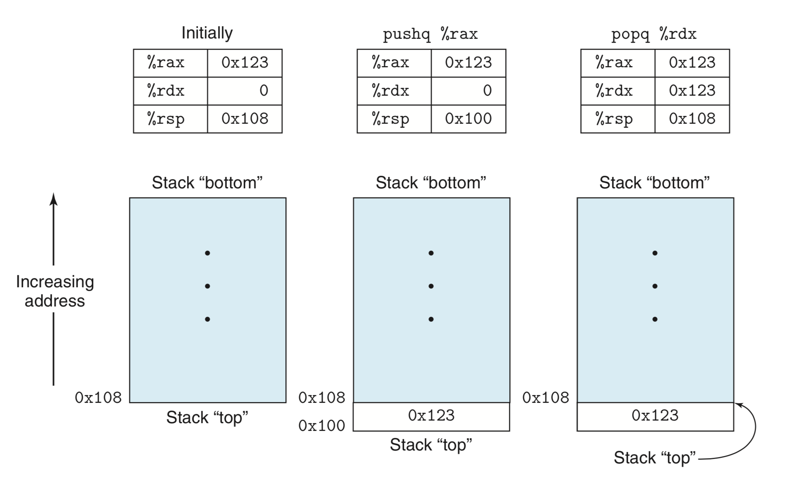

# Machine-Level Representation of Programs:
- This document will delve into machine code and its human-readable representation, assembly code.
- ّWhy learn about assembly when compilers can do it all and nobody has to write assembly anymore? Understanding the assembly code generated by the compiler allows you to:
	+ Rewrite your high-level code for better compiler optimization.
	+ Better understand the runtime behavior of your code. This behavior might be hidden by the high-level language abstraction and is only visible in its machine-level representation. 
	+ Write more secure code because security vulnerabilities can be better understood through its machine-level representation.
- This document is not about writing assembly code but about reading and understanding assembly generated by compilers and trying to the understand its links to the original high-level C code. This is more about *reverse-engineering*, sorta!
- This document will also be about the ***x86-64*** processor. It's a complex beast but the focus will be on GCC and Unix (mainly Linux).
- A quick summary of what will be discussed in this document is as follows:
	- A tour of the relationship between C, assembly and machine code.
	- The representation and manipulation of data and implementation of control constructs such as `if` and and `while` statements.
	- The implementation of procedures details, such as how they maintain a runtime stack or store local variables or pass data to other processes, etc.
	- How data structures such as arrays and structures are implemented.
	- The reasons behind out of out-of-bounds memory references and how buffer overflow attacks and other vulnerabilities happen. 
	- How floating-point data and operations work at the machine level. 

## Program Encoding:
- We've covered what happens when a C program is compiled with the GCC compiler [here](computerSystems.md/#2-programs-are-translated-by-other-programs-into-different-forms).
- To better understand the relationship between C code and compiled assembly, we use the **`-Og`** option with GCC to produce machine code that is not optimized and close in structure to the original C code.

### Machine-Level Code:
- Two very important machine-level Programming abstractions are:
	1. The ISA (*instruction set architecture*) which defines the processor state, the format of the instructions and the effect these instructions have on the state. These instructions appear to execute in sequence but in effect the processor might execute them simultaneously while making sure they behave as if they execute in sequence.
	2. *Virtual memory* which gives the illusion the process has access to a very long array of bytes but that array is an abstraction of a combination of multiple hardware memories and operating system software.
- However, the machine code that you see in the form of assembly is not as abstracted as high-level C and doesn't hide many of the things that you are totally oblivious to when only coding in high-level languages. Examples of these things which have to do with the processor's state include:
	- The **program counter (PC)**: known as **`%rip`** in x86-64. It indicates the address of the next instruction to be executed. 
	- The integer **register file** contains 16 registers storing 64-bit values. These registers can hold addresses (C pointers) and integer data. They are used to keep track of critical parts of the program's state and hold temporary data such as local function data and data to be returned.
	- The condition code registers hold information about most recently executed logic or arithmetic instructions. These information are used for the control of data flow during loops and conditionals.
	- A group of vector registers used to hold one or more integer or floating-point values. 
- While your run-of-the-mill high-level language declare and allocate in memory objects of different data types, assembly only sees a large byte-addressable array. Aggregate data such as arrays and structures are collections of contiguous bytes and scalar data such as integers and floats are all the same. Assembly doesn't differentiate between signed and unsigned integers or between pointers and integers. 
- The program's memory contains:
	- The executable code of the program. 
	- Information required by the OS.
	- Run-time stack for managing procedure calls and returns.
	- Blocks of memory allocated by the user through the `malloc` function.
- Our assembly operates on the virtual memory which an abstraction that hides and simplifies the inner workings of hardware memory. The OS manages translating between virtual memory and the complexities of the metal.
- Machine instructions perform very basic actions such as adding two numbers stored in registers, moving data from memory to a register or branch to a new instruction address. The compiled code is a sequence of such instructions.

### Code Examples
```c
long mult2(long, long);

void multstore(long x, long y, long *dest){
    long t = mult2(x, y);
    *dest = t;
}
```
- To get the assembly output of the above C program (let's say it's in a pogram named `wawa.c`), we use the following command:
```sh
gcc -Og -S wawa.c
```
- In this command we instruct the gcc to output the files's assembly equivalent. **`-Og`** as know prevents optimization. The assembly output should looks as follows:

```
multstore:
	pushq	%rbx
	movq	%rdx, %rbx
	call	mult2
	movq	%rax, (%rbx)
	popq	%rbx
	ret
```
- I tried this on OS X and got a different output that shares a lot with this one. I also tried on Ubuntu Linux and it was essentially the same as this one bar the directives that I have removed. 
- Each indented line in the assembly code represents a single machine instruction. Notice how all variable names and data types have been stripped away. 
- Using the following command, you can generate an object code from the C file:
```bash
gcc -Og -c wawa.c
```
- The generated object file `wawa.o` contains the machine code we saw earlier but it's in binary format consisting of the following 14-byte sequence:
```
53 48 89 d3 e8 00 00 00 00 48 89 03 5b c3
```
- We can use a *disassembler* to disassemble the object file `wawa.o` to get this binary format along with its assembly mnemonics. Linux favorite disassemble is **`objdump`** which we'd use with the option **`-d`** as follows:
```sh
objdump -d wawa.o
```
- `objdump` outputs the following:
```
0000000000000000 <multstore>:
   0:	53                   	push   %rbx
   1:	48 89 d3             	mov    %rdx,%rbx
   4:	e8 00 00 00 00       	callq  9 <multstore+0x9>
   9:	48 89 03             	mov    %rax,(%rbx)
   c:	5b                   	pop    %rbx
   d:	c3   
```
- To the left are the 14 bytes we saw earlier in the `wawa.o` object file. and to the right are the instructions they correspond to in assembly. You can notice how binary instructions range between 1 and 5 bytes in length an that they hhave a slightly different format from the assembly generated by gcc such as that gcc's `pushq` is replaced by `push`.
- If we create a `main.c` file and populate it with a `main` function and a definition fo `mult2` function and compile it along with `wawa.c` and have everything linked together, and then disassembled we will obtain a file that contains something similar to the following code:
```
000000000040054 <multstore>:
   400540:	53                   	push   %rbx
   400541:	48 89 d3             	mov    %rdx,%rbx
   400544:	e8 00 00 00 00       	callq  40058b <mult2>
   400549:	48 89 03             	mov    %rax,(%rbx)
   40054c:	5b                   	pop    %rbx
   40054d:	c3                   	retq
   40054e:	90                   	nop
   40054e:	90                   	nop
```
- This is similar to the the isolated object dump of `wawa.o`, but does also have some important differences:
	- Addresses on the left of each instruction in this program are different. They kinda look real as opposed to the earlier *placeholders*.
	- The address of the function to be called by `callq` instruction is filled up and `<multstore+0x9>` is replaced by `<mult2>`.
	- The final two instructions are just fillers to grow the code to be 16 bytes instead of just 14. This will allow for a better placement of the next block of code which is better for performance :confused:. (*You can say that walking down a stair with uniform-sized steps is better than if steps had different sizes*).
 
### Formatting:
- The following snippet is of the full assembly code generated by gcc:
```
	.file	"lala.c"
	.text
	.globl	multstore
	.type	multstore, @function
multstore:
.LFB0:
	.cfi_startproc
	pushq	%rbx 
	.cfi_def_cfa_offset 16
	.cfi_offset 3, -16
	movq	%rdx, %rbx
	call	mult2@PLT
	movq	%rax, (%rbx)
	popq	%rbx
	.cfi_def_cfa_offset 8
	ret
	.cfi_endproc
.LFE0:
	.size	multstore, .-multstore
	.ident	"GCC: (Ubuntu 7.3.0-27ubuntu1~18.04) 7.3.0"
	.section	.note.GNU-stack,"",@progbits
```
- This code has a lot of information the programmer doesn't care about or need, but also lack a lot of information about how this code works or what it's doing!
- From now on we will ignore stuff we don't need to know such as directives which start with **`.`** such as `.size	multstore, .-multstore`. On the other hand comments will be added to lines corresponding to the C code as the following example shows for a single instruction (the comment follows the symbol `#`):
```
movq	%rax, (%rbx) # Copy dest to %rbx
``` 
- Since we live in a Unix/Linux world, we use the ATT assembly format rather than Intel's format which is encountered in Micosofty stuff and Intel's documentation. It's a little different in that has a reversed order of operands to that ATT, doesn't use size indicators such as `q` at the end of `pushq`, etc.

## Data Formats:
- The following table shows the different x86-64 representations corresponding to C data types:

| C declarations | Intel data types | Assembly-code suffix | Size in bytes |
| --- | --- | --- | --- |
| <code>char</code> | Byte | <code>b</code> | 1 |
| <code>short</code> | Word | <code>w</code> | 2 |
| <code>int</code> | Double word | <code>l</code> | 4 |
| <code>long</code> | Quad word  | <code>q</code> | 8 |
| <code>char *</code> | Quad word | <code>q</code> | 8 |
| <code>float</code> | Single precision | <code>s</code> | 4 |
| <code>double</code> | Double precision | <code>l</code> | 8 |

- The first x86 processor used a 16-bit architecture, that's why 2 bytes are called a **word**, 32 bits are a **double word** and a 64-bit bit vector is called a **quad word**.
- Instructions can operate on words of different lengths, hence the different assembly suffixes such as **`b`**, **`q`**, and **`s`**.

## Accessing Information:
- x86-64 CPUs have 16 **general-purpose registers** which are used to store 64-bit values of integer and pointer data types. These registers names start with **`%r`** are shown in the following table:

| Functionality | 63-0 | 31-0 | 15-0 | 7-0 |
| --- | --- | --- | --- | --- |
| Return value | <code>%rax</code> | <code>%eax</code> | <code>%ax</code> | <code>%al</code> |
| Callee saved | <code>%rbx</code> | <code>%ebx</code> | <code>%bx</code> | <code>%bl</code> |
| 4th argument |<code>%rcx</code> | <code>%ecx</code> | <code>%cx</code> | <code>%cl</code> |
| 3rd argument |<code>%rdx</code> | <code>%edx</code> | <code>%dx</code> | <code>%dl</code> |
| 2nd argument |<code>%rsi</code> | <code>%esi</code> | <code>%si</code> | <code>%sil</code> |
| 1st argument |<code>%rdi</code> | <code>%edi</code> | <code>%di</code> | <code>%dil</code> |
| Callee saved |<code>%rbp</code> | <code>%ebp</code> | <code>%bp</code> | <code>%bpl</code> |
| Stack pointer |<code>%rsp</code> | <code>%esp</code> | <code>%sp</code> | <code>%spl</code> |
| 5th argument |<code>%r8</code> | <code>%r8d</code> | <code>%r8w</code> | <code>%r8b</code> |
| 6th argument argument |<code>%r9</code> | <code>%r9d</code> | <code>%r9w</code> | <code>%r9b</code> |
| Caller saved |<code>%r10</code> | <code>%r10d</code> | <code>%r10w</code> | <code>%r10b</code> |
| caller saved |<code>%r11</code> | <code>%r11d</code> | <code>%r11w</code> | <code>%r11b</code> |
| Callee saved |<code>%r12</code> | <code>%r12d</code> | <code>%r12w</code> | <code>%r12b</code> |
| Callee saved |<code>%r13</code> | <code>%rd13</code> | <code>%r13w</code> | <code>%r13b</code> | 
| Callee saved |<code>%r14</code> | <code>%rd14</code> | <code>%r14w</code> | <code>%r14b</code> |
| Callee saved |<code>%r15</code> | <code>%rd15</code> | <code>%r15w</code> | <code>%r15b</code> |

- The The table also shows the historical registers found in 32-bit and 16-bit older generations x86 processors. These older generation registers accommodating different architectures can still be used in x86-64 and their conventions show the evolution of x86 architecture. 
- The original x86 16-bit registers were were expanded with the IA32 to hold 32 bits and names were changed so **`%ax`** became **`%eax`** and **`%bp`** became **`%ebp`**, etc. With IA64, these registers started holding 64 bits of data and names like **`%ebp`** became **`%rbp`**. 8 new registers were added and you can refer to the table above on how they were named. 
- Instructions can use these registers to operate on different data sizes, so byte instructions operate on the least significant byte in the register, word operators can use use the least significant 16-bits, etc. 
- The table above also shows the functionality and purposes of these registers. The stack pointer **`%rsp`** is unique. It indicates the end of the run time stack of a program, whatever that means! Some instructions are specialized to read from and write to this register. The other registers are more flexible. Some of them have specialized instructions and some are used for managing the stack such as returning values from functions or passing arguments.. etc. We will see more about these!

### Operand Specifiers:
- Most instructions have one or more operands that specify the source values used in the operation and the destination location where to place the results. Source values can be constants or read from registers or memory. Results can be stored in registers or memory. 
- The following table shows the different forms operands can take:

| Type | Form | Operand value | Name |
| --- | --- | --- | --- |
| Immediate | *$Imm* | *Imm* | Immediate | 
| Register | *r<sub>a</sub>* | R[r<sub>a</sub>] | Register | 
| Memory | *Imm* | M[*Imm*] | Absolute | 
| Memory | *(r<sub>a</sub>)* | M[R[r<sub>a</sub>]] | Indirect | 
| Memory | *Imm(r<sub>b</sub>)* | M[*Imm* + R[r<sub>b</sub>]] | Base +  Displacement | 
| Memory | *(r<sub>b</sub>, r<sub>i</sub>)* | M[R[r<sub>b</sub>] + R[r<sub>i</sub>]] | Indexed | 
| Memory | *Imm(r<sub>b</sub>, r<sub>i</sub>)* | M[*Imm* + R[r<sub>b</sub>] + R[r<sub>i</sub>]] | Indexed | 
| Memory | *(, r<sub>i</sub>, s)* | M[R[r<sub>i</sub>] · *s*] | Scaled Indexed | 
| Memory | *Imm(, r<sub>i</sub>, s)* | M[*Imm* + R[r<sub>i</sub>] · *s*] | Scaled Indexed | 
| Memory | *(r<sub>b</sub>, r<sub>i</sub>, s)* | M[R[r<sub>b</sub>] + R[r<sub>i</sub>] · *s*] | Scaled Indexed | 
| Memory | *Imm(r<sub>b</sub>, r<sub>i</sub>, s)* | M[*Imm* + R[r<sub>b</sub>] + R[r<sub>i</sub>] · *s*] | Scaled Indexed | 

- There are 3 types of operands:
	- *Immediate* is used for constant values. It uses **`$`** followed by standard C notation for integers as in **`$-14`** or **`0xFD2`**. Remember that different instructions allow for different ranges of values. 
	- *Register* denotes the contents of registers. In the table above, an arbitrary  register ***a*** h *as the symbol**r<sub>a</sub>***. It's part of the machine's set of registers ***R*** and in this respected represented by ***R[r<sub>a</sub>]***.
	- *Memory reference* where we access a memory location using a computed address (also called *effective address*). Memory is viewed as a large byte of array which is denoted by ***M<sub>b</sub>[Addr]***. This notation references the *b*-byte value stored in Memory starting at address ***Addr***. The subscript *b* is not necessary since we know it's all about bytes. 
- The table above shows how there are many different *addressing modes* allowing for different ways of referencing memory. The most general form is at the bottom of the table and is denoted by ***Imm(r<sub>b</sub>, r<sub>i</sub>, s)***. It has an immediate register ***Imm***, a *base register* ***r<sub>b</sub>***, an *index register* ***r<sub>i</sub>*** and a *scale factor* ***s***. ***s*** must be either 1, 2, 4 or 8. The base and index must be 64-bit registers. The effective address is computed as ***Imm* + R[r<sub>b</sub>] + R[r<sub>i</sub>] · *s***. This form is used when referencing elements of arrays. The other forms are specialized forms of this general form where certain parts of the annotation are removed. 

### Date Movement Instructions:
- Generally speaking, instructions that perform the same type of operation but differ in their operand sizes can be grouped together in so called *instruction classes*.
- Much of machine code is about moving data from one location to another. The simplest data movement instructions belong to the class ***MOV***. These instructions simply copy data from a source location to a destination location without any transformation. The class has 4 instructions **`movb`**, **`movw`**, **`movl`**, **`movq`**. The only difference between the 4 instructions is that they move 1, 2, 4, 8 bytes of data respectively. The following table details their behavior:

| Instruction | Effect | Description |
| --- | --- | --- |
| MOV *S, D* | *D ← S* | Move |
| &nbsp;&nbsp;&nbsp;&nbsp;<code>movb</code> |  | Move byte |
| &nbsp;&nbsp;&nbsp;&nbsp;<code>movw</code> |  | Move word |
| &nbsp;&nbsp;&nbsp;&nbsp;<code>movl</code> |  | Move double word |
| &nbsp;&nbsp;&nbsp;&nbsp;<code>movq</code> |  | Move quad word |
| <code>movabsq</code> *I, R* | *R ← I* | Move absolute quad word |

- Let's also just establish that an instruction in Att assembly follows this general syntax:
```
instruction    source    destination
```
- The source of a ***MOV*** instruction can be an immediate value or a value stored in memory or a register. The destination can only be a register or memory. You also cannot have both ***MOV*** operands as memory location. To copy data between two locations in memory, you need two instructions: One to copy (load) the data from the first memory to a register and a second one to copy data from that register to the other location in memory. 
- Register operands can be  the named portions of these registers with sizes 1, 2 , 4 or 8 bytes. These portions must match the last character of the operation name (`b`, `w`, `l` or `q`) :confused:. Generally, ***MOV*** only updates the bytes of a register or memory indicated by the destination operand. The exception to is the **`movl`** instruction which will update the higher order 4 bytes of a register to 0. 
- **`movq`** can only have an immediate source operand that is 32-bit long in 64-bit architecture. This value is then sign extended to produce a 64-bit value for the destination :confused:. The **`movabsq`** instead can have a 64-bit immediate source but it can also only have a register as a destination. 
- I think the instruction's ending must match the size of the destination if the destination is a register, otherwise it matches a source register if the destination is memory.
- The following example shows how data movement changes destination registers (note how **`movl`** changes the upper bytes to zeros):
```
movabsq $0x0011223344556677, %rax    # %rax = 0011223344556677
movb    $-1, %al                     # %rax = 00112233445566FF
movw    $-1, %ax                     # %rax = 001122334455FFFF
movl    $-1, %eax                    # %rax = 00000000FFFFFFFF
movq    $-1, %rax                    # %rax = FFFFFFFFFFFFFFFF
```
- You can also copy a source value to a larger destination using two different classes of instructions. These instructions can only copy data from a register or a memory location to a register. 
- The first of thes two classes is ***MOVZ***. It copies data and fill the higher order bytes of the destination with zeros as the following table shows. Notice there is no **`movzlq`**. The reason is that instructions with a 4-byte source and an 8-byte register as a destination fill up the upper bytes with zeros, so **`movl`** will do here. This is not the case with sign-extension, though as the sign-extended class ***MOVS*** support all 3 sizes. The following table describes these instructions:

| Instruction | Effect | Description |
| --- | --- | --- |
| MOVZ *S, R* | *R ← ZeroExtend(S)* | Move with zero extension |
| &nbsp;&nbsp;&nbsp;&nbsp;<code>movzbw</code> |  | Move zero-extended byte to word |
| &nbsp;&nbsp;&nbsp;&nbsp;<code>movzbl</code> |  | Move zero-extended byte to double word |
| &nbsp;&nbsp;&nbsp;&nbsp;<code>movzwl</code> |  | Move zero-extended word to  double word |
| &nbsp;&nbsp;&nbsp;&nbsp;<code>movzbq</code> |  | Move zero-extended byte to quad word |
| &nbsp;&nbsp;&nbsp;&nbsp;<code>movzwq</code> |  | Move zero-extended word to quad word |

- THe ***MOVS*** class of instructions fill the upper bytes by sign extension, copies of the source's most significant bit. The following table describes these operations:

| Instruction | Effect | Description |
| --- | --- | --- |
| MOVS *S, R* | *R ← SignExtend(S)* | Move with sign extension |
| &nbsp;&nbsp;&nbsp;&nbsp;<code>movsbw</code> |  | Move sign-extended byte to word |
| &nbsp;&nbsp;&nbsp;&nbsp;<code>movsbl</code> |  | Move sign-extended byte to double word |
| &nbsp;&nbsp;&nbsp;&nbsp;<code>movswl</code> |  | Move sign-extended word to  double word |
| &nbsp;&nbsp;&nbsp;&nbsp;<code>movsbq</code> |  | Move sign-extended byte to quad word |
| &nbsp;&nbsp;&nbsp;&nbsp;<code>movswq</code> |  | Move sign-extended word to quad word |
| &nbsp;&nbsp;&nbsp;&nbsp;<code>movslq</code> |  | Move sign-extended double word to quad word |
| <code>cltq</code> | <code>%rax</code> *←* SignExtend(<code>%eax</code>) | sign-extend <code>%eax</code> to <code>%rax</code> |

- The **`cltq`** only has **`%eax`** as a source and **`%rax`** as a destination. It has the same effect as **`movslq %eax, %rax`** but is more compact.
- The following table shows examples of how **`MOVZ`** and **`MOVZ`** change destination addresses:
```x86asm
movabsq $0x0011223344556677, %rax    # %rax = 0011223344556677
movb    $0xAA, %dl                   # %rax = AA (this hex for binary 1010. Bit sign is 1)
movb    %dl,  %al                    # %rax = 00112233445566AA
movsbq  %dl, %rax                    # %rax = FFFFFFFFFFFFFFAA
movzbq  %dl, %rax                    # %rax = 00000000000000AA
```

### Date Movement Examples:
- The following two snippets show an example of data movement in both C and assembly:
```c
long exchange(long *xp, long y){
	long x = *xp;
	*xp = y;
	return x;
}
```
```x86asm
# long exchange(long *xp, long y) = xp is in %rdi, y in %rsi
exchange:
    movq    (%rdi), %rax    # put get value of x frm xp and sets it as return value
    movq    %rsi, (%rdi)    # store y at xp
    ret                     # return
```
- Let's dissect this program and see what is going on in assembly and how it corresponds to the C code:
	- When the procedure begins execution, C variables **`xp`** and**`y`** are stored in registers **`%rdi`** and **`%rsi`**. 
	- An instruction reads **`x`** pointed to in memory by register **`%rdi`** and stores it in **`%rax`**. The value stored in **`%rax`**, which is **`x`**, will be returned.
	- The next instruction writes the value of **`%rsi`** or **`y`** into **`xp`**.
- This code demonstrates that:
	- Pointers are memory addresses. 
	- Dereferencing pointers is copying memory values into registers. 
	- Local variables are copied into registers for faster retrieval. 

### Pushing and Popping Stack Data:
- There are also data movement instructions specialized in pushing data to and popping it from the program's stack. I don't know what that mysterious stack is but the book states that it is important in procedure calls. 
- The image below illustrates how an x86-64 stack works. The stack is stored in some region in memory. It grows downward such that its top element has the lowest memory address among its element addresses. The stack is usually drawn with its top in the bottom (it's upside down) as the following figure shows:

- The **`%rsp`** register is the **stack pointer**. It holds the address of the top element of the program's stack. 
- The following table shows the two stack instructions and their behavior:

| Instruction | Effect | Description |
| --- | --- | --- |
| <code>pushq</code> *S* | R[<code>%rsp</code>] *←* R[<code>%rsp</code>] - 8;<br> M[R[<code>%rsp</code>]] ← *S* | Push quad word
| <code>popq</code> *D* | *D* *←* M[R[<code>%rsp</code>]];<br> R[<code>%rsp</code>] R[<code>%rsp</code>] + 8 | Pop quad word

- **`pushq`** allows you to push data onto the stack. It takes a single operand, the source data to be pushed onto the stack. This instruction involves decrementing the value of the stack pointer by 8 bytes (remember that the stack grows towards the lower memory addresses), and then writing the source data into the new top-of-stack address. This is equivalent to the following two instructions:
```
subq    $8, %rsp      # Decrement stack pointer
movq    %rbp, (%rsp)  # Store %rbp on the stack
```
- **`popq`** plucks the top of the stack and places it in its destination operand. Like **`pushq`**, **`popq`** also takes only one operand, but it's a destination operand. This instruction reads data from the top of the stack and writes it to its destination operand and then increments the stack pointer by 8 bytes (meaning the stack's size is reduced). The data in that region of memory that is no longer part of the stack stays there until it's overwritten by another operation, probably another **`pushq`**. The top of the stack, however, is always indicated by the **`%rsp`** register.
- The stack is part of the same memory as the rest of the program and its data. This means the program can access arbitrary parts of the stack (maybe without having to refer to the stack pointer; maybe changing parts of the stack and stack pointer not in the intended way :confused:).  

## Arithmetic and Logical Operations:

| Instruction | Effect | Description |
| --- | --- | --- |
| <code>leaq</code>&nbsp;&nbsp;*S, D* | *D ← &S* | Load effective address |
| INC&nbsp;&nbsp;&nbsp;*D* | *D ← D + 1* | Increment |
| DEC&nbsp;&nbsp;&nbsp;*D* | *D ← D - 1* | Decrement |
| NEG&nbsp;&nbsp;&nbsp;*D* | *D ← -D* | Negate |
| NOT&nbsp;&nbsp;&nbsp;*D* | *D ← ~D* | Complement |
| ADD&nbsp;&nbsp;&nbsp;*S, D* | *D ← D + S* | Add |
| SUB&nbsp;&nbsp;&nbsp;*S, D* | *D ← D - S* | Subtract |
| IMUL&nbsp;&nbsp;*S, D* | *D ← D · S* | Multiply |
| XOR&nbsp;&nbsp;&nbsp;*S, D* | *D ← D ^ S* | Exclusive-or |
| OR&nbsp;&nbsp;&nbsp;&nbsp;*S, D* | *D ← D | S* | Or |
| AND&nbsp;&nbsp;&nbsp;*k, D* | *D ← D & S* | And |
| SAL&nbsp;&nbsp;&nbsp;*k, D* | *D ← D << S* | Left shift |
| SHL&nbsp;&nbsp;&nbsp;*k, D* | *D ← D << S* | Left shift(Same as SAL) |
| SAR&nbsp;&nbsp;&nbsp;*k, D* | *D ← D >> <sub>A</sub>S* | Arithmetic right shift |
| SHR&nbsp;&nbsp;&nbsp;*k, D* | *D ← D >> <sub>L</sub>S* | Logical right shift |


### Load Effective Address:
### Unary and Binary Operations:
### Shift Operations:
### Discussion:
### Special Arithmetic Operation
## Control:
## Procedures:
## Array Allocation and Access:
## Heterogeneous Data Structures:
## Combining Control and Data Machine-Level Programs:
## Floating-Point Code:


