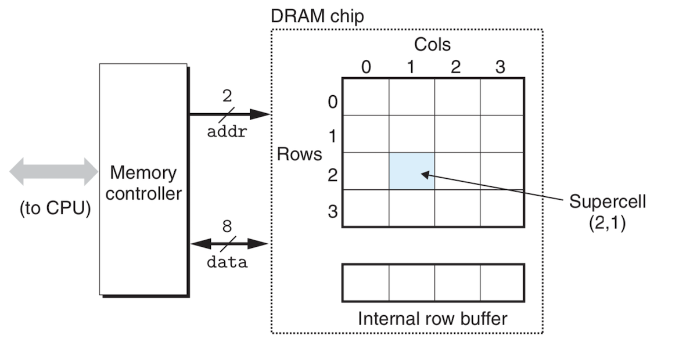

# The Memory Hierarchy:
- *Virtual memory*, an OS abstraction, gives the illusion that memory is just a long linear byte-array that holds instructions and data for the CPU which can access different parts of this memory at a constant time, but the reality is much more complicated. 
- The actual hardware that constitutes a system's memory is divided up into a hierarchy of different storage devices that differ in their speed and cost, and each one of these storage devices acts as a caching facility for the device that lies under it in this hierarchy. The CPU registers hold most used data, while *cache memories* act as a staging area for main memory. Main memory act as a staging area for storage disk and the latter is a cache for the network. 
- This hierarchical setup allows well-written programs to both exploit the high speed of the costly small memories and have access to the vast cheap memories. To have a 'well-written' program that makes use of this hierarchy, you need understand how a system moves data up and down this hierarchy (this is what we will be doing here)!
- A fundamental concept we will be dealing with in this document is *locality*, a feature of programs that tend to access the same data over and over again and access nearby data and usually from the upper levels of the memory hierarchy. In a way this document is an extension of the previous document about optimization. We want to have faster programs and memory is often a bottleneck that needs to be broken.
- We will look at different memory and storage technologies: stuff like *SRAM*, *DRAM*, *ROM*, *rotating* and *solid state* disks. We will also look at cache memories and their impact on program efficiency. We will analyze programs' locality. 

## Storage Technologies:
### Random-Access Memory:
- Random-access memory (RAM) exists in two types: **static RAM (SRAM)** which is faster and much more expensive and used for caching in the CPU and outside of it, and **dynamic RAM (DRAM)** which is used for main memory and the *frame buffer for graphics* :confused:! The system used to type this document has a couple megabytes of SRAM and sever gigabytes of DRAM. 

#### SRAM:
- SRAM stores data in a *bistable* cells where a cell can only be stable in one of two states. Any intermediate state is unstable and will quickly change to one of the two stable states which makes it a persistent type of memory holding its state as long as the power is on. An SRAM cell is made of a 6-transistor circuit. It has fast access and is resilient to electric disturbances.

#### DRAM:
- Dynamic RAM is inferior to SRAM. It stores a bit as charge on a capacitor that is connected to one transistor. This simple setup allows for storing a bunch of DRAM cells in a small area. The inferiority of DRAM stems from its hyper sensitivity to electric disturbances  and even light rays (for your info, a digital camera's sensor are arrays of DRAM cells).
- Even worse, DRAM leaks voltage like crazy every 10 to 100 milliseconds, but processors work at at nanosecond rates so they shouldn't be affected by this type of data loss. To tackle this data loss, memory systems refresh data by reading it out and writing it back in and some systems have special mechanisms to detect and correct errors caused by these leakages. 
- The following tables illustrates the differences between SRAM and DRAM and justifies the cost difference:

|  | Transistors per bit | Relative Access Time | Persistent | Sensitive | Relative cost | Applications |
| --- | --- | --- | --- | --- | --- | --- |
| SRAM | 6 | 1x | Yes | No | 100x | Cache Memory |
| DRAM | 1 | 10x | No | Yes | 1x | Main memory, frame buffers |

- Cells in a DRAM chip are packaged into *supercells* (Some call supercells words). The chip itself is made of a rectangular array of supercells that are organized into rows and columns. Each supercells cell has an address of the form ***(i, j)*** where ***i*** denotes the row and ***j*** denotes the column. 
- Examine the following figure. It shows a 124-bit 16 x 8 DRAM chip consisting of 16 supercells each of which has 8 cells. It has 4 rows and 4 columns. The shaded supercells has address ***(2, 1)***. Data flow in and out of the chip through **pins**. Each pin carries one bit of data. In this figure there are two sets of pins: an 8-pin set that carries one byte of data and a 2-bit set that carries 2 bits of address, I believe one for row and the other for column (control pins are not shown in the diagram):

- Attached to the chip is the **memory controller** which controls data movement into and out of the chip. It can move a supercell worth of bits. To read data at address ***(i, j)***, the controller sends the row address ***i*** and follows it by that of the column ***j***. A row address is called **RAS (row access strobe request)** and a column address is called **CAS (column access strobe request)**. The chip responds to the request to read data at a particular address by first copy a whole row to the area called *internal row buffer* and then sending the column part to the controller. 
- Multiple DRAM chips can and are usually packaged into so-called *memory modules* which can be plugged into expansion slots of a motherboard. 

#### Enhanced DRAMs
- You might see and be confused by the many types of DRAM in different computer hardware specifications. This is caused by manufacturers' quest to catch up with the increasingly faster processors. These DRAMs are based on the conventional cell model we've discussed in the previous section, but they differ in the different optimizations they apply to DRAM to get faster data access:
	- *Fast page mode (FPM DRAM)*: Conventional DRAM copies a whole row into the internal row buffer for every request even if consecutive address requests come from the same row. This means that if 4 requests of supercells all come from the same row, there will be 4 RAS/CAS requests, but in FPM DRAM only the initial request will be RAS/CAS! The following 3 requests will be only CAS requests. Only one copying of the row to the internal row buffer is performed for all 4 addresses. This makes this type of DRAM faster. 
	- *Extended data out (EDO DRAM)*: This is a faster variety of FPM DRAM that spaces CAS requests closer together in time. 
	- *Synchronous (SDRAM)*: I have no idea what I've just read but this is faster than the previous types. 
- There are other faster types of DRAM and I don't care. 

#### Non-Volatile Memories:
- DRAM and SRAM are **volatile**: they lose information when cut off from electricity. There are also **non-volatile memories** that retain information even when off!! They are generally, somehow incorrectly, called *read-only memories (ROMs)*. Some of can be written! There are different types of ROMs and they differ mainly by how often they can be reprogrammed (written to) and how they get programmed. They include:
	- *Programmable ROM (PROM)*: is programmable exactly once.
	- *Erasable programmable ROM (EPROM)*: uses light and ultraviolet and what not to write data. Can be erased and rewritten in the order of a 1000 times. *Electric erasable programmable ROM (EEPROM)* can be reprogrammed a 100,000 times and doesn't require special tools to write.
	- *Flash memory*: is based on EEPROM and is everywhere today from server computers to watches to flash thumbnails and SD cards. The flash-based SSD cards are replacing rotating disks in many applications. 
- Programs stored in ROMs are what is called *firmware*. Some systems offer some basic IO functionality in the firmware which is the first programs to run when a a computer starts up such BIOS (basic input output system)  

#### Accessing Main Memory:

- Data flows between the CPU and main memory through **buses** which are sets of parallel wires that carry address, data and control signals between CPU, main memory and I/O devices. Transfer of data between the CPU and main memory is called a *transaction*. A *read transaction* is movement of data from memory to the CPU and the opposite of that is a *write transaction*.
- Address and data might flow in the same wires or have their own dedicated wires. In all cases, there are also control wires whose signal manages how data is moved through the bus: is it a read or a write? Does data move between memory and the CPU or between the latter and and an I/O device?
- An *I/O bridge*, a chipset that lies between the CPU, main memory and IO is attached to the bus. The bus that connects it to the CPU is *system bus* (which is connected to the rest of the CPU by a *bus interface*) and the one connecting it to the main memory is *memory bus*. The IO bridge also contains memory control.
- What happens we *load* data from memory to a register through the following instruction?
```
movl     A, %eax
```
- The bus interface chip on the CPU initiates a read transaction on the bus. The read transaction consists of 3 steps:
	- CPU places address A on the system bus.
	- The IO bridge passes the address to the memory bus.
	- The main memory receives the read transaction signal through the memory bus, fetches the data at the given address from DRAM and writes it on the memory bus. The data follows the same path backward until it is written up on the register.
- Writing register data to memory involves a write transaction and it follows the same path.

### Disk Storage:
- Disks are a cheap storage technology which can store huge amounts of data, but they are very slow. THey can access data in the order of milliseconds which is millions of times slower than SRAM.

#### Disk Geometry:
- A typical disk consists of one or two *platters*, each with two *surfaces* coated with magnetic recording material. A spindle in the middle of platters spins at a fixed rotation rate that is a few thousand *revolutions per minutes (RPM)*. 
- A platter surface is divided into eccentric rings called *tracks*. Each track is cut in length into *sectors*. Each sector contains an equal amount of data bits encoded in its magnetic coating. Sectors are separated from each other by little gaps that don't store data, but store information identifying sectors. 
- *Cylinders* refer to  tracks that are equidistant from the center of the disk: a cylinder on 1-platter disk is the two overlapping tracks on the two surfaces of the platter. On a 2-platter disk, a cylinder contains 4 tracks.

#### Disk Capacity:
- The *capacity* of a disk refers to how much data can be stored in a disk. It is determined by the following factors:
	- *Recording density (bits/in)*: the number f bits that can be squeezed into a 1-inch segment of a track.
	- *Track density (tracks/in)*: The number of tracks that can be squeezed into an inch of the disk's radius. 
	- *Areal Density (bits/in<sup>2</sup>)*: equal to product of recording density but track density.

#### Disk Operation:
- Bits on the surface of a platter are read and written using a *read/write head* placed at the end of an *actuator arm*. The arm moves back and forth over the surface (performing a *seek*) while the disk rotates around to the spindle allowing the arm head to reach any spot on the disk surface. When the head is over the desired track it can either alter bits during a *write* or read the bits during a *read*. Disks usually have multiple platters and hence multiple arms and read/write heads. 
- "The read/write head at the end of the arm flies (literally) on a thin cushion of air over the disk surface at a height of about 0.1 microns and a speed of about 80 km/h. This is analogous to placing the Sears Tower on its side and flying it around the world at a height of 2.5 cm (1 inch) above the ground, with each orbit of the earth taking only 8 seconds!"
- Data is read and written into sector-sized blocks. The **access time** of a sector has 3 components:
	- **Seek time**: the time it takes an arm to move over the disk before hitting the track containing the target sector. It depends on the arm's speed and the head's previous position. It is usually between 3 and 9 ms and can be as high as 20 ms.  
	- **Rotational latency**: the time the head spends on the track containing the right sector before the first bit of that sector is read or written. This depends on the position of the surface before the head arrives at the track and the rotational speed of the disk. 
	- **Transfer time**: from when the head starts reading or writing the first bit of the sector until the end of the sector. It depends on two factors: the rotational speed of the disk, and the number of sectors on a track. 
- The total access time of a disk is the sum of the average times of the 3 factors above. The seek time and rotational latency dominate the access time and are almost the same so we can safely say that ***access time =  2 x  seek time***. 

#### Logical Disk Blocks:
- Disks have complex geometries. They have multiple surfaces with tracks and sectors, etc. They are just too complex!! They hide this complexity from the OS by showing it a a simpler geometry that is a sequence of ***B*** sector-sized **logical blocks** numbered ***1, 2, ..., B - 1***. The **disk controller**, a hardware/firmware mechanism in the disk translates between logical blocks and the actual physical sectors in the disk.
- When the OS wants to load certain data from the disk to RAM, it sends a command to the disk controller asking it for data in a certain logical block. The controller translates the lgical block into a (surface, track, sector) triplet that identify the given sector. The disk hardware uses this triplet to move the head to that sector and put its content into a buffer in the disk controller which then sends it back up to memory. 

#### Connecting IO Devices:
- Some waffling about IO bus! One important component that is connected to the IO bus is the *host bus adapter* which is used to connect one or more disks to the system. It is controlled by a communication protocol *host bus interface*. There are two famous host bus interfaces: *SCSI* (:speaker: 'scuzzy') and *SATA* (:speaker: 'sat-uh').SCSI is more expensive, faster and can connect more disks to the system. SATA can only connect one disk to the system. 

#### Accessing Disks:
- The CPU in a typical system manages IO devices through a technique called **memory-mapped IO**. In such a system, a block of addresses is reserved for communicating with IO devices. Each IO devices is mapped to one or more of these addresses (called **IO ports**) when it's attached to the IO bus. 
- If the disk were mapped to address `0x44`, the CPU sends 3 instructions to that address. The first instruction tells the disk to initiate a read, the second instruction tells the disk the logical block that needs to be read, and the third instruction indicates where in memory the content should be placed. The disk controller does its thing and sends the data directly to memory. By the way, the process whereby an IO device reads or writes into memory without CPU involvement is called **direct memory access (DMA)**. This transfer of data is called a **DMA transfer**. After the transfer is completed, the disk controller might send an interrupt signal to the CPU notifying it of the transfer completion (we will see interrupts later). 

### Solid State Disks:
- Solid state disks (SSD) is based on the non-volatile flash memory we saw [earlier](#non-volatile-memories) that can be a better alternative to rotting disks. An SSD can be attached to a slot on the system's IO bus (USB or SATA mostly) and acts like a normal disk. SSD storage comes in SSD packages which consists of one or more flash chips and *flash translation layers* which translate requests for logical blocks into flash physical voodoo. 
- Sequential reads and writes to an SSD are relatively fast. Random reads are also comparably fast, but random writes are much slower. 
- *I don't even know what a sequential vs. random access are as far as SSDs go*. Anyways, the reason why random writes are slow lies in how SSDs are built and work. An SSD consists of a sequence of **blocks** and each block is made of a sequence of **pages**. The reading and writing in SSD are expressed in units of pages. Before data can be written to a page, the whole block it belongs to must be first erased by setting all its bits to 1. Once erased, data can be written to the block's pages with no further erasing. Knowing that SSDs are ROMs, blocks do wear out after 100k writes. 
- Two factors make random SSD writes slower:
	- Erasing a block is a slow operation! It takes an average of 1ms.
	- If the write occurs in a page that contains other useful data, then all pages in that block must be copied to another erased block before data can be written (*this is a little probaly misworded! What if I write to an erased page in a block containing pages with useful data? adn Should this block also be erased before we can start writing into it?*). 
- SSDs beat rotating in disks in that they use semiconductor memory which uses less power, is much faster and much rugged (doesn't get affected by shocks like moving disks). The big disadvantage of SSD is that they wear out of many writes. Manufacturers implement logic in SSDs to achieve *wear leveling*, meaning that erasures are spread evenly over all blocks to maximize of lives of these blocks. SSDs are also more expansive than rotating disks, but this gaps has been getting smaller over the last decades. 

## Locality:
### Locality of References to Program Data:
### Locality of Instruction Fetches:
### Summary of Locality:

## The Memory Hierarchy:

## Cache Memories:

## Writing Cache-Friendly Programs:

## The Impact of Caches on Program Performance: