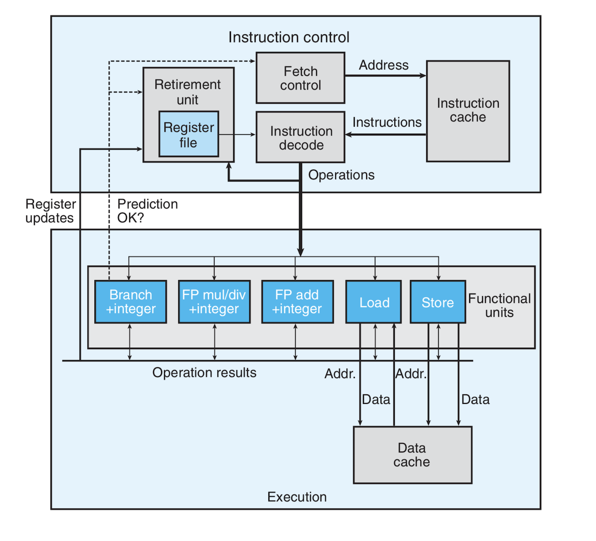

# Optimizing Program Performance:
- This document is not about effective data structures or algorithms. It's mostly about how to make the compiler generate more optimized code. It also advises you on the general etiquette of optimization. Don't wholesale sacrifice the readability and extendability of your programs, be open to using trial and error and optimize  mostly when necessary, etc. 
- Topics we will discuss in the document include (in no particular order):
	- Identifying and eliminating or reducing *optimization blockers*, aspects of a program that depend largely on the execution environment and the compiler have no idea about.
	- Reducing unnecessary code such as function calls and memory references
	- Exploiting our knowledge of how a processor process instructions and how a certain goal can be achieved through different instructions or combinations of instructions, some of which are more efficient than the others. We can also direct the compiler to make use of so-called *instruction-level parallelism*.
	- We introduce such tools as *profilers* that are used to identify bottlenecks in the code and parts that require optimization. We will also hand-examine or eye-examine assembly code to identify bottlenecks.

## Capabilities and Limitations of Optimizing Compilers:
- Modern compilers are so smart! They can use the result of a single computations in several places and reduce the number of times computations are done. 
- Compilers such GCC offer us ways to control optimization. The simplest optimization control is to specify the level of optimization with an option like **`-Og`**, **`-O1`**, **`-O2`** or **`-03`**. We will mostly work with level 1 optimization. One side effect of raising the optimization level is that it results in hard to debug code and larger code size. Optimizing our code rationally using the tricks we will learn here can make optimization level 1 vastly better than blindly applying a higher level of optimization to it.
- As there can apparently be unsafe optimization, one must only use **safe optimizations** which result in a code with the exact same behavior for all cases. The following program shows how naive optimizations can result in bad code:
```c
void twiddle1(int *xp, int *yp){
    *xp += *yp;
    *xp += *yp;
}

void twiddle2(int *xp, int *yp){
    *xp += 2 * *yp;
}
```
- This is a case where trying to optimize code involving memory references can get a little murky. `twiddle2` is more efficient than `twiddle1` because the latter uses 3 memory references, while the former uses only 3 (memory references are generally considered as expensive operations).  What if both **`xp`** and **`yp`** reference the same memory location. this will result? There is no reason why they shouldn't. In this case the two operations will have different results. `twiddle1` will result in 3 times the value at **`xp`**, while `twiddle2` will quadruple that value. Normally the compiler would optimize `twiddle1` to a form similar to that of `twiddle2`, because the compiler can't by any means determine if **`xp`** and **`yp`** would point to the same location in memory, it will not optimize `twiddle1` to `twiddle2`. This is called **memory aliasing** where two pointers may point to the same location. Memory aliasing, where multiple pointers might reference the same memory location is a major **optimization blockers**, a situation where the compiler doesn't compile a segment of code because it cannot determine whether memory is aliased or not.
- Function calls are another major optimization blocker. Consider the following code:
```c
int counter = 0;

int f(){
    return counter++;
}

int func1(){
    return f() + f() + f();
}

int func2(){
    return 4 * f();
}
```
- `func2` might seem like an optimized `func1` and it might be in certain cases, but what if it produces side effects? In this example `f()` modifies the global variable `counter` making `func1` function differently from `func2`. 
- A compiler GCC does not try to do this kind of optimization because it assumes a function might cause side effects, this is why it's on the programmer to write more efficient code that leaves to the compiler only cases where there are no optimization blockers.

## Eliminating Loop Inefficiencies: 
- **Loop-invariant code motion** is one pretentious phrase to describe a method used to optimize loops. It involves removing *loop Loop-invariant expressions*, which are expressions that don't change while the loop is executing. Such a repetitive expression which computes the same thing over and over can be moved out of the loop body and its result be used instead. The following code shows bad code with Loop-invariant computations inside a loop and its equivalent with that code moved out of the loop:
```c
...
for (int j = 0; j < n; j++){
    a[n * i + j] = b[j];
}

...
...

int ni = n * i; // This computation was moved outta loop
for (int j = 0; j < n; j++){
    a[n * i + j] = b[j];
}
```
- Compilers might be stomped and not always move loop-invariant expressions outside loops, especially if they involve aliased memories or function calls. A call to an expensive function that does the exact same thing in every iteration can be extremely costly. In such cases, the programmer might have to do such a motion manually.
- The book discusses code that transform strings from upper to lower case. It involves a call to `strlen` in every iteration of the loop over the string's character. This is an expensive function that iterates over the whole string in every iteration that when run over a long string can cause some considerable performance hits. I personally wrote code that opened a database connection on every iteration of a loop!! Stupid me, but it was caught before I pushed it for review!

## Reduction in Strength:
- Expensive operations can be replaced by cheaper ones. For example 

## Reducing Procedure Calls:
- The main thing to keep in mind about unnecessary procedure calls is that it's a major optimization blocker and the average compiler might not want optimize blocks containing unnecessary function calls lest they might have side effects. If the programmer is certain that reducing function calls will always yield the correct result, they can intervene and do it manually. 

## Eliminating Unneeded Memory References:
- Consider the following code and its unoptimized compiled assembly:
```c
void someLoop(int *xp){ 

    int i; 
    for (i = 0;i < 10; i++)
        *xp = *xp + 1; 
} 
```
```
.L3:
	movl	(%rdi), %eax    # Reading xp
	addl	$1, %eax
	movl	%eax, (%rdi) # writing to xp
	addl	$1, %edx
```
- The assembly snippet corresponding to the loop body shows how memory is unnecessarily accesses twice on each iteration. Add to this the issue of memory aliasing, and you end up with unoptimizable code. The overhead incurred by reading and writing in the loop with each iteration can be replaced by doing the computations inside the loop but moving the memory reference outside the loop. We only need the final result to be placed in **`*xp`**. I still don't see an explanation of what the big deal with memory references.
- Wasteful memory references also apply to array indexes and arrays might suffer more from this problem. 

## Understanding Modern Processors:
- The techniques we've seen so-far are general common sense that should work for any platform, but there are times when we might have to optimize for a specific architecture or processor. This require some intimate knowledge of how our processor works.
- One very important feature of modern processors is their ability to perform so-called **instruction-level parallelism**, whereby it can processor multiple/many instructions simultaneously while preserving the semantics of a program having instructions that run in sequence one after the other. 
- Instruction-level parallelism can be limited by two lower bounds:
	- The **latency bound** which takes place when a series of instructions must be performed in a strict sequence, one after the other. ILP cannot be done in such cases.
	- The **throughput bound** is the limitation caused by the "raw computing capacity of the processor’s *functional units*," whatever this really means

### Overall Operation:
- Some modern processors are deemed *superscalar*, meaning that they can processor multiple instructions per clock cycle and out-of-order. These processors consists of two parts:
	- The **instruction control unit (ICU)** which reads instructions from memory and generate primitive operations from them
	- The **execution unit (EU)** which execute the operations generated by the ICU.
- The following diagram shows the rough general structure of a superscalar processor:

- The ICU fetches instructions from the *instruction cache* which contains recently used instructions and in general the ICU fetches instructions ahead of time an decodes them to send operation down to the EU and wastes no time, well, until it encounters a *branch* (basically a conditional jump). In this case the ICU does *speculative execution*, meaning that it predicts which branch to take and it starts to fetch, decode and even execute instructions in that branch even before it determines for sure that it is the correct branch to take. If the processor finds out it used the wrong branch, it resets everything to the branch point and starts again fetching, decoding and executing in the other direction.
- When the ICU decodes an instruction, it might produce multiple primitive operations from a single instruction. These operations might then go on to be executed in parallel.
- When the EU receives the primitive operations (usually multiple operations at once), it dispatches them to its *functional units* which are specialized units that perform specialized operations such as multiplications but can also do integer addition or shifting regardless of their specialties. Using the load and store functional units, the EU can read from and write to memory usually through a proxy of fast caches.
- Speculative execution doesn't store data in registers until it makes sure that the branch is correct. The EU decides if the branch is correct and if not it directs the branch unit to go back, discard the incorrect processing and start over. This can be especially costly performancewise. 
- The *retirement unit* within the ICU is responsible for keeping track of the processing and preserving the sequential semantics of the program. It maintains a queue and a register file. The queue it uses for decoded instructions. If an instructions is predicted correctly, it is retired and the registers are updated accordingly, but the instruction is mispredicted, then it is flushed from the queue.

## Loop Unrolling:
## Enhancing Parallelism:
