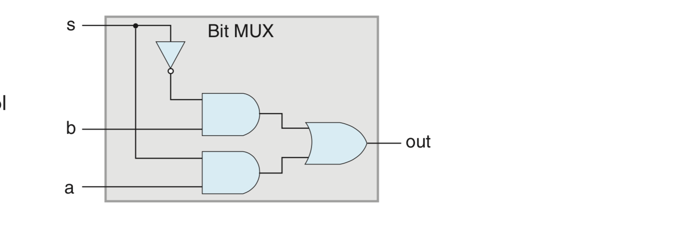
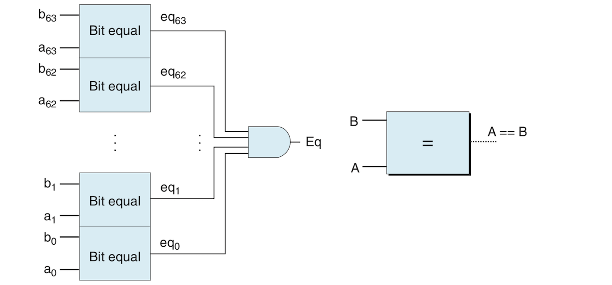
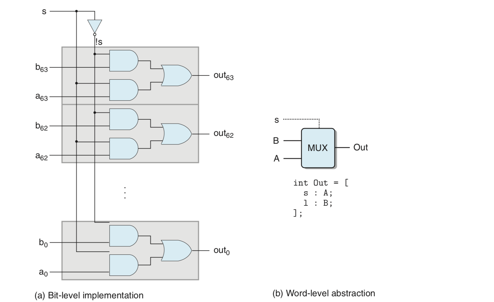
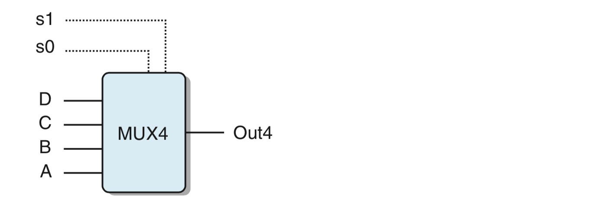
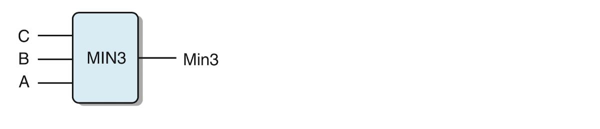
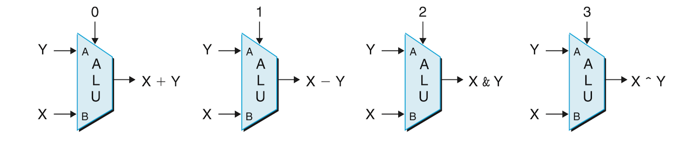
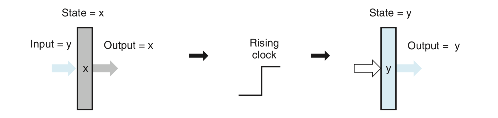
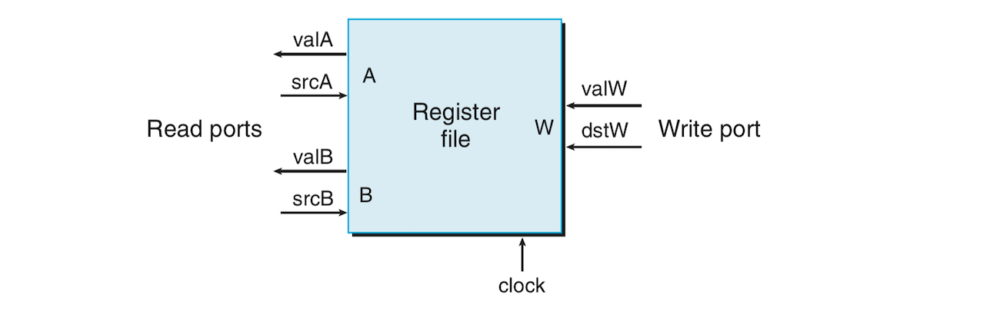
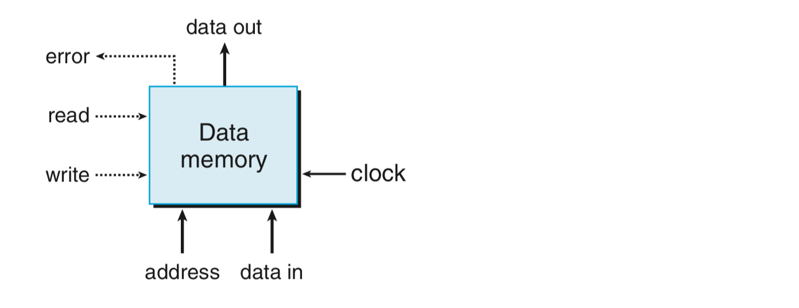

# Processor Architecture:
- *(**Warning:** This summary is messy and just bad. It has some good information, but I don't think this book is doing a great job at explaining processor architecture. I think that the **MIPS** instruction set from that other book is probably better)*. 
                              -------------------------------

* [The Y86-64 Instruction Set Architecture](#the-y86-64-instruction-set-architecture)
	+ [Instruction Encoding](#instruction-encoding)
	+ [CISC vs RISC](#cisc-vs-risc)
* [Logic Design and the Hardware Design Language](#logic-design-and-the-hardware-design-language)
	+ [Combinatorial Circuits and Boolean HCL Expressions](#combinatorial-circuits-and-boolean-hcl-expressions)
	+ [Word-Level Combinational Circuits and HCL Integer Expressions](#word-level-combinational-circuits-and-hcl-integer-expressions)
	+ [Memory and Clocking](#memory-and-clocking)
* [Sequential Y86-64 Implementations](#sequential-y86-64-implementations)

- We've been digging very close to the metal and were able to see at the machine-language level stuff C abstracted away from us. Machine language consists of sequences of very basic instructions that perform such operations as addition and checks for equality. These instructions are known collectively as an ISA (instruction set Architecture) of the processor. They also make for yet another abstraction layer which decouples the work of processor designers from that of compiler designers. Multiple processors with different architectures can have the same ISA against which compile designers improved and optimize the code generated by their compilers.
- This chapter will dig in beyond the ISA and explore the design of the processor hardware and how this hardware executes the instructions of a particular ISA. This will allow us to appreciate the hard work put in by processor designers and help us have a better understanding of how computers work. We will also see another example of abstraction at work: how the ISA appears to execute instructions in sequence, but the actual processor performs its work in parallel where multiple instructions are executed simultaneously, but programs still behave in expected fashion as if instructions run one after the other.
- The original content studies a toy processor and an associated instruction set called Y86-64. I have no interest in this Y86-64, and I will just look at general concepts and principles of logic and hardware design language (HDL) and the implementation of sequential vs. pipelined processors!! I will avoid details and just focus on general ideas.

## The Y86-64 Instruction Set Architecture:
### Instruction Encoding:
- An important topic that I found interesting in this section is *instruction encoding*. How instructions are represented in the hardware. Each instruction (in this particular Y86-64 ISA) is between 2 and 10 bytes in lengths and consists of:
	- *The initial or instruction byte* defines its type. This instruction itself is split into two parts:
		- The *code* or high-order part is used to define a family or class of instructions that do similar operations, something like JMP or MOV. 
		- The *function* low-order part defines specific stuff the instruction does, is it a `jle` or `jge`. Some instructions only have this byte such as `ret`.
	- *Register-specifier byte* is used in instructions that require one or more operands. This byte is divided into two fields. The first field is mostly used as a source and the second one as a destination and in something that has to do with computing addresses. Instructions that only have one register as an operand, can denote the empty half of the register-specifier byte with some agreed upon value like `0xF` or whatever.
	- An optional 8-byte *constant word* used in instructions that have an immediate or a memory location as one of its operands. 
- Each instruction has a unique hex value. The instruction byte can tell us what the instruction is and does and what the rest of the bytes following it do. My question is "how does the processor determine the start of an instruction?" are instructions aligned so each one is 10 bytes in length, even those that are only 1-byte in length? This is makes sense for memory, but maybe not. Because the processor can tell the size of an instruction from its starting byte, it knows exactly where to jump next.

### CISC vs RISC:
- x86-64 ISA and the x86 ISA family are deemed *CISC (complex instruction set computers)*. This type of computers came first. Instruction sets grew so big as to accommodate a large number of operations and tasks. In archaic mainframes, there were instructions that even performed high-level tasks such as evaluating polynomials and doing decimal arithmetic. Early microprocessors used limited instruction sets, but as processing power became trivial they too went the CISC way. x86 followed this path.
- Sometime in the 1980s, IBM researchers conceptualized the *RISC (reduced instruction set computers)* philosophy as an alternative approach to CISC which required powerful hardware and involved instructions that weren't even used that much. They proposed a simple instruction set that could run in cheap hardware and be organized in efficient pipelines.
The following table summarizes how CISC differs from RISC:

| CISC | RISC (Early) |
| --- | --- |
| Many many instructions | Very few instructions |
| Arithmetic/logic operations on registers and memory operands | Arithmetic and logic operations on register operands only. Referencing memory is only done with limited number of instructions such as those storing register content in memory or copying memory content to registers, etc. This is called *load/store architecture* |
| The ISA hides implementation *artifacts*, whaat :confused:. What the programs sees is a simple clean surface hiding some nasty stuff | Artifacts are exposed to to machine-level. Programmers can optimize their code against these artifacts |
| Condition codes are built-in side effects for branching | No condition codes. Explicit test instructions are stored in normal registers and used for testing |
| Major use of the stack by procedures for passing arguments and return addresses | Registers are used for passing arguments and return addresses. Some processes don't use any memory references. These usually have more registers (32) |
- Overtime, CISC and RISC got closer to each other. RISC started incorporating many more instructions, though not too many. CISC also moved towards RISC and started translating instructions into RISC-like instructions that could be easily pipelined. However, CISC processors, represented by by x86 dominated laptops and desktops mainly because of its backward compatibility, while RISC dominated smart phones due to its power efficiency and weak-hardware friendliness

## Logic Design and the Hardware Design Language:
- A digital system consists of 3 major components: *combinatorial logic* to do computations on bits, *memory elements* to store bits, and *clock signals* to regulate updates to memory elements. 
- This section will briefly go over these three elements and introduce HCL (hardware control language) which is a toy HDL *(hardware description language)*. It's probably not as real as Verilog and VHDL which are actually used in the process of creating microprocessors, but the point to be exposed to logic design and the work of hardware designers (though at a superficial level).

### Combinatorial Circuits and Boolean HCL Expressions:
- Three basic logic gates are discussed: ***AND***, ***OR***, and ***NOT***.
- These basic gates are then combined to construct **combinatorial circuits**. These combinatorial circuits can be used to perform higher-level operations, but there are some constraints on how logic gates can be combined to make such circuits:
	1. Every logic gate input must be connected to exactly one of these 3 elements:
		a. System input (*primary input*): I believe this is something like a keyboard, maybe!
		b. The output of a memory element.
		c. The output of a logic gate.
	2. The outputs of two logic gates cannot be connected together.
	3. The network cannot be *cyclic*, meaning there cannot be a loop in any of the network's paths.
- A basic combinatorial circuit that checks for equality between two bits can be represented in HCL as follows:
```
bool eq = (a && b) || (!a && !b)
```
- The following diagram shows a *multiplexer*, also called a *MUX*:

- A multiplexer selects a value from a set of data signals (inputs) based on the input of a control signal. In this image, the ***s*** is the control signal. When this signal is 1, the output is equal to to ***a***, and ***b*** when the ***s*** is 0. This circuit can be represented by the following HCL:
```
bool out = (s && a) || (!s && b)
```

### Word-Level Combinational Circuits and HCL Integer Expressions:
- Combinational circuits operating on single bits can be assembled into larger networks that operate on words rather than individual bits. The words themselves can be anything form integers, addresses, register identifiers or instruction codes.
- Word-level combinatorial circuits operate are constructed from individual gates that operate on the individual bits of the input words and their outputs are constructed from the individual bits or the results of evaluating the individual input bits. The following image tests for equality between words ***A*** and ***B***. It applies the equality expressions we saw earlier to every individual bit from the two words. It compares A<sub>0</sub> with B<sub>0</sub>, A<sub>1</sub> with B<sub>1</sub> ... A<sub>63</sub> with B<sub>63</sub>. If the outputs of these gates are 1, then the two word are equal. This is decided by the AND gate to the right which outputs 1 only if all these outputs are true. The right side of the image shows an abstract simplification suitable for representing word operations (Notice how individual bits are drawn with a dashed line):
 
- Just remember that HCL is just an educational tool and probably nobody uses it to design actual hardware to just get an idea how these things are done. From now on we will treat words as data belonging to the type **`int`** and will not specify the word sizes. 
- HCL allows comparison between words so the circuit comparing two words in the image above can be expressed as follows:
```
bool Eq = (A == B); 
```
- The following diagram shows a word-level multiplexer:

- The word-level multiplexer is identical to the bit-level one in that its outputs is one of the two inputs based on control bit ***s***. The cool thing is that a single inverter ***s*** is enough to compare whole words and didn't have to be repeated.
- Multiplexers are fundamental components of a processor or any digital system and we will see many forms of these. They allow us to select a word from a set of inputs based on some control conditions. A multiplexing function is described using a *case expression* which looks as follows:
```
[
    select_1: expr_1;
    select_2: expr_2;
    .
    .
    .
    select_k: expr_k;
]
```
- This expression contains a series of cases where each *select_x* is a boolean denoting the condition of selection and and an *expr_x* indicating the result of the selection. The selection expressions are not mutually exclusive, but are evaluated in sequence. The first expression that yields 1 is selected as the following code shows:
```
word Out = [
    s: A;
    1: B;
];
```
- The second selection expression in this example is 1 meaning that if no other selection was made, the expression should be defaulted to this one. 
- Multiplexers can be more complex with many more inputs and many more control signals with different combinations. Examine the following figure the the code following it which show how combining multiple control signals allows for many complex selection criteria:

```
word Out4 = [
    !s1 && !s0 : A;
    !s1        : B;
    !s0        : C;
    1          : D;
]
```
- The following circuit finds the minimum value among a set of words A, B and C:

```
word Min3 = [
    A <= B && A <= C : A;
    B <= A && B <= C : B;
    1                : C;
]
```
- Combinatorial logic circuits can so complex as to support many operations. The following diagram shows one such combinatorial circuit, called *arithmetic/logic unit*. It performs 4 kinds of arithmetic types of operations. The operation it performs on its inputs depends on the signal of the control input. The control signal matches the function codes of the 4 arithmetic operations of Y86-64 which we haven't seen!


### Memory and Clocking:
- Combinatorial circuits don't store any information. They only react to input and generate an output equal to some function of the input. Information is instead stored in **sequential circuits** which have state and performs computations on that state. These storage devices are controlled by a systewide *clock*, which is a periodic signal that determines when new values are to be loaded in these sequential devices. There are two types of memory classes:
	- **Clocked Registers** can store single bits or words. The clock controls when values are loaded into their inputs.
	- **Random access memories** which store multiple words and use addresses to write and read data. They include virtual memory and register files. Register identifiers are used as register addresses.
- Being a sequential circuit controlled by a clock, the register's state remains the same even if its input has changed. The state only changes to reflect the value of its input when the clock signal rises. The following diagram shows how the register state remains ***x*** even though its input is ***y***. Once the clock rises, the register state becomes ***y*** reflecting the value in its input. The state of a register only changes when the clock signal rises. "Registers serve as barriers between the combinational logic in different parts of the circuit. Values only propagate from a register input to its output once every clock cycle at the rising clock edge". Registers hold important values such as the program counter (PC) and condition codes (CC):

- The following image shows a typical clocked register:

- The register file shown in the diagram above has:
	- Two *read ports* named *A* and *B*. This means the register file can read the values of two registers at the same time. The two read ports have address inputs (*srcA* and *srcB*) which are register identifiers indicating which registers to read from. They also have data outputs (*valA* and *valB*) extracting data from the given addresses. 
	- One *write port* named *W*. It has an *address input* *dstW* and a value output *valW*.
- The memory is kinda simpler. It has one address input indicating where to write or read from, a *data in* of value to be written into the given address, and a *data out* for reading. The *read* and *write* are used to control if at a given moment data should be read from memory or written to it. The *error* signal is set to 1 if there is an error such as when trying to write in non-existing address outside the bounds of existing memory:


## Sequential Y86-64 Implementations:
- A sequential processor is one that processes instructions one after the other and each instruction is broken into different operations that are run in a sequence of stages. Instructions differ in what they do and in their structures but they are all run using the same sequence of stages. 
- Processing an instruction can be done in the following sequence of stages:
	- **Fetch** reads the bytes of an instruction from memory. It extracts the instruction code and instruction function which constitute the first byte of the instruction. It also possibly extracts one register specifiers from the register byte and maybe an 8-byte value containing a memory address or an immediate value. It then computes the PC value which is the current value of PC plus the length of the currently fetched instruction. 
	- **Decode** reads the operands from the two registers
	- **Execute** is done by the ALU. The ALU performs the instruction's operation or computes the effective address of a memory reference, etc. 
	- **Memory** reads data from memory or writes data into it.
	- **Write back** writes data into one or two results into the register file.
	- **PC update** involves setting the PC to the address of the next instruction.
- The processor runs in an infinite loop performing instruction until it encounters an exception of sorts. It stops or enter an exception handling state. 


