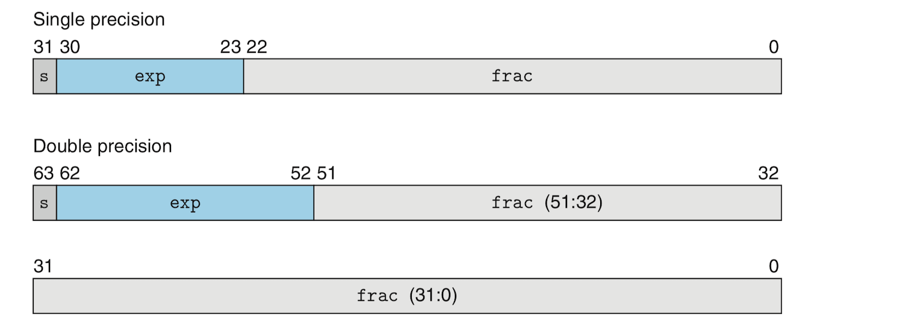
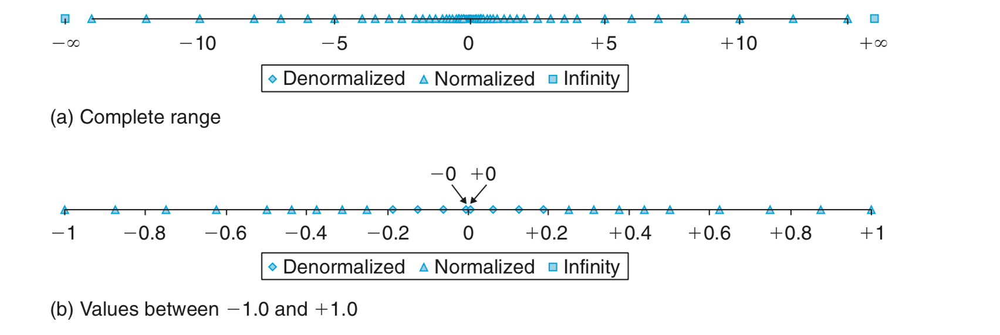
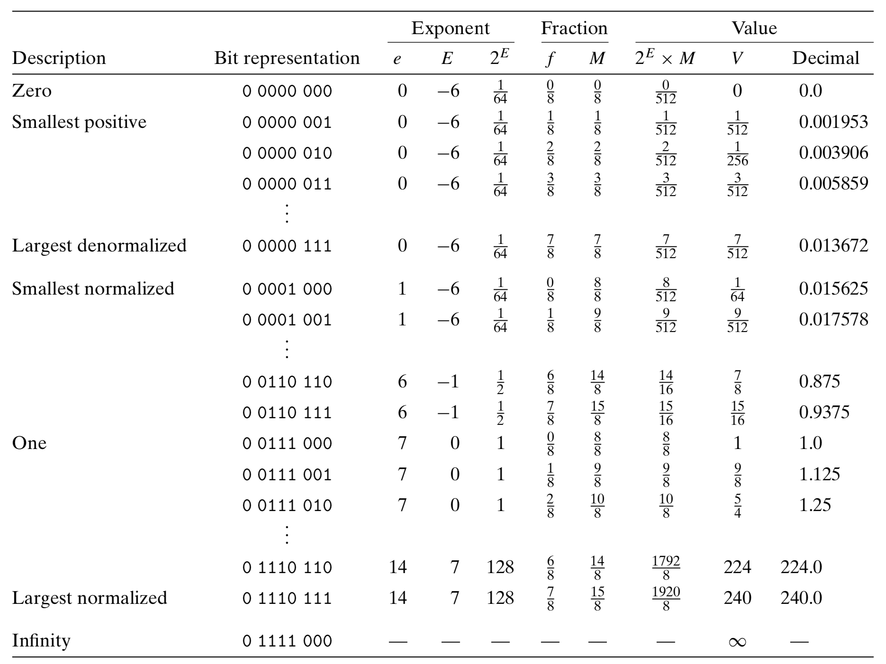

# Representing and Manipulating Information:
- *I will skip many of the very obvious information such as "everything in computers is 0's and 1's".*

## Intro and Motivation:
- A bit is useless by itself, but multiple bits grouped together can be used to encode different types of information, be it characters, negative or nonnegative numbers, etc. 
- In this document we will study three different types of encodings: **unsigned** encodings which is used to represent whole numbers, **two's complement** encodings used to represent **signed** integers, and **floating-point** encodings which are a binary version of scientific notation used to represent real numbers.- We will also discuss issues that that perplex novices such as **overflow** which happens when we try to represent a number that requires more bits than what we used to represent it. 
- Integer arithmetic in computer, however, respects traditional algebraic properties such as associativity and commutativity and all that jazz.
- Floating-point arithmetic can does not respect some algebraic rules due to so called *precision*. Consider the following two examples:
	+ ***3.14 + (1e20 - 1e20) = 3.14***
	+ ***(3.14 + 1e20) - 1e20 = 0***
- Integers are precise while floats are just approximations to real numbers.
- Having only a hazy idea about how how numbers are represented in computers can lead to some confusing results and cause security vulnerability. You have no choice but sit down and spend a little time trying to understand how these work.
- Several binary representations of numbers are used such as *hexadecimal* and *octal* and these are crucial to understand machine-level code.
- *Bit-level* manipulation is also a crucial in understanding code generated and optimized by the compiler. 
- Understanding this document will allow you to make a strong connection between actual real numbers and integers and their computer representation and have a stronger awareness of the capabilities and limitations of computers.  

## Information Storage:
- Instead of accessing bits directly, we use *bytes* which are blocks of 8 bits. Bytes are the smallest addressable unit of the memory. 
- As we've mentioned before, the machine-level program views memory as a very large array of bytes called *virtual memory*. Each byte is identified by a number called its **address**. The set of all possible addresses is called the *virtual address space*. 
- The sequence of bytes are themselves grouped into *program objects*, meaning instructions, program data and control information. However, while the compiler keeps information about data *types*, the actual machine level program treats data as just a sequence of bytes and has no idea about data types?!!!!

### Hexadecimal Notation:
- A single byte consists of 8 bits. In binary notation, its value ranges from ***00000000<sub>2</sub>*** and ***11111111<sub>2</sub>***, that is the range between ***0<sub>10</sub>*** and ***255<sub>10</sub>*** decimalwise. 
- Binary notation is too long and it would be tedious to use decimal notation to represent bits because it is hard to convert between the two. Instead we use ***hexadecimal*** or **base-16** which represented numbers using this sequence **`0 1 2 3 4 5 6 7 8 9 A B C D E F`** where `A` through `F` represents numbers 10 through 15. Written in hexadecimal, byte values can range between ***00<sub>16</sub>*** and ***FF<sub>16</sub>***. Only two hexes can represent the 8 bits in a byte. The conversion between binary and hex notation should be extremely easy even when dealing with very large values. 
- In C, numeric constants preceded by **`0x`** or **`0X`** are interpreted as hexes. The characters `A` through `F` can be upper, lower or even mixed case so ***FA1D37B*** can be represented as **`0xFA1D37B`**, **`0XFA1D37B`**, **`0xfA1D37B`**, etc. From now on,w e will use C notation for representing hex numbers. 
- Converting between binary and hex and vice-versa should be fairly obvious. Just remember that when given a binary number that is not a multiple of 4, make sure to start with right and take the reminder from the leftmost bits and pad their left with leading zeros. 
- When a decimal number ***x*** is a power of 2 such that ***x = 2<sup>n</sup>***, it is easy to convert it to binary and hexadecimal forms. To convert it to binary you just prepend ***n*** zeros to a 1 so that a ***2<sup>5</sup>*** becomes ***100000***. For hex, you divide the number of zeros by 4 and perpend the result to the number. As for the remainder, you raise 2 to to it. For example ***x = 2048 = 2<sup>11</sup>***. We divided ***11*** by ***4*** and we get ***2*** zeros. The remainder of this division is ***3***, we raise 2 to this 3 and get ***8***. We prepend 2 zeros to 8 and get ***0x800***. ***2048 = 0x800***.
- Converting decimal to hexadecimal notation in the general case involves repeatedly dividing the decimal number by ***16*** resulting in a quotient ***q*** and a remainder ***r*** such that ***x = q · 16 + r***. We then replace r with its equivalent hex symbol and use it as the least significant digit. We repeat the same operation for the quotient for the rest of the number. For example to convert the decimal ***75132*** to hex we do t75132he following:
	- ***75132  =  4695 · 16 + 12		(D)***
	-  ***4695  =  293 · 16 +  7		(7)***
	-   ***293  =   18 · 16 +  5		(5)***
	-   ***18   =    1 · 16 +  2		(2)***
	-    ***1   =    0 · 16 +  1		(1)***
-  The series of divisions above results in the hex **`0x1257D`**.
- The general case of converting hexes to decimal notation is much less tedious. It involves multiplying each hex "digit" by a power of 16 and adding the results, for example:
	- ***0x7AF = 7 · 16<sup>2</sup> + 10 · 16<sup>1</sup> + 15 · 16<sup>0</sup>***
	- ***0x7AF = 7 · 256 + 10 · 16 + 15 · 1***
	- ***0x7AF = 1792 + 160 + 15***
	- ***0x7AF = 1967***

### Data Sizes:
- A computer has a **word size** that indicate the size of a pointer and the width of data bus in that computer. The maximum size of the *virtual address space* itself is determined by the word size. For a machine with ***w***-bit word size, virtual addresses can be between ***0*** and ***2<sup>w</sup> - 1***.
- 32-bit word size machines have access to only a 4 GB virtual address space, hile 64-bit systems have access to exabytes of virtual memory.. That's "almost infinite"!
- 64-bit machines can run code designed for 32-bit machines and the compilers gives you the ability to target either one of the who architectures:
```sh
# This will run on both 32-bit and 64-bit systems
gcc -m32 hello.c

# Only runs on a 64-bit machine
gcc -m64 hello.c
```
- A program can be either a 64-bit or 32-bit program, depending on how it was compiled (and not on the machine where it runs). 
- Computers and compilers can differentiate **data types** based on their formats and lengths. The format would usually be floating point or integer and the lengths of such data types range from 1 byte and 8 bytes in the 64-bit architecture for example. 
- The following table shows the different integer and floating-point data types of the C language and their typical length:

<table>
	<thead>
		<tr>
			<th colspan="2">C Declarations</th>
			<th colspan="2">Length in Bytes</th>
		</tr>
		<tr>
			<th>Signed</th>
			<th>Unsigned</th>
			<th>32-bit</th>
			<th>64-bit</th>
		</tr>
	</thead>
	<tbody>
		<tr>
			<td><code>[signed] char</code></td>
			<td><code>unsigned char</code></td>
			<td>1</td>
			<td>1</td>
		</tr>
		<tr>
			<td><code>short</code></td>
			<td><code>unsigned short</code></td>
			<td>2</td>
			<td>2</td>
		</tr>
		<tr>
			<td><code>int</code></td>
			<td><code>unsigned int</code></td>
			<td>4</td>
			<td>4</td>
		</tr>
		<tr>
			<td><code>long</code></td>
			<td><code>unsigned long</code></td>
			<td>4</td>
			<td>8</td>
		</tr>
		<tr>
			<td> <code>int_32t</code></td>
			<td><code>uint32_t</code></td>
			<td>4</td>
			<td>4</td>
		</tr>
		<tr>
			<td><code>int_64t</code></td>
			<td><code>uint_64t</code></td>
			<td>8</td>
			<td>8</td>
		</tr>	
		<tr>
			<td><code>char *</code></td>
			<td></td>
			<td>4</td>
			<td>8</td>
		</tr>
		<tr>
			<td><code>float</code></td>
			<td><code></code></td>
			<td>4</td>
			<td>4</td>
		</tr>
		<tr>
			<td><code>double</code></td>
			<td></td>
			<td>8</td>
			<td>8</td>
		</tr>
	</tbody>
</table>

- The a program is compiled can result in different byte lengths for these data types, so the table above only shows the typical lengths.
- Types can be a little vague. `int` is 4 bytes long in in both 32-bit programs and 64-bit, while `long` is 4 bytes long in 32-bit and 8 bytes long in 64-bit programs. The *ISO C99* standard introduced **`int_32t`**, **`uint_32t`**, **`int_64t`** and **`uint_64t`** to avoid such vagaries. These 4 types would be either 4 or 8 bytes in length regardless of the architecture. 
- As you can see in the table above, a type can be either an integer type such as `int` and `char`, or a floating-point type such as `float` or `double`. 
- Integer types can be signed or unsigned. The keyword `signed` is unnecessary except when it comes to the `char` type. The C standard doesn't guarantee that a `char` be signed by default. You must use the `unsigned` to guarantee that `char` is signed. When preceded by the keyword `unsigned`a data type can only allow nonnegative integers.
- The `char` type is not used to represent characters only. They are integers just like `int`, `short` and `long` types.
- Different orderings of keywords concerning data type can have the same meaning. The following variables all have the same type:
```c
unsigned long a;
unsigned long int  b;
long unsigned c;
long unsigned int d;
```
-  A pointer type should take the full word size of the system regardless of what data type it points to!
- Being aware of type sizes and making types insensitive to exact sizes in different environments can make your programs more portable. 

### Addressing and Byte Ordering:
- When it comes to placing and locating objects in memory, especially objects that span multiple bytes, we are faced with two issues: The memory addresses of these objects and how the bytes of this objects are to be ordered.
- An object is stored as a sequence of contiguous bytes in memory with the address of the object being the smallest address of the object's bytes. Let's a variable **`x`** has address **`0x100`** (in C you get this a dereferencing operation `&x`). The 4 bytes of **`int x`** will be stored in addresses **`0x100`**, **`0x101`**, **`0x102`** and **`0x103`**
- As far as ordering the bytes of a multibyte object in memory, there is and has been a huge nonsensical debate. **Little Endian** advocates argues that we start we the least significant byte and place it at smallest address, while **Big Endian** fanatics call for that order to be reversed so the most significant byte of the object occupies the smallest address cell and the less significant bytes follow it. The following figure shows the byte ordering of object **`0x01234567`** in the two configurations:

- Most Intel-compatible are little endian while most IBM and Oracle compatible machines are big endian. Most and not all as manufacturers tend to share technologies sometimes. More modern microprocessor chips can be **bi-endian** accommodating both orderings and can be configured to use one over the other. In practice, the OS chooses one over the other.
- Ordering can be problematic
	- Byte ordering is mostly invisible to most application programmers and they shouldn't really worry about it. The problem is that it can cause issues in networked systems. When a little endian machine sends data to a big endian machine or vice versa, data is received in a reversed ordering. Networking programs are must follow established conventions that address this issue. 
	- Little endian is kinda contrary to how we represent numbers. The hexadecimal byte-level representation of the number **`0x200b43`** for example might be something like **`43 0b 20 00`** and programmers trying to forage through raw machine code can get confused, although I doubt that anybody with the temerity to such foraging would have such a problem. 
	- Another situation where byte ordering can be problematic is when you try to circumvent the C type system to allow an object to be referenced using a type different from the one it was originally declared with, through such methods as *casting* or *unions*. The average application programmer should probably not mess with this stuff!

### Representing Strings:
- A string in C is an array of characters terminated with a null(whose value is **`0x00`**).
- ASCII decimal digits have values hex values `30 31 32 33 34 35 36 37 38 39` with "0" being equivalent to `30` and so on. They also correspond to octal numbers in the range ***{30, ..., 39}***
- The string **`1234`** is represented in ASCII by the sequence **`31 32 33 34 00`**.
- *Endianness* is not an issue when it comes to an array of `char`s because each `char` is one byte in length. Endianness shows up only when dealing with multiple-byte words. This makes ASCII a platform-independent data format  

### Representing Code:
- One important thing to note is that binaries are seldom portable. Even code compiled for identical processors might not be compatible with machines running different operating systems. 
- For a machine, code nothing but a sequence of bytes. The machine has no idea about the original source code. 

### Intro to Boolean Algebra:
- Boolean algebra and how its used by computers owes its existence and utility to two giants of in the history of computers: Geroge Boole and Claud Shannon. Boole captured logical reasoning through the use of the numbers 0 and 1, and Shannon concluded  that such reasoning could be done by digital machines.
- There are 4 basic boolean operations that act on the set ***{0, 1}***:
	- **NOT** is denoted in C by the symbol **`~`**.
	- **OR** is denoted in C by the symbol **`|`**. 
	- **AND** is denoted in C by the symbol **`&`**.
	- **XOR** is denoted in C by the symbol **`^`**.
- The four boolean operators don't only work on individual bits but can be extended to operate on **bit vectors** (a fancy term for strings or arrays of ones and zeros) where such vectors are equal in length.
- Bit vectors can be used to represent finite sets of something. A finite set ***{0, 1, ..., w - 1}*** can be represented by the bit vector ***[a<sub>w - 1</sub>, ..., a<sub>1</sub>, a<sub>0</sub>]***. Note that the the bit vector indexes are the reverse of those belonging to the finite set their represent. The bit vector ***a = [01101001]*** encodes the finite set ***A = {0, 3, 5, 6}***, while the vector bit ***b = [01010101]*** encodes ***B = {0, 2, 4, 6}***. **`|`** and **`&`** are equivalent to *union* and *intersection* operations on sets. **`~`** is equivalent to set complement. The intersection of A and B which can be expressed as the bit vector operation **`a & b`** results in ***[01000001]*** which is the same as ***A ∩ B = {0, 6}***.
- Bit vectors are widely used for different applications including the use of bits to represent signals for interrupting the execution of a program (We will see this some day, Inshallah)!

### Bit-Level Operations in C:
- To easily perform bit-level operations by hand, expand numbers into their binary representations first.
- The following is the famed in place value swap in C:
```cs
void in_place_swap(int *a, int *b){
	*a = *a ^ *b;
	*b = *a ^ *b;
	*a = *a ^ *b;
}
```
- If you think a little bit about it, you'll find that the result of the **`^`** operation holds the difference between the two operands. It indicates where `a` and `b` differ, so if you have either one of those two variable, you also have the other. The value of one of the 3 values is implicitly stored in the other one. 
- ***Masking*** provides an important use of bit-level operations. It allows you to select a set of bits within a word and sets everything else to zero. This pattern  **`x & 0xFF`** selects the least significant bit from **`0x40AFDAD7`** and sets the rest of the word to zero so the word becomes **`0x000000D7`**. To mask a whole word, you'd use **`x & ~0`**. This is more portable than **`x & 0xFFFFFFFF`**, knowing that the `int` type is not guaranteed to be 8 bytes in length. 

### Logical Operations in C:
- The logical operators **`&&`**, **`||`**, and **`!`** should not be confused with bit-level operators. Logic operators only make distinction between zero and non-zero values and can only result in a **`0`** (False) or a **`1`** (True).
- Logical operators unlike bit-level operators never check their second operand if the result can be determined from the first operand. In **`0x00 && 0x5D`** never checks the second operand because the first one already tells it the result is a false. The same goes for **`0x01 || 0x00`**. 

### Shift Operations in C:
- The **shift** operations allow you to shift bit patterns to the left or right within a value. For a value ***x*** with bit representation ***[x<sub>w - 1</sub>,x<sub>w - 2</sub>, ... ,x<sub>0</sub>]*** the ***left-shift*** operation **`x << k`** results in ***[x<sub>w - k - 1</sub>,x<sub>w - k - 2</sub>, ... ,x<sub>0</sub>, 0, ..., 0]***. ***x*** is shifted by ***k*** bits to the left, dropping the most significant bits and filling the right with ***k*** zeros. The shift value should be between ***0*** and ***w - 1***. "Shift operations associate from left to right so **`x << j << k`** is equivalent to **`(x << j) << k`**".
- The other shift operation is the ***right-shift*** operation. It has the form **`x >> k`**. It shifts bits to the left of ***x*** by ***k*** bits. There are 2 forms of right shift, however:
	* **Logical** right shift which fills the left with ***k*** zeros.
	* **Arithmetic** right shift which fills the left with ***k*** repetitions of the most significant bit. Arithmetic right shift is used to shift signed data types. 
- The C standard does not define probably which right shift to use for signed data which is can lead to portability issues. However most compilers and programmers agree that arithmetic right shifts be used for signed data and logical right shifts be used for unsigned data. 

## Integer Representations:
- This section will deal with two ways bits are used to represent integers:
	+ *Unsigned integers* which represents only non-negative numbers.
	+ *Signed integers* which represents zero, negative and non-negative numbers.
- This section will also deal with "converting" data encoded as integers between data types of different lengths. 

### Integral Data Types:
- The C language supports a variety of *integral* data types which support different ranges of values. For example:
	* **`[signed] char`** can represent the range ***[0..255]*** in both 32-bit and 64-bit architectures.
	* **`short`** can represent the range ***[-32,768..32,767]*** in both 32-bit and 64-bit architectures.
- The same type can be represented using different names. For example `long`, `long int`, `long long` `long long int` all mean the same thing.
- The ranges that can be represented by the same data types across different platforms (at least in 64-bit vs. 32-bit), except for the `long` type which is platform dependent. It uses 4 bytes in 32-bit machines and 8 bytes in 64-bit machines, resulting in different ranges.
- The C standard itself only defines the minimum ranges that each type can represent. For example the minimum range of the signed `int` type is ***[-32,768..32,767]*** while it is ***[−2,147,483,648..2,147,483,647]***.
- It is also important to notice that in the 32-bit and 64-bit architectures, signed types are asymmetric around the zero in the `char` type which has the range ***[-128..127]***. This is not part of the of minimum ranges defined by the C standard!! We will see the reason for this asymmetry in the signed encoding section.

### Unsigned Encodings:
- The book goes into some Knuthic gymnastics in pursuit of rigor, rigor that the feeble-minded like me have no use or stomach for! It concludes  that converting a decimal number using a vector of bits and vice versa is a **bijection**. There is a unique unsigned bit vector to represent a non-negative number.

### Two's-Complement Encodings:
- **Two's-Complement** is the most popular encoding for representing signed numbers. The basic idea behind two's-complement is to use the most significant bit of a type to indicate if the number is negative or positive. 
- The most significant bit in is called the **sign bit**. When the sign bit is ***1*** the number is negative, and when it's ***0***, the number is positive, but this bit not just a sign. There is some math behind it. 
- I am amazed by the Knuth-type brains. The math is consistent in this type of encoding. Even when we consider the most significant bit as a number, a negative number, we get the same result when we just look at the bit sign as just a minus or plus sign. Let's say we are dealing with a 4-bit word. 
	- To represent the positive number ***3*** we use the bit vector ***[0011]***  which is equivalent to ***-0 · 2<sup>3</sup> + 0 · 2<sup>2</sup> + 1 · 2<sup>1</sup> + 1 · 2<sup>0</sup>*** which is equivalent to ***-0 · 8 + 0 · 4 + 1 · 2 + 1 · 1*** which is ***3***.
	- To represent the positive number ***-5*** we use the bit vector ***[1011]***  which is equivalent to ***-1 · 2<sup>3</sup> + 0 · 2<sup>2</sup> + 1 · 2<sup>1</sup> + 1 · 2<sup>0</sup>*** which is equivalent to ***-1 · 8 + 0 · 4 + 1 · 2 + 1 · 1*** which is ***-5***.
- The bijection feature of unsigned encoding is preserved in the two's-complement encoding.
- As noted earlier two's-complement is asymmetric in that ***| range_min | = range_max + 1***. For example a `signed char` has the range ***[-128..127]***. This is caused by the fact that **0** is one of the non-negative numbers. 
- The asymmetric nature of two's-complement can lead to subtle bugs, especially when it comes to portability. Remember how C doesn't have this kind of asymmetry. C itself is not meant to use only two's-complement for signed numbers, so you shouldn't assume if a machine uses two's-complement if you want your program to work across different platforms. However, most machines and compilers use it.
- The C library's `limits.h` defines the different ranges of machines where the compiler is running and can help you get over the weird portability issues. 
- There are two other ways to represent signed integers other than two's-complement:
	- *Ones' complement*: In this arrangement the most significant bit in an integer type is ***-(2<sup>w - 1</sup> - 1)*** rather two's-complement's ***-2<sup>w - 1</sup>***. So the `char` range would be ***[-127..127]***.
	- *Sign magnitude*: Just like in floats, in this scheme the bit sign simply represents a sign so the number is negative if the sign is 1 and positive if it is 0. 
- The ones'-complement and sign-magnitude schemes have two zeros, a negative zero and a positive zero!! Mmm!! Anyways, none of these two is in use anymore؛ let's just focus on two's complement.

### Conversions between Signed and Unsigned:
- when casting an signed integer to an unsigned integer of the same word size or vice-versa, the bit pattern stays the same. Only the interpretation of the number change. When we cast the signed `char` ***2*** into an `unsigned char`, we obtain ***254***, but both numbers have the same bit vector ***[1111 1110]***.

### Signed vs. Unsigned in C:
- C Does not specify a particular representation of signed numbers, but most modern machines use two complement. 
- Integers in C are signed by default. A constant such **`4444`** is signed and if you want a constant to be unsigned, you append a **`U`** or **`u`** the number as in **`4444U`** and **`4444u`**.
- C Doesn't precisely specify how a signed to unsigned conversion or vice-versa are done but most systems implement in such a away that the bit pattern is not altered during such a conversion.
- Conversion in C can be done with explicit casting as the following example shows:
```c
int ta, tb;
int ua, ub;

ta = (int) ua;
ub = (unsigned) tb;
```
- The same can be done implicitly without you doing the casting as in:
```c
```c
int ta, tb;
int ua, ub;

ta = ua;
ub = tb;
```
- Pay also attention to string formatting with the `printf` function. It uses `%d` to print signed numbers and `%u` for unsigned numbers. The `printf` function doesn't care about actual value types, so an unsigned can be printed as a signed one and vice versa.
- Some weird behavior can arise when unsigned and signed operands are used in the same operation. The signed operand is implicitly converted into an unsigned operation. For example, the expression `-1 < 0U` results in a `1` because `-1` becomes unsigned. This problem arises mainly when dealing with relational operators `<` and `>`.

### Expanding The Bit Representation of a Number:
- You can convert integers between types with different sizes while retaining the numeric values of these integers. Converting an integer to a larger data type (**expanding** its bit representation) is always possible, but **truncating** the number (converting it to a smaller bit representation and retaining its value) is not always possible because the destination data type might be too small to contain all the number's bits.
- When we convert an unsigned number to a larger data type, we simply add leading zeros in what is called **zero extension**. Converting a 4-bit number **[0111]** to an 8-bit type makes it **[0000 0111]**.
- When converting a two's-complement to a larger data type, we add copies of the most significant bit in what is called **sign extension**. In this case, converting the 4-bit **[0111]** into an 8-bit representation yields **[0000 0111]** and **[1001]** gives us **[1111 1001]**.
- While the sign extension preserves the numeric value of the extended value, the bit pattern changes. This is especially apparent when the leading sign is a **1**. We preserve the value even if we seem o be adding extra **1**s in the case of negative numbers, because the most significant **1**s value grows and we counterweight that with extra leading **1**s.
- Be careful and precise when doing your conversions. The following code is a little problematic:
```c
short a = -5;
unsigned b = a;
```
- Printing `b` in the example above gives `4294967291`. The program first converted `a` into an `int` (a 32-bit value in my machine) and then made it unsigned. The following code is more precise and more predictable:
```c
short a = -5;
unsigned short b = a;
```
- `b` now is printed as `65531`. It is these small things that often mess our programs!

### Truncating Numbers:
- When **truncating** a number (converting it to a smaller data type), we simply reduce the number of bits that represent it. The same simple rule applies for both signed and unsigned numbers. The problem with truncation is that alters the value of the number. When you truncate a number and then extend it, it is likely that you'd end with a different number. Cases where truncation alters the value of a number are a form of overflow.
```c
int a = 3233;
char b = a; // -95
int c = b; // -95
```
- In the case of the signed numbers, the sign of the number changes depending on the value of the most significant bit of the truncated number, so both the sign and absolute value of the number are susceptible to change when a signed number is truncated. 

### Advice on Signed vs. Unsigned:
- Be extra-careful about casting and converting between different data types and lengths. These can lead to some very subtle bugs and problems. Pay attention to where implicit casting may occur and have control over it if you can!
- The CMUtians go as far as saying "never use unsigned numbers", although they admit that unsigned numbers do have many applications especially in systems programming. 

## Integer Arithmetic:
- Until I started reading about the lower-level representations of different data types, especially integer types, I was one of those poor confused and demoralized about how adding two positive numbers could result in a negative result. These problems arise from the finite nature of computer arithmetic which we will delve into here:

### Unsigned Addition:
- Let's say we have two nonnegative integers ***x*** and ***y*** such that ***0 ≤ x, y < 2<sup>w</sup>***. Both of these values can each be represented by a ***w***-bit unsigned number but adding the two together might result in a sum that will not fit in the range ***[0..2<sup>w</sup>]***. Instead this value will be in the range ***0 ≤ x + y ≤ 2<sup>w + 1</sup> - 2***. We need ***w + 1*** bits to represent this sum. 
- Some languages like *Lisp* support *arbitrary size* where there can be integers of any length (bounded only by the system's memory), but our peasant languages like C use *fixed size* data types making our systems arithmetic differ from its *real-world* counterpart.
- If we restrict the result  of the sum ***0 ≤ x, y < 2<sup>w</sup>*** to length ***w*** and view it as n unsigned value, we are practically truncating this sum. This is a form of **modular arithmetic**. We are computing the sum of ***x*** and ***y*** *modulo* ***2<sup>2</sup>*** through the discard the bits that exceed ***2<sup>w - 1</sup>***. This is the so called wrap-around you see in clocks and whatnot.
- When the sum of ***x*** and ***y*** is ***2<sup>w</sup>*** or more, meaning the sum can't fit in the word size of the given type, we say the operation **overflows**.  
- Overflows are not errors and compilers and systems would probably not explicitly alert you that there was an overflow. We can simply detect an overflow if the sum ***s*** is ***s < x*** or ***s < y***.
- There is some talk of the *abelian group* which I don't care about at this very moment!

### Unsigned Negation:
- The additive inverse of an unsigned integer ***x*** depends on its value. If ***x = 0***, then ***x***'s additive inverse is ***0*** itself. If ***x > 0***, then its additive inverse is ***2x<sup>w</sup> - x***

### Two's-Complement Addition:
- Unlike unsigned addition, two's complement can result in one of two cases: a *positive overflow* where the result is too large or a *negative overflow* where the result is too small. 
- The sum of integers ***x*** and ***y*** in the range ***-2<sup>w - 1</sup> ≤ x, y ≤ 2<sup>w - 1</sup> -1*** falls in the range ***-2<sup>w</sup> ≤ x + y ≤ 2<sup>w</sup> - 2***. This sum requires a bit vector of length ***w + 1*** to represent it. 
- In a nutshell result of adding the sum could be one of 3 possibilities:
	+ A positive overflow when ***2<sup>w - 1</sup> ≤ x + y***
	+ A normal result when ***-2<sup>w - 1</sup> ≤ x + y < 2<sup>w - 1</sup>***
	+ A negative overflow when ***x + y < -2<sup>w - 1</sup>***
- As with unsigned number, we need to truncate the result of the addition of the two's-complement numbers ***x*** and ***y*** to represent it with ***w*** bits. Truncating the sum results in in one of 4 cases:
	+ A normal positive value.
	+ A normal negative value.
	+ A value that is too large. We subtract a ***2<sup>w</sup>*** from the sum and it becomes negative.
	+ A value that is too small. We add ***2<sup>w</sup>*** to the sum and it becomes positive. 
- The ***w***-bit two's-complement sum of two numbers has the same bit-level representation as unsigned sum. Most machines use the same instruction for adding unsigned and two's-complement numbers. 
- Because unsigned and two's-complement addition have the bit-level representation, two's-complement addition is done by first converting the operands into unsigned format, adding them and then converting them back to two's-complement. 
- How do we detect two's-complement overflows? Assuming ***s*** is the truncated sum of ***x*** and ***y***:
	+ A positive overflow happens if and only if ***x > 0*** and ***y > 0*** but ***s ≤ 0***.
	+ A negative overflow happens if and only if ***x < 0*** and ***y < 0*** but ***s ≥ 0***. 

### Two's-Complement Negation:
-  Depending on the value of a two's-complement integer ***x***, its additive inverse (the one you add it to to get a zero) is one of two:
	- If the value is the minimum value that can be represented in the range, its additive inverse is itself. For example, the `char` ***-128***'s additive inverse is ***-128*** itself.
	- The additive inverse of any other ***x*** is ***-x*** so the inverse of the `char` ***55*** is ***-55***.
- You can get negation of a two's-complement integer using one of these two tricks:
	+ Flip its bits with bit operator **`~`** and add ***1*** to it. For example, the value 5 has the 4-bit pattern ***[0101]***. Flipping its bits results in ***[1010]*** and adding ***1*** to that results in ***[1011]*** which is ***-5***.
	+ Find the rightmost ***1*** in its bit vector and flip every bit to the left of it. For example, ***4*** has the 4-bit pattern ***[0100]***. To get its inverse we flip the leftmost bit because it's the only one to the left of the rightmost 1. This results in ***[1100]*** which is ***-4***.

### Unsigned Multiplication:
- "Integers ***x*** and ***y*** in the range ***0 ≤ x, y ≤ 2<sup>w</sup> - 1*** can be represent as ***w***-bit [long] unsigned numbers, but their product ***x · y*** can range between ***0*** and ***(2<sup>w</sup> - 1)<sup>2</sup> = 2<sup>2w</sup> - 2<sup>w + 1</sup> + 1***." This result will require up to ***2w*** bits to represent, we truncate such a result and keep only the bits bounded by ***w***. 
- Truncating a ***2-w*** bit is the same as computing it modulo ***2<sup>w</sup>*** as in ***(x · y) mod 2<sup>w</sup>***

### Two's-Complement Multiplication:
- Like their unsigned counterparts, two's-complement integers ***x*** and ***y*** in the range ***-2<sup>w - 1</sup> ≤ x, y ≤ 2<sup>w - 1</sup> - 1*** have a product ***x · y*** whose range is between:
	+ Minimum: ***-2<sup>w - 1</sup> · (2<sup>w - 1</sup> - 1) = -2<sup>2w - 2</sup> + 2<sup>w - 1</sup>***.
	+ Maximum: ***(-2<sup>w - 1</sup>)<sup>2</sup> = 2<sup>2w - 2</sup>***
- This product might need as much ***2w*** to hold its value, but as usual we truncate this product by dropping bits that don't in the lower order ***w***-bits (which is the same as performing ***(x · y) mod 2<sup>w</sup>)***. 
- Just like with addition, the two's-complement's multiplication and truncation result is identical to the result of multiplication and truncation of an unsigned integer at the bit level. The product might be different, but truncating that product is identical between the two. Let's say we have two 3-bit vectors ***[101]*** which is an unsigned ***5*** and a two's-complement ***-3*** and ***[011]*** which a ***3*** in both unsigned and two's-complement forms. Multiplying the two vectors results in the 6-bit unsigned ***[001111]*** which is ***15*** or the 6-bit two's-complement ***[110111]*** which is a ***-9***. The bit-level representations of these two numbers are different, but after truncating them and keeping just the lower ***w*** bits, we get ***[111]*** which is ***7*** or ***-1*** depending on the representation.
- The fact that the truncated product of two two's-complement integer is identical to that of unsigned numbers, means unsigned multiplication is used to multiply two's-complement integers. The two numbers are converted to unsigned numbers, multiplied, truncated and then converted back to two's-complement. 
- There is no overflow only if the  ***p / x = y*** or ***x = 0*** (you can swap x and y).
- Again, be careful about overflow and make sure to detect if there are overflows and try to mitigate them. They can lead to some serious security vulnerabilities. 

### Multiplying by Constants:
- Multiplication is generally considered an expensive operation that takes multiple click cycles as opposted to addition, subtraction, shifting and other bit-level operations which typically require a single clock cycle. To optimize multiplication operations, compiler resort to replacing multiplication with constant factors by combinations of shifts and additions. This section will be about optimizing multiplication by constant powers of ***2***. This will be generalized to handle all multiplications by constants.  
- Due to the fact the value of a bit in a bit vector is double that of the bit to its right, you can double the value of that bit merely by shifting it one position to the left; shifting that bit two positions to left increases its value by twofold, etc. Shifting a bit vector of an unsigned value left by ***x*** positions multiplies its value by ***2x*** (does an unsigned multiplication). Of course, shifting this value outside of its range results in as expected in an overflow. 
- Since the bit level representation of unsigned and signed integers (from now on I will only use *signed* for two's-complement), the same rule applies to for both. A combination of left shifts, additions and maybe subtractions can be applied to an unsigned integer as a form of optimization for multiplication. 
- Let's say we want to multiply a certain integer ***x*** by the number ***14***. ***14*** can be re-expressed as ***14 = 2<sup>3</sup> + 2<sup>2</sup> + 2<sup>1</sup>***. Replacing the multiplication ***x · 14*** with a combinations of left shifts and additions we have **`(x << 3) + (x << 2) + (x << 1)`** as an optimized multiplication. We can even use the property ***14 = 2<sup>4</sup> - 2<sup>1</sup>*** to perform **`(x << 4) - (x << 1)`**. 
- The general case of replacing the multiplication of an integer ***x*** by integer ***K*** with a combination of left shifts and multiplications involves the following:
	- Find all the ***1***s in the bit pattern of K and note their positions. For example if ***K = 21***, its 8-bit pattern is ***[0001 0101]***. The positions of ***1***s are ***0***, ***2***, and ***4***.
	- Multiply ***x*** by each one of the positions of ***1***s from the previous step and add these products up to get the final product. If ***x = 10*** then **`(10 << 4) + (10 << 2) + (10 << 0)`** which results in ***210***. 
- This optimization is only done if it requires a small number of shifts and additions.

### Dividing by Powers of 2:
- Integer division is much slower than multiplication. It requires 30 or clock cycles. 
- Integer division by powers of 2 can also be performed using a shift operations, but it uses right shifts instead of left ones. Logical and arithmetic right shifts accommodate unsigned and signed numbers.
- Integer division always rounds towards zero. In the case of unsigned numbers, a division always rounds down, while in signed integers it rounds down if the result is equal or larger than 0 and it rounds up towards zero if the result is negative.
- Right shifting in unsigned numbers yield correct results that are consistent with the results of an actual division. the result is rounded down towards the zero.
- Performing a right shift in a signed integer has two results:
	+ First, if the left-most sign bit is a ***1*** then, the left side of the bit vector will be filled with ***1***s, hence the name arithmetic shift.
	+ The result of the shift is always rounded down even when the result is negative. We know that the result of division must always be rounded towards the zero. 
- To force rounding towards zero in signed negative results, we use so called *bias* which can be obtained by the following C code **`(x + (1 << k) - 1) >> k`** give that ***x*** is the number we want to divide through shifting right by ***k*** bits. This will only affect numbers that need to be rounded. 
- The problem with adding bias is that it results in rounding up positive results that don't need rounding up (rounding gives wrong results for this). To mitigate this situation we use the following C code: **`(x < 0 ? x + (1 << k) - 1 : x) >> k`**. In this example, we check if the ***x*** is negative and only then we add the bias, otherwise we proceed directly to right-shifting it.
- Unfortunately, we can only divide by constant powers of 2 and not by random constants like in multiplication.

## Floating Point:
- Floating-point representations are a different beast. They are used to encode rational numbers (or to be more precise approximations to rational numbers) of the form ***V = x · 2<sup>y</sup>***. Floating-point representations are used to perform computations involving:
	- Very large numbers of the form ***(| V | >> 0)***. (It looks like ***>>*** means something much larger than 0 :confused:).
	- Numbers very close to 0 (very small numbers) ***(| V | << 1)***.
- In around the mid-1980's a joint effort by IEEE and Intel culminated in standardizing the representation of floating-point numbers and the operations that can be performed on them. 
- Most modern machines use the IEEE floating-point standard and this is what we will study in this section. We will look at issues of rounding and precision in floating-point numbers and study the properties of operations involving floats. In a nutshell, we will demystify these nut-bags!

### Fractional Binary Numbers:
- How do we represent fractions in a binary form. Let's first look at how fractions are represented in decimal notation. It's done as follows: ***d<sub>m</sub> d<sub>m - 1</sub> d<sub> ... </sub> d<sub>1</sub> d<sub>0</sub> . d<sub>-1</sub> d<sub>-2</sub> ... d<sub>-n + 1</sub> d<sub>-n</sub>***, where each decimal digit ***d<sub>i</sub>*** is in a range between ***0*** and ***9***. The values of the digits are weighted around the  decimal point ('***.***'). To the left of the decimal point, each digit ***d<sub>i</sub>*** is multiplied by a nonnegative power of 10 (***d<sub>i</sub> · 10<sup>i</sup>***). To the right of the decimal point, each digit is multiplied by a negative power of of 10 (***d<sub>i</sub> · 10<sup>i</sup>***). All these digits are summed together to give us the value of the number.
- For example the decimal notation ***112.34*** represents the the number ***(1 · 10<sup>2</sup>) + (1 · 10<sup>1</sup>) + (2 · 10<sup>0</sup>) + (3 · 10<sup>-1</sup>) + (4 · 10<sup>-2</sup>)*** which is the same as ***100 + 10 + 2 + 3 / 10 + 4 / 100***.
- Binary numbers can use a similar notation ***b<sub>m</sub> b<sub>m - 1</sub> b<sub> ... </sub> b<sub>1</sub> b<sub>0</sub> . b<sub>-1</sub> b<sub>-2</sub> ... b<sub>-n + 1</sub> b<sub>-n</sub>***. Just like in decimal notation, binary notation uses a digit or bit ***b<sub>i</sub>*** that ranges in value between ***0*** and ***1***. The binary notation also uses a binary point ('***.***'), to the left of which bits are multiplied by a nonnegative power of ***2*** as in ***b<sub>i</sub> · 2<sup>i</sup>***. To the right of the binary point ***b<sub>i</sub>*** is multiplied by a negative power of ***2*** as in ***b<sub>i</sub> · 2<sup>i</sup>***. 
- The binary notation ***101.11<sub>2</sub>*** represents the number ***(1 · 2<sup>2</sup>) + (0 · 2<sup>1</sup>) + (1 · 2<sup>0</sup>) + (1 · 2<sup>-1</sup>) + (1 · 2<sup>-2</sup>)*** which is the same as ***4 + 0 + 1 + 1 / 2 + 1 / 4*** which is ***5.75***.
- From the examples above, we can see that shifting the binary point to the left divides the number by 2 and shifting to the right doubles the number's value. 
- considering the mismatch between binary and decimal representations of numbers and the fact that we use understand decimal while computers understand only binary but we want the computers to do decimal computations for us, binary fractions are only approximations to decimal fractions. The fraction ***1 / 5*** is exactly ***0.2*** in decimal notation, but there is no exact binary equivalent because numbers can only numbers that can be expressed as ***x · 2<sup>y</sup>*** can be represented exactly. Intead we resort to approximations as the following table illustrate the different binary approximations to the decimal ***1 / 5***

| Binary representation | Value | Decimal |
| --- | --- | --- |
| 0.0<sub>2</sub> | 0 / 2 | 0.0<sub>10</sub> |
| 0.01<sub>2</sub> | 1 / 4 | 0.25<sub>10</sub> |
| 0.010<sub>2</sub> | 2 / 8 | 0.25<sub>10</sub> |
| 0.0011<sub>2</sub> | 3 / 16 | 0.1875<sub>10</sub> |
| 0.00110<sub>2</sub> | 6 / 32 | 0.1875<sub>10</sub> |
| 0.001101<sub>2</sub> | 13 / 64 | 0.203125<sub>10</sub> |
| 0.0011010<sub>2</sub> | 26 / 128 | 0.203125<sub>10</sub> |
| 0.00110011<sub>2</sub> | 51 / 256 | 0.19921875<sub>10</sub> |

### IEEE Floating-Point Representation:
- Positional notation is not good for representing very large number. ***4 · 2<sup>100</sup>*** would require ***100*** with a 100 zeros to the right of it: ***1000000000000000000000000000000000000000000000000000000000000000000000000000000000000000000000000000000***. Instead, a notation similar to scientific notation in the form ***x · 2<sup>y</sup>*** is more efficient. 
- The *IEEE floating-point standard* represents a number in the form ***V = (-1)<sup>s</sup> · M · 2<sup>E</sup>***:
	- The **sign** ***s*** determines if the number is negative (***s = 1***) or positive (***s = 0***). If the number is ***0***, the sign bit is handled as a special case!
	- The **significand** ***M*** is a fractional binary number that ranges either between one or zero or a value larger than zero. 
	- The **exponent** ***E*** weights the value of the number by a negative or positive power of ***2***.
- The bit representation of an IEEE floating-point number is divided into 3 fields:
	- "The single **sign *s*** bit directly encodes the sign ***s***."
 	- The ***k***-bit exponent field ***exp = e<sub>k - 1</sub> ... e<sub>1</sub> e<sub>0</sub>*** encodes the exponent ***E***.
 	- The ***n***-bit fraction ***frac = f<sub>n - 1</sub> ... f<sub>1</sub> f<sub>0</sub>*** field encodes the significand ***M*** but the value it encodes depends on whether the exponent field is equal to ***0*** or not.

- The image above shows the packing of these 3 fields into two of the most common floating formats:
	- *Single-precision floating-point* format where the fields ***s***, ***exp***, and ***frac*** are ***1***, ***k = 8***, and ***n = 28*** bits in length each respectively. This is packed into a 32-bit word. It's equivalent to C's **`float`**.
	- Double-precision floating-point* format where the fields ***s***, ***exp***, and ***frac*** are ***1***, ***k = 11***, and ***n = 52*** bits in length each respectively. This is packed into a 64-bit word. It's equivalent to C's **`double`**.
- Depending on the value of ***exp***, the value represented by floating-point bit pattern can be one of 3 cases. One of these three cases has two variants. The following subsections will explain these cases which are illustrated in the following image:


#### Case 1: Normalized Values:
- This is the most common case. It occurs when the bit pattern for ***exp*** is not all zeros (meaning ***exp = 0***) and not all ones (meaning ***exp = 255*** for single precision and ***2047*** for double precision).
- The exponent field ***exp*** in this case represents a signed integer in ***biased*** form. This means that the exponent value is ***E = e - Bias*** where:
	- ***e*** is the unsigned number with the bit representation ***e<sub>k - 1</sub> ... e<sub>1</sub>e<sub>0</sub>***.
	- ***Bias*** is a bias value equal to ***2<sup>k - 1</sup> - 1***. It is ***127*** for single precision floats and ***1023*** for double. This results in exponent values ranging between ***-126*** and ***127*** for single precision and values between ***-1022*** and ***1023*** for double precision. 
- The fraction field ***frac*** represents a fractional value ***f*** where ***0 ≤ f < 1***. It has the bit representation ***0.f<sub>n - 1</sub> ... f<sub>1</sub> f<sub>0</sub>***, with the binary point to the left of the most significant bit of the number. The significand is defined as ***M = 1 + f***. Some call this the **implied leading 1** representation because ***M = 1.f<sub>n - 1</sub> f<sub>n - 2</sub> ... f<sub>1</sub> f<sub>0</sub>***. This is a trick to get an extra bit of precision because "we can always adjust the exponent ***E*** so that the significand ***M*** is in the range ***1 ≤ M ≤ 2***." (:confused: This is a little ambiguous). This means we don't need to represent the leading bit of the significand since its always ***1***.

#### Case 2: Denormalized Values:
- This case occurs when the exponent field bits are all zeros. The exponent field in this case is ***E = 1 - Bias***. The significand value is ***M = f*** which is the value of the fraction field without an **implied leading 1**.
- The denormalized case is used for two purposes
	1. It is used to represent the value ***0***, because in the normalized case we must always have the significand ***M ≥ 1*** meaning zero cannot be represented in the normalized case. The floating-point represented of ***+0.0*** has a bit pattern of all zeros where the sign bit is ***0***, the exponent field is all ***0***s, and the fraction field is also all ***0***s giving ***M = f = 0***. If the sign bit is ***1***, the floating-point number represented is ***-0.0*** which is the same as ***+0.0*** in some cases and different in others.
	2. The other function of the denormalized case is to represent numbers that are very close to zero. They provide a property called ***gradual underflow*** where numeric values are spaced evenly around zero. 

#### Case 3: Special Cases:
- This case occurs when all the exponent bits are ones. It is actually two cases:
	1. When the fraction field is all zeros, the resulting values represent infinity. Either ***+∞*** if the sign bit is ***s = 0*** or ***-∞*** if the sign bit is ***s = 1***. Infinity is useful for representing results that overflow such when dividing by zero or when multiplying very large values. 
	2. When the fraction field is a non-zero the represented value is a ***NaN***, which stands for **not a number**. Such values are returned when the result of a computation cannot be returned as a real number or as infinity such as ***√-1*** or ***∞ - ∞***. Some applications might use them to represent uninitialized data.

### Example Numbers:

- The figure above shows the values that can be represented by a hypothetical 6-bit floating-point format. It has:
	+ Exponent bits ***k = 3***.
	+ A bias of ***n<sup>3 - 1</sup> - 1 = 3***.
	+ A fraction of ***n = 2*** bits.
- Part *a* in the image shows the complete representable values other than ***NaN***:
	+ The two infinities are at the extreme ends of the representation.
	+ The maximum magnitudes of normalized values are bounded by ±14.
	+ Denormalized values are clustered around ***0***.
- Part *b* of the figure shows a subset of the range bounded by ±1.0 with a focus on denormalized values. This part shows the negative and positive zeros and how values more densely clustered around the zeros.
- The following table shows more detail about the behavior of floats:

- This figure shows a hypothetical 8-bit floating point format. It has the following features:
	+ Exponent bits ***k = 4***.
	+ A bias of ***2<sup>4 - 1</sup> - 1 = 7***.
	+ A fraction of ***n = 3*** bits.
- The figure is divided vertically into 3 regions representing the 3 cases of numbers that can be represented by a float. The columns show how the value can be encoded with the exponent field ***E*** and the significand field ***M***. Together, the significand and the exponent field represent the value ***V = 2<sup>E</sup> · M***.
- Denormalized values are clustered around ***0***, including ***0*** itself. The denormalized exponent has the format ***E = 1 - 7 = -6*** giving values the weight ***2<sup>E</sup> = 1/64***. Remember that the significand ***M*** in this region is equal to zero so the significands equals fractions ***f*** which have values ***0, 1/8, ..., 7/8*** giving values ***V*** in the range ***0*** to ***1/64 · 7/8 = 7/512***. Notice how denormalized values are equally or evenly spaced due to the so-called *gradual underflow*. 
- The smallest normalized value has the exponent ***E = 1 - 7 = -6*** giving a weight ***2<sup>-6</sup> = 1/64***. Fractions ***f*** are in the range ***0, 1/8, ..., 7/8***. The significands ***M***have values in the range ***M = 1 + 0 = 1***  to ***M = 1 + 7/8 = 15/8***. Multiplying ***2<sup>E</sup>***s by significands results in values ***V*** in the range ***8/512 = 1/64*** to ***15/512***. 
- The reason behind the smooth transition from the largest denormalized value ***V = 7/512*** to smallest normalized value ***V = 8/512*** lies in how the denormalized exponent is defined ***E = 1 - Bias*** rather than ***-Bias***. (So far the most confusing thing to me is this ***E = 1- Bias***, in the denormalized case, but should I worry about. It's just a convention that works. It's the same as having the two numbers with the same sign being always positive. It just works but has no basis in logic :confused:).
- An interesting property of the bit patterns of floating-point numbers is if treated like unsigned integers, they occur in ascending order. The IEEE floating-point encoding was devised on purpose to be sorted like unsigned numbers. There is the caveat of signed numbers starting with a a 1, but this can probably easily be overcome with some nerdy trick!

### Converting an Unsigned Integer into IEEE Floating-Point Representation:
- Let's convert the integer value ***12,345*** into the IEEE floating-point form:
	+ We first obtain the  binary representation of ***12,345*** as an unsigned integer is ***11000000111001***.
	+ We create a normalized representation by shifting the bits 13 positions to the right to get ***1.1000000111001*** to have ***1.1000000111001<sub>2</sub> · 2<sup>13</sup>***.
	+ We create the fraction field by dropping the leading ***1*** and adding 10 zeros to the right to get ***10000001110010000000000***.
	+ To get the exponent field, we add the *Bias* ***127*** to ***13*** to get ***140*** which is ***[10001100]*** in binary. 
	+ The sign bit is ***0***.
	+ We combination the sign bit, the exponent field and the fraction field to get ***01000110010000001110010000000000***.

### Rounding:
-

### Floating-Point Operations:
-

### Floating Point in C:


