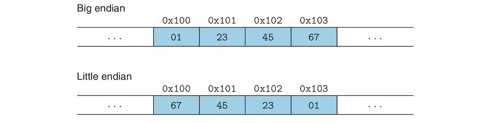

# Representing and Manipulating Information:
- *I will skip many of the very obvious information such as "everything in computers is 0's and 1's".*

## Intro and Motivation:
- A bit is useless by itself, but multiple bits grouped together can be used to encode different types of information, be it characters, negative or nonnegative numbers, etc. 
- In this document we will study three different types of encodings: **unsigned** encodings which is used to represent whole numbers, **two's complement** encodings used to represent **signed** integers, and **floating-point** encodings which are a binary version of scientific notation used to represent real numbers.- We will also discuss issues that that perplex novices such as **overflow** which happens when we try to represent a number that requires more bits than what we used to represent it. 
- Integer arithmetic in computer, however, respects traditional algebraic properties such as associativity and commutativity and all that jazz.
- Floating-point arithmetic can does not respect some algebraic rules due to so called *precision*. Consider the following two examples:
	+ ***3.14 + (1e20 - 1e20) = 3.14***
	+ ***(3.14 + 1e20) - 1e20 = 0***
- Integers are precise while floats are just approximations to real numbers.
- Having only a hazy idea about how how numbers are represented in computers can lead to some confusing results and cause security vulnerability. You have no choice but sit down and spend a little time trying to understand how these work.
- Several binary representations of numbers are used such as *hexadecimal* and *octal* and these are crucial to understand machine-level code.
- *Bit-level* manipulation is also a crucial in understanding code generated and optimized by the compiler. 
- Understanding this document will allow you to make a strong connection between actual real numbers and integers and their computer representation and have a stronger awareness of the capabilities and limitations of computers.  

## Information Storage:
- Instead of accessing bits directly, we use *bytes* which are blocks of 8 bits. Bytes are the smallest addressable unit of the memory. 
- As we've mentioned before, the machine-level program views memory as a very large array of bytes called *virtual memory*. Each byte is identified by a number called its **address**. The set of all possible addresses is called the *virtual address space*. 
- The sequence of bytes are themselves grouped into *program objects*, meaning instructions, program data and control information. However, while the compiler keeps information about data *types*, the actual machine level program treats data as just a sequence of bytes and has no idea about data types?!!!!

### Hexadecimal Notation:
- A single byte consists of 8 bits. In binary notation, its value ranges from ***00000000<sub>2</sub>*** and ***11111111<sub>2</sub>***, that is the range between ***0<sub>10</sub>*** and ***255<sub>10</sub>*** decimalwise. 
- Binary notation is too long and it would be tedious to use decimal notation to represent bits because it is hard to convert between the two. Instead we use ***hexadecimal*** or **base-16** which represented numbers using this sequence **`0 1 2 3 4 5 6 7 8 9 A B C D E F`** where `A` through `F` represents numbers 10 through 15. Written in hexadecimal, byte values can range between ***00<sub>16</sub>*** and ***FF<sub>16</sub>***. Only two hexes can represent the 8 bits in a byte. The conversion between binary and hex notation should be extremely easy even when dealing with very large values. 
- In C, numeric constants preceded by **`0x`** or **`0X`** are interpreted as hexes. The characters `A` through `F` can be upper, lower or even mixed case so ***FA1D37B*** can be represented as **`0xFA1D37B`**, **`0XFA1D37B`**, **`0xfA1D37B`**, etc. From now on,w e will use C notation for representing hex numbers. 
- Converting between binary and hex and vice-versa should be fairly obvious. Just remember that when given a binary number that is not a multiple of 4, make sure to start with right and take the reminder from the leftmost bits and pad their left with leading zeros. 
- When a decimal number ***x*** is a power of 2 such that ***x = 2<sup>n</sup>***, it is easy to convert it to binary and hexadecimal forms. To convert it to binary you just prepend ***n*** zeros to a 1 so that a ***2<sup>5</sup>*** becomes ***100000***. For hex, you divide the number of zeros by 4 and perpend the result to the number. As for the remainder, you raise 2 to to it. For example ***x = 2048 = 2<sup>11</sup>***. We divided ***11*** by ***4*** and we get ***2*** zeros. The remainder of this division is ***3***, we raise 2 to this 3 and get ***8***. We prepend 2 zeros to 8 and get ***0x800***. ***2048 = 0x800***.
- Converting decimal to hexadecimal notation in the general case involves repeatedly dividing the decimal number by ***16*** resulting in a quotient ***q*** and a remainder ***r*** such that ***x = q · 16 + r***. We then replace r with its equivalent hex symbol and use it as the least significant digit. We repeat the same operation for the quotient for the rest of the number. For example to convert the decimal ***75132*** to hex we do t75132he following:
	- ***75132  =  4695 · 16 + 12		(D)***
	-  ***4695  =  293 · 16 +  7		(7)***
	-   ***293  =   18 · 16 +  5		(5)***
	-   ***18   =    1 · 16 +  2		(2)***
	-    ***1   =    0 · 16 +  1		(1)***
-  The series of divisions above results in the hex **`0x1257D`**.
- The general case of converting hexes to decimal notation is much less tedious. It involves multiplying each hex "digit" by a power of 16 and adding the results, for example:
	- ***0x7AF = 7 · 16<sup>2</sup> + 10 · 16<sup>1</sup> + 15 · 16<sup>0</sup>***
	- ***0x7AF = 7 · 256 + 10 · 16 + 15 · 1***
	- ***0x7AF = 1792 + 160 + 15***
	- ***0x7AF = 1967***

### Data Sizes:
- A computer has a **word size** that indicate the size of a pointer and the width of data bus in that computer. The maximum size of the *virtual address space* itself is determined by the word size. For a machine with ***w***-bit word size, virtual addresses can be between ***0*** and ***2<sup>w</sup> - 1***.
- 32-bit word size machines have access to only a 4 GB virtual address space, hile 64-bit systems have access to exabytes of virtual memory.. That's "almost infinite"!
- 64-bit machines can run code designed for 32-bit machines and the compilers gives you the ability to target either one of the who architectures:
```sh
# This will run on both 32-bit and 64-bit systems
gcc -m32 hello.c

# Only runs on a 64-bit machine
gcc -m64 hello.c
```
- A program can be either a 64-bit or 32-bit program, depending on how it was compiled (and not on the machine where it runs). 
- Computers and compilers can differentiate **data types** based on their formats and lengths. The format would usually be floating point or integer and the lengths of such data types range from 1 byte and 8 bytes in the 64-bit architecture for example. 
- The following table shows the different integer and floating-point data types of the C language and their typical length:

<table>
	<thead>
		<tr>
			<th colspan="2">C Declarations</th>
			<th colspan="2">Length in Bytes</th>
		</tr>
		<tr>
			<th>Signed</th>
			<th>Unsigned</th>
			<th>32-bit</th>
			<th>64-bit</th>
		</tr>
	</thead>
	<tbody>
		<tr>
			<td><code>[signed] char</code></td>
			<td><code>unsigned char</code></td>
			<td>1</td>
			<td>1</td>
		</tr>
		<tr>
			<td><code>short</code></td>
			<td><code>unsigned short</code></td>
			<td>2</td>
			<td>2</td>
		</tr>
		<tr>
			<td><code>int</code></td>
			<td><code>unsigned int</code></td>
			<td>4</td>
			<td>4</td>
		</tr>
		<tr>
			<td><code>long</code></td>
			<td><code>unsigned long</code></td>
			<td>4</td>
			<td>8</td>
		</tr>
		<tr>
			<td> <code>int_32t</code></td>
			<td><code>uint32_t</code></td>
			<td>4</td>
			<td>4</td>
		</tr>
		<tr>
			<td><code>int_64t</code></td>
			<td><code>uint_64t</code></td>
			<td>8</td>
			<td>8</td>
		</tr>	
		<tr>
			<td><code>char *</code></td>
			<td></td>
			<td>4</td>
			<td>8</td>
		</tr>
		<tr>
			<td><code>float</code></td>
			<td><code></code></td>
			<td>4</td>
			<td>4</td>
		</tr>
		<tr>
			<td><code>double</code></td>
			<td></td>
			<td>8</td>
			<td>8</td>
		</tr>
	</tbody>
</table>

- The a program is compiled can result in different byte lengths for these data types, so the table above only shows the typical lengths.
- Types can be a little vague. `int` is 4 bytes long in in both 32-bit programs and 64-bit, while `long` is 4 bytes long in 32-bit and 8 bytes long in 64-bit programs. The *ISO C99* standard introduced **`int_32t`**, **`uint_32t`**, **`int_64t`** and **`uint_64t`** to avoid such vagaries. These 4 types would be either 4 or 8 bytes in length regardless of the architecture. 
- As you can see in the table above, a type can be either an integer type such as `int` and `char`, or a floating-point type such as `float` or `double`. 
- Integer types can be signed or unsigned. The keyword `signed` is unnecessary except when it comes to the `char` type. The C standard doesn't guarantee that a `char` be signed by default. You must use the `unsigned` to guarantee that `char` is signed. When preceded by the keyword `unsigned`a data type can only allow nonnegative integers.
- The `char` type is not used to represent characters only. They are integers just like `int`, `short` and `long` types.
- Different orderings of keywords concerning data type can have the same meaning. The following variables all have the same type:
```c
unsigned long a;
unsigned long int  b;
long unsigned c;
long unsigned int d;
```
-  A pointer type should take the full word size of the system regardless of what data type it points to!
- Being aware of type sizes and making types insensitive to exact sizes in different environments can make your programs more portable. 

### Addressing and Byte Ordering:
- When it comes to placing and locating objects in memory, especially objects that span multiple bytes, we are faced with two issues: The memory addresses of these objects and how the bytes of this objects are to be ordered.
- An object is stored as a sequence of contiguous bytes in memory with the address of the object being the smallest address of the object's bytes. Let's a variable **`x`** has address **`0x100`** (in C you get this a dereferencing operation `&x`). The 4 bytes of **`int x`** will be stored in addresses **`0x100`**, **`0x101`**, **`0x102`** and **`0x103`**
- As far as ordering the bytes of a multibyte object in memory, there is and has been a huge nonsensical debate. **Little Endian** advocates argues that we start we the least significant byte and place it at smallest address, while **Big Endian** fanatics call for that order to be reversed so the most significant byte of the object occupies the smallest address cell and the less significant bytes follow it. The following figure shows the byte ordering of object **`0x01234567`** in the two configurations:

- Most Intel-compatible are little endian while most IBM and Oracle compatible machines are big endian. Most and not all as manufacturers tend to share technologies sometimes. More modern microprocessor chips can be **bi-endian** accommodating both orderings and can be configured to use one over the other. In practice, the OS chooses one over the other.
- Ordering can be problematic
	- Byte ordering is mostly invisible to most application programmers and they shouldn't really worry about it. The problem is that it can cause issues in networked systems. When a little endian machine sends data to a big endian machine or vice versa, data is received in a reversed ordering. Networking programs are must follow established conventions that address this issue. 
	- Little endian is kinda contrary to how we represent numbers. The hexadecimal byte-level representation of the number **`0x200b43`** for example might be something like **`43 0b 20 00`** and programmers trying to forage through raw machine code can get confused, although I doubt that anybody with the temerity to such foraging would have such a problem. 
	- Another situation where byte ordering can be problematic is when you try to circumvent the C type system to allow an object to be referenced using a type different from the one it was originally declared with, through such methods as *casting* or *unions*. The average application programmer should probably not mess with this stuff!

### Representing Strings:
- A string in C is an array of characters terminated with a null(whose value is **`0x00`**).
- ASCII decimal digits have values hex values `30 31 32 33 34 35 36 37 38 39` with "0" being equivalent to `30` and so on. They also correspond to octal numbers in the range ***{30, ..., 39}***
- The string **`1234`** is represented in ASCII by the sequence **`31 32 33 34 00`**.
- *Endianness* is not an issue when it comes to an array of `char`s because each `char` is one byte in length. Endianness shows up only when dealing with multiple-byte words. This makes ASCII a platform-independent data format  

### Representing Code:
- One important thing to note is that binaries are seldom portable. Even code compiled for identical processors might not be compatible with machines running different operating systems. 
- For a machine, code nothing but a sequence of bytes. The machine has no idea about the original source code. 

### Intro to Boolean Algebra:
- Boolean algebra and how its used by computers owes its existence and utility to two giants of in the history of computers: Geroge Boole and Claud Shannon. Boole captured logical reasoning through the use of the numbers 0 and 1, and Shannon concluded  that such reasoning could be done by digital machines.
- There are 4 basic boolean operations that act on the set ***{0, 1}***:
	- **NOT** is denoted in C by the symbol **`~`**.
	- **OR** is denoted in C by the symbol **`|`**. 
	- **AND** is denoted in C by the symbol **`&`**.
	- **XOR** is denoted in C by the symbol **`^`**.
- The four boolean operators don't only work on individual bits but can be extended to operate on **bit vectors** (a fancy term for strings or arrays of ones and zeros) where such vectors are equal in length.
- Bit vectors can be used to represent finite sets of something. A finite set ***{0, 1, ..., w - 1}*** can be represented by the bit vector ***[a<sub>w - 1</sub>, ..., a<sub>1</sub>, a<sub>0</sub>]***. Note that the the bit vector indexes are the reverse of those belonging to the finite set their represent. The bit vector ***a = [01101001]*** encodes the finite set ***A = {0, 3, 5, 6}***, while the vector bit ***b = [01010101]*** encodes ***B = {0, 2, 4, 6}***. **`|`** and **`&`** are equivalent to *union* and *intersection* operations on sets. **`~`** is equivalent to set complement. The intersection of A and B which can be expressed as the bit vector operation **`a & b`** results in ***[01000001]*** which is the same as ***A ∩ B = {0, 6}***.
- Bit vectors are widely used for different applications including the use of bits to represent signals for interrupting the execution of a program (We will see this some day, Inshallah)!

### Bit-Level Operations in C:
- To easily perform bit-level operations by hand, expand numbers into their binary representations first.
- The following is the famed in place value swap in C:
```cs
void in_place_swap(int *a, int *b){
	*a = *a ^ *b;
	*b = *a ^ *b;
	*a = *a ^ *b;
}
```
- If you think a little bit about it, you'll find that the result of the **`^`** operation holds the difference between the two operands. It indicates where `a` and `b` differ, so if you have either one of those two variable, you also have the other. The value of one of the 3 values is implicitly stored in the other one. 
- ***Masking*** provides an important use of bit-level operations. It allows you to select a set of bits within a word and sets everything else to zero. This pattern  **`x & 0xFF`** selects the least significant bit from **`0x40AFDAD7`** and sets the rest of the word to zero so the word becomes **`0x000000D7`**. To mask a whole word, you'd use **`x & ~0`**. This is more portable than **`x & 0xFFFFFFFF`**, knowing that the `int` type is not guaranteed to be 8 bytes in length. 

### Logical Operations in C:
- The logical operators **`&&`**, **`||`**, and **`!`** should not be confused with bit-level operators. Logic operators only make distinction between zero and non-zero values and can only result in a **`0`** (False) or a **`1`** (True).
- Logical operators unlike bit-level operators never check their second operand if the result can be determined from the first operand. In **`0x00 && 0x5D`** never checks the second operand because the first one already tells it the result is a false. The same goes for **`0x01 || 0x00`**. 

### Shift Operations in C:
- The **shift** operations allow you to shift bit patterns to the left or right within a value. For a value ***x*** with bit representation ***[x<sub>w - 1</sub>,x<sub>w - 2</sub>, ... ,x<sub>0</sub>]*** the ***left-shift*** operation **`x << k`** results in ***[x<sub>w - k - 1</sub>,x<sub>w - k - 2</sub>, ... ,x<sub>0</sub>, 0, ..., 0]***. ***x*** is shifted by ***k*** bits to the left, dropping the most significant bits and filling the right with ***k*** zeros. The shift value should be between ***0*** and ***w - 1***. "Shift operations associate from left to right so **`x << j << k`** is equivalent to **`(x << j) << k`**".
- The other shift operation is the ***right-shift*** operation. It has the form **`x >> k`**. It shifts bits to the left of ***x*** by ***k*** bits. There are 2 forms of right shift, however:
	* **Logical** right shift which fills the left with ***k*** zeros.
	* **Arithmetic** right shift which fills the left with ***k*** repetitions of the most significant bit. Arithmetic right shift is used to shift signed data types. 
- The C standard does not define probably which right shift to use for signed data which is can lead to portability issues. However most compilers and programmers agree that arithmetic right shifts be used for signed data and logical right shifts be used for unsigned data. 

## Integer Representations:
### Integral Data Types:
### Unsigned Encodings:
### Two's-Complement Encodings:
### Conversions between Signed and Unsigned:
### Signed vs. Unsigned in C:
### Expanding The Bit Representation of a Number:
### Truncating Numbers:
### Advice on Signed vs. Unsigned:


## Integer Arithmetic:


### Unsigned Addition:
### Two's-Complement Addition:
### Two's-Complement Negation:
### Unsigned Multiplication:
### Two's-Complement Multiplication:
### Multiplying by Constants:
### Dividing by Powers of 2:
### Final Thoughts on Integer Arithmetic:

## Floating Point:
### Fractional Binary Numbers:
### IEE Floating-Point Representation:
### Example Numbers:
### Rounding:
### Floating-Point Operations:
### Floating Point in C:


