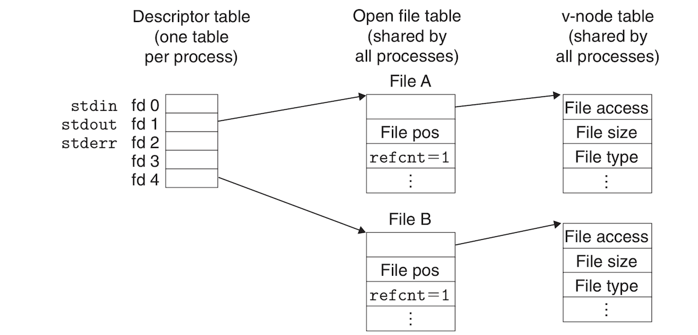

# System Level IO:
## Table of Content:
* [Introduction](#introduction)
* [Unix IO](#unix-io)
* [Opening and Closing Files](#opening-and-closing-files)
* [Reading and Writing Files](#reading-and-writing-files)
* [Robust Reading and Writing with the Rio Package](#robust-reading-and-writing-with-the-rio-package)
* [Reading File Metadata](#reading-file-metadata)
* [Sharing Files](#sharing-files)
* [IO Redirection](#io-redirection)
* [Standard I/O](#standard-i/o)
* [Putting It Together Which I/O Functions Should I Use?](#putting-it-together-which-i/o-functions-should-i-use)

## Introduction:
- **Input/Output (IO)** is the process of copying data between main memory and external devices such as networks, displays or storage devices. An **input** operation copies data from an IO device to main memory, while **output** is copying data from main memory to an IO device. 
- All languages provide out-of-the-box higher-level IO packages which include such important functions as `printf`. These higher-level functions themselves are based on the system-level *Unix IO* functions provided by the kernel. The higher-level IO packages do most of what a programmer really needs, so why study the low-level Unix IO? There are a few reasons which include:
	- **Understanding Unix IO is a prerequisite to understanding other systems concepts:** IO concepts are central to systems in general and many other aspects of systems are deeply interdependent with IO. For example, creating a new process does involve one aspect or another of IO. Processes themselves are also fundamental to understanding IO. We have touched in previous documents on a few IO topics when we discussed memory hierarchy, virtual memory and processes. This document will be a deeper treatment of IO and its particular features. 
	- **There are IO services that can only be accessed by raw Unix IO:** There are some IO services that cannot be accessed with language higher-level IO packages such as file metadata (file size or creation date). IO packages also have shortcomings that prevents them from being used safely in network programming. 
- This document will be an introduction to the general concepts of Unix IO and standard IO and how to use them effectively.

## Unix IO:
- A Unix **file** is a sequence of ***m*** bytes:
	- ***B<sub>0</sub>, B<sub>1</sub>, ..., B<sub>k</sub>, ..., B<sub></sub>***
- All IO devices such as networks, disks, displays, keyboards, etc. are modeled as files and all input and output are performed by reading from and writing to these files. This simple mapping between devices and files allows for a simple interface known as the **Unix IO** which allows for all IO operations to be done in a consistent way across different types of devices:
	- **Opening files**: An application indicates that it wants to access an IO device by asking the kernel to **open** its file. The kernel returns a small nonnegative number called a **descriptor**. The descriptor identifies the file in all the following operations. The kernel keeps track of all information about the open file, while the application keeps track of the file descriptor. When you create a process by a Unix shell, the process starts life with 3 open files: **standard input** with descriptor 0, **standard output** with descriptor 1, and **standard error** with descriptor 2. `<unistd.h>` holds constants for these descriptors: **`STDIN_ FILENO`**, **`STDOUT_ FILENO`**, and **`STDERR_FILENO`**.
	- **Changing the current file position**: The **file position** of an open file is a byte offset of a certain value from the beginning of a file. It is initially 0 and is maintained by the kernel. The application can explicitly set the file position with the **seek** operation.
	- **Reading and writing files**: A **read** operation copies ***n > 0*** bytes from a file to memory starting at the current file position, and incrementing the file position by ***n***. If the size of the file is ***m*** bytes, then when the file position is equal to or larger than ***m***, a condition called **edge-of-file (EOF)** is triggered. EOF can be detected by the application. There is no *"EOF character"* at the end of the file! *Thank you!!* The **write** operation follows similar steps with the exception that it copies bytes from memory to the file.   
	- **Closing files**: When the application finishes accessing the file, it tells the kernel to **close** the file. The kernel frees "the data structures it created when the file was opened and restor[es] the descriptor to a pool of available descriptors." If the terminal terminates normally or unexpectedly, the kernel closes all open files and frees their memory resources. 

## Opening and Closing Files:
- The **`open`** function can open an existing file or create a new file:
```c
#include <sys/types.h> 
#include <sys/stat.h> 
#include <fcntl.h>

int open(char *filename, int flags, mode_t mode); // Returns descriptor, or -1 on error
```
- The `open` function "converts" a `filename` to a file descriptor and returns the descriptor number to the calling process. The descriptor returned is the smallest descriptor that is not current opened in the process. 
- The **`flags`** argument tells us how the process wants to access the file:
	- **`O_RDONLY`**: Read only.
	- **`O_WRONLY`**: Write only.
	- **`O_RDWR`**: Write and read.
- The `flags` argument can also be *OR*'d with more instructions for writing:
	- **`O_CREAT`**: If a file with the given name doesn't exist, create a *truncated* version of it. 
	- **`O_TRUNC`**: If the file exists, truncate it (empty it).
	- **`O_APPEND`**: Before writing, set file position to the end of the file.
- The following examples opens a file with the intention of starting to write at the end of it:
```c
fd = open("somefile.txt", O_WRONLY | O_APPEND, 0);
```
- The mode arguments decides the accessing permission bits of a new file. These bits are shown in the following table:

| Mask | Description |
| --- | --- |
| `S_IRUSR` | User (owner) can read this file |
| `S_IWUSR` | User (owner) can write this file |
| `S_IXUSR` | User (owner) can execute this file |
| `S_IRGRP` | Members of the owner's group can read this file |
| `S_IWGRP` | Members of the owner's group can write this file |
| `S_IXGRP` | Members of the owner's group can execute this file |
| `S_IROTH` | Others (anyone) can read this file |
| `S_IWOTH` | Others (anyone) can write this file |
| `S_IXOTH` | Others (anyone) can execute this file |

- The context of each process has a `umask` (whatever that means) which is set by the `umask` function. When a process creates a new file with the `open` function using the `mode` argument, the access permission bits of the file are set to `mode & ~umask`
- The following macros define an example of default `mode` and `umask` you can make:
```c
#define DEF_MODE S_IRUSR|S_IWUSR|S_IRGRP|S_IWGRP|S_IROTH|S_IWOTH
#define DEF_UMASK S_IWGRP|S_IWOTH
```
- The following code uses the definitions above to create a new file where only the owner has read and write permissions, while everyone else has read permissions only:
```c
umask(DEF_UMASK);
fd = Open("somefile.txt", O_CREAT|O_TRUNC|O_WRONLY, DEF_MODE);
```
- Opened files can be closed with the **`close`** function which takes a file descriptor as an argument. Closing a descriptor that is already closed results in an error:
```c
#include <unistd.h> 

int close(int fd); // Returns 0 if ok, -1 on error
```

## Reading and Writing Files:
- Applications perform input with the **`read`** function and output with the **`write`** function:
```c
#include <unistd.h>

// Returns: number of bytes read if OK, 0 on EOF, −1 on error
ssize_t read(int fd, void *buf, size_t n);

// Returns: number of bytes written if OK, −1 on error
ssize_t write(int fd, const void *buf, size_t n);
```
- The `read` function copies at most `n` bytes from the file pointed to be descriptor `fd` to memory location `buf`. On error, `read` returns -1, and returns 0 on EOF. Normally, it returns the number of bytes that were coppied from `fd` to `byte`. 
- **`write`** does the exact same thing but in reverse: it copies bytes from memory location `buf` to file `fd`.
- The following code copies standard input to standard output one byte at a time:
```c
#include <unistd.h>
#include <stdlib.h>

int main(){
    char c;
    while(read(STDIN_FILENO, &c, 1) != 0)
        write(STDOUT_FILENO, &c, 1);
    exit(0);
}
```
- The current file position can be manipulated with the **`lseek`** function.
- In some cases `read` and `write` transfer less bytes than the application requests. These are called *short counts* they are not necessarily errors, but might occur for some reasons such as:
	- *Encountering EOF on reads*: If the application requests a 100 bytes from a file that has only 20 bytes, the first `read` will return the short count 20 and the next `read` returns the short count 0, coz it encounters EOF.
	- *Reading text lines from a terminal*: If the open file is associated with the terminal (keyboard, display, etc.), `read` can only read one line at a time. If you requests chunks of 100 bytes and a line is shorter than 100, you get a short line.
	- *Reading and wring sockets*: If the open file is a network socket, "then internal buffering constraints and long network delays" can cause short counts. Short counts can also happen due to the Unix *pipe*.
- Short counts are almost never encountered when reading from or writing to disk except on EOF, but to have reliable network applications, we need to overcome short counts caused by network latency and other reasons. 

## Robust Reading and Writing with the Rio Package:
- *This section went over creating a IO package resilient to short counts, but what I thought was interesting is the difference between buffered and unbuffered IO. I understand the general idea, but I'm not sure about the details. Basically, with buffering a whole block of bytes gets written or read at once, instead of reading/writing each byte individually. The block of bytes gets stored somewhere between operations. The common opinion is that buffering reduces overhead because there are not system calls for each byte  and that fewer calls are performed for a whole block than for each byte in the block. One thing that really confused me from the text is a claim that buffered IO is good for text files, while unbuffered IO is good for text files, while binary data is bettered IOed without buffering.I checked online and couldn't find definitive answers to anything about buffering and often some conflicting "opinions", the most confusing of which was that buffering might be bad because we are doing [double buffering](https://www.quora.com/What-is-a-good-explanation-of-buffered-I-O). Even when reading the C programming language book, I was stomped at one of the later chapters that was about Unix IO. Probably, I might have to come back to this subject in the future.*

## Reading File Metadata:
- Information about a file or **metadata** can be gotten by a call to **`stat`** or **`fstat`**:
```c
#include <unistd.h>
#include <sys/stat.h>

int stat(const char *filename, struct stat *buf);
int fstat(int fd, struct stat *buf);
```
- `stat` takes a file name and a struct of type `stat` as arguments, while `fstat` takes a file descriptor instead of a file name. Both function fills the `stat` struct with the file's metadata. This struct has several information about the file such as its owner and group IDs, its size in bytes, the time it was created, modified and accessed and also about its protection and file type. The following code prints the time when the file was last accessed (seconds that had elapsed since January 1, 1970!): 
```c
#include <unistd.h>
#include <sys/stat.h>
#include <stdio.h>

int main(int argc, char **argv){
	struct stat ztat;

	stat(argv[1], &ztat);

	printf("%ld\n", ztat.st_atime);

	return 0;
}
```
- Some of the more important file metadata include its type which is denoted by the `st_mode` element of the `stat` struct. A file can be either a *regular file*, a *directory* which contains information about other files, or a *socket* which is a file used to communicate with other processes across a network. 
- File size is denoted by the `st_size` element of the `stat` struct. It is in bytes.

## Sharing Files:
- Unix files can be shared (between what and what) in different ways. To understand file sharing, we need to first understand how the kernel represents open files. Open files are represented by the kernel in 3 related data structures:
	- **Descriptor table**: Each process has its own descriptor table with entries indexed  by the process's open file descriptors. Each open descriptor entry points to an entry in the *file table*.
	- **File table**: is the set of open files in the whole system. It is shared by all processes. Each entry in the table contains information such as the file current position, a *reference count* of the number of open file descriptor point to it, and a pointer to the *v-node table*. 
	- **v-node table:** is also shared by all processes. Each entry contains most of the information in the `stat` struct of the file. 
- The following image shows a processor with two descriptors referencing two distinct files through two different file descriptors. These files are not shared and each descriptor references a distinct file. This is the normal non-problematic case:

- The weird part is that multiple descriptors from the same process can reference the same file through different file table entries. The main differentiator is that each file descriptor has its own file position as the following image shows:
[Kernel data structures for open files (2 descriptors per file)](img/process2files.png)
- When a processes creates child process with `fork`, the child process inherits exact copies of the file descriptors of the parent. They share the same file positions. Both parent and child must close these shared file descriptors before the file table entry of the file can be deleted:
[Kernel data structures for open files (Parent and child sharing files)](img/parentChildFileDescs.png)

## IO Redirection:
- Unix's **IO redirection** means allowing the user to associate standard output and input with disk files. When you run the shell command **`ls > somefile.txt`**, you are printing the results of `ls` to the disk file `somefile.txt`, meaning redirecting in from standard output. "A Web server performs a similar kind of redirection when it runs a CGI program on behalf of the client."
[IO redirection using dup2](img/ioRedirectionDup2.png)
- One way to do IO redirection is with the **`dup2`** function:
```c
#include <unistd.h>

// Returns: nonnegative descriptor if OK, −1 on error
int dup2(int oldfd, int newfd);
```
- `dup2` copies descriptor table entry `oldfd` to descriptor table entry `newfd`. If `newfd` is already open, then `dup2` closes it before copying to it. 
- Imagine we have a process with two descriptors and the same file position. We then redirect one of the two files to the other. Now both descriptors will point the second file through its file table entry. The first file is closed and its file table entry is deleted. Everything written to the first  will be directed to the second one. 

## Standard I/O:
- We might not have to dip or hands deep in the muddied waters of low level Unix IO, as C provides us with the convenient **standard IO** (`<stdio.h>`). It provides `fopen` and `fclose` for opening and closing a file, `fread` and `fwrite` for reading and writing bytes, `fgets` and `fputs` for writing and reading strings, and `printf` and `scanf` for sophisticated formatted IO. 
- An open file in stdio is abstracted as a **stream**, which isa basically a pointer to  structure of type `FILE`.
- Each C program starts with 3 open streams: `stdin` (standard input), `stdout` (standard output), and `stderr` (standard error):
```c
#include <stdio.h>

extern FILE *stdin;  // 0
extern FILE *stdout; // 1
extern FILE *stderr; // 2
```
- A stream of type `FILE` is an abstraction for a descriptor and a *stream buffer*. Streams are basically buffered IO structures, which are more efficient because they minimize IO system calls. Even for IO calls that read a single byte at a time such as `getc`, a stream buffer gets filled for each call, and the next bytes are retrieved from this buffer instead of from disk.

## Putting It Together: Which I/O Functions Should I Use?
- When it comes to IO, you can directly use IO functions implemented in the OS kernel itself, such as the Unix `open`, `close`, `read`, `write`, `lseek` and `stat` functions. You can also write your own packages where you tweak things to serve your specific needs. There is also an amazing battle tested stdio library that has been used by generations of programs. 
- You might never have to bother with the low Unix IO functions or develop your own packages, but deal exclusively with the standard IO utilities offered by the standard library. There are situations, though, where stdio is not ideal, namely when dealing with network socket files, mainly because standard IO streams have their own restrictions which interfere with restrictions imposed on socket files.
- stdio streams are *full duplex*, meaning both input and output can be performed on the same stream. What follows from that are the following two restrictions:
	- When an *input function follows an output function,* the function `fflush` (for emptying the stream buffer), `fseek`, `fsetpos`, or `rewind` (these 3 functions set file position) must be called between the two calls. 
	- When an *output function follows an input function,* `fseek`, `fsetpos`, or `rewind` must be called between the two, unless the input function encounters an EOF.
- Such restrictions are problematic for network applications because it's illegal to call `lseek` in sockets. The first restriction can be mitigated by flushing the the stream buffer before every call to input. To get around the second restriction, we open 2 streams on the same open socket descriptor, one for input and the second for output:
```c
FILE *fpin, *fpout;

fpin = fdopen(sockfd, "r");
fpout = fdopen(sockfd, "w");
```
- To free the resources associated with this socket, both streams need to be closed with:
```c
fclose(fpin);
fclose(fpout);
```
- One of these of these calls will close the open file, but the second will fail because it is called on a closed file. This is fine for sequential programs but a big problem for multi-threaded programs. 
- The book recommends using their own RIO package or something robust when dealing with networks. 
