# Virtual Memory:

## Introduction:
- Multiple processes can share the CPU and memory. When too many processes share a CPU, it is slowed down but when too many	processes share memory, they might run out of the available space and no more processes can use that memory. Processes might also be able to mess with memory "belonging" to other processes, thus corrupting this memory.
- Modern systems use **virtual memory** to address these problems. "*Virtual memory is an elegant interaction of hardware exceptions, hardware address translation, main memory, disk files, and kernel software that provides each process with a large, uniform, and private address space.*" It offers the following three services:
	- It treats main memory as a cache for disk, keeping only active data in memory and moving data back and forth between memory and disk as needed.
	- It simplifies memory management by providing each process with a uniform address space.
	- It provides each process with a private address space that cannot or should not be accessed/corrupted by other processes.
- The system takes care of virtual memory from A to Z without the need of programmer's intervention. Why bother about it then? Reasons for bothering about VM include:
	- *VM is central*: Understanding VM will make one have a better understanding of the system. VM involves all layers and aspects of a system from hardware exceptions, assemblers, files, loaders, processes, etc. 
	- *VM is powerful*: Understanding VM gives applications advanced capabilities and allows for neat tricks (*that we will see later*).
	- *VM is dangerous*: Improper use of VM can lead to weird and dangerous errors and program behavior. Understanding VM might allow me to better understand memory errors surrounding misuse of pointers and what not!
- VM is a difficult subject. This document will try to first go over how it works and then moves on to described how it is used and managed by applications. We might also go over how to manage and control VM in our programs. 

## Physical and Virtual Addressing:
- Main memory is an array of ***M*** contiguous byte-sized cells each of which has a unique **physical address (PA)**. The first byte has address 0, the second address 1, the third address 2, etc. The CPU is capable of accessing this array of bytes in what is called **physical addressing**.
- The following images shows an example of physical addressing in the context of a load operation. The CPU generates a physical address starting at address 4. This address is sent to main memory over memory bus. The main memory fetches the 4-byte word starting at PA 4 and returns it to the CPU: 
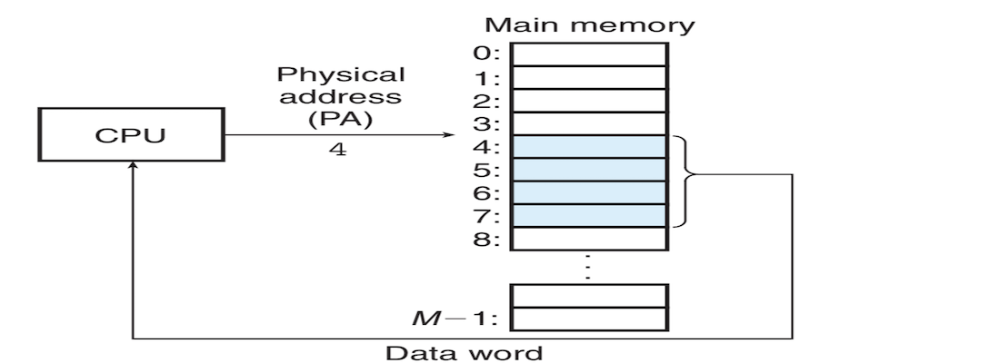
- Physical addressing was common in earlier computers. Embedded microcontrollers, digital signal processors, etc. continue to use raw physical addressing. 
- Modern processors use **virtual addressing (VA)** instead. With virtual addressing, the CPU accesses main memory by issuing virtual addresses which are converted to physical addresses before being sent to memory. The act of converting a virtual address into a physical address is called **address translation**. Virtual addressing requires a close cooperation between the CPU hardware and the operating system. The CPU chip has a piece of hardware dedicated to translating virtual addresses. It is called **memory management unit (MMU)**. It translates virtual addresses on the fly using a look-up table stored in main memory whose contents are managed by the OS. The following image shows how VA works:
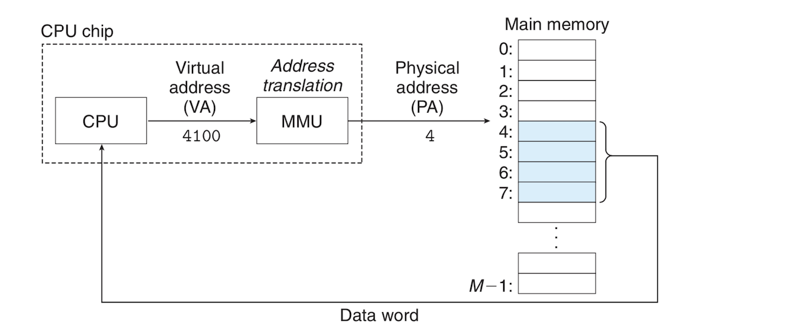

## Address Spaces:
- An **address space** is an ordered set of nonnegative integer addresses:
	* ***{0, 1, 2, ...}***
- A **linear address space** is one where the integers are consecutive. We will assume all address spaces are linear. 
- In a system with virtual memory, the CPU generates virtual addresses from an address space of ***N = 2n*** addresses called the **virtual address space**:
	* ***{0, 1, 2, ..., N - 1}***
- The size of an address space is determined by the number of bits needed to represent the largest address. A virtual address space with ***N = 2n*** is an *n-bit* address space. Modern systems have either a 32-bit or 64-bit virtual address space. 
- A system also has a **physical address space** corresponding to the ***M*** bytes of its physical memory:
	* ***{0, 1, 2, ..., M - 1}***
- ***M*** doesn't have to be a power of 2, but for the sake of simplification we will assume ***M = 2m***. 
- The address space concept can help us make distinction between data objects (bytes) and their attributes (addresses). This distinction allows us to have multiple addresses from different address spaces for each data object. 
- The basic idea of virtual memory is that each byte of main memory has a virtual address from the virtual address space and a physical address from the physical address space. 

## VM as a Tool for Caching:
- In theory, a virtual memory is an array of ***N*** contiguous byte-sized cells stored in disk. Each byte has a unique virtual address acting as an index into this array. The contents of the array in disk are cached in main memory. As with other cache in memory hierarchy, the virtual array in disk is segmented into blocks that are used as transfer units between disk and main memory. The VM system is responsible for this partitioning. It partitions virtual memory into fixed-sized blocks called **virtual pages (VPs)**. Each virtual page is ***P = 2p*** bytes in size. 
- Physical memory is also partitioned into blocks called **physical pages (PP)** which are called **page frames**. 
- The set of virtual pages is partitioned into 3 disjointed subsets:
	- **Unallocated**: pages are not yet created (allocated) by the VM system. They have no data associated with them and don't occupy space on disk.
	- **Cached**: Allocated pages that are cached in physical memory.
	- **Uncached**: Allocated pages that are not cached in physical memory.
- The following image shows a virtual memory with 8 pages accommodating a 6-page physical memory. You can see in the image the different subsets of virtual memory, i.e. unallocated, cached and uncached:
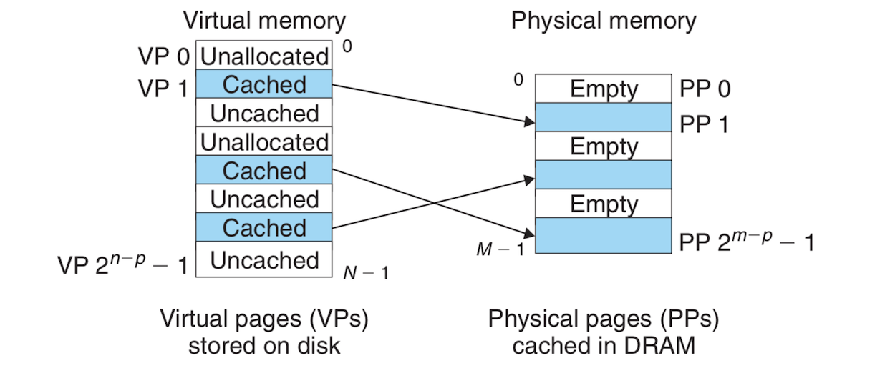

### DRAM Cache Organization:
- From now on we will use *SRAM cache* to denote three caching layers L1, L2 and L3, and *DRAM cache* to denote the VM system's cache which caches virtual pages in main memory. 
- The position of a caching level in the memory hierarchy decides how the cache is organized. DRAM is only 10 times slower than SRAM, but disk is 100,000 times slower than DRAM. DRAM cache misses are extremely costly.
- To mitigate the large miss penalties and the costly retrieval of data from disk:
	- Virtual pages are between 4KB and 2MB large. These large page sizes can help . 
	- DRAM caches are also fully associative: a virtual page can be placed in any physical page.
	- Operating systems also use sophisticated implementations of replacement policies for DRAM caches.
	- DRAM caches also use write-back instead of write-through. 

### Page Tables:
- The VM system must have a way of finding if and where a virtual page is cached in DRAM. If the virtual page is cached, the system must know in which physical page it's cached. If not, the system must know where the virtual page is stored in disk. It must also select a victim page in DRAM and replace it with the appropriate virtual page.
- These capabilities are provided by a combination of OS software, address translation hardware in the MMU and an important data structure stored in physical memory called **page table**. Page table maps virtual pages to physical pages. The address translation hardware reads the page table each time it translates a virtual address to a physical address. The OS is responsible for maintaining the contents of the page table and moving pages between the DRAM and disk.
- The following image shows the organization of the page table and how it works:
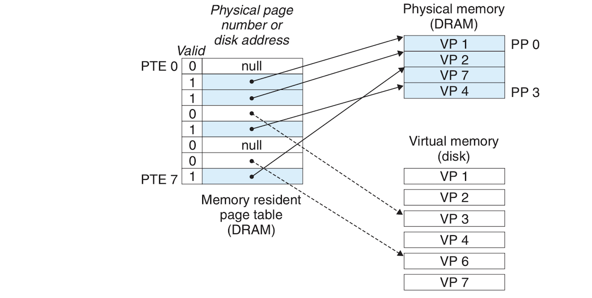
- A page table is an array of **page table entries (PTEs)**. Each page in the virtual address space has a PTE at a fixed offset in the page table. We assume that each PTE consists of two parts, a *valid bit* and an *n*-bit address field. The valid bit indicates whether a virtual page is currently cached in DRAM. If the valid bit is set (has value 1), the address field indicates the start of the physical page where the virtual page is cached. If the valid bit is not set and the address field is NULL, then the virtual page has not been allocated. If the valid bit is not set and there is an address, then that address points to the start of the uncached virtual page on disk. 
- To reiterate, any virtual page can be placed in any physical page because DRAM cache is fully associative. 

### Page Hits:
- Referring to the [page table image](img/pageTable.png), let's say the CPU want to access data from virtual memory located in *VP 2*. The translation hardware uses the virtual memory address as an index to locate *PTE 2* (using a mechanism we will see later) and reads it from memory. *VP 2* is cached because the valid bit is set. The address in *PTE* which points to the start of the physical page *PP 1*is then used to form the physical address of the data. 

### Page Faults:
- A DRAM cache miss is called a **page fault**. When the address translation hardware reads a PTE from memory and finds out that its valid bit is not set and it's address field is not NULL. it knows that the corresponding virtual page is not cached so:
	- It triggers a *page fault exception*. 
	- The page fault exception invokes a handler in the kernel which select a victim virtual page stored in physical memory. It first checks if this victim page has been modified it, in which case it copies it back to the disk. It then modifies the PTE for the given virtual page to reflect that page is no longer cached in main memory.
	- The kernel copies the virtual page from disk to the corresponding physical page, updates the corresponding PTE, and returns.
	- After the handler returns, the faulting instruction is restarted. The address translation hardware now handles a page hit normally because the given virtual page is now cached in DRAM.
- Virtual memory has been around since the early 1960s, which is the reason why it has some  different terminology than SRAM that refer the basically the same things:
	- SRAM *blocks* are called *pages*.
	- Transferring pages between disk and memory is called **swapping** (also **paging**). Pages are *swapped in* from disk to DRAM, and *swapped out* from DRAM to disk.
	- Waiting until the last moment to swap in a page is called **demand paging** which is the de facto mode used in virtual memory.

### Allocating Pages:
- A new page of virtual gets allocated as a result of say the `malloc` C function. It basically involves creating a virtual page on disk and updating some entry in the PTE to point to this newly created virtual page.

### Locality to the Rescue Again
- Virtual memory might seem inefficient due to the large miss penalties, but is surprisingly efficient because of *locality*. Programs might reference a large number of distinct pages that might exceed the size of physical memory, but a given moment these programs tend to mostly operate on a small set of *active pages* called the **working set** or **resident set**. After the initial warming when the resident set is paged into memory, subsequent references to that set are fast with no misses. Think of Microsoft Word's sluggish start!
- Good temporal locality produces seamless fast programs, but not all programs have it. If the working set exceeds the size of the physical memory, **thrashing** occurs. Thrashing is a situation where pages continually swapped in and out. 

## VM as a Tool for Memory Management:
- Another use of virtual memory is that it simplifies memory management and "provide[s] a natural way to protect memory."
- So far we've been talking about a single page table that maps a single virtual address space, but in fact, the OS provides a separate page table, and a thus a separate virtual address space for every process as the following image shows:
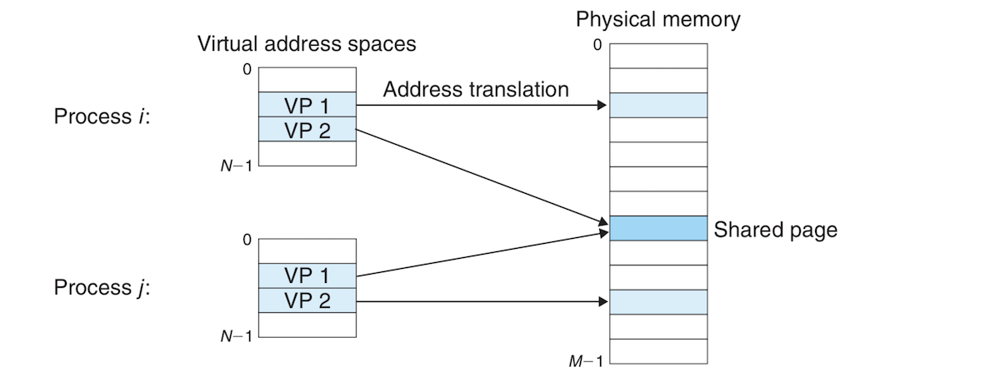
- An interesting observation from the previous image is that multiple virtual pages from different process can be mapped to the same shared physical page.
- The combination of demand paging and separate address spaces in a virtual memory system largely simplifies the use and management of memory (*having skipped the linking chapter for now, I basically know nothing about it at the moment and might misrepresent the rest of this section*):
	- *Simplifying linking*: Separate address spaces allow each process to have the same memory image where code starts a certain point and text and stack have similar layouts regardless of the the particular physical memory where they are stored. Apparently linking is made easier by this predictable layout of each process irrespective of what physical memories they target. 
	- *Simplifying loading*: ?? *I don't know anything about linking might come back to this*
	- *Simplifying sharing*: Each process has its own separate private data, code, stack and heap, but virtual memory allows for easy sharing of some code and data between different processes such as kernel code or the C standard library routines. Instead of having separate copies of kernel code and shared libraries, the operating systems have page tables map virtual pages of this shared code and data to the same physical pages. 
	- *Simplifying memory allocation*: VM also allows for simple allocation of additional memory to user processes. When a user processes requests additional memory, for example when calling `malloc`), the OS allocates the appropriate amount of contiguous virtual memory pages and maps this contiguous chunk to arbitrary physical memory pages located anywhere in DRAM. 

## VM as a Tool for Memory Protection:
- A modern OS is expected to offer protection and control of memory system. A user process cannot or should not be able to:
	- Modify its read-only text region. 
	- Read or modify kernel's data and code.
	- Read or write private memory of other processes.
	- Modify virtual pages shared with other processes (unless explicitly allowed to do so through interprocess system calls).
- By providing processes with separate address spaces, VM makes it easy to isolate the private memories of these processes.  
- The address translation mechanism of a VM system goes further to offer a finger form of memory protection at the page-level. Every time the CPU wants to access information at a given address, the address translation hardware reads a PTE. By adding permission bits to PTEs, it becomes easy to control access to the contents of the corresponding virtual page as the following image shows:
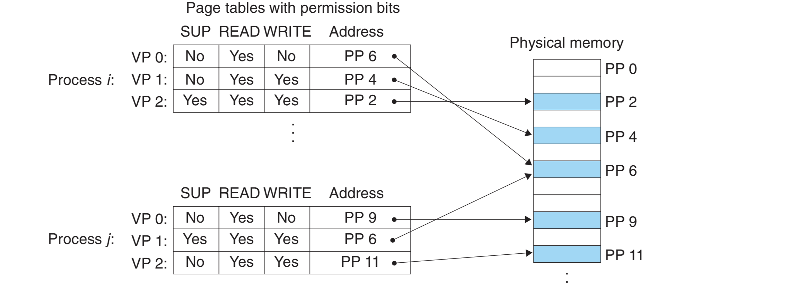
- PTEs in this example now have 3 additional bits for access control:
	- The ***SUP*** bit indicates whether the process must be running in kernel (supervisor) mode to able to access the page. Processes running in kernel mode can access any page, but user mode processes can only access pages whose SUP bit is 0.
	- The ***READ*** bit controls the read access to the page.
	- The ***WRITE*** bit controls the write access to the page.
- If a process violates any of these permissions, the CPU triggers a protection fault and transfers control to an exception handler in the kernel. This is reported as the famous or infamous *segmentation fault*!! Ahha, that's what it is!!

## Address Translation:
- This section offers a rough overview of the basics of address translation and the hardware's role in virtual memory. The following tables show the meanings of the symbols that will be used through this section:

*- Basic Parameters:*

| Symbol | Description |
| --- | --- |
| N = 2n | Number of addresses in virtual address space |
| M = 2m | Number of addresses in physical address space |
| P = 2p | Page size in bytes |

*- Components of a virtual address (VA):*

| Symbol | Description |
| --- | --- |
| VPO | Virtual page offset in bytes |
| VPN | Virtual page number |
| TLBI | TLB index |
| TLBT | TLB tag |

- *Components of a physical address (PA):*

| Symbol | Description |
| --- | --- |
| PPO | Physical page offset in bytes |
| PPN | Physical page number |
| CO | Byte offset within cache block |
| CI | TLB index |
| CT | TLB tag |

- **Address translation** is a mapping between the elements of an ***N***-element virtual address space (***VAS***) and an ***M***-element *physical address space* (***PAS***).
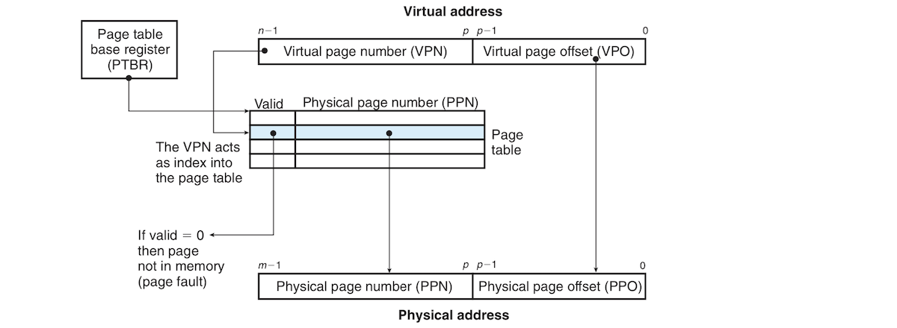
- THe image above shows how the MMU uses a page table to perform address translation. A control register in the CPU called the **page table base pointer (PTBR)** points to the current page table. The ***n***-bit virtual address has two components: a ***p***-bit **virtual page offset (VPO)** and a ***(n - p)***-bit **virtual page number (VPN)**. The VPN is used by the MMU to locate the appropriate PTE so VPN 0 selects PTE 0, VPN 1 selects PTE 1, and so on. The corresponding physical page can be found by concatenating the **physical page number (PPN)** to the VPO of the virtual address. Because physical and virtual pages are both P bytes in length, the PPO and VPO are the same. 
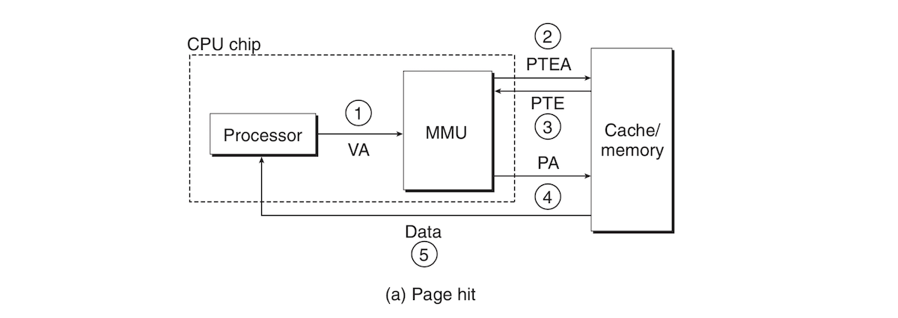 
- The image above traces the steps followed when there is a page hit:
	- *Step 1*: The processor generates a virtual address and sends it to the MMU. 
	- *Step 2*: The MMU produces the PTE address and requests it from main memory.
	- *Step 3*: The MMU constructs the physical address and sends it to main memory.
	- *Step 4*: The main memory returns the requested word to the processor. 
[A page fault](img/pageFault.png)
- The image above shows what happens when a page fault occurs:
	- *Step 1 to 3*: The same steps 1 to 3 in a page hit.
	- *Step 4*: The valid bit in the PTE is 0, so the CPU triggers an exception which transfers control to a page fault exception handler in the kernel.
	- *Step 5*: The fault handler identifies a victim page in physical memory. If that page is modified, it pages it out to disk.
	- *Step 6*: The fault handler pages the new page in and updates the PTE.
	- *Step 7*: The fault handler returns to the process that caused the fault and causes the faulting instruction to restart. The CPU then resends the same address to the MMU and because the page is in physical memory, there is a hit. Steps 1 to 4 from the page hit section are performed and the main memory returns the requested to the processor. 

### Integrating Caches and VM:
- Should we use virtual or physical addresses to access SRAM cache? Most systems use direct physical addresses for SRAM and don't ask me why! It's enough to know that cache wouldn't have memory protection issues because address translation occurs before access, so processes can have blocks in cache at the same time. PTEs can also be cached in SRAM as any other data from main memory.

### Speeding Up Address Translation with TLB:
- Should the MMU refer to a PTE to translate a virtual address into a physical address for every request by the CPU? This can introduce considerable overhead. If the PTE is cashed in L1, referring to it can take  couple extra cycles, if it has to be fetched from main memory then it's a few hundred cycles. 
- Modern systems try to reduce this overhead by having a small cache of PTEs in the MMU called **translation lookaside buffer (TLB)**. A TLB is a small *virtually addressed (:confused:!!!)* cache where each line holds a single PTE. When there is a TLB hit, the whole address translation voodoo happens in the MMU hardware making it extremely fast. A TLB follows these steps:
	- *Step 1*: The CPU generates a virtual address.
	- *Step 2 and 3*: The MMU fetches the PTE from TLB.
	- *Step 4*: The MMU translates the virtual address to physical address and sends to cache or main memory. 
	- *Step 5*: The cache/main memory returns the requested data to the CPU.
- When there is a TLB miss, the PTE is requested from cache/main memory. The fetched PTE is then stored in the TLB and maybe overwriting an existing PTE. The following image shows how TLB hits and misses work:
[TLB hits and misses](img/tlb.png)

### Multi-Level Page Tables: 
- So far, we've been talking about a single page table for each process. In a 32-bit system, having 4KB pages with a 4-byte PTE for each page requires having a 4 MB page table in memory at all time for each process even if the process uses only a small part of the VM. This becomes a bigger problem in 64-bit systems. 
- This problem is mitigated with the use of **multi-level page tables**. There are many details, but the basic idea is that instead of having a single page table, there is a hierarchy of page tables for each process. Imagine we have a 32-bit address space partitioned into 4KB pages with page table entries having 4 bytes each. There are one million pages and for each one of these pages we have one PTE, which would require 4 million bytes (4MB) if we use a single page table. Imagine also that the address space has the following layout: The first 2K pages are for code and data, the next 6K pages are unallocated, the next 1023 pages are also unallocated, and the next page is allocated for the stack. The following image shows how a 2-level page table hierarchy is used to address such a layout:
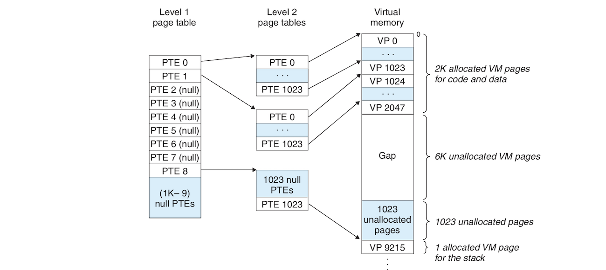
- Each PTE in the first-level table is responsible for mapping a 4MB chunk of virtual address space, with every chunk containing 1024 pages. We need 1024 PTEs to cover the whole 4GB address space, so our level 1 page table is only 4KB in size. 
- As the image above shows, if every page in a given chunk is unallocated, the corresponding PTE is null. In our image, level-1 PTEs 2 to 7 are null because page is allocated in the corresponding chunks. If only one page is allocated in a given chunk, the corresponding level-1 PTE points to a level-2 page table.
- Each PTE in a level-2 page table is responsible for mapping a single 4KB page of virtual memory. Each of these level-2 page tables has a 4 KB size. 
- This scheme reduce the size of page table requirements in two ways:
	- If a PTE in level-1 table is null, the corresponding level-2 table doesn't have to exist. Most memory in a 4GB virtual address space is unallocated, so we save up a lot of space that would've been eaten by a single page table.
	- Only the 4KB level-1 page need be resident in memory at all time. level-2 pages can be created, paged in or paged out based on current needs. Only the mostly used level-2 pages need to be cached in main memory, hence reducing load on the system. 
- The following image shows how address translation is done with multi-level page tables. The virtual address is partitioned into a number of VPNs corresponding to the number of levels in our page table hierarchy and a VPO. Each VPN is an index into a a table in the hierarchy. Each PTE in the lower-level tables contains points to a higher-level table. PTEs in the highest-level table contains PPNs of physical memory or disk blocks:

- Multi-Level page tables might seem inefficient, but they are not, because TLB caching makes them faster. Generally speaking, they are not that much slower than single page tables and are worth the spare space you get in your memory.

## Linux Virtual Memory System:
- *I skipped the part about Intel's i7's handling of virtual memory as it was too hardwary, and will focus on Linux's handling of the topic*.
- The virtual memory layout of a Linux process (Each process has its separate virtual address space) generally looks as follows:
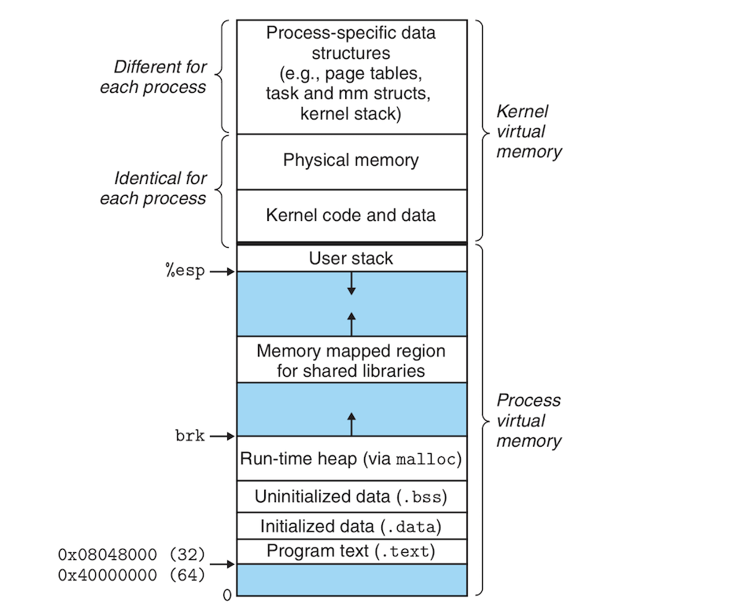
- The kernel virtual memory contains code and data structures in the kernel. Some regions of the kernel virtual memory are shared by all processes. Examples of such shared kernel memory regions include the kernel code and global variables. Linux also maps a set of contiguous virtual pages equal to all the system's DRAM pages to the corresponding set of physical pages. This allows the kernel to access any location in physical memory to do such operations as accessing page tables or memory-mapped IO operations, etc. The kernel region also contains data specific to each process such as page tables for each process or the stack that the kernel uses when it's running in the context of the given process.

### Linux Virtual Memory Areas:
- Linux organizes virtual memory as a collection of **areas** (also called **segments**). Areas are contiguous chunks of allocated virtual memory that is related in some way, for example, we have code area, data area, heap area, shared library area,etc. 
- Each existing virtual page is part of an area. A page that doesn't belong to an area does not exist and cannot be referenced. The kernel does not keep track of pages that don't belong to an area, so they don't consume memory or disk or kernel's memory itself. 
- The following image shows the kernel data structures that keep track of the areas of a process:
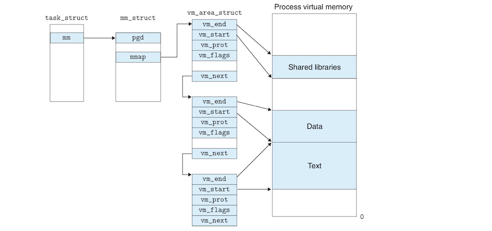
- These data structures include:
	- **`task_struct`**: is a task structure that the kernel maintains for each process. Each element in the task structure points to or contains all the data the kernel needs to run the process such as the PID, pointer to the stack, the PC, the name of the executable, etc. 
	- **`mm_struct`**: one of the data contained in a task structure element characterizes the current state of process's VM. It contains two important structures, `pgd` and `mmap`.
	- **`pgd`**: points to the base of the level 1 page table (*page global directory*, from which the structure's name comes). When the kernel runs the process, it stores the `pgd` in in the CR3 control register. 
	- **`mmap`** points to a list of `vm_area_struct`s.
	- **`vm_area_struct`**: (area structure) characterizes an area of the current virtual address space.
- A `vm_area_struct` itself consists of :
	- **`vm_start`**: points to the beginning of the area.
	- **`vm_end`**: points to the end of the area. 
	- **`vm_prot`**: describes the read/write permissions for all the pages in the area.
	- **`vm_flags`**: does various things, including describing if pages in the area are shared with other processes or private to the current process.
	- **`vm_next`**: points to the next area struct.

### Linux Page Fault Exception Handling
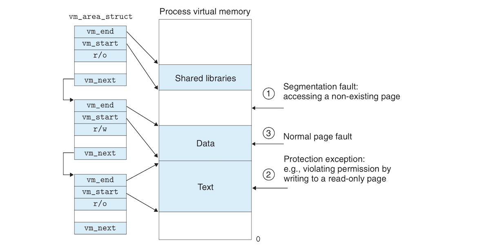
- Remember that we talked about how the kernel intervenes when there is a page fault. When an exception occurs while the MMU is trying to translate a virtual address, control is transferred to the kernel fault handler which does the following:
	- The fault handler checks if the address is legal, meaning: is it in an area struct? The fault handler searches the address in the list of area structs by comparing the address with the `vm_start` and `vm_end` in each area. If the address is not legal, the fault handler triggers a segmentation fault and terminates the process. A process can create an arbitrary number of areas, so Linux places the list in a tree structure for speedy search when there are too many areas.
	- Is the attempted memory access legal? If the process is violating access permissions such as trying to write into a read-only area or if a process running in user mode is trying to read from the kernel's virtual memory, then the handler triggers a protection exception which terminates the process. 
	- The kernel knows now that the page fault resulted from a legal operation on a legal area. It selects a victim page from the area, swaps out the victim page if it's dirty, swaps the new page and updaates the page table. When the fault handler returns, the CPU reruns the faulting instruction which resends the address to the MMU. This time the address is translated normally and no page fault occurs. s

## Memory Mapping:
## Dynamic Memory Allocation:
## Garbage Collection:
## Common Memory Related C Bugs:

